# Configure Generative AI Service

## Introduction

Oracle APEX uses a large language model (LLM) to interpret natural language prompts and convert them into trusted, declarative report settings. Before you can use AI Interactive Report features, you need to connect APEX to a Generative AI provider. In this lab, you will generate or gather the provider credentials, and configure a Workspace-level Generative AI Service. Once configured, APEX shares only report metadata and configuration context with the LLM - your business data never leaves your environment.

> **Important:** Oracle APEX acts as the application layer and connects to the Generative AI provider of your choice using your own credentials. You will need an active account with a supported provider to complete this lab. Any charges for API usage are billed directly by your AI provider. Please review your provider's pricing before proceeding.

Estimated Lab Time: 5 minutes

### Objectives

In this lab, you learn how to:

- Generate or gather provider credentials.
- Configure a Generative AI Service in your APEX Workspace.

<if type="OCIGenAI">

## Task 1: Generate OCI API keys

In this task, you will generate the OCI API key details needed to configure OCI Generative AI Service in APEX. If you already have an OCI key pair and configuration details, you may skip this task.

1. Log in to your OCI account.

    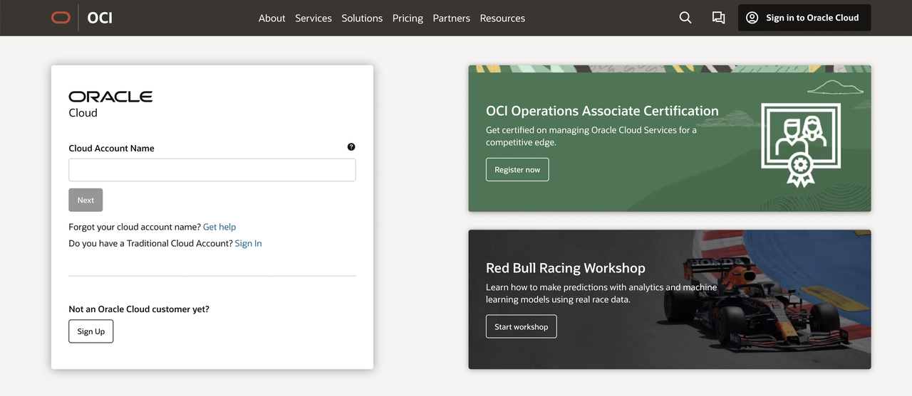

2. Select **Profile** at the top-right corner and select your user name.

    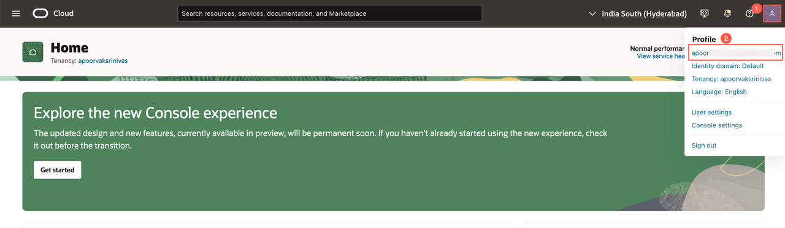

3. Open the **Tokens and keys** tab, then select **Add API key**.

    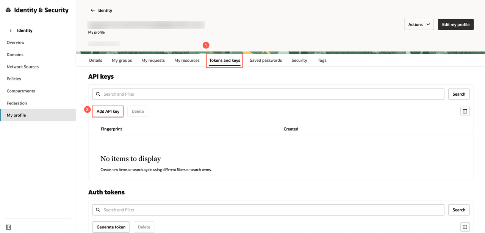

4. In the **Add API Key** dialog, select **Generate API Key Pair**.

5. Select **Download Private Key**. A `.pem` file is saved to your local machine. You do not need to download the public key.

6. Select **Add**.

    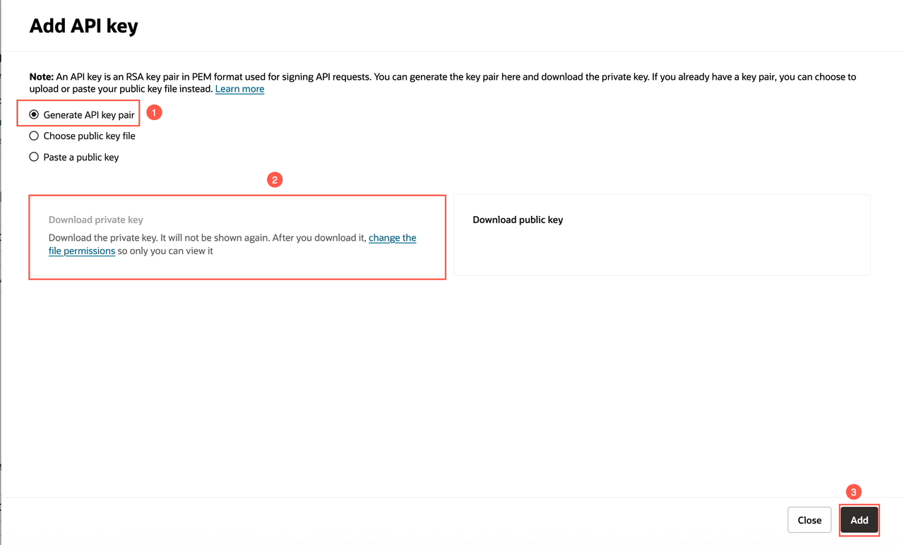

7. Copy and save the configuration file preview. You will use these values when configuring the Generative AI Service in APEX.

    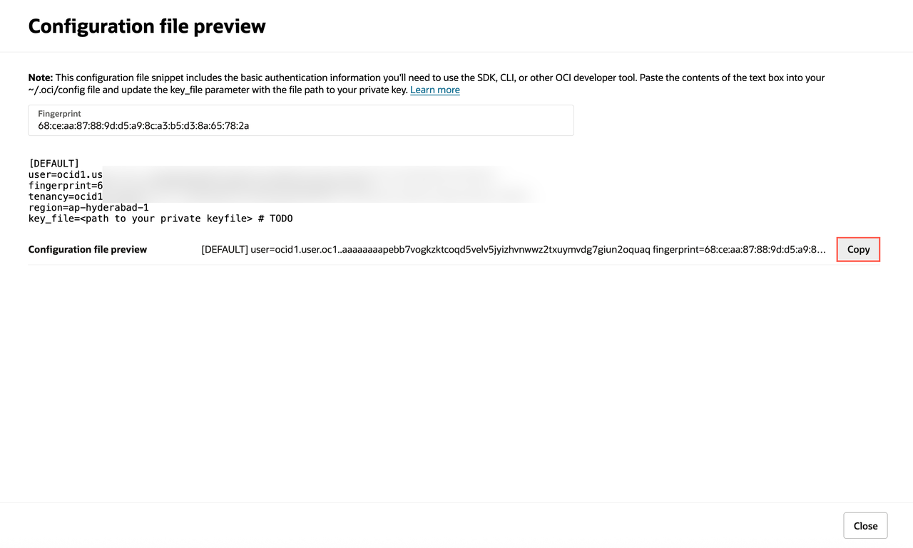

## Task 2: Configure Generative AI Service

In this task, you will configure OCI Generative AI Service in your APEX Workspace.

1. To configure the Generative AI Service in your Workspace, navigate to the Workspace home page from the left navigation menu and select **Enable AI** in the top navigation bar. This option appears only if no AI service has been configured yet.

    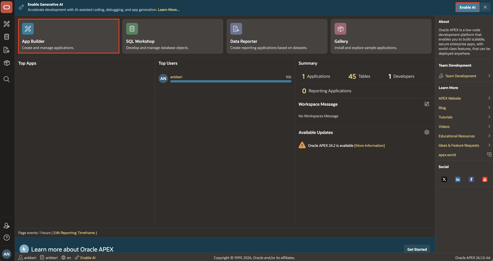

    Alternatively, from the Workspace home page, navigate to **App Builder > Workspace Utilities > Generative AI** to access the configuration settings.

    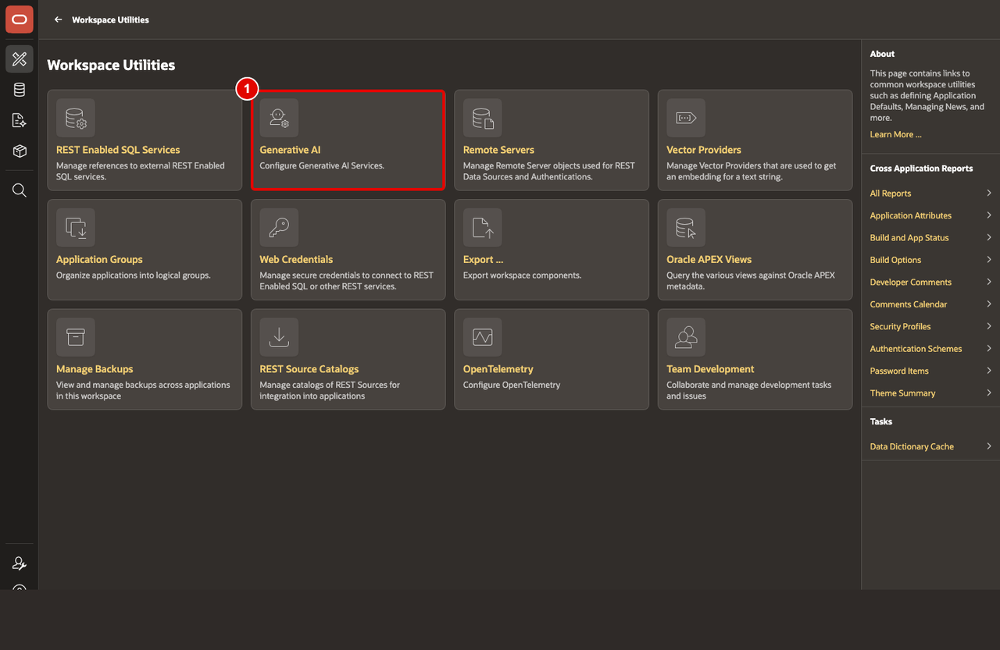

2. Select **Create**.

    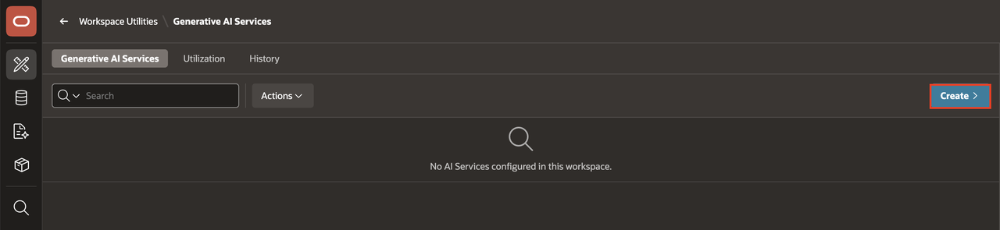

3. On the **Create Generative AI Service** page, enter or select the following:

    - AI Provider: **OCI Generative AI Service**
    - Name: **OCI Generative AI**
    - Compartment ID: Enter your OCI Compartment ID.
    - Region: Enter an OCI region that supports OCI Generative AI Service and the selected model.
    - Model ID: **cohere.command-a-03-2025** (The pre-trained models are frequently deprecated. Refer to the [documentation](https://docs.oracle.com/en-us/iaas/Content/generative-ai/pretrained-models.htm#pretrained-models) for the latest pre-trained models.)
    - Used by App Builder: Toggle **On**
    - Base URL: Leave the auto-generated value unchanged.
    - Credential: Select an existing OCI credential if one is already available in your Workspace. Otherwise, create a new OCI credential using the configuration details from Task 1.

    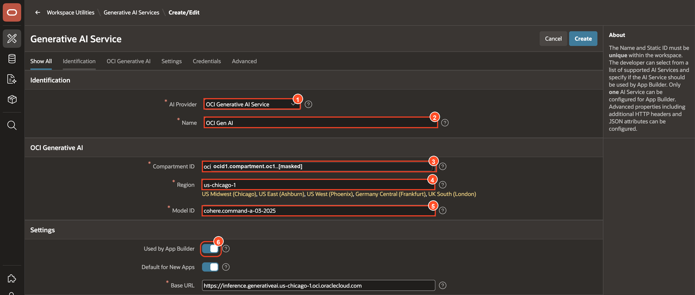

    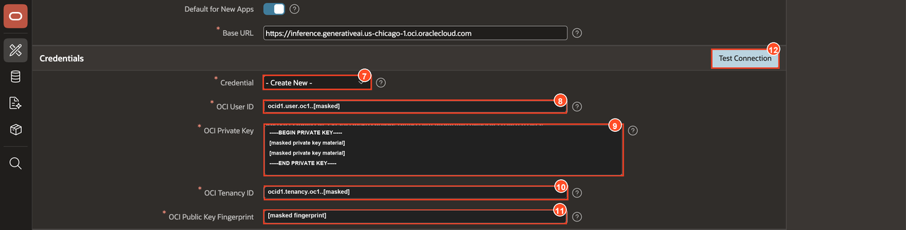

4. Select **Test Connection**.

5. If the connection is successful, select **Create**.
    If unsuccessful, verify that you have configured the IAM policy on OCI correctly. Refer to the [Identity and Access Management](https://livelabs.oracle.com/pls/apex/r/dbpm/livelabs/run-workshop?p210_wid=624&p210_wec) workshop for more details.

    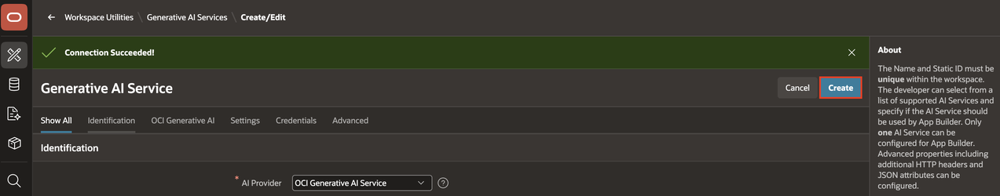

</if>

<if type="OpenAI">

## Task 1: Generate an OpenAI API key

In this task, you will create an OpenAI API key to configure OpenAI as the Generative AI provider in APEX. If you already have an OpenAI API key, you may skip this task.

1. Create and log in to your [OpenAI account](https://platform.openai.com/).

    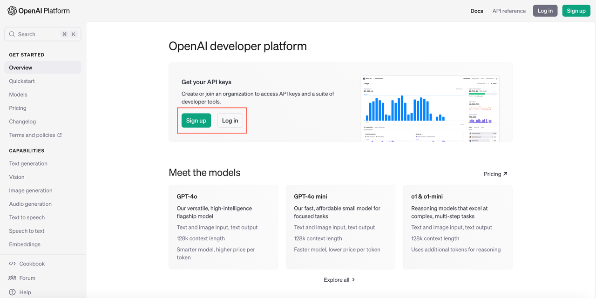

2. Navigate to the [API keys](https://platform.openai.com/settings/organization/api-keys) page and create a new secret key.

    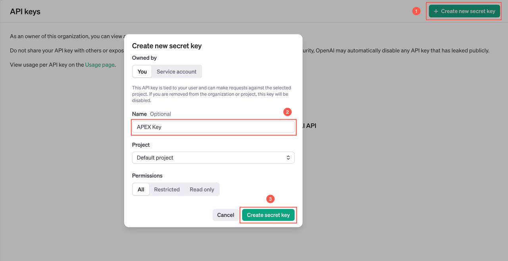

3. Copy and save the secret key. You will use it when you configure the Generative AI Service in APEX.

    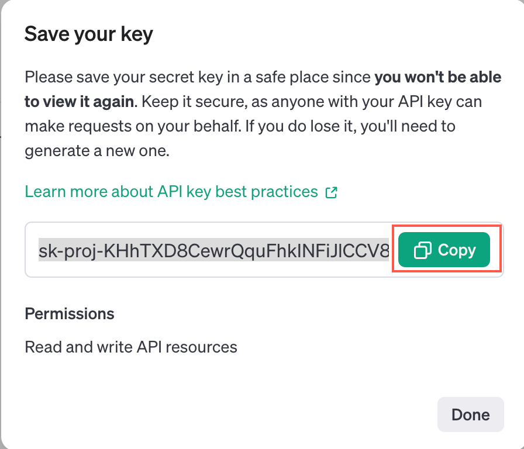

## Task 2: Configure Generative AI Service

In this task, you will configure OpenAI as a Generative AI Service in your APEX Workspace.

1. To configure the Generative AI Service in your Workspace, navigate to the Workspace home page from the left navigation menu and select **Enable AI** in the top navigation bar. This option appears only if no AI service has been configured yet.

    

    Alternatively, from the Workspace home page, navigate to **App Builder > Workspace Utilities > Generative AI** to access the configuration settings.

    

2. Select **Create**.

    

3. On the **Create Generative AI Service** page, enter or select the following:

    - AI Provider: **OpenAI**
    - Name: **OpenAI**
    - Used by App Builder: Toggle **On**
    - API Key: Enter the OpenAI API key you created in Task 1.
    - AI Model: Enter the OpenAI model you want to use for this workshop.

    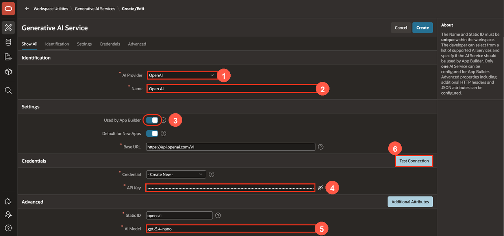

4. Select **Test Connection**.

5. If the connection is successful, select **Create**.

    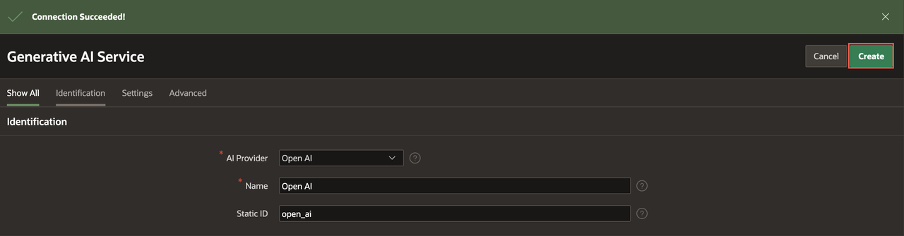

</if>

## Summary

You configured a Generative AI Service in your APEX Workspace, tested the connection.

You may now **proceed to the next lab**.

## Acknowledgements

* **Author** - Roopesh Thokala, Principal product manager
* **Last Updated By/Date** - Roopesh Thokala, July 29, 2026