# Lab 1: Real-Time Salary Band Indicator

## Introduction

In this lab, you configure page items, a Dynamic Action, and a Dynamic Content region on the Talent Acquisition Portal **Form on Offers** page:

**Dynamic Action** - Responds when a page item value changes without submitting the page.

**Dynamic Content** - Displays HTML returned by a PL/SQL function.

The Dynamic Action retrieves the salary range for the selected requisition and refreshes the indicator when the offered salary changes. The Dynamic Content region uses a PL/SQL function to display the offered salary's position within that range.

Estimated Time: 5 minutes

### Objectives

In this lab, you will:

- Create hidden items for the minimum and maximum salary.
- Retrieve salary-band values when the requisition changes.
- Build and refresh a salary-band indicator.

## Task 1: Create the salary range items and retrieval action

In this task, you create the supporting Hidden items and retrieve the selected requisition salary range when the request ID changes.

1. In App Builder, open the **Talent Acquisition Portal** application. On the application home page, select **Form on Offers** (Page 9).

    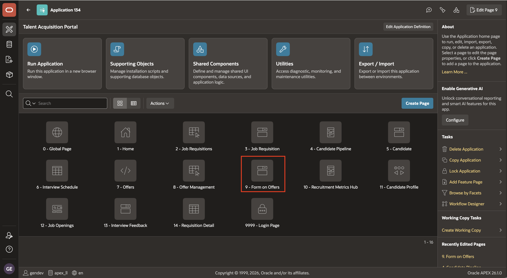

2. In the **Rendering** tab, expand **Page 9** and right-click **Form on Offers** region. Select **Create Page Item**.

    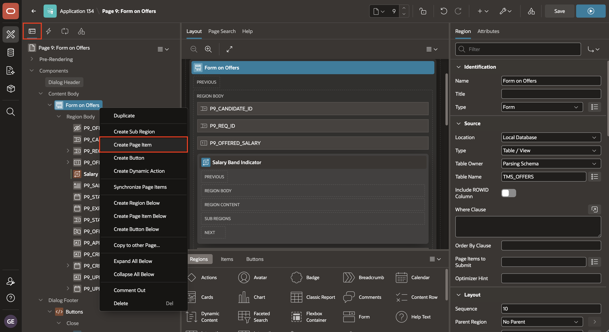

3. In the Property Editor, set:

    - Under Identification:

        - Name: **`P9_MIN_SALARY`**
        - Type: **Hidden**

    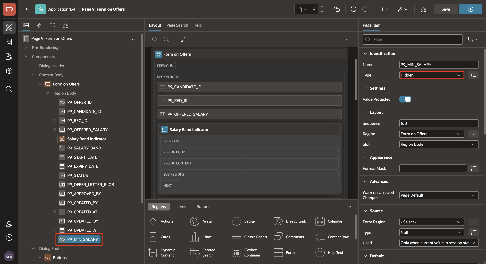

4. Repeat the step 2 to create the second hidden item:

    - Under Identification:

        - Name: **`P9_MAX_SALARY`**
        - Type: **Hidden**

    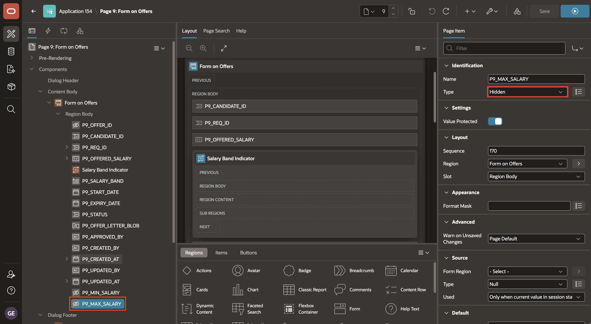

5. Click the **Dynamic Actions** tab. Right-click **Events** node and select **Create Dynamic Action**.

    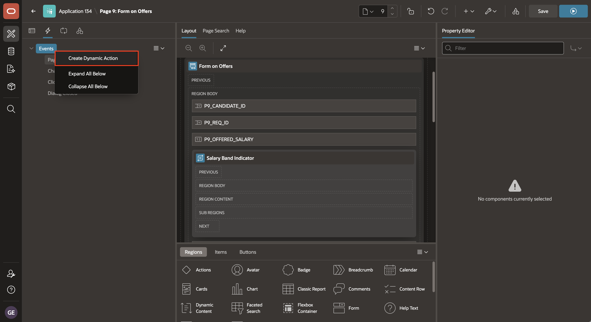

6. In the Property Editor, set:

    - Under Identification:

        - Name: **Get Max and Min Salaries**

    - Under When:

        - Event: **Change**
        - Selection Type: **Item(s)**
        - Item(s): **`P9_REQ_ID`**

    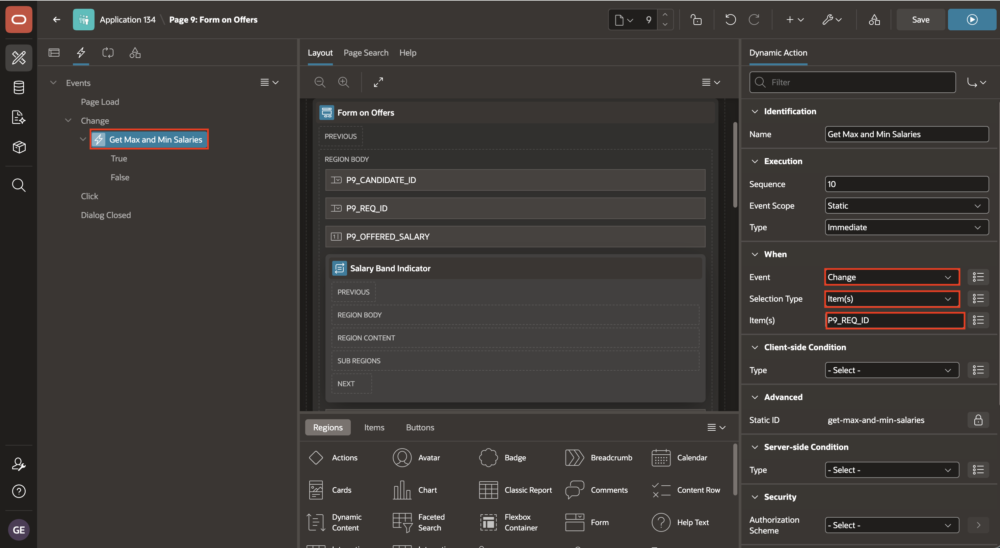

7. Under the **Get Max and Min Salaries** dynamic action, select **Create TRUE Action**.


    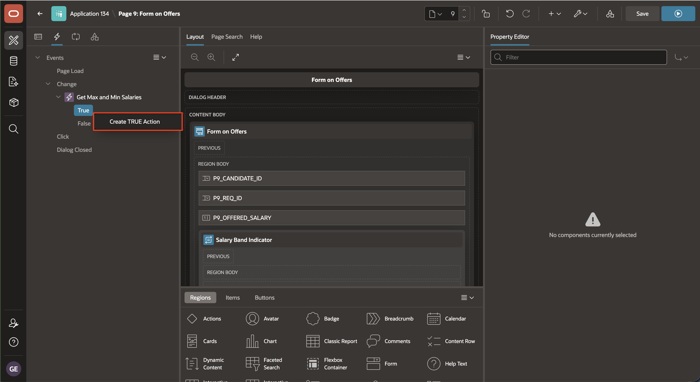

8. In the Property Editor, set:

    - Under Identification:

        - Action: **Execute Server-side Code**

    - Under Settings:

        - Language: **PL/SQL**
        - PL/SQL Code: enter the following code.
            ```sql
            <copy>
            SELECT
                j.min_salary,
                j.max_salary
            INTO
                :P9_MIN_SALARY,
                :P9_MAX_SALARY
            FROM tms_job_requisitions r
            JOIN tms_jobs j
                ON j.job_id = r.job_id
            WHERE r.req_id = :P9_REQ_ID;
            </copy>
            ```
        - Items to Submit: **`P9_REQ_ID`**
        - Items to Return: **`P9_MIN_SALARY,P9_MAX_SALARY`**

    - Under Execution:

        - Fire on Initialization: True

    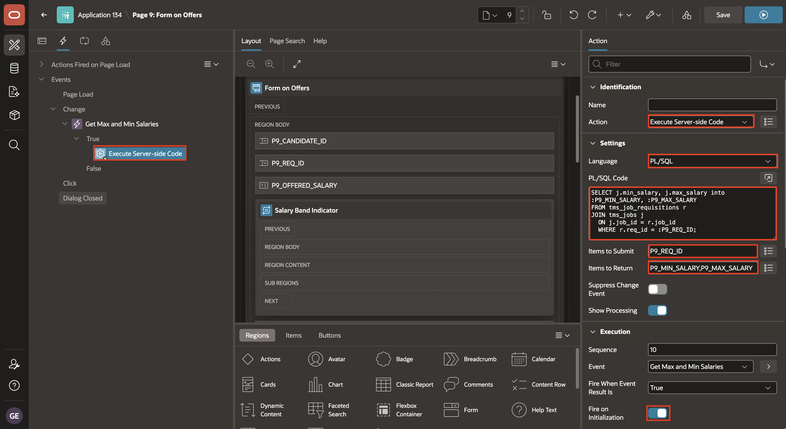

## Task 2: Create the Salary Band Indicator region

In this task, you create the Dynamic Content region that calculates and displays the offered salary's position within the configured range.

1. Return to the **Rendering** tab. In the layout tree, select the region or item position directly below `P9_OFFERED_SALARY`. Right-click the parent region and select **Create Region Below**.

    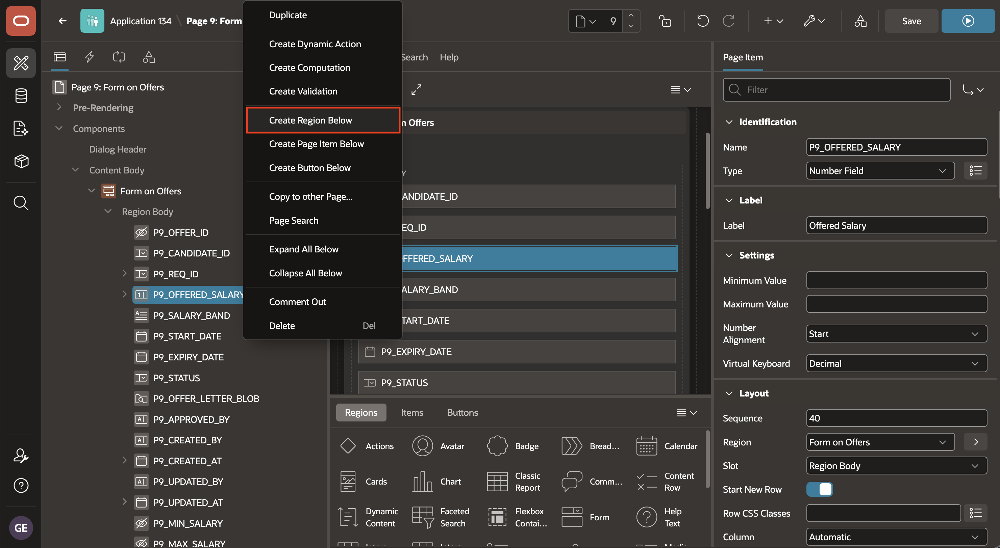

2. In the Property Editor, set:

    - Under Identification:

        - Title: **Salary Band Indicator**
        - Type: **Dynamic Content**

    - Under Source:

        - Language: **PL/SQL**
        - PL/SQL Function Body returning a CLOB: paste the following code.

            ```plsql
            <copy>
            DECLARE
                l_salary NUMBER := TO_NUMBER(
                    REGEXP_REPLACE(NVL(:P9_OFFERED_SALARY, '0'), '[^0-9.\-]', '')
                );
                l_min   NUMBER := NVL(TO_NUMBER(:P9_MIN_SALARY), 0);
                l_max   NUMBER := NVL(TO_NUMBER(:P9_MAX_SALARY), 0);
                l_pct   NUMBER := 0;
                l_color VARCHAR2(20) := '#10b981';
            BEGIN
                IF l_max > l_min THEN
                    l_pct := ROUND(
                        GREATEST(0, LEAST(1, (l_salary - l_min) / (l_max - l_min))) * 100
                    );
                END IF;

                IF l_salary > l_max THEN
                    l_color := '#ef4444';
                ELSIF l_pct > 80 THEN
                    l_color := '#f59e0b';
                END IF;

                RETURN
                    '<div style="background:#e5e7eb;border-radius:8px;height:12px;overflow:hidden">'
                    || '<div style="height:12px;width:' || l_pct || '%;background:' || l_color || ';border-radius:8px"></div>'
                    || '</div>'
                    || '<p style="font-size:12px;margin-top:4px;color:#6b7280">'
                    || l_pct || '% of band</p>';
            END;
            </copy>
            ```

        - Page Items to Submit: **`P9_MIN_SALARY,P9_MAX_SALARY,P9_OFFERED_SALARY`**

    - Under Appearance:

        - Template: **Blank with Attributes (No Grid)**
    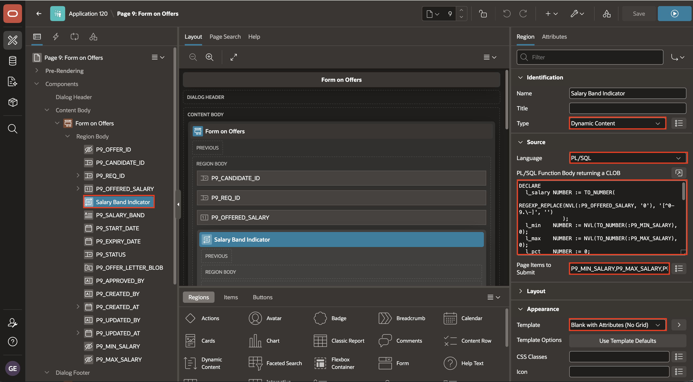

## Task 3: Refresh and test the salary indicator

In this task, you refresh the Dynamic Content region when the offered salary changes and verify the salary-band states at runtime.

1. Click the **Dynamic Actions** tab. Right-click **Events** node and select **Create Dynamic Action**.

    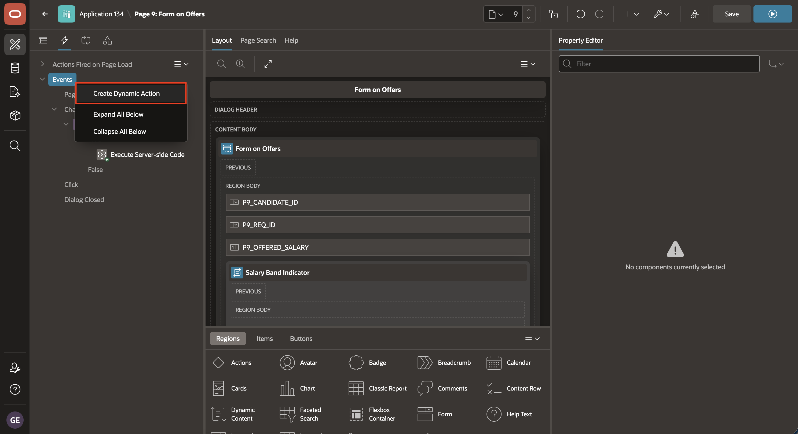

2. In the Property Editor, set:

    - Under Identification:

        - Name: **Salary Band Refresh**

    - Under When:

        - Event: **Change**
        - Selection Type: **Item(s)**
        - Item(s): **`P9_OFFERED_SALARY`**

    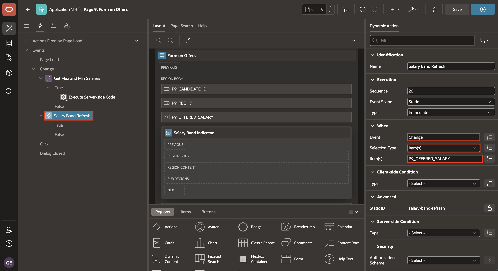

3. Under **Salary Band Refresh** dynamic action, select **Create TRUE Action**.

    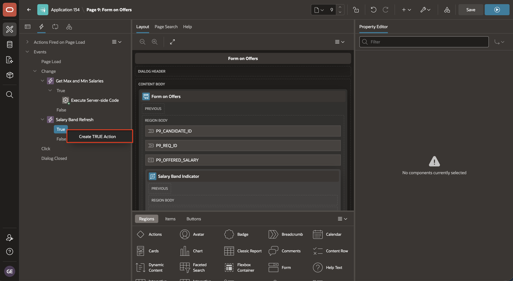

4. In the Property Editor, set:

    - Under Identification:

        - Action: **Refresh**

    - Under Affected Elements:

        - Selection Type: **Region**
        - Region: **Salary Band Indicator**

    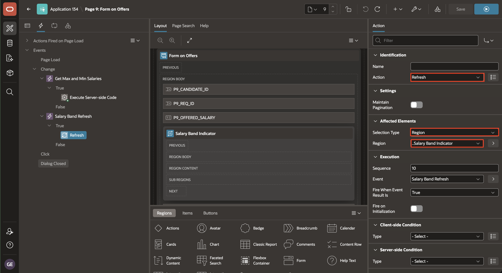

5. Click **Save and Run Page**.

    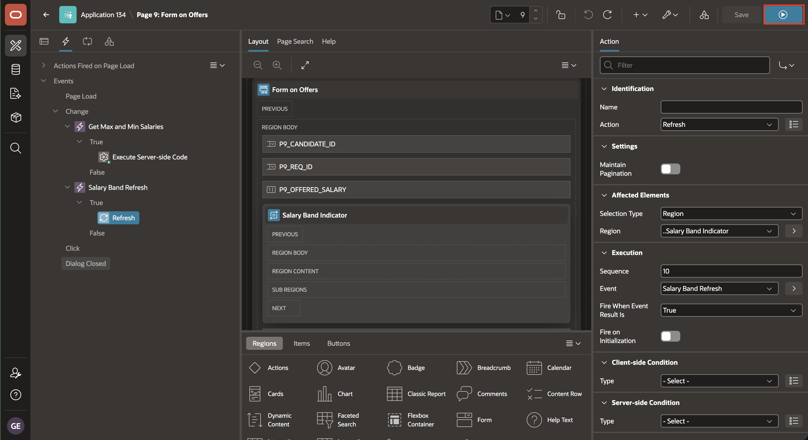

6. Select a requisition, enter an offered salary, and confirm that the indicator refreshes. Test a value below 80 percent, a value above 80 percent, and a value greater than the maximum salary.

    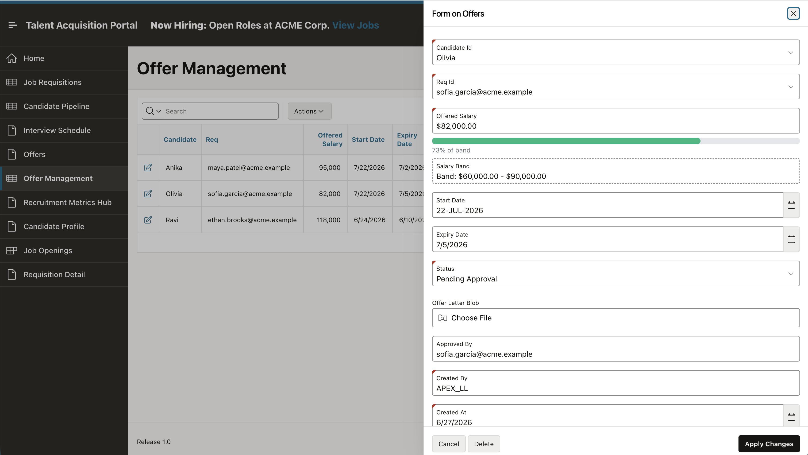

## Summary

You learned how **Hidden** page items can store values used by other components on the page.

A Dynamic Action responds when a page item value changes. You used one Dynamic Action to retrieve the salary range for the selected requisition and another to refresh the salary-band indicator when the offered salary changes.

You also learned how a **Dynamic Content** region can run PL/SQL during page rendering and display the returned HTML. The region shows the offered salary's position within the configured range.

At the end of this lab, you are on the running **Form on Offers** page. In the next lab, you will open the **Candidate Pipeline** page and refresh its candidate regions when a requisition is selected.

You may now proceed to the next lab.

## Acknowledgements

- **Author** - Ashwin Rao, Principal Product Manager; Roopesh Thokala, Principal Product Manager
- **Last Updated By/Date** - Ashwin Rao Principal Product Manager, July 2026
