# Lab 2: Refresh Applied and Filtered Candidates When the Requisition Changes

## Introduction

In this lab, you configure two region types on the Talent Acquisition Portal **Candidate Pipeline** page:

**Cards** - Displays information as a set of visual tiles.

**Interactive Report** - Displays tabular data that users can search, sort, and filter.

The Cards region displays candidates in the Applied stage, and the Interactive Report displays candidate details. You configure a Select List and a Dynamic Action so both regions refresh when a recruiter selects a requisition.

Estimated Time: 8 minutes

### Objectives

In this lab, you will:

- Submit the selected requisition to both report regions.
- Configure the requisition Select List.
- Refresh the regions through a debounced Dynamic Action.

## Task 1: Update the Applied region

In this task, you update the Applied region query and submit the selected requisition value when the region refreshes.

1. In App Builder, open the **Talent Acquisition Portal** application. On the application home page, select **Candidate Pipeline** (Page 4).

    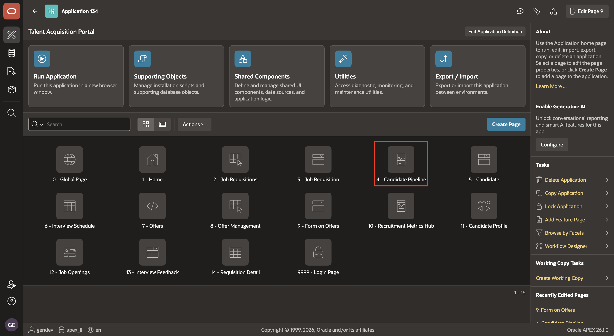

2. In the **Rendering** tab, select the **Applied** region. In the Property Editor, set:

    - Under Source:

        - Type: **SQL Query**
        - SQL Query: Replace with the following query.

            ```sql
            <copy>
            SELECT
                c.candidate_id,
                c.req_id,
                c.first_name || ' ' || c.last_name AS candidate_name,
                d.name AS department_name,
                c.current_stage AS current_stage,
                'Applied: ' || TO_CHAR(c.applied_date, 'DD-Mon-YYYY') AS applied_on
            FROM tms_candidates c
            LEFT JOIN tms_job_requisitions r
                ON c.req_id = r.req_id
            LEFT JOIN tms_departments d
                ON r.dept_id = d.dept_id
            WHERE :P4_REQ_ID IS NULL
               OR c.req_id = :P4_REQ_ID
            ORDER BY c.applied_date DESC
            </copy>
            ```

        - Page Items to Submit: **`P4_REQ_ID`**

    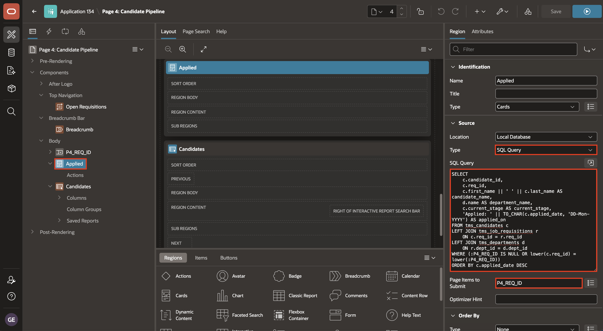

## Task 2: Configure the requisition selector

In this task, you configure the requisition Select List and make its selected value available to the Candidates region.

1. In the **Rendering** tree, select the **Candidates**  IR region. Enter `P4_REQ_ID` in **Page Items to Submit**.

    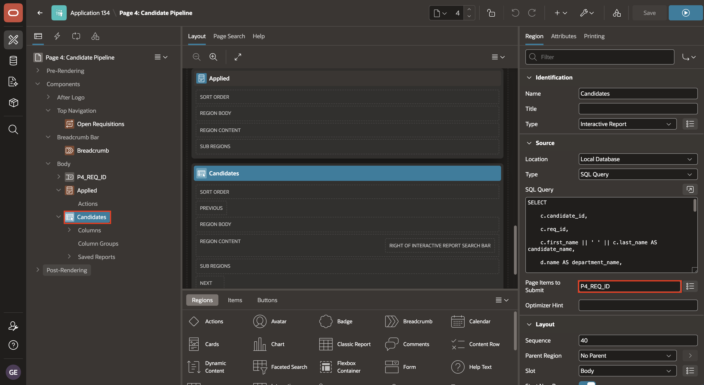

2. In the Rendering tree, select the `P4_REQ_ID` page item. In the Property Editor, set:

    - Under Identification:

        - Type: **Select List**

    - Under List of Values:

        - Type: Shared Component
        - List of Values: Choose `TMS_JOB_REQUISITIONS.REQUESTED_BY`

    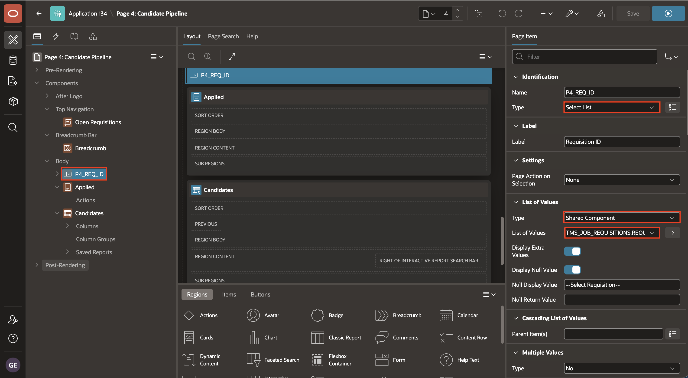

## Task 3: Refresh the candidate regions

In this task, you create a debounced Change Dynamic Action that refreshes both candidate regions.

1. Click the **Dynamic Actions** tab. Right-click **Events** node and select **Create Dynamic Action**.

    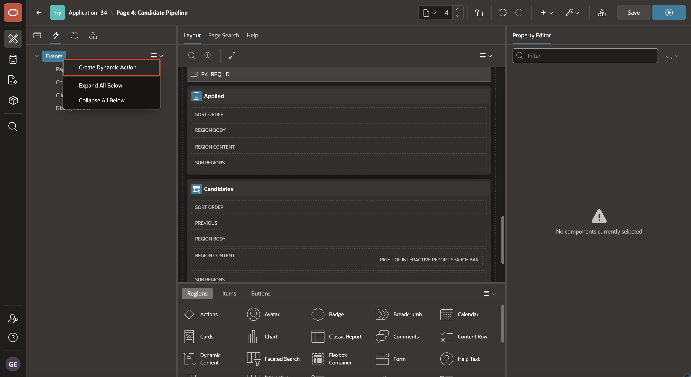

2. In the Property Editor, set:

    - Under Identification:

        - Name: **Refresh Regions**
    
    - Under Execution:

        - Type: **Debounce**
        - Time: **3000** milliseconds

    - Under When:

        - Event: **Change**
        - Selection Type: **Item(s)**
        - Item(s): **`P4_REQ_ID`**

    Debouncing waits until the requisition value has stopped changing before refreshing the regions. This avoids sending repeated refresh requests to the server.

    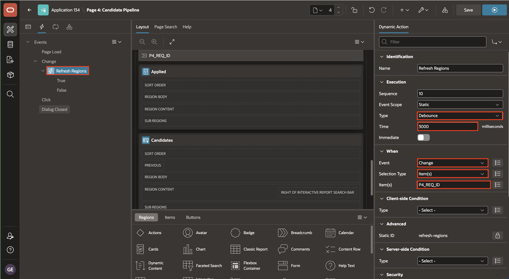

3. Under **Refresh Regions** dynamic action, select **Create TRUE Action**.

    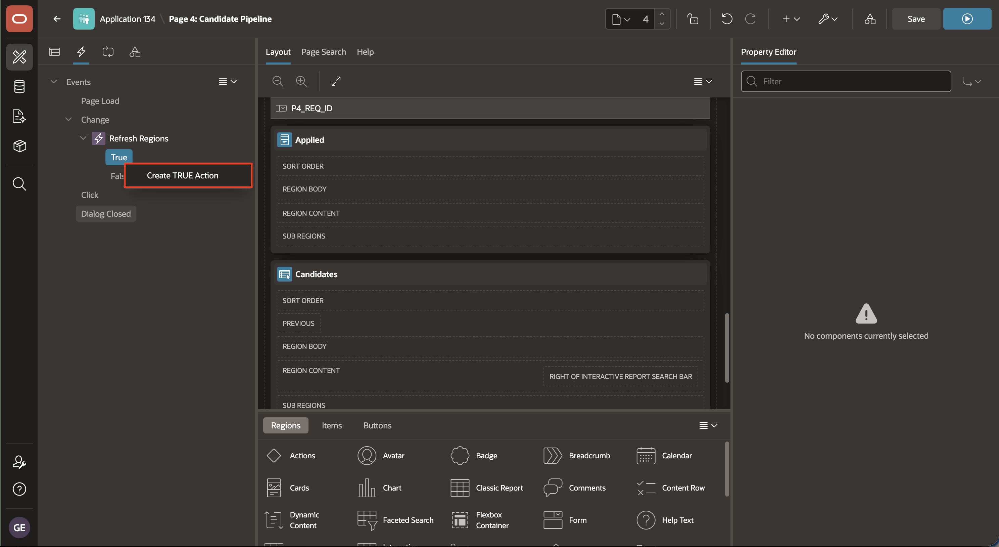

4. In the Property Editor, set:

    - Under Identification:

        - Name: **Refresh Region - Applied**
        - Action: **Refresh**

    - Under Affected Elements:

        - Selection Type: **Region**
        - Region: **Applied**

    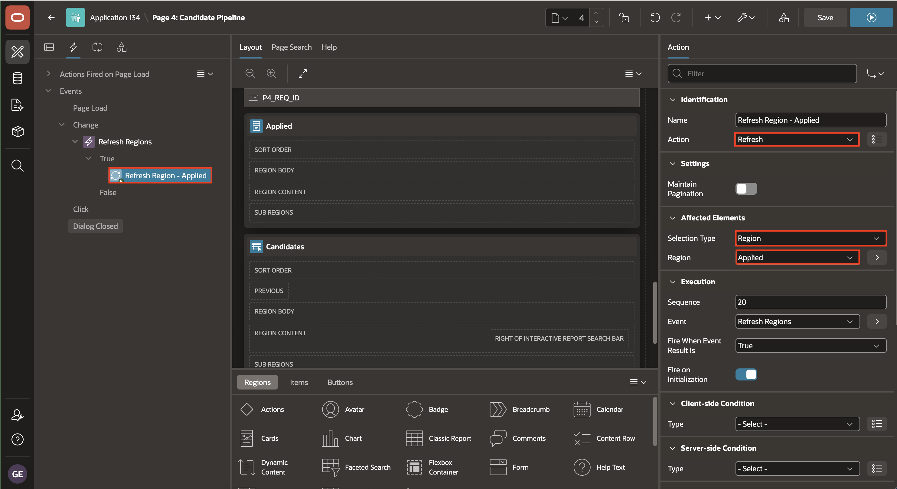

5. Repeat step 3. Under **Refresh Regions** dynamic action, right-click **True** node and select **Create TRUE Action**. In the Property Editor, set:

    - Under Identification:

        - Name: **Refresh Region - Candidates**
        - Action: **Refresh**

    - Under Affected Elements:

        - Selection Type: **Region**
        - Region: **Candidates**

    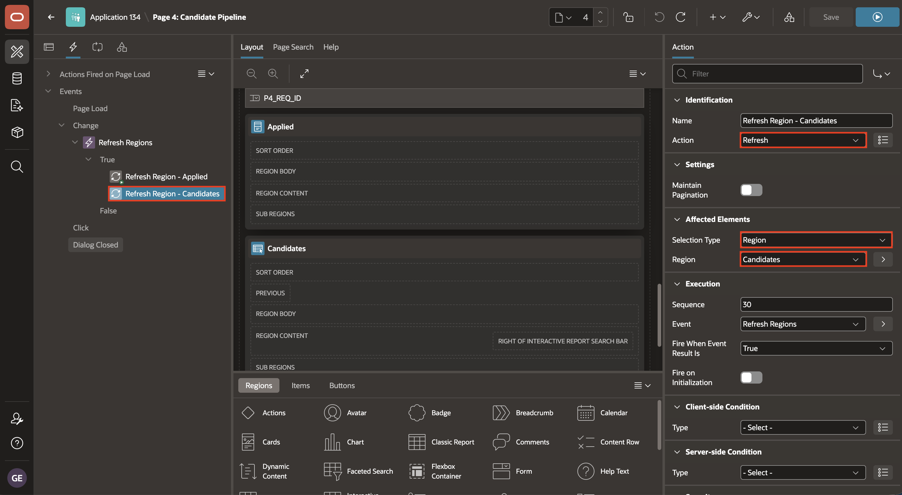

6. Click **Save and Run Page**.

    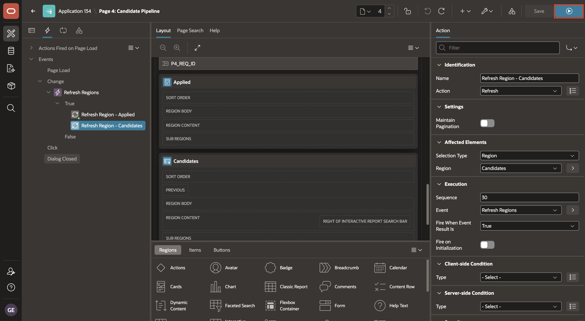

7. Select a requisition and verify that the Applied and Candidates regions refresh with matching results. Clear the Select List and verify that the unfiltered results return.

    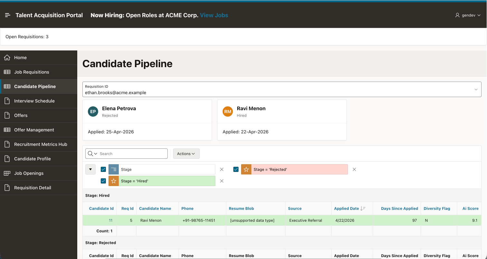

## Summary

You learned how the **Cards** and **Interactive Report** region types present candidate information in different ways. Cards display visual candidate summaries, while an Interactive Report provides searchable and filterable candidate details.

You used a **Select List** to choose a requisition and passed its value to both regions. You also configured a Dynamic Action with Refresh true actions so the Cards and Interactive Report refresh together without a full page reload.

At the end of this lab, you are on the running **Candidate Pipeline** page. In the next lab, you will return to the Talent Acquisition Portal **Home** page and add an Ask AI button.

You may now proceed to the next lab.

## Acknowledgements

- **Author** - Ashwin Rao, Principal Product Manager; Roopesh Thokala, Principal Product Manager
- **Last Updated By/Date** - Ashwin Rao Principal Product Manager, July 2026
