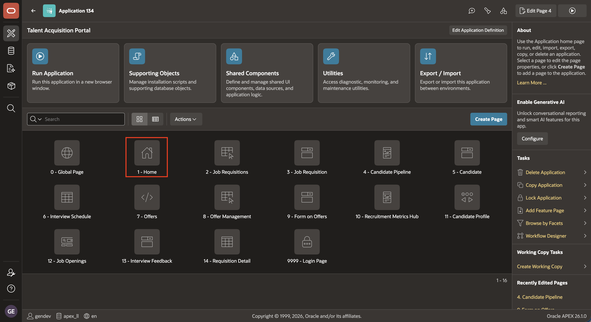
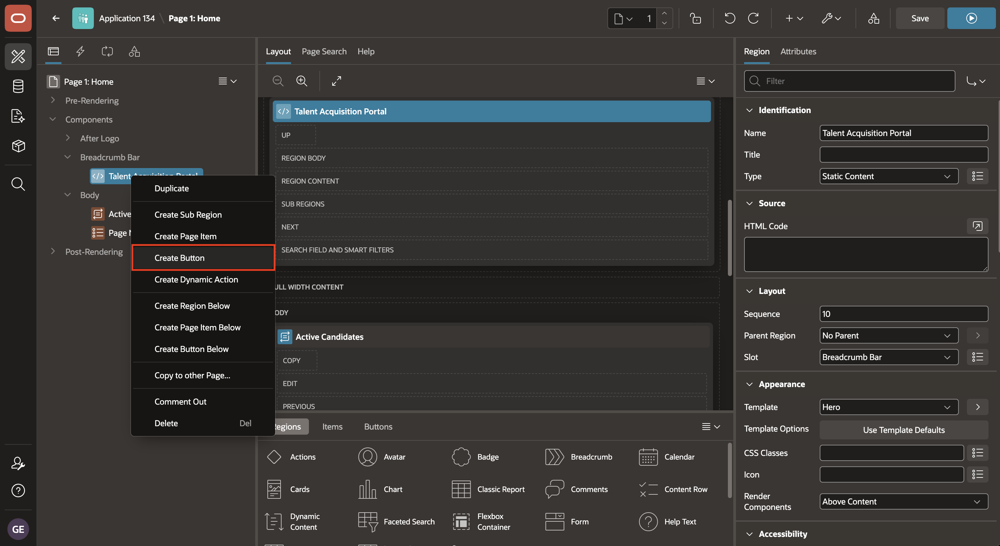
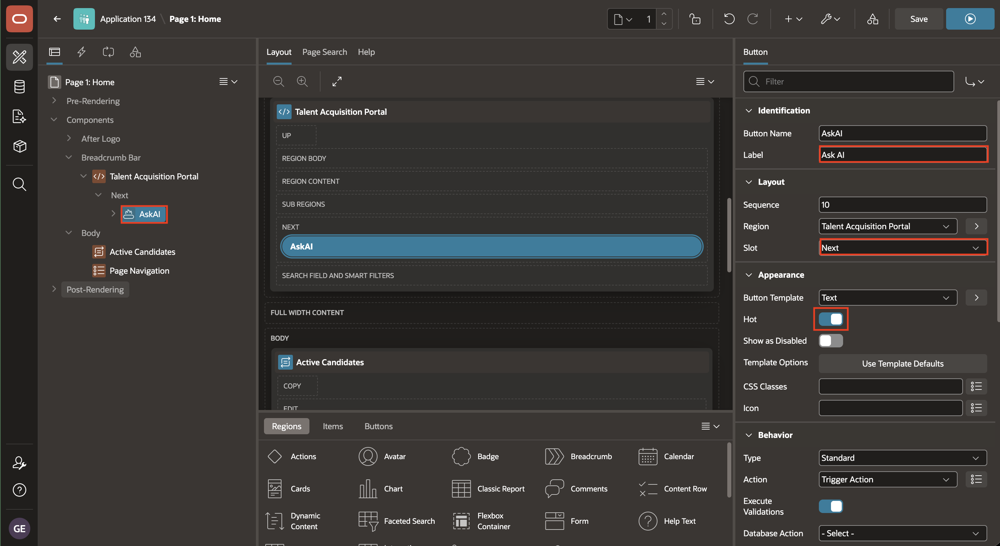
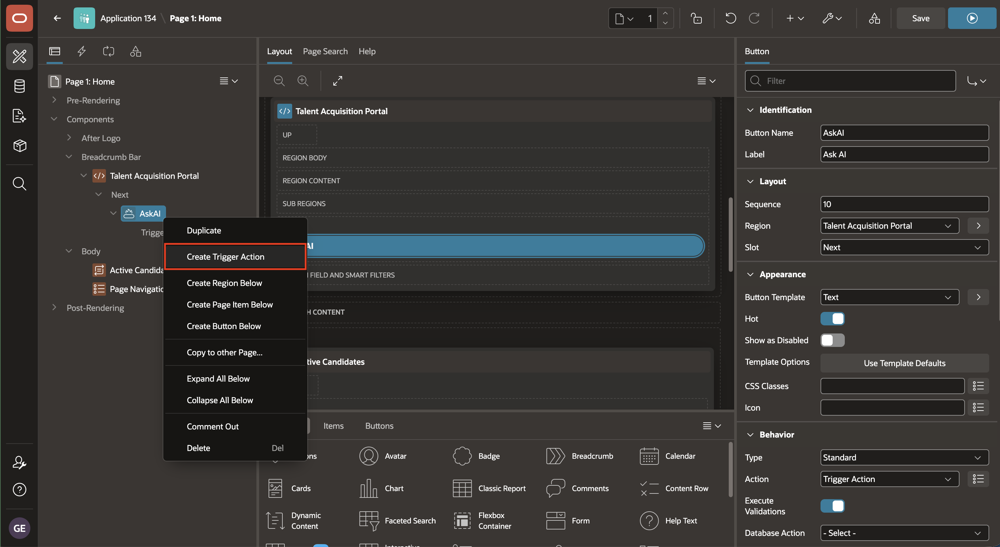
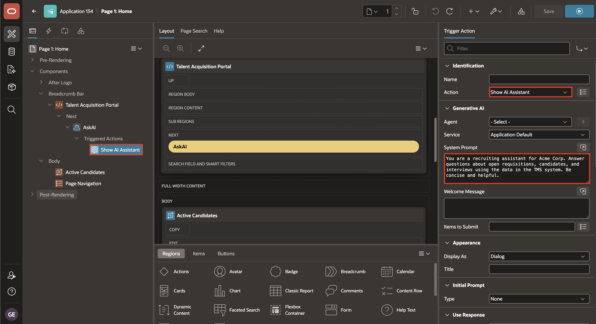
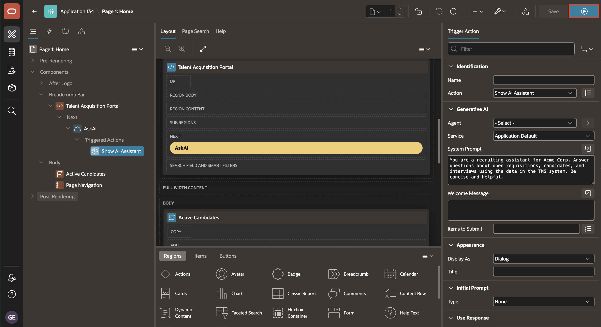
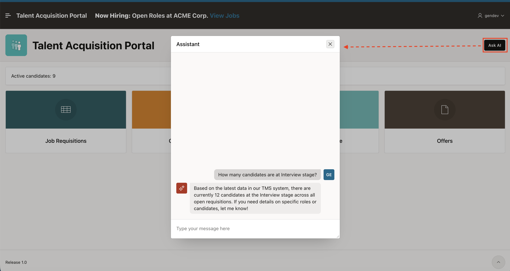

# Lab 3: Recruiter Chatbot on Talent Acquisition Portal Home

## Introduction

In this lab, you configure a button and a Trigger Action on the Talent Acquisition Portal **Home** page:

**Button** - Gives users a clear entry point for an action on the page.

**Trigger Action** - Runs a configured action when the button is selected.

The Ask AI button opens the AI Assistant. Its Trigger Action includes a recruiting-focused system prompt so users can ask questions about requisitions, candidates, and interviews.

Estimated Time: 4 minutes

### Objectives

In this lab, you will:

- Create a Hot Ask AI button.
- Configure a Show AI Assistant Trigger Action.
- Test a recruiting question.

## Task 1: Create the Ask AI button

In this task, you create and style a button that users select to open the recruiting AI Chatbot.

1. In App Builder, open the **Talent Acquisition Portal** application. On the application home page, select **Home** (Page 1).

    

2. In the **Rendering** tab, right-click the Talent Acquisition Portal region and select **Create Button**.

    

3. In the Property Editor, set:

    - Under Identification:

        - Button Name: **`AskAI`**
        - Label: **Ask AI**

    - Under Layout:

        - Slot: **Next**

    - Under Appearance:

        - Hot: **True**

    

## Task 2: Configure and test the AI Assistant action

In this task, you configure the button Trigger Action to open the AI Assistant and test the recruiting prompt.

1. Right-click button **AskAI** and select **Create Trigger Action**.

    

2. In the Property Editor, set:

    - Under Identification:

        - Action: **Show AI Assistant**

    - Under Generative AI:

        - System Prompt:

            ```text
            <copy>
            You are a recruiting assistant for Acme Corp. Answer questions about open requisitions, candidates, and interviews using the data in the TMS system. Be concise and helpful.
            </copy>
            ```

    

3. Click **Save and Run Page**.

    

4. Click the **Ask AI** button. In the assistant, ask: `How many candidates are at Interview stage?` Confirm that the assistant returns a response through the configured provider.

    

    > **Note:** This is a Trigger Action-based assistant. Module 20 upgrades it to a full AI Agent.

## Summary

You learned how an APEX **Button** provides a clear entry point for a page action.

You also learned how a **Trigger Action** runs when a button is selected. You used it to open the APEX AI Assistant and supplied a recruiting-focused system prompt so users can ask questions about requisitions, candidates, and interviews.

At the end of this lab, you are on the running Talent Acquisition Portal **Home** page. In the next lab, you will open the Employee Self-Service Portal **Leave Request** page and add Dynamic Actions that respond to leave selections and dates.

You may now proceed to the next lab.

## Acknowledgements

- **Author** - Ashwin Rao, Principal Product Manager; Roopesh Thokala, Principal Product Manager
- **Last Updated By/Date** - Ashwin Rao Principal Product Manager, July 2026
