# Lab 4: Leave Form Dynamic Actions

## Introduction

In this lab, you configure supporting page items and Dynamic Actions on the Employee Self-Service Portal **Leave Request** page:

**Display Only item** - Shows a calculated value that users cannot edit.

**Hidden item** - Stores a value for use by the page without displaying it.

**Dynamic Action** - Responds to a change in a page item without submitting the page.

The Dynamic Actions calculate the available leave balance and requested days, then display an alert when a request exceeds the remaining balance.

Estimated Time: 3 minutes

### Objectives

In this lab, you will:

- Calculate and display available leave balance.
- Calculate requested days from the selected start and end dates.
- Show an over-limit leave warning.

## Task 1: Create the leave balance items

In this task, you create the items that display the available leave balance and store the over-limit warning.

1. In the **Employee Self-Service Portal** application, use **Page Finder** to open the **Leave Request** form (Page 5).

    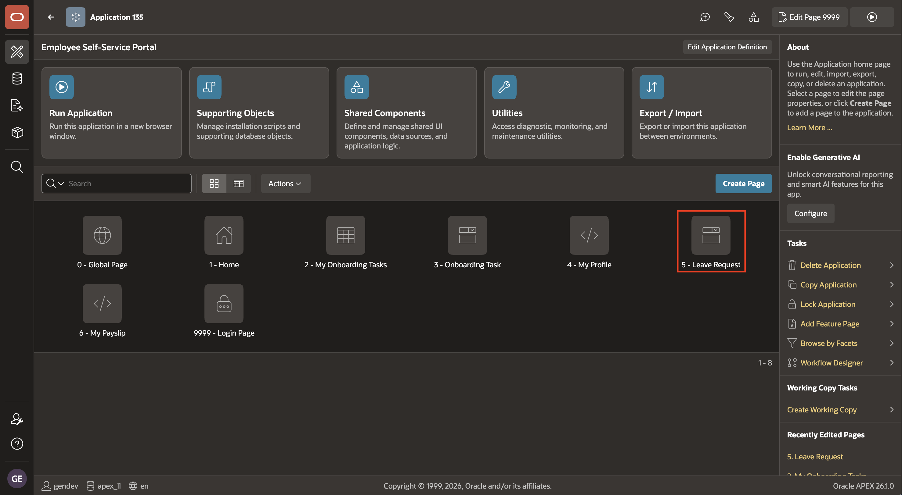

2. In the Rendering tree, right-click the **Leave Request Form** region and select **Create Page Item**.

    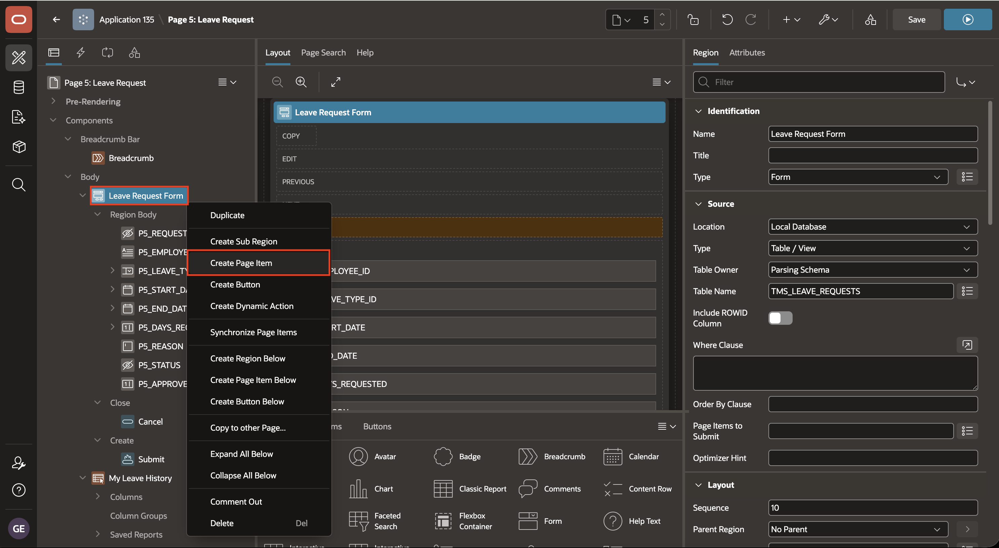

3. In the Property Editor, set:

    - Under Identification:

        - Name: **`P5_AVAILABLE_BALANCE`**
        - Type: **Display Only**

    - Under Label:

        - Label: **Available Balance**

    - Under Settings:

        - Send on Page Submit: **No**

    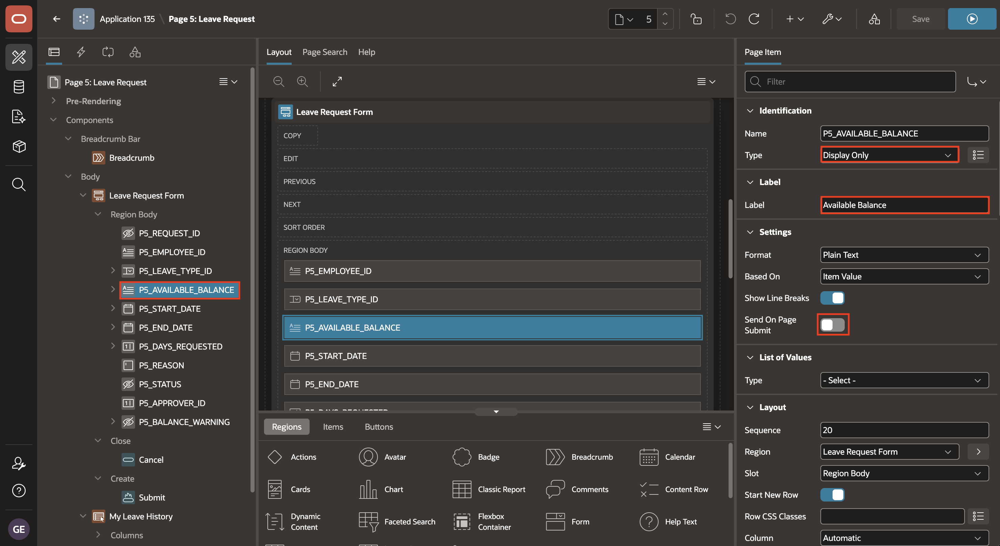
4. Repeat step 2 and select **Create Page Item**. In the Property Editor, set:

    - Under Identification:

        - Name: **`P5_BALANCE_WARNING`**
        - Type: **Hidden**

    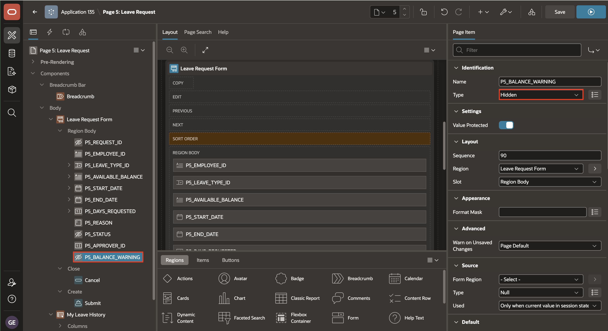

## Task 2: Calculate the available leave balance

In this task, you create a Change Dynamic Action that calculates and displays the balance for the selected leave type.

1. Under the **Dynamic Actions** tab, right-click **Events** node and select **Create Dynamic Action**.

    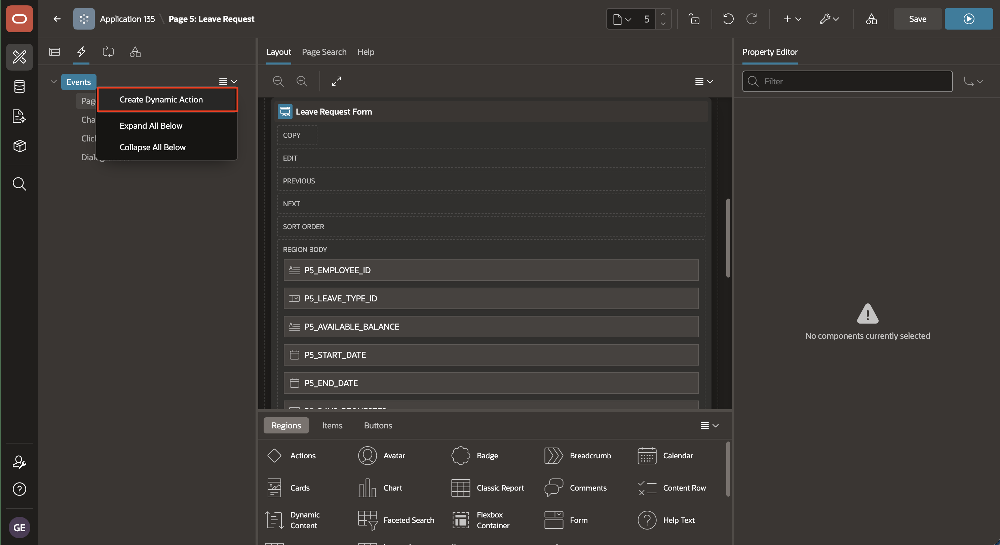

2. In the Property Editor, set:

    - Under Identification:

        - Name: **Calculate Leave Balance**

    - Under When:

        - Event: **Change**
        - Selection Type: **Item(s)**
        - Item(s): **`P5_LEAVE_TYPE_ID`**

    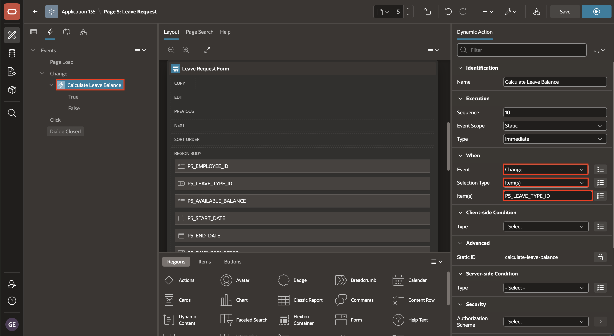

3. Under **Calculate Leave Balance** dynamic action, select **Create TRUE Action**.

    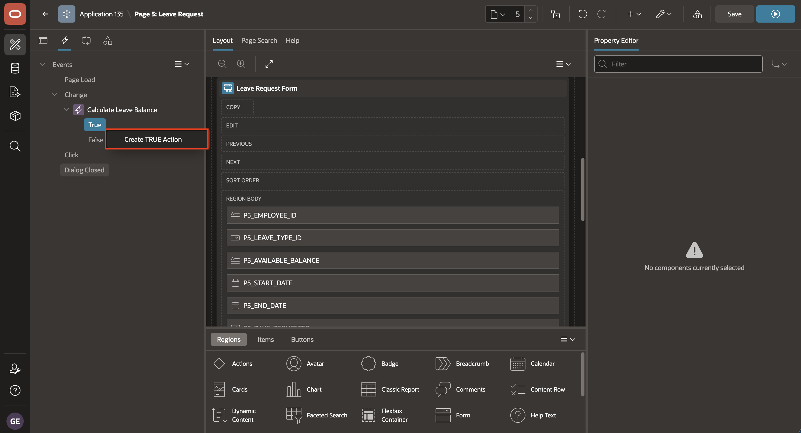

4. In the Property Editor, set:

    - Under Identification:

        - Action: **Set Value**

    - Under Settings:

        - Set Type: **PL/SQL Function Body**
        - PL/SQL Function Body: enter the following code.

            ```plsql
            <copy>
            RETURN ess_util.calculate_leave_balance(:P5_EMPLOYEE_ID, :P5_LEAVE_TYPE_ID);
            </copy>
            ```

        - Items to Submit: **`P5_EMPLOYEE_ID,P5_LEAVE_TYPE_ID`**

    - Under Affected Elements:

        - Selection Type: **Item(s)**
        - Item(s): **`P5_AVAILABLE_BALANCE`**
    

    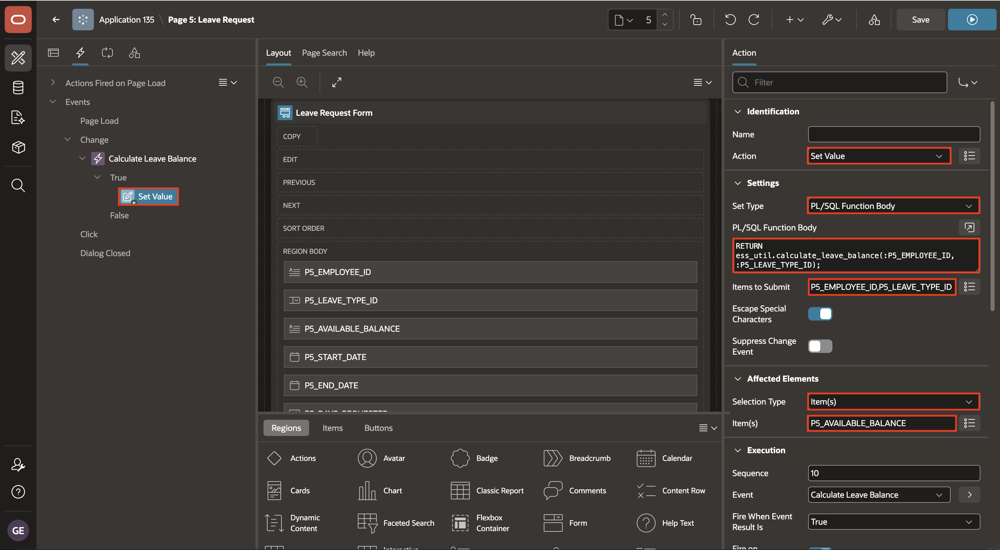

## Task 3: Calculate requested days

In this task, you calculate the requested leave days when both the start date and end date are populated.

1. Under the **Dynamic Actions** tab, right-click **Events** node and select **Create Dynamic Action**.

    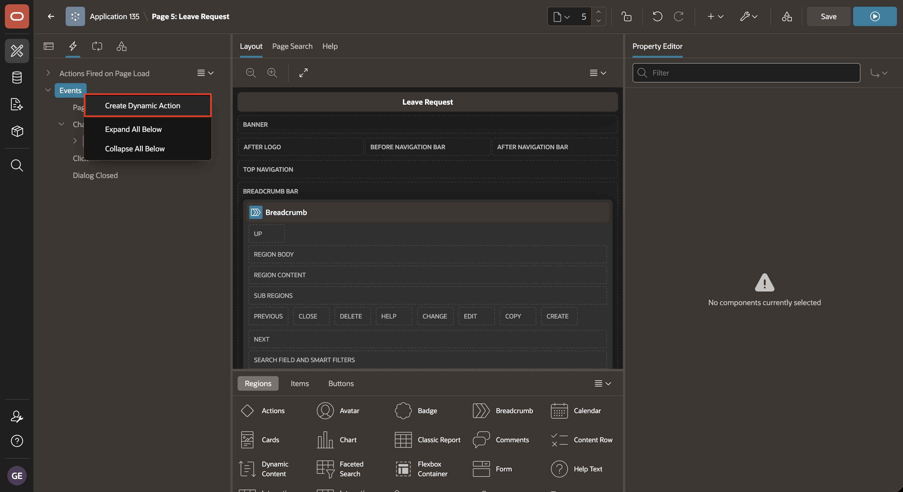

2. In the Property Editor, set:

    - Under Identification:

        - Name: **Calculate Requested Days**

    - Under When:

        - Event: **Change**
        - Selection Type: **Item(s)**
        - Item(s): **`P5_START_DATE,P5_END_DATE`**

    - Under Client-side Condition:

        - Type: **JavaScript expression**
        - JavaScript Expression: enter the following code.

            ```javascript
            <copy>
            $v('P5_START_DATE') != '' && $v('P5_END_DATE') != ''
            </copy>
            ```

    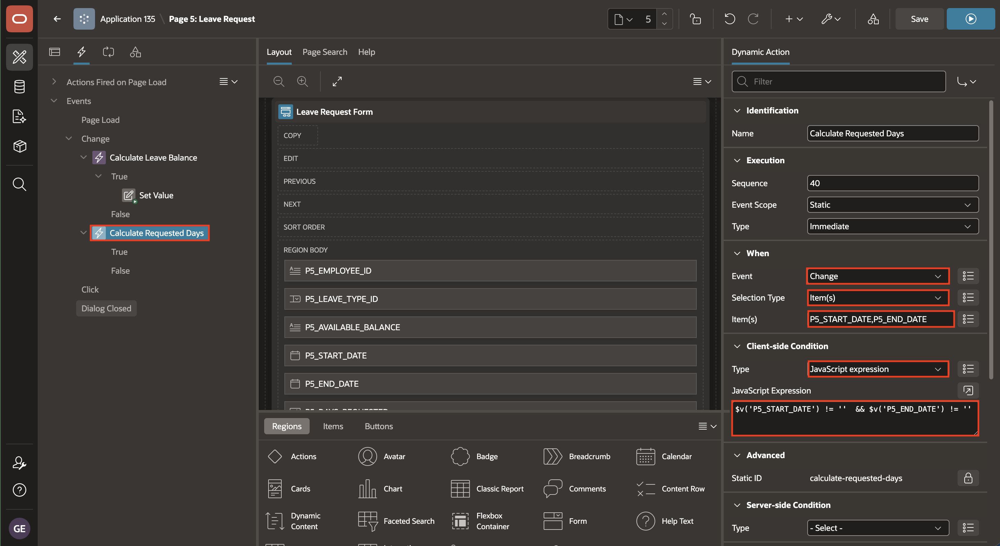

3. Under **Calculate Requested Days** dynamic action, select **Create TRUE Action**.

    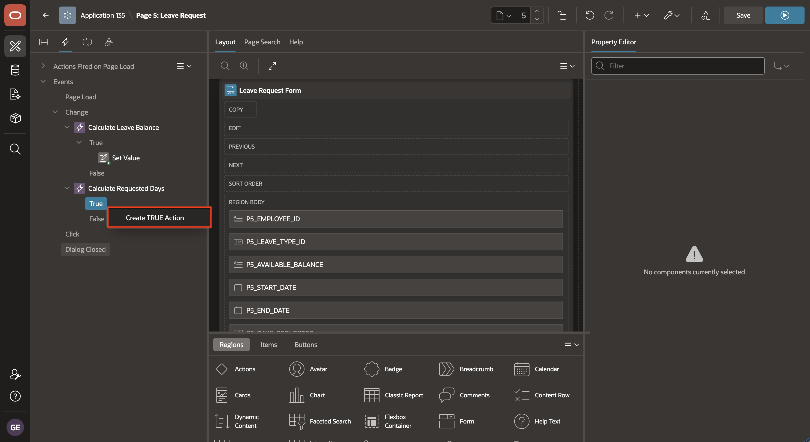

4. In the Property Editor, set:

    - Under Identification:

        - Action: **Set Value**

    - Under Settings:

        - Set Type: **PL/SQL Expression**
        - PL/SQL Expression: enter the following expression.

            ```plsql
            <copy>
            TO_DATE(:P5_END_DATE, 'MM/DD/YYYY')
                - TO_DATE(:P5_START_DATE, 'MM/DD/YYYY')
            </copy>
            ```

        - Items to Submit: **`P5_END_DATE,P5_START_DATE`**

    - Under Affected Elements:

        - Selection Type: **Item(s)**
        - Item(s): **`P5_DAYS_REQUESTED`**

    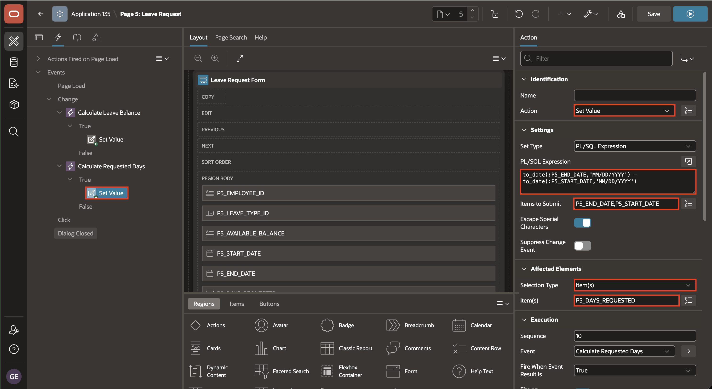

5. Under **Calculate Requested Days** dynamic action, right-click the **False** node and select **Create FALSE Action**.

    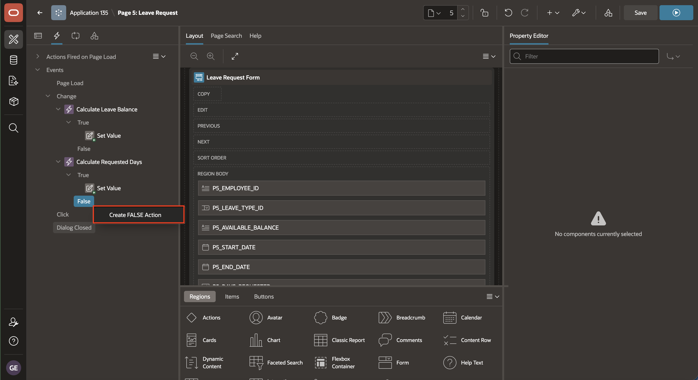

6. In the Property Editor, set:

    - Under Identification:

        - Action: **Clear**

    - Under Affected Elements:

        - Selection Type: **Item(s)**
        - Item(s): **`P5_DAYS_REQUESTED`**

    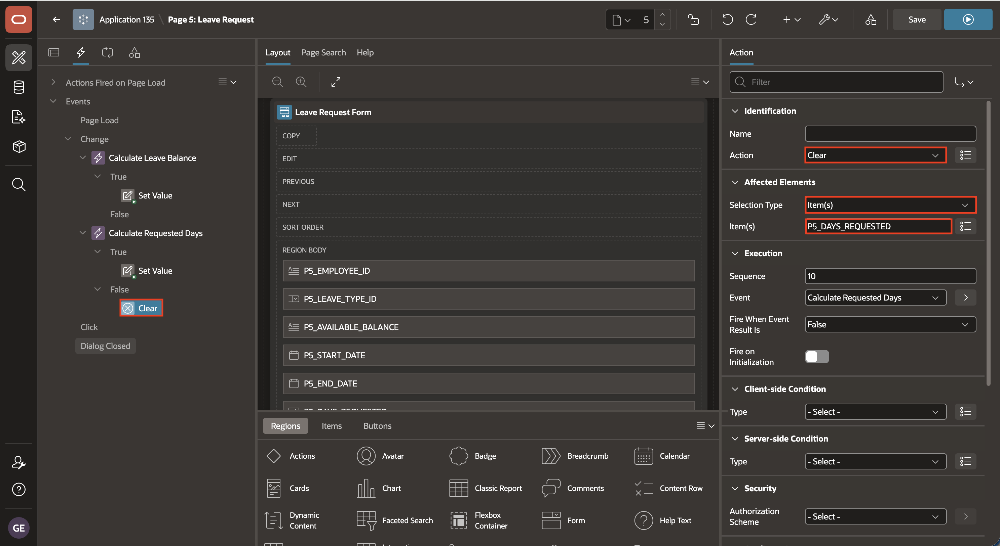

## Task 4: Set the over-limit warning

In this task, you set a warning value when the requested days are greater than the available balance.

1. Under the **Dynamic Actions** tab, right-click **Events** node and select **Create Dynamic Action**.

    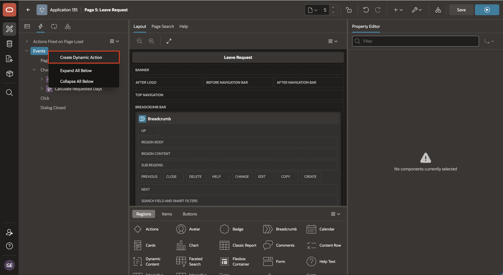

2. In the Property Editor, set:

    - Under Identification:

        - Name: **Exceed remaining balance**

    - Under When:

        - Event: **Change**
        - Selection Type: **Item(s)**
        - Item(s): **`P5_AVAILABLE_BALANCE,P5_DAYS_REQUESTED`**

    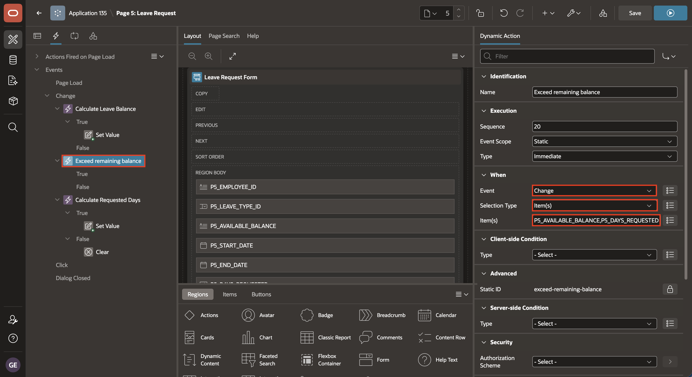

3. Under **Exceed remaining balance** dynamic action, select **Create TRUE Action**.

    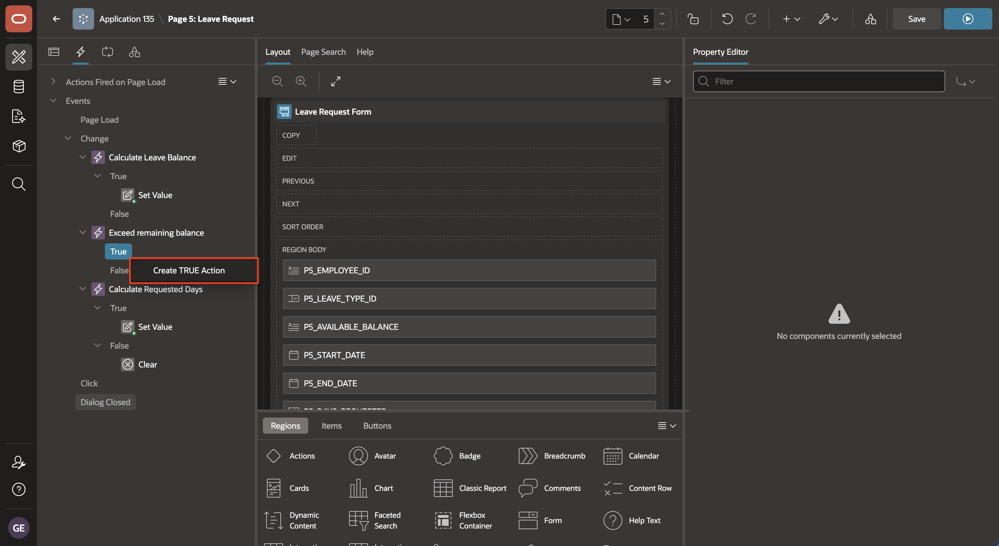

4. In the Property Editor, set:

    - Under Identification:

        - Action: **Set Value**

    - Under Settings:

        - Set Type: **PL/SQL Function Body**
        - PL/SQL Function Body: enter the following code.

            ```plsql
            <copy>
            IF :P5_DAYS_REQUESTED > :P5_AVAILABLE_BALANCE THEN
              RETURN 'Requested days exceed your remaining balance.';
            END IF;
            RETURN NULL;
            </copy>
            ```

        - Items to Submit: **`P5_AVAILABLE_BALANCE,P5_DAYS_REQUESTED`**

    - Under Affected Elements:

        - Item(s): **`P5_BALANCE_WARNING`**

    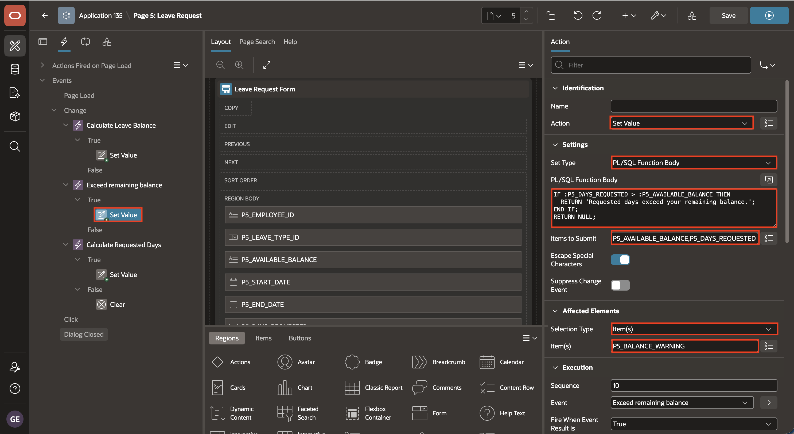

## Task 5: Display and test the leave warning

In this task, you display an alert when the warning is set and test the leave-request interaction.

1. Under the **Dynamic Actions** tab, right-click **Events** node and select **Create Dynamic Action**.

    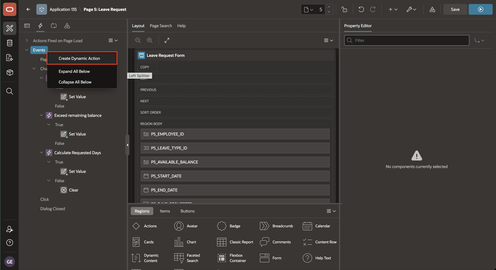

2. In the Property Editor, set:

    - Under Identification:

        - Name: **Leave Balance Warning**

    - Under When:

        - Event: **Change**
        - Selection Type: **Item(s)**
        - Item(s): **`P5_BALANCE_WARNING`**

    - Under Client-side Condition:

        - Type: **Item is not null**
        - Item: **`P5_BALANCE_WARNING`**

    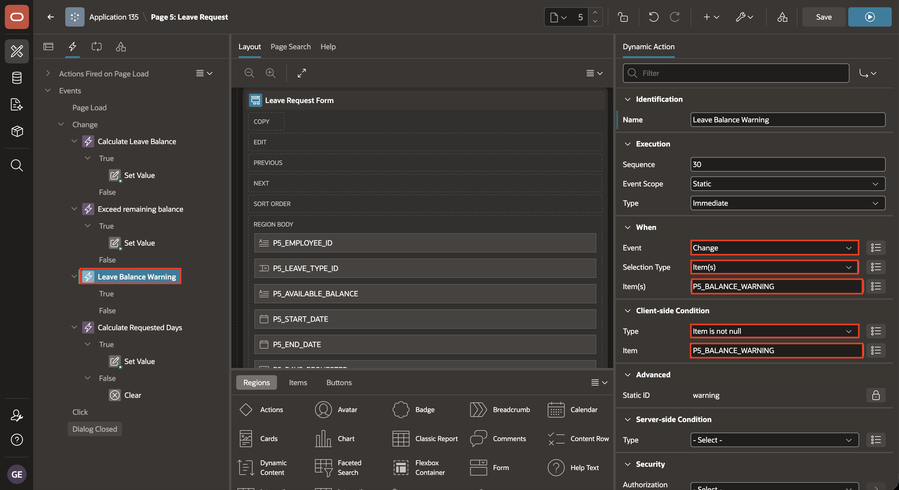

3. Under **Leave Balance Warning** dynamic action, select **Create TRUE Action**.

    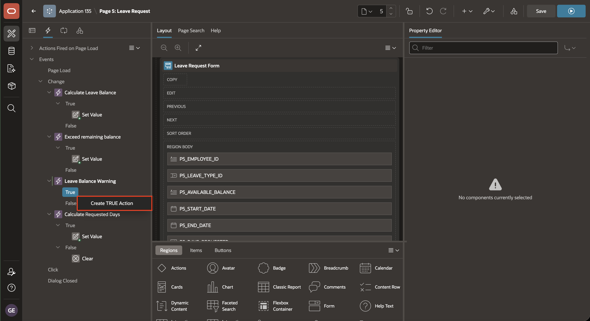

4. In the Property Editor, set:

    - Under Identification:

        - Action: **Alert**

    - Under Settings:

        - Message: **`Requested days exceed your remaining balance.`**

    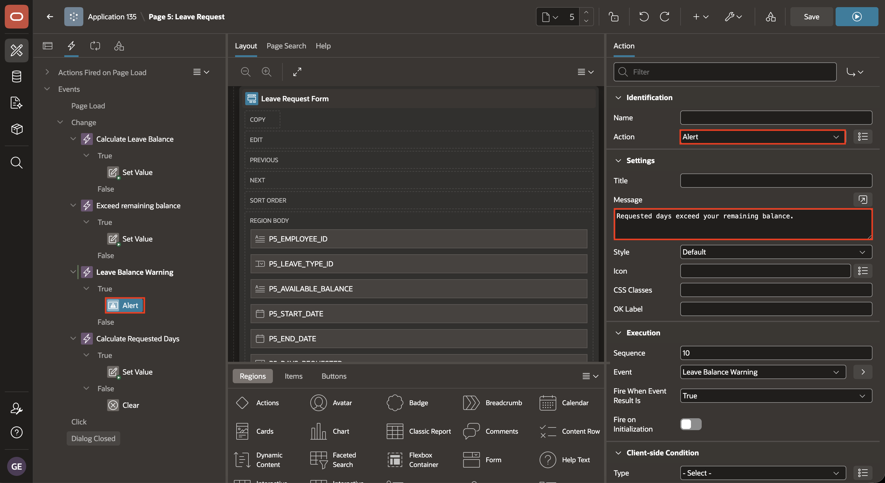

5. Click **Save and Run Page**.

    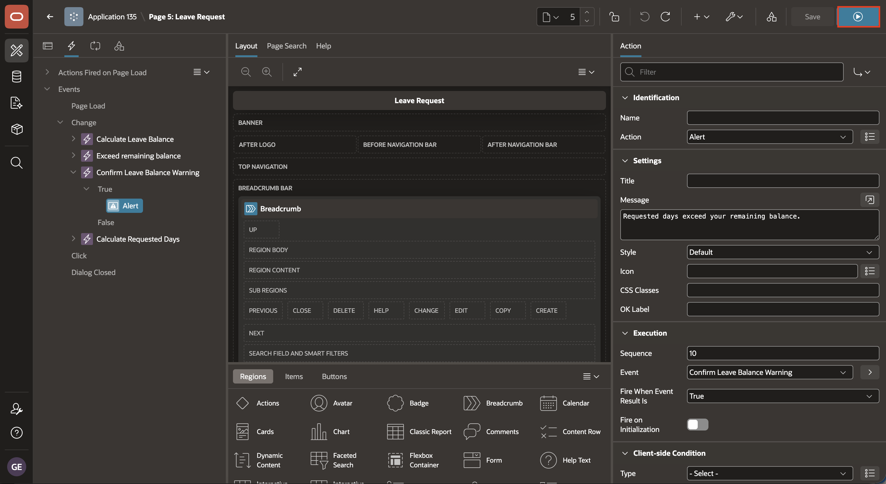

6. Select a leave type to populate the available balance. Then enter a start date and end date to populate the requested days. If the requested days are greater than the available balance, an alert box is displayed.

    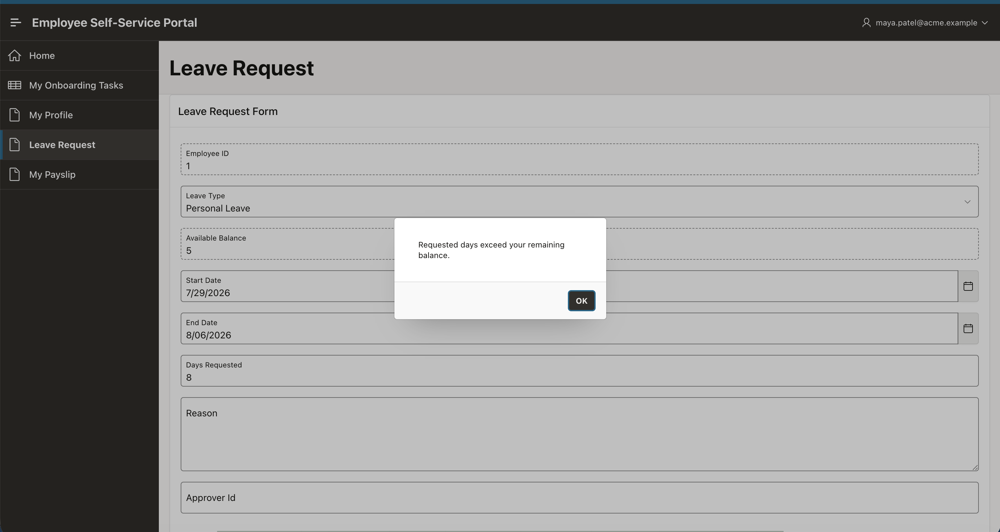

## Summary

You learned how **Display Only** and **Hidden** page items support a responsive form. The Display Only item shows the available leave balance, while the Hidden item stores the warning message used by the page.

You also learned how **Dynamic Actions** respond when page item values change. You used Set Value actions to calculate the available balance and requested days, then used an Alert action to warn users when their request exceeds the remaining balance.

At the end of this lab, you are on the running Employee Self-Service Portal **Leave Request** page, where the form provides immediate feedback without a full page submit.

## Acknowledgements

- **Author** - Ashwin Rao, Principal Product Manager; Roopesh Thokala, Principal Product Manager
- **Last Updated By/Date** - Ashwin Rao Principal Product Manager, July 2026
