# Link Candidate Profile and Interview Feedback

## Introduction

One candidate can have several interview feedback entries. Lab 1 prepares the Candidate Profile form and leaves the supplied **Application History** region in place. In this lab, you will configure that region as **Interview Feedback History**, including the interview feedback notes. Recruiters can then create a new feedback entry for the selected candidate from Page 11.

Estimated Lab Time: 5 minutes

### Objectives

In this lab, you will:

- Configure the existing Application History region as an Interview Feedback History report.
- Display feedback only for the selected candidate.
- Open Interview Feedback in insert mode for that candidate.
- Refresh Interview Feedback History when the feedback form closes.
- Configure the interview-stage list on Page 13.

### Prerequisites

Use **TAP Page 11: Candidate Profile** and the existing **Page 13: Interview Feedback** form. Before you begin, confirm that Page 11 includes:

- Hidden item **P11\_CANDIDATE\_ID**
- Candidate Profile region sourced from **TMS\_CANDIDATES**
- Application History region from the supplied Page 11 export

Reuse the supplied **Application History** region; do not add a second report if it is already present. Page 13 is the existing modal form used to create a new feedback entry.

## Task 1: Configure Interview Feedback History

In this task, you will configure the **Application History** region from the supplied Page 11 export as a Classic Report. The report displays the stage, interviewer, scheduled date, outcome, score, and feedback notes for the selected candidate.

1. Click **App Builder** and open **Talent Acquisition Portal**.

    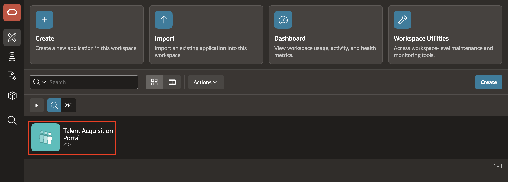

2. Select **Page 11: Candidate Profile**.

    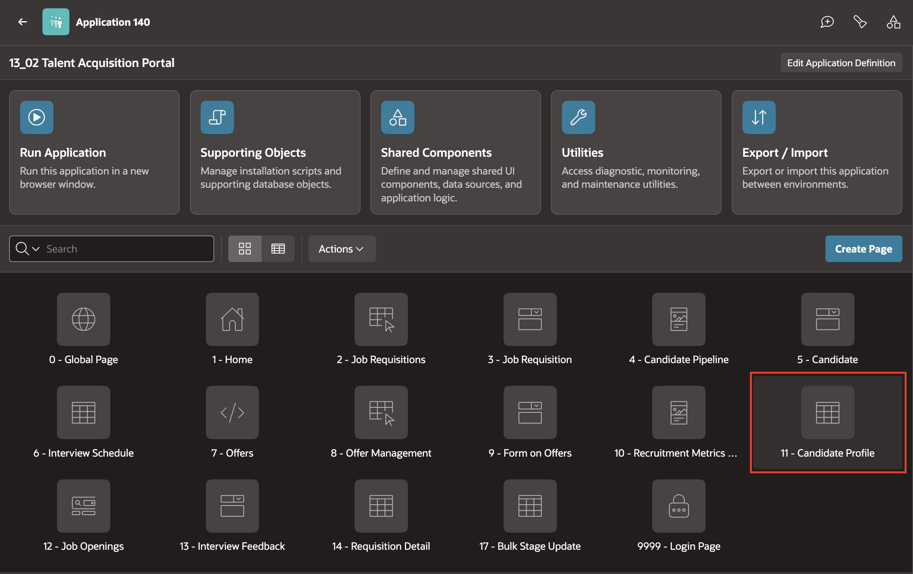

3. In the Rendering tree, select the existing **Application History** region below the Candidate Profile form columns. If it is missing, right-click **Body** and select **Create Region** in that position.

    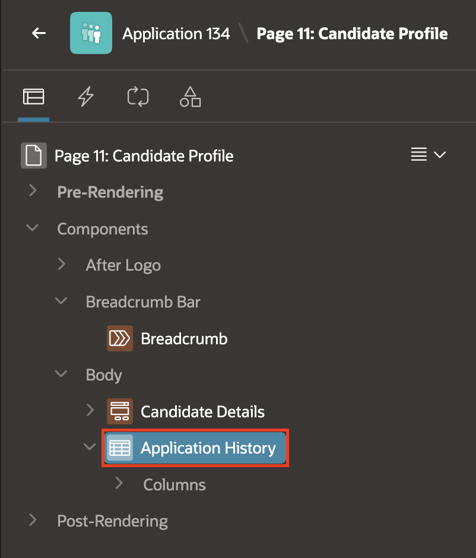

4. In the Property Editor, update the region:

    - Under Source:
        - Location: **Local Database**
        - Type: **SQL Query**
        - SQL Query: Copy and paste the following:

            ```sql
            <copy>
            SELECT
                i.stage_name,
                e.first_name || ' ' || e.last_name AS interviewer_name,
                i.scheduled_date,
                i.outcome,
                i.score,
                DBMS_LOB.SUBSTR(i.feedback_notes, 4000, 1) AS feedback_notes
            FROM tms_interview_stages i
            LEFT JOIN tms_employees e
                   ON i.interviewer_id = e.employee_id
            WHERE i.candidate_id = :P11_CANDIDATE_ID
            ORDER BY i.scheduled_date DESC
            </copy>
            ```

    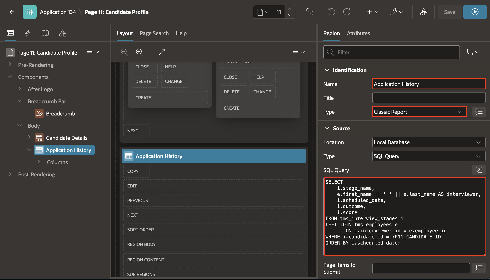

    The screenshot shows where to edit the existing region's properties. Replace its current SQL with the query above. The report displays the selected candidate's interview and feedback history, with **P11\_CANDIDATE\_ID** linking the detail rows to the Candidate Profile master record.

5. Click **Save**. The existing **Application History** region is now **Interview Feedback History**; do not create a duplicate report region.

    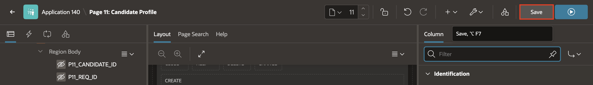

## Task 2: Configure the Interview Stage List

In this task, you will configure the interview-stage item on the existing feedback form.

1. Open **Page 13: Interview Feedback** in Page Designer. Confirm that the page is configured as a modal dialog.

    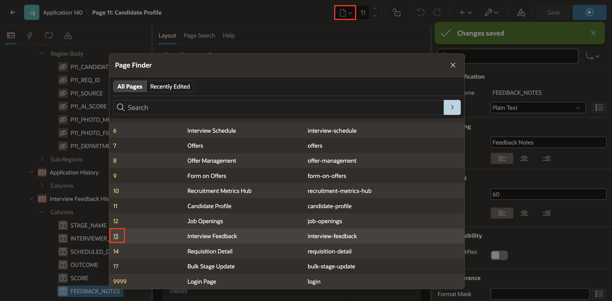
    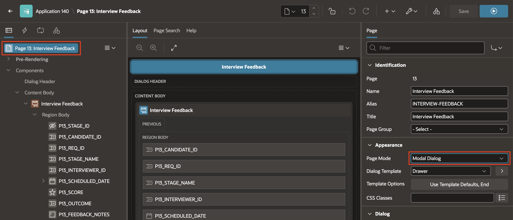

2. In the Rendering tree, select **P13\_STAGE\_NAME**. Then, in the Property Editor, enter/select the following:

    - Identification > Type: **Select List**
    - Source > Column: **STAGE\_NAME**

    - Under List of Values:

        - Type: **Shared Component**
        - List of Values: **TMS\_INTERVIEW.STAGES**

    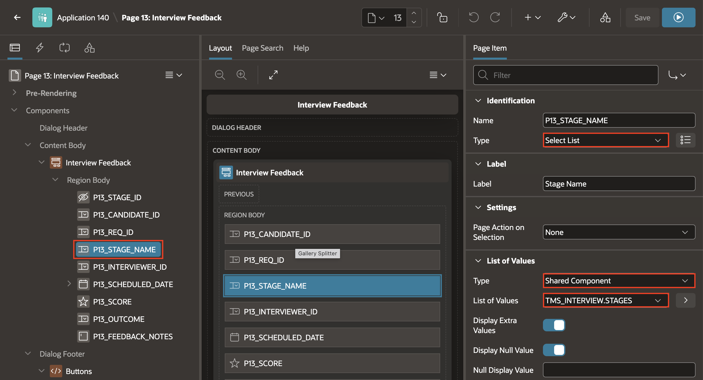

3. Click **Save**.

## Task 3: Add the New Feedback Entry Button

In this task, you will add a button that opens a new feedback entry for the selected candidate.

1. Return to **Page 11: Candidate Profile**.

    

2. In the Rendering tree, right-click **Interview Feedback History** and select **Create Button**.

    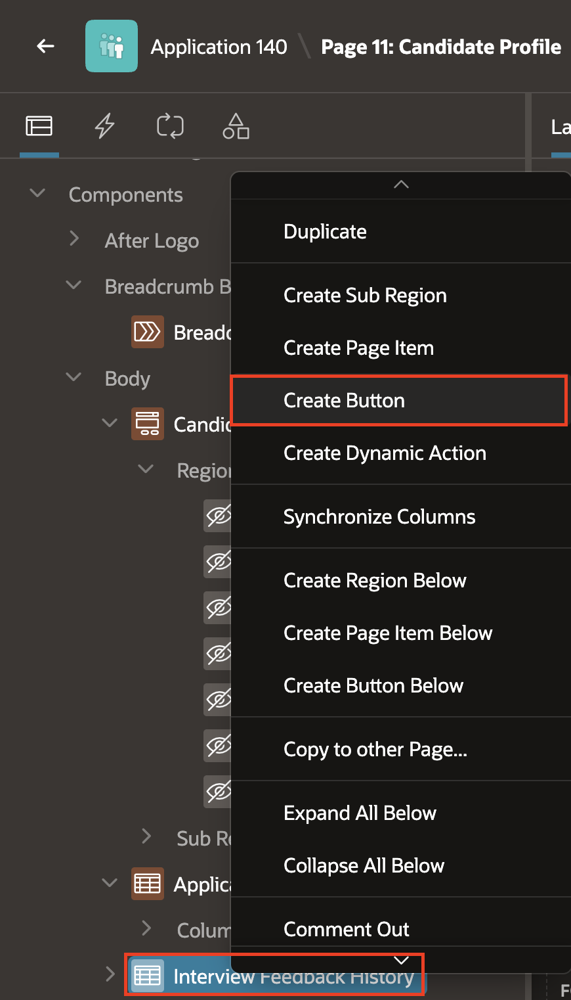

3. Select the new button and enter/select the following in the Property Editor:

    - Under Identification:

        - Button Name: **New\_Feedback\_Entry**
        - Label: **New Feedback Entry**

    - Layout > Slot: **Copy**

    - Under Behavior:

        - Action: **Redirect to Page in this Application**

    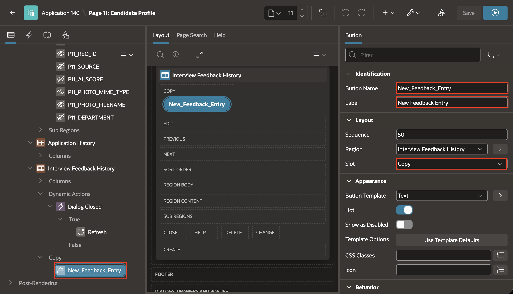

4. Under **Behavior**, click **Target** to open the Link Builder. Enter/select the following:

    - Page: **13 - Interview Feedback**
    - Under Set Items:

        - Name: **P13\_CANDIDATE\_ID**
        - Value: **&P11\_CANDIDATE\_ID.**

    - Clear Cache: **13**

    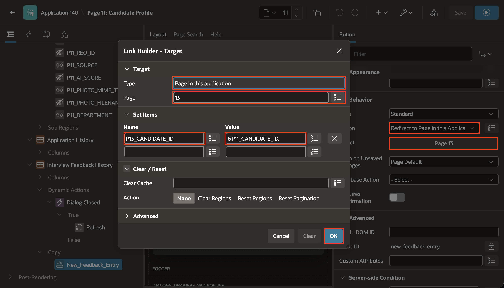

    The screenshot shows the page and item mapping. It leaves **Clear Cache** empty; enter **13** there before clicking **OK** so the form opens in insert mode.

    Click **OK**.

    Clearing Page 13 removes any previously loaded feedback entry, so the button opens the form in insert mode. Passing **P13\_CANDIDATE\_ID** associates the new feedback entry with the selected candidate.

5. Click **Save**.

    

## Task 4: Refresh Interview Feedback History

In this task, you will refresh the detail report when the feedback form closes.

1. Return to **Page 11: Candidate Profile**.

    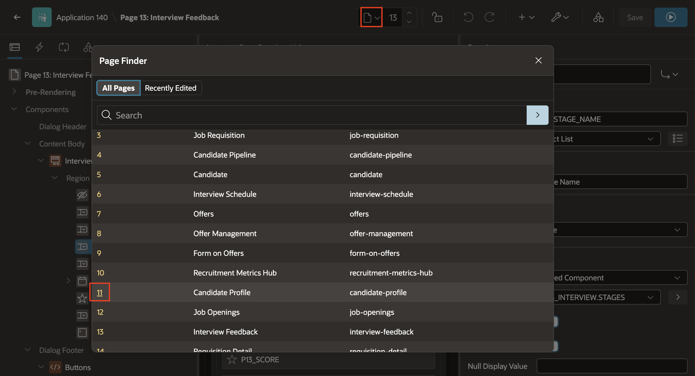

2. In Page Designer, click the **Dynamic Actions** tab in the left pane.

3. Right-click **Events** and select **Create Dynamic Action**.

    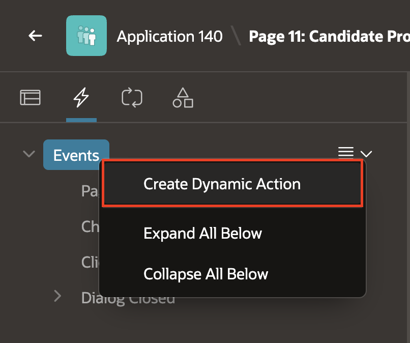

4. Select the new dynamic action and enter/select the following in the Property Editor:

    - Under When:

        - Event: **Dialog Closed**
        - Selection Type: **Region**
        - Region: **Interview Feedback History**

    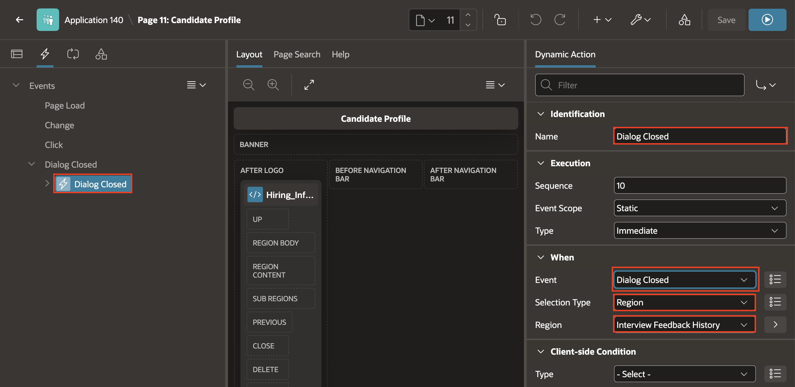

    This scopes the event to dialogs opened by components in **Interview Feedback History**, including **New Feedback Entry**.

5. Under the dynamic action, select the default True action and enter/select the following:

    - Identification > Action: **Refresh**

    - Under Affected Elements:

        - Selection Type: **Region**
        - Region: **Interview Feedback History**

    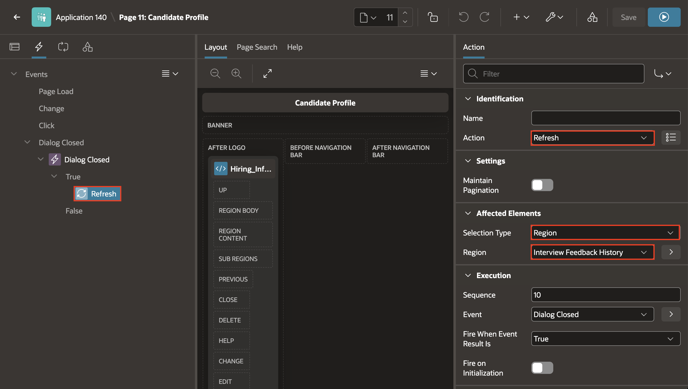

6. Click **Save**.

## Task 5: Run the Candidate Feedback Flow

1. Run TAP and Navigate to **Candidate Pipeline** page.

    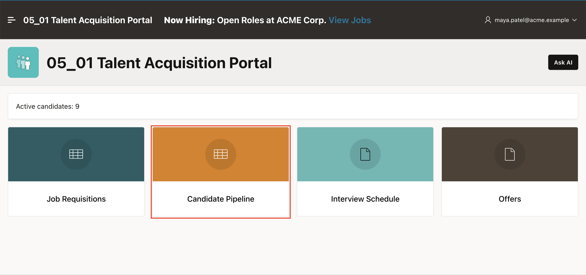

2. Open an existing candidate from the Candidate Pipeline Report.

    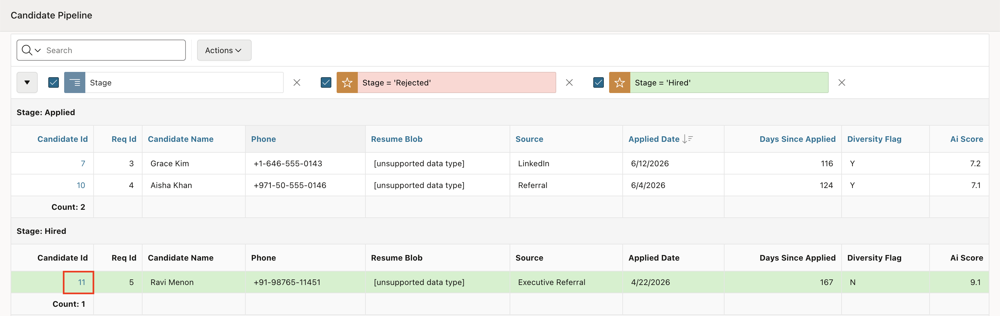

3. Confirm that **Interview Feedback History** appears below the Candidate Profile form columns and displays feedback for the selected candidate. In this example, we do not have any Feedback available.

4. Click **New Feedback Entry**.

    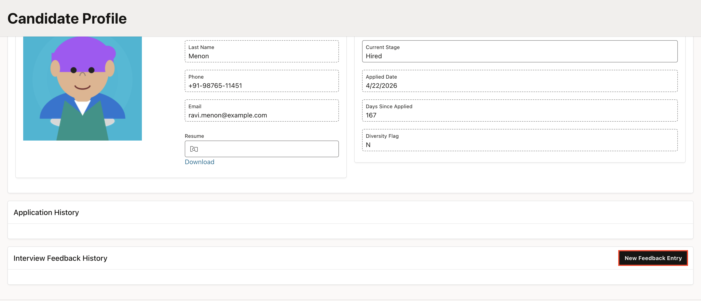

5. Confirm that Interview Feedback opens with the selected candidate ID passed to **P13\_CANDIDATE\_ID**.

6. Enter the feedback and click **Create**

    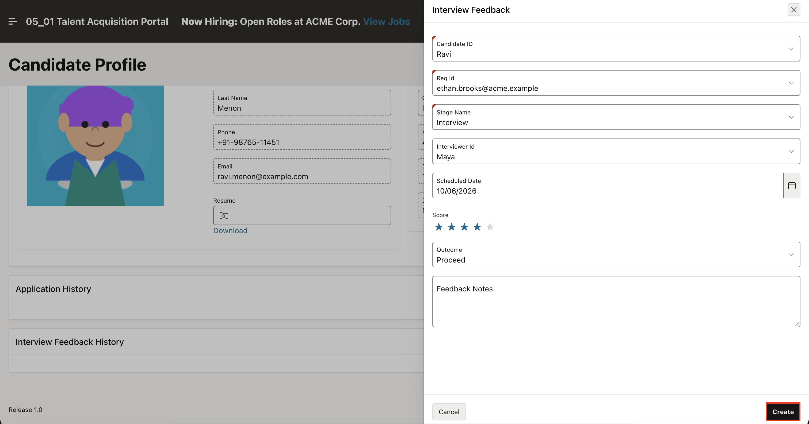

7. Confirm that **Interview Feedback History** refreshes and shows the new entry.

    

## Summary

You configured the supplied Application History region as **Interview Feedback History** with feedback notes. You configured **P13\_STAGE\_NAME** to use **TMS\_INTERVIEW.STAGES**, and linked Page 11 to a new Page 13 feedback entry for the selected candidate.

You may now proceed to the next lab.

## Learn More

- [Oracle APEX 26.1: Understanding Dynamic Actions](https://docs.oracle.com/en/database/oracle/apex/26.1/htmdb/understanding-dynamic-actions.html)
- [Oracle APEX 26.1: Creating Dialog Pages](https://docs.oracle.com/en/database/oracle/apex/26.1/htmdb/creating-dialog-pages.html)

## Acknowledgements

- **Author** - Roopesh Thokala, Principal Product Manager
- **Last Updated By/Date** - September 2026