# Build a Bulk Stage Update Interactive Grid

## Introduction

Recruiters may need to move several candidates to a new stage at the same time. In this lab, you will create a Bulk Stage Update page that lets recruiters update the current stage for multiple candidates.

Estimated Lab Time: 5 minutes

### Objectives

In this lab, you will:

- Create an editable Interactive Grid for candidates who are not hired or rejected.
- Make **CURRENT\_STAGE** the only editable column and use valid candidate-stage values.
- Add the page to navigation and prepare it for recruiter authorization in Module 18.

## Task 1: Create the Editable Interactive Grid Page

Create the page and its Interactive Grid together in the Create Page wizard.

1. Click **App Builder** and open **Talent Acquisition Portal**.

    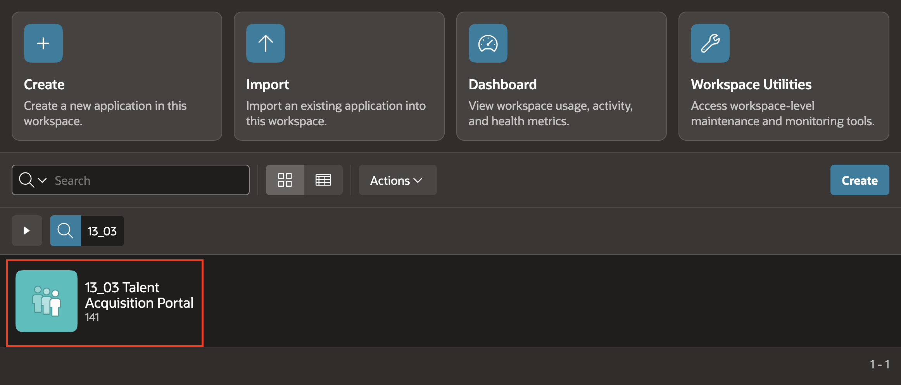

2. Click **Create Page**.

    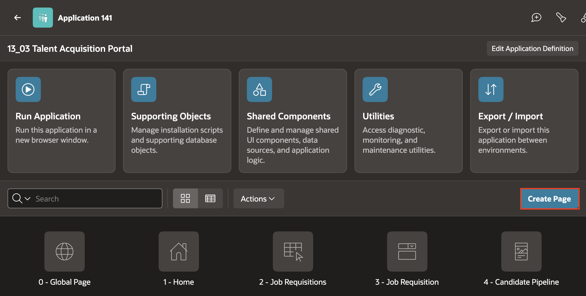

3. Under **Component**, select **Interactive Grid**.

    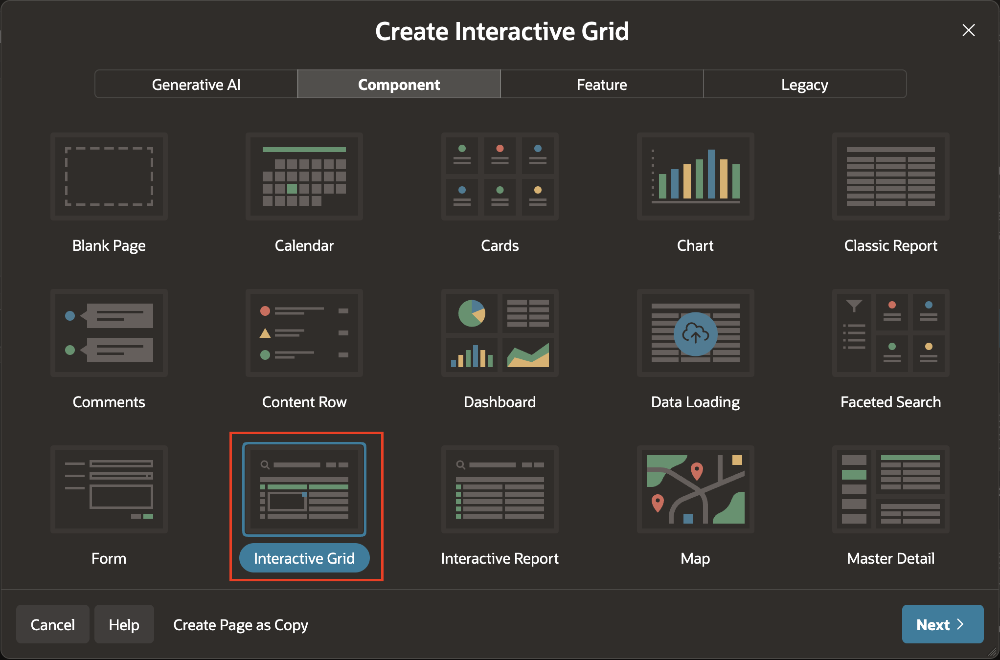

4. Under **Page Definition**, enter **Bulk Stage Update** as the page name. Leave **Page Mode** set to **Normal** and **Include Form Page** disabled.

    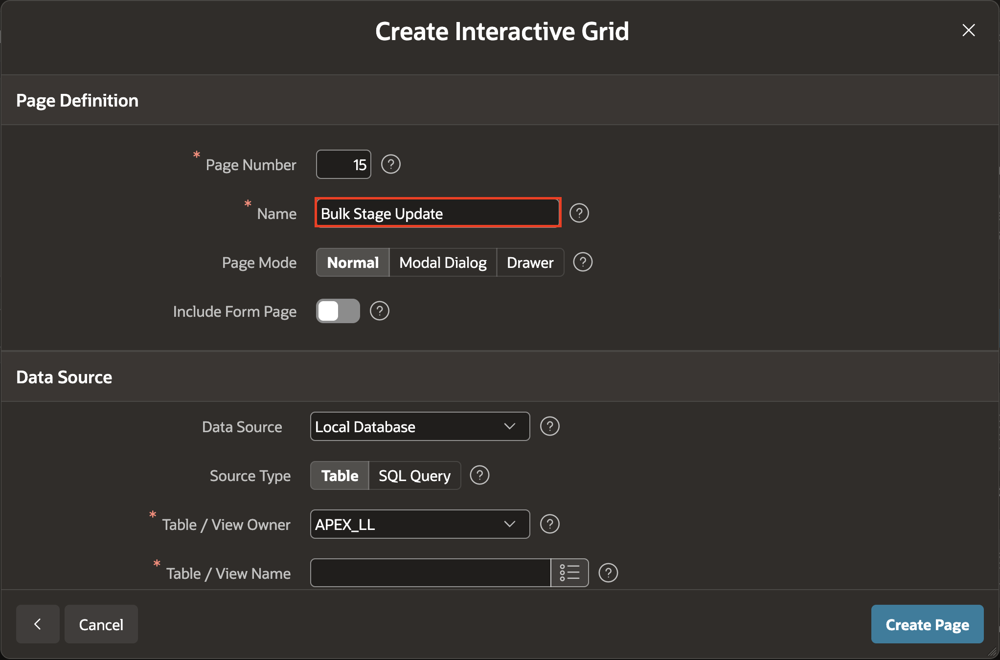

    The wizard initially selects **Table** as the source type. Change it to **SQL Query** in the next step.

5. Under **Source Type**, select **SQL Query** and enter the following query. Make sure **Editing Enabled** is set to **Yes**.

    ```sql
    <copy>
    SELECT
        c.candidate_id,
        c.first_name || ' ' || c.last_name AS candidate_name,
        c.current_stage,
        c.applied_date,
        c.req_id
    FROM tms_candidates c
    WHERE c.current_stage NOT IN ('Hired', 'Rejected')
    </copy>
    ```

    - Click **Next**.

    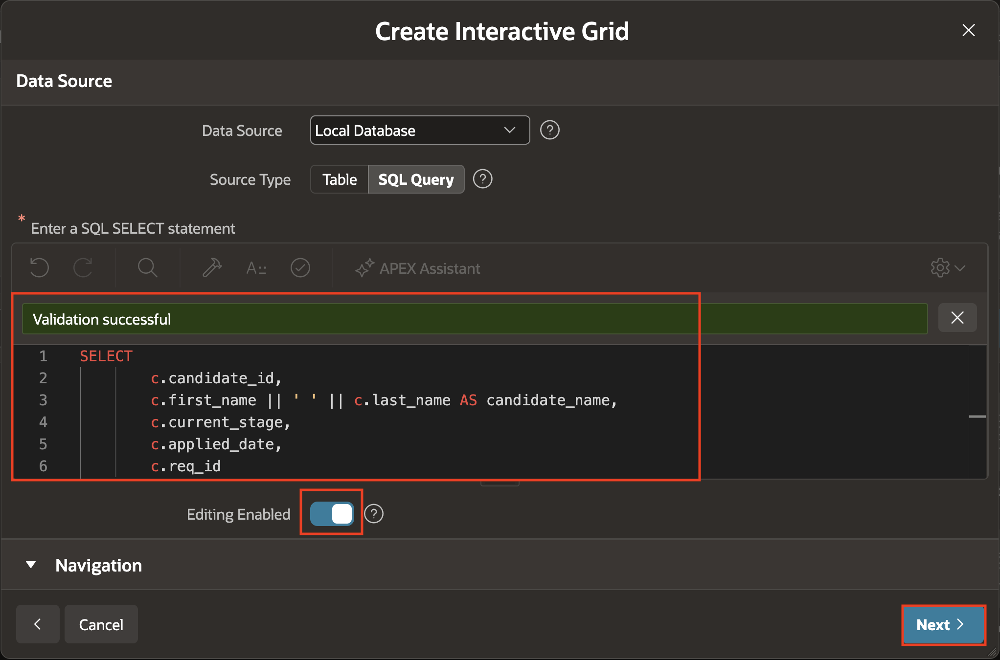

6. Under **Primary Key**, select **CANDIDATE\_ID** for **Primary Key Column 1**. Leave **Primary Key Column 2** unselected, then click **Create Page**.

    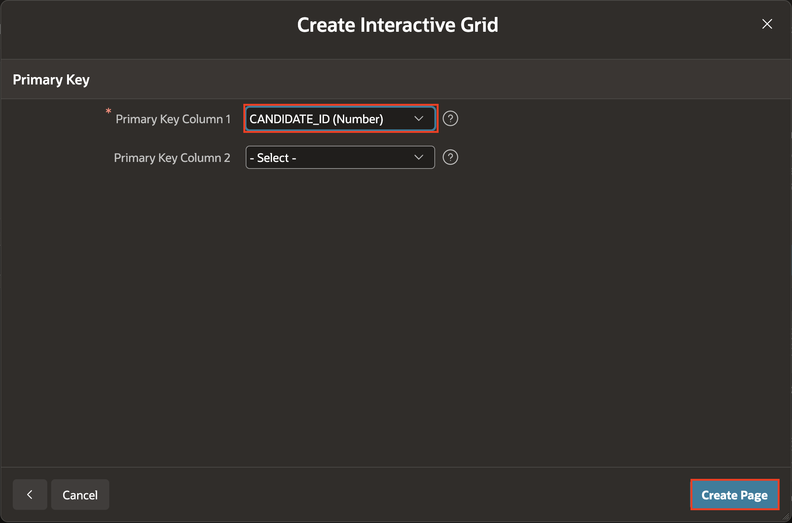

## Task 2: Configure the Grid for Stage Updates

In this task, you will configure **CURRENT\_STAGE** as the only editable column.

1. In the Rendering tree, select the **Bulk Stage Update** Interactive Grid region.

2. In the Property Editor, select the **Attributes** tab and set the following properties:
    - Under **Allowed Operations**:
        - **Add Row**: Off
        - **Update Row**: On
        - **Delete Row**: Off

    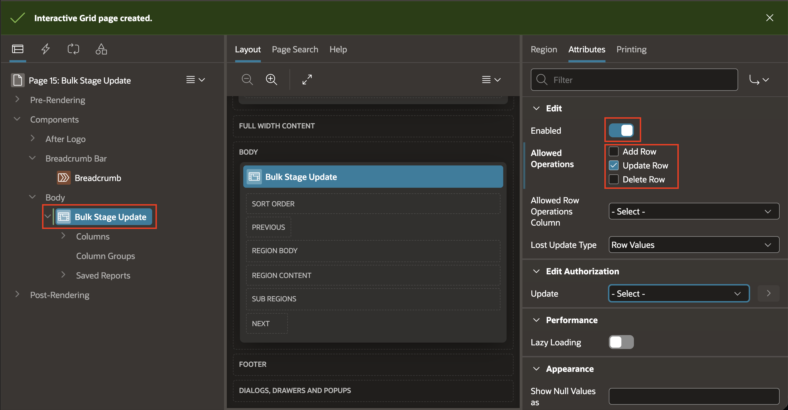

3. In the Rendering tree, expand the **Columns** node and select **CANDIDATE\_ID**. In the Property Editor, set **Identification > Type** to **Display Only**.

    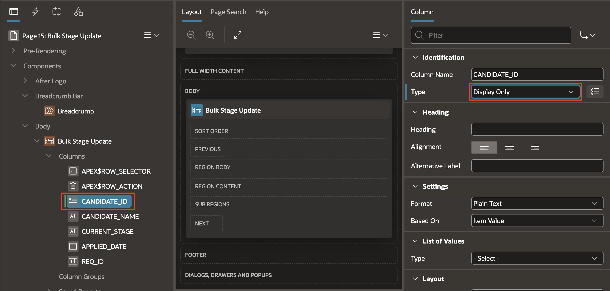

4. Similarly, set the **Identification > Type** of the following columns to **Display Only**:

    | Column Name | Identification > Type | Source > Query Only |
    | --- | --- | --- |
    | CANDIDATE\_NAME | Display Only | Yes |
    | APPLIED\_DATE | Display Only | Yes |
    | REQ\_ID | Display Only | Yes |

    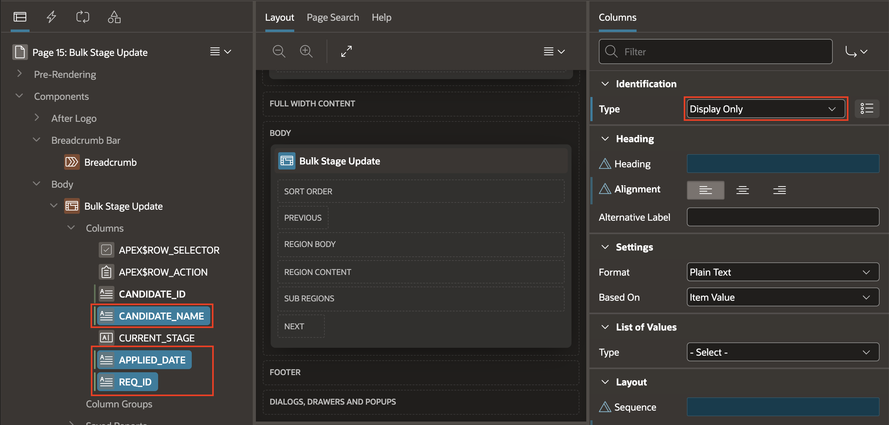

5. Select the **CURRENT\_STAGE** column. In the Property Editor, set:
    - Under **Identification > Type**, select **Select List**.
    - Under **List of Values > Type**, select **Static Values**.

    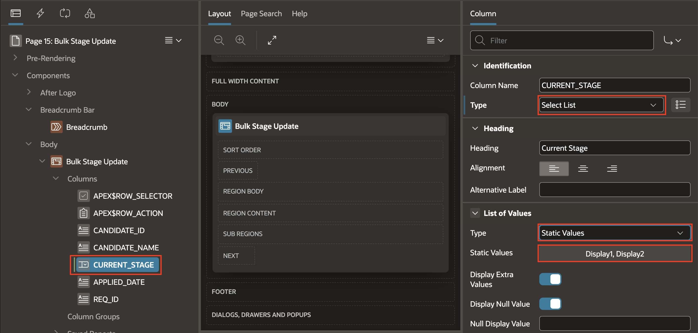

    Enter the following values. Use the same text for each display value and return value:

    | Display Value | Return Value |
    | --- | --- |
    | Applied | Applied |
    | Screening | Screening |
    | Interview | Interview |
    | Offer | Offer |
    | Hired | Hired |
    | Rejected | Rejected |

    These are the values allowed by the `TMS_CANDIDATES.CURRENT_STAGE` constraint. Include **Hired** and **Rejected** so a recruiter can move an active candidate into either final stage. Do not use **TMS\_INTERVIEW.STAGES** here; that shared LOV is used for interview `STAGE_NAME` values, which differ from candidate `CURRENT_STAGE` values.

    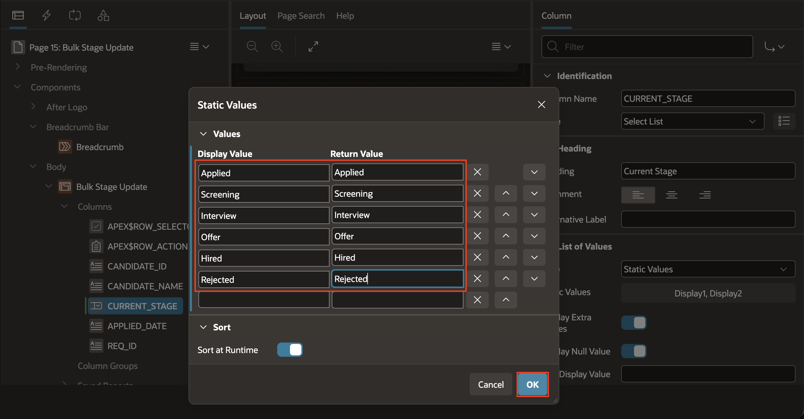

6. Click **Save**.

    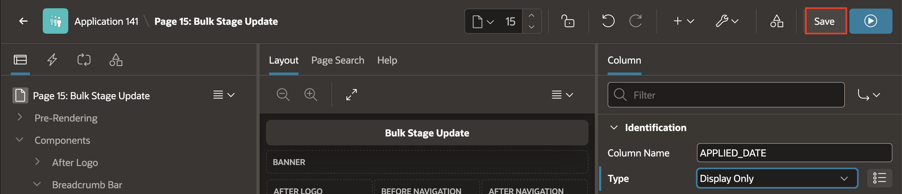

## Task 3: Run and Check the Grid

1. Click **Save and Run Page**.

    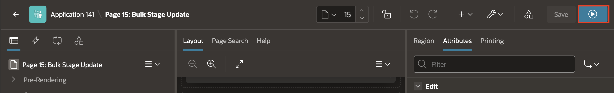

2. Confirm the grid shows candidates whose current stage is not **Hired** or **Rejected**.

    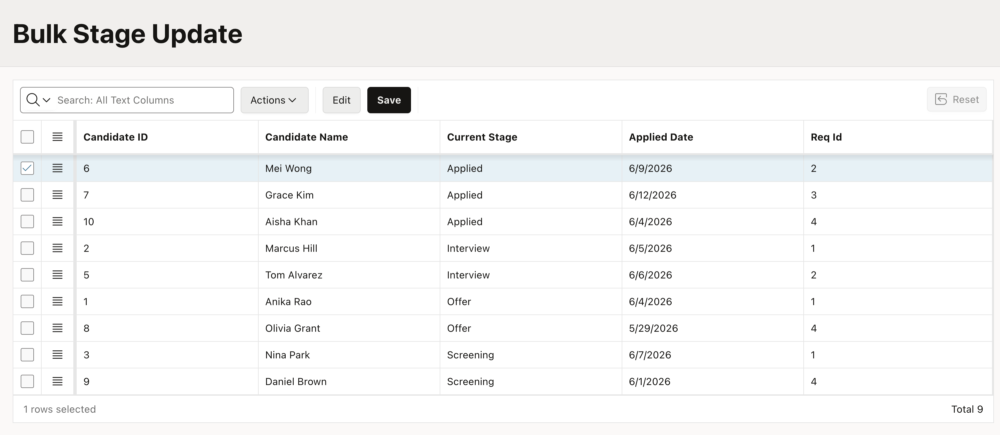

3. Change a candidate's **CURRENT\_STAGE** and select a new stage from the list.

    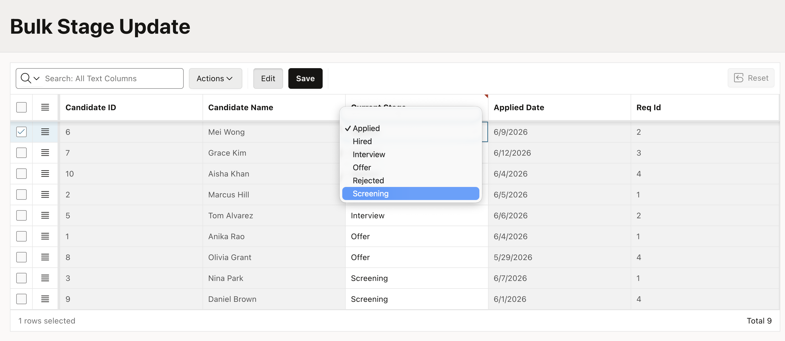

4. Click the grid toolbar's **Save** and confirm that the change is saved.

    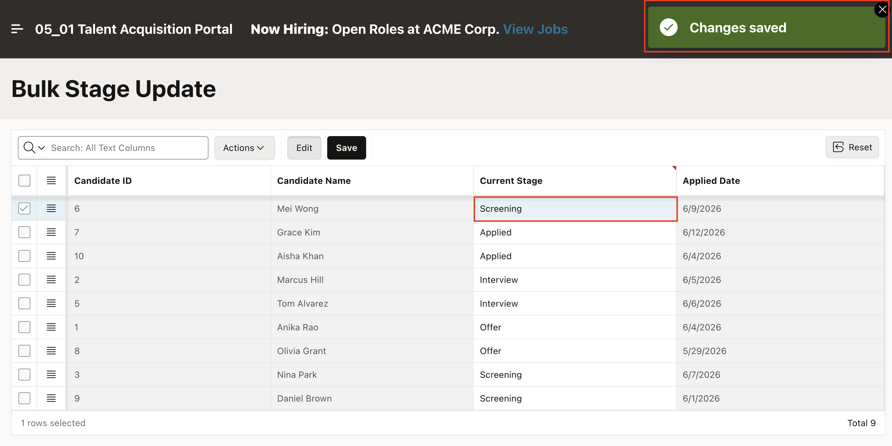

   If you set the stage to **Hired** or **Rejected**, the candidate disappears from this grid after saving because the query filters out those stages.

## Summary

You created an editable Bulk Stage Update Interactive Grid, marked **CANDIDATE\_ID** as its primary key, and limited editing to **CURRENT\_STAGE** with values allowed by the candidate table. The grid's toolbar Save button saves the changes. Module 18 adds recruiter-only authorization.

You may now proceed to the next lab.

## Acknowledgements

- **Author** - Roopesh Thokala, Principal Product Manager
- **Last Updated By/Date** - September 2026
