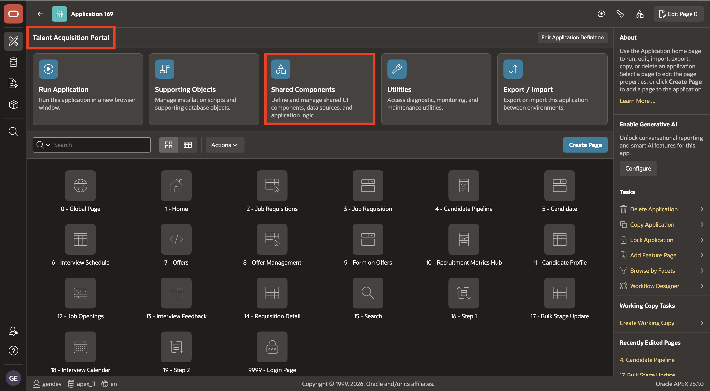
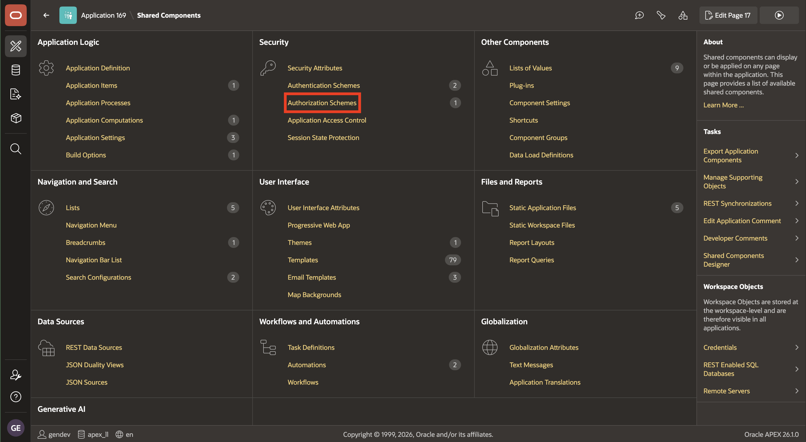
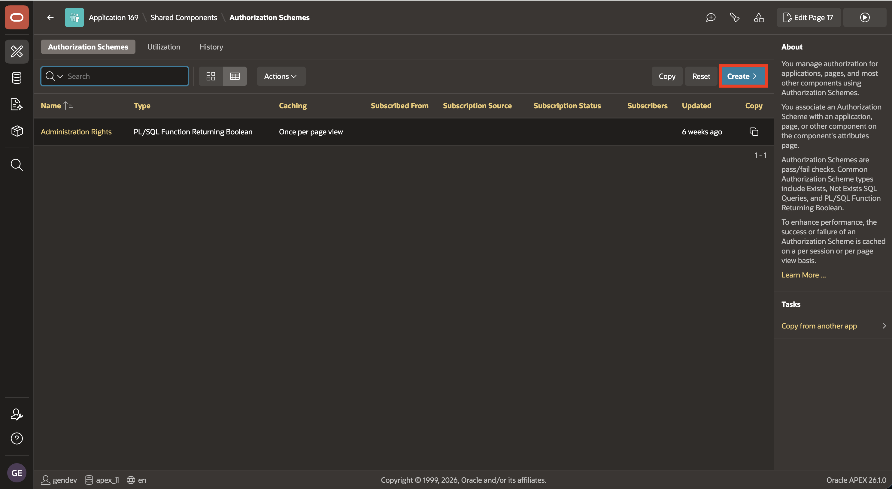
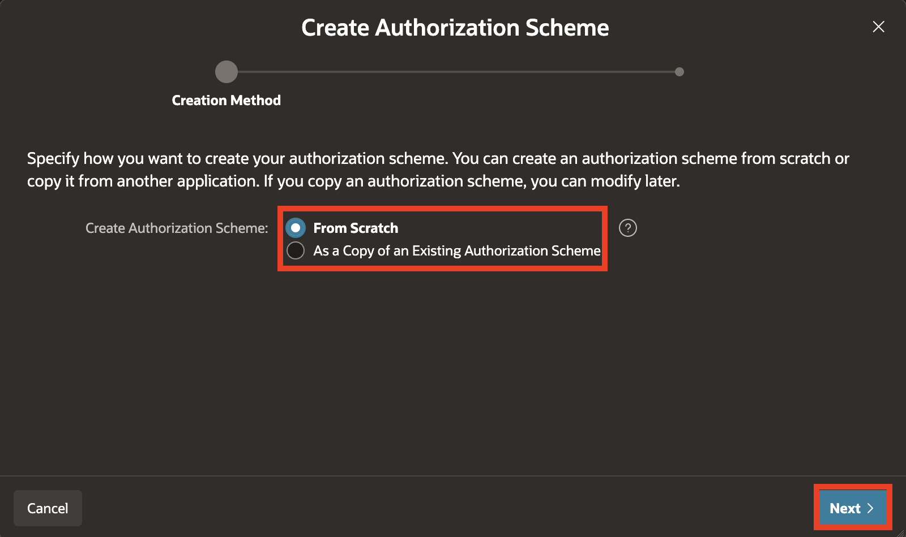
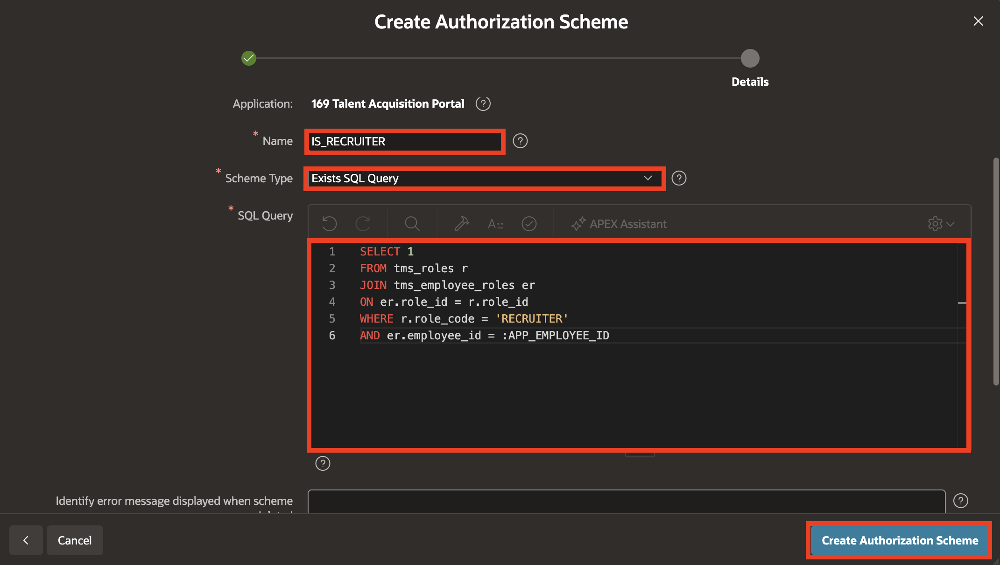
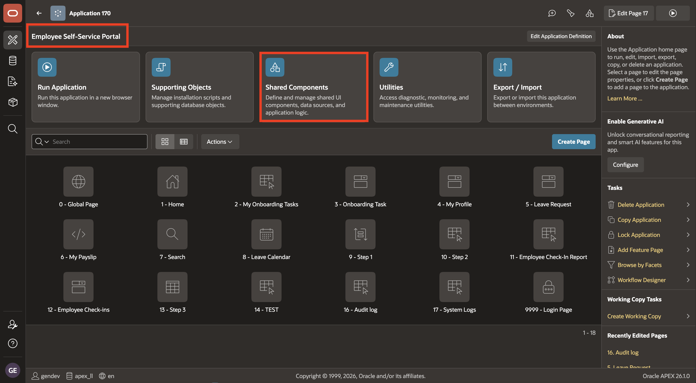
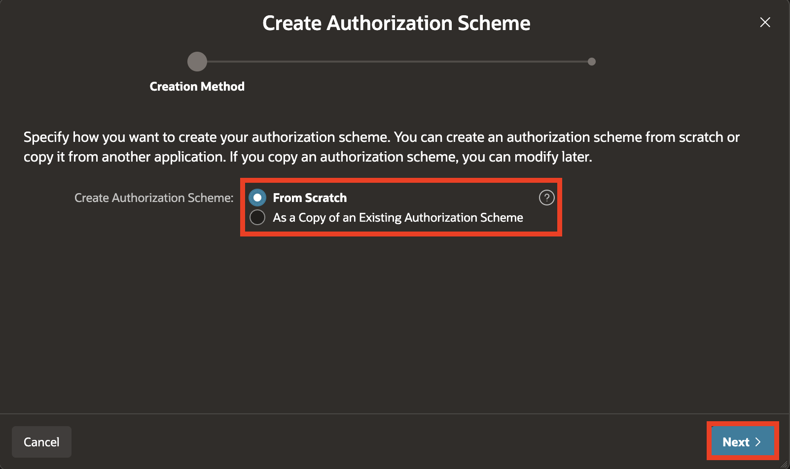
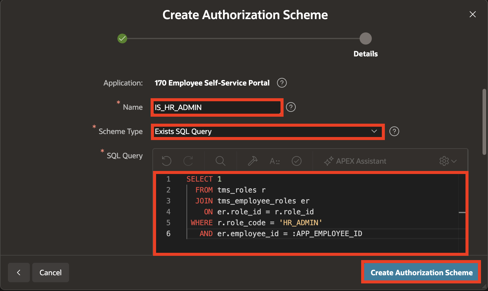

# Lab 2: Create Authorization Schemes

## Introduction

In this lab, you create reusable authorization schemes. Each scheme checks whether the authenticated employee has a role recorded in `TMS_EMPLOYEE_ROLES`.

Estimated Time: 4 minutes

### Objectives

- Create the TAP `IS_RECRUITER` authorization scheme.
- Repeat the same flow for the remaining TAP role combinations.
- Create the ESS `IS_HR_ADMIN` authorization scheme.

## Task 1: Create TAP authorization schemes

1. From **App Builder**, open **Talent Acquisition Portal (TAP)**, then click **Shared Components**.

    

2. Under **Security**, click **Authorization Schemes**.

    

3. On the Authorization Schemes page, click **Create**.

    

4. In the **Create Authorization Scheme** dialog, leave **From Scratch** selected and click **Next**.

    

5. For the example scheme, set:

    - Name: **`IS_RECRUITER`**
    - Scheme Type: **Exists SQL Query**
    - SQL Query:

      ```sql
      <copy>
      SELECT 1
        FROM tms_roles r
        JOIN tms_employee_roles er
          ON er.role_id = r.role_id
       WHERE r.role_code = 'RECRUITER'
         AND er.employee_id = :APP_EMPLOYEE_ID
      </copy>
      ```

    Click **Create Authorization Scheme**.

    

    To create the remaining TAP schemes, follow the same steps 3–5 shown above. Only the scheme name and role predicate change.

    Use the following complete SQL statements when creating the remaining schemes:

    **`IS_HIRING_MANAGER`**

    ```sql
    <copy>
    SELECT 1
      FROM tms_roles r
      JOIN tms_employee_roles er
        ON er.role_id = r.role_id
     WHERE r.role_code = 'HIRING_MANAGER'
       AND er.employee_id = :APP_EMPLOYEE_ID
    </copy>
    ```

    **`IS_TA_ADMIN`**

    ```sql
    <copy>
    SELECT 1
      FROM tms_roles r
      JOIN tms_employee_roles er
        ON er.role_id = r.role_id
     WHERE r.role_code = 'TA_ADMIN'
       AND er.employee_id = :APP_EMPLOYEE_ID
    </copy>
    ```

    **`IS_HIRING_MANAGER_OR_TA_ADMIN`**

    ```sql
    <copy>
    SELECT 1
      FROM tms_roles r
      JOIN tms_employee_roles er
        ON er.role_id = r.role_id
     WHERE r.role_code IN ('HIRING_MANAGER', 'TA_ADMIN')
       AND er.employee_id = :APP_EMPLOYEE_ID
    </copy>
    ```

    **`IS_RECRUITER_OR_TA_ADMIN`**

    ```sql
    <copy>
    SELECT 1
      FROM tms_roles r
      JOIN tms_employee_roles er
        ON er.role_id = r.role_id
     WHERE r.role_code IN ('RECRUITER', 'TA_ADMIN')
       AND er.employee_id = :APP_EMPLOYEE_ID
    </copy>
    ```

    **`IS_RECRUITER_OR_HIRING_MANAGER_OR_TA_ADMIN`**

    ```sql
    <copy>
    SELECT 1
      FROM tms_roles r
      JOIN tms_employee_roles er
        ON er.role_id = r.role_id
     WHERE r.role_code IN ('RECRUITER', 'HIRING_MANAGER', 'TA_ADMIN')
       AND er.employee_id = :APP_EMPLOYEE_ID
    </copy>
    ```

## Task 2: Create the ESS HR-administrator scheme

1. Use the breadcrumb to return to **App Builder**, open **Employee Self-Service Portal (ESS)**, and click **Shared Components**.

    

2. Under **Security**, click **Authorization Schemes**.

    

3. Click **Create**. In the **Create Authorization Scheme** dialog, leave **From Scratch** selected and click **Next**.

    

4. Set:

    - Name: **`IS_HR_ADMIN`**
    - Scheme Type: **Exists SQL Query**
    - SQL Query:

      ```sql
      <copy>
      SELECT 1
        FROM tms_roles r
        JOIN tms_employee_roles er
          ON er.role_id = r.role_id
       WHERE r.role_code = 'HR_ADMIN'
         AND er.employee_id = :APP_EMPLOYEE_ID
      </copy>
      ```

    Click **Create Authorization Scheme**.

    

## Summary

You now have named, reusable policy checks for TAP and ESS. In the next lab, you attach them to pages and navigation entries.

## Acknowledgements

- **Author** - Ashwin Rao, Principal Product Manager; Roopesh Thokala, Principal Product Manager
- **Last Updated By/Date** - Ashwin Rao, August 2026
