# Lab 3: Protect Pages and Navigation

## Introduction

Authorization must be applied to the page itself, not only to a navigation link. In this lab, you protect the TAP and ESS pages and hide unavailable navigation entries.

Estimated Time: 5 minutes

### Objectives

- Apply authorization to protected pages.
- Apply the same authorization to navigation entries.
- Keep menu visibility consistent with page access.

## Task 1: Add page authorization in TAP

1. From **App Builder**, open **Talent Acquisition Portal (TAP)**. On the application home page, select **Job Requisitions** (Page 2).

    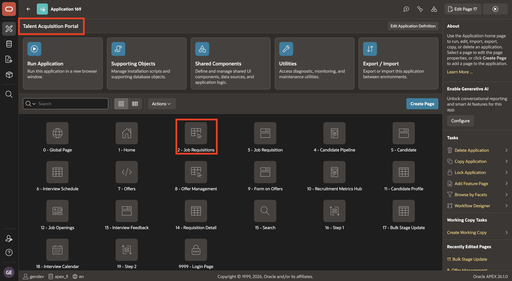

2. In **Page Designer**, select the **Page 2: Job Requisitions** page root. In the Property Editor, expand **Security**, set **Authorization Scheme** to **`IS_RECRUITER_OR_HIRING_MANAGER_OR_TA_ADMIN`**, and click **Save**.

    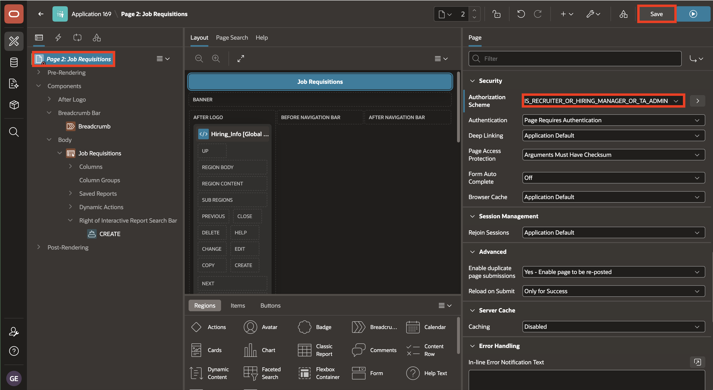

    **Note:** Repeat the page configuration shown in step 2 for the following TAP pages. Select the page listed below and use the specified authorization scheme:

    | Page | Page number | Authorization scheme |
    | --- | ---: | --- |
    | Job Requisition | 3 | `IS_RECRUITER_OR_HIRING_MANAGER_OR_TA_ADMIN` |
    | Candidate Pipeline | 4 | `IS_RECRUITER_OR_TA_ADMIN` |
    | Offer Management | 8 | `IS_RECRUITER_OR_TA_ADMIN` |
    | Bulk Stage Update | 17 | `IS_TA_ADMIN` |

## Task 2: Add navigation-menu authorization in TAP

1. Return to the TAP application home page and click **Shared Components**.

    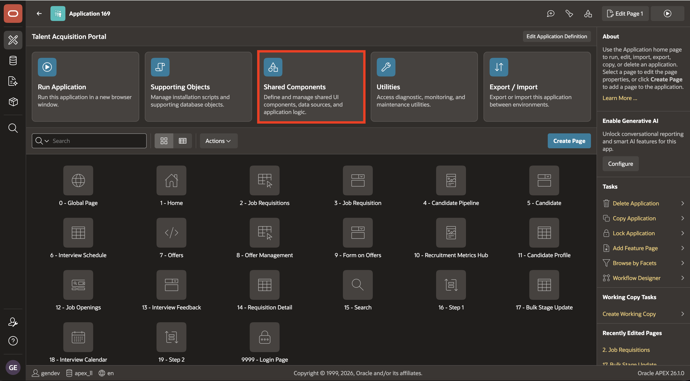

2. Under **Navigation and Search**, click **Navigation Menu**.

    

3. On the **Lists** page, click the **Navigation Menu** list.

    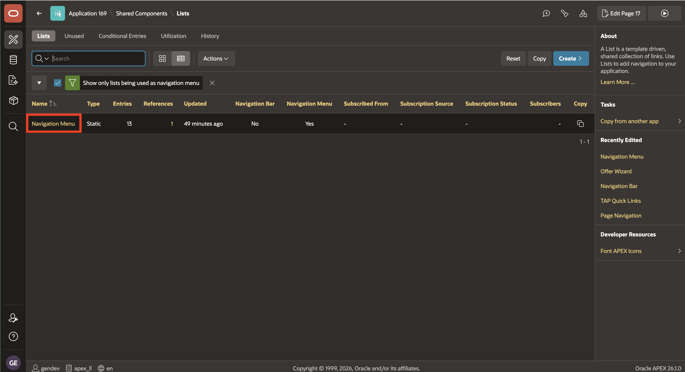

4. In the list entries, click the **edit pencil** for **Job Requisitions**.

    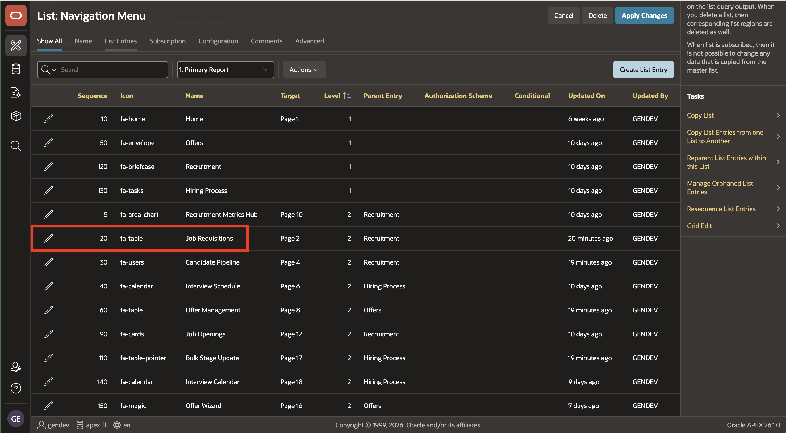

5. On the **Authorization** tab, set **Authorization Scheme** to **`IS_RECRUITER_OR_HIRING_MANAGER_OR_TA_ADMIN`**, then click **Apply Changes**.

    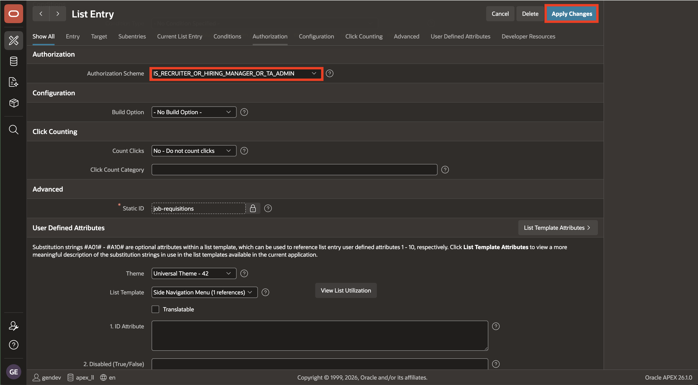

6. Return to the **Navigation Menu** list and edit each remaining entry below. For every entry, open the **Authorization** tab, select the listed scheme, and click **Apply Changes**. When finished, return to the list.

    - **Candidate Pipeline**: **`IS_RECRUITER_OR_TA_ADMIN`**
    - **Offer Management**: **`IS_RECRUITER_OR_TA_ADMIN`**
    - **Bulk Stage Update**: **`IS_TA_ADMIN`**

    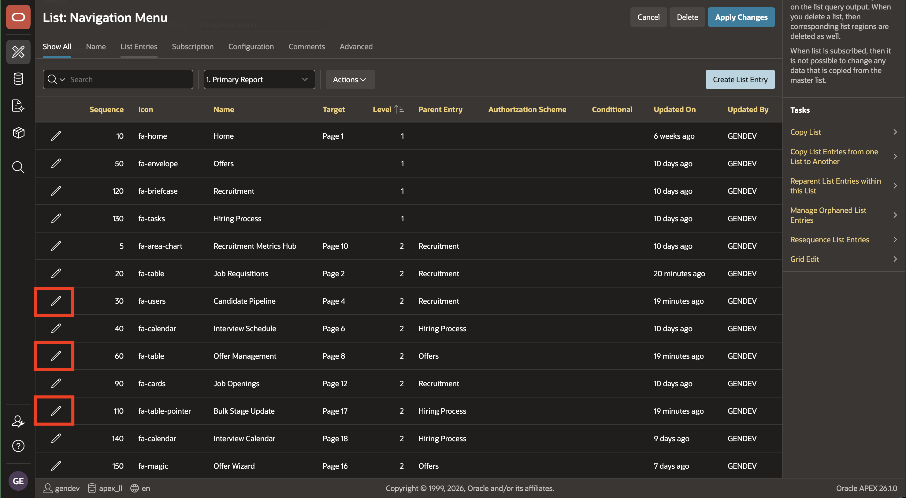

## Task 3: Add page and navigation authorization in ESS

1. Return to **App Builder**, open **Employee Self-Service Portal (ESS)**, and select **System Logs** (Page 17) on the application home page.

    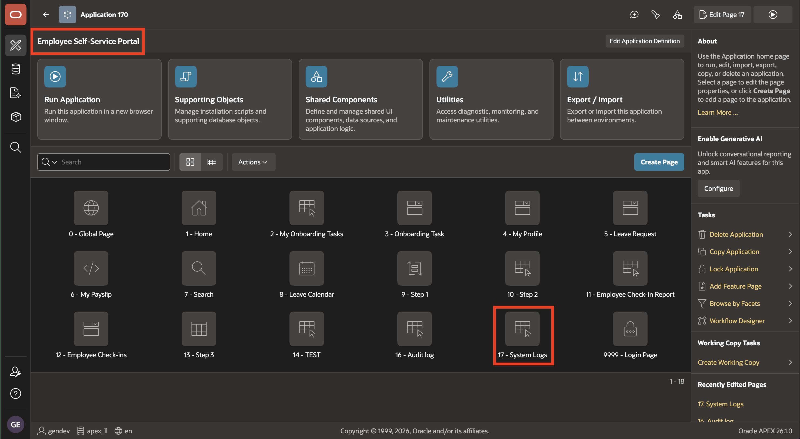

2. In **Page Designer**, select the **Page 17: System Logs** page root. In the Property Editor, expand **Security**, set **Authorization Scheme** to **`IS_HR_ADMIN`**, and click **Save**.

    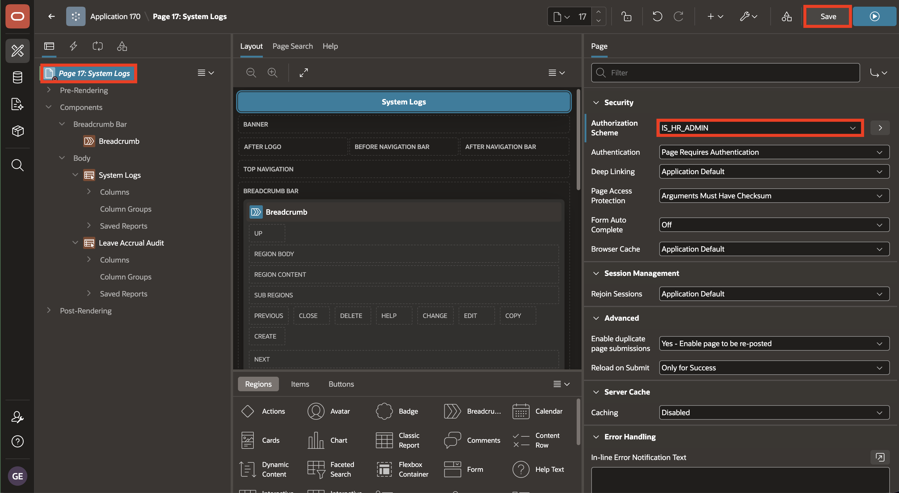

3. Return to the ESS application home page and click **Shared Components**.

    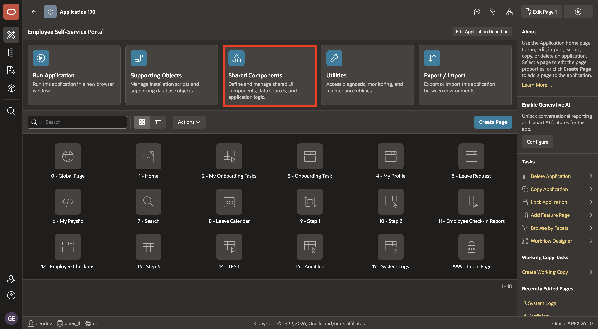

4. Under **Navigation and Search**, click **Navigation Menu**.

    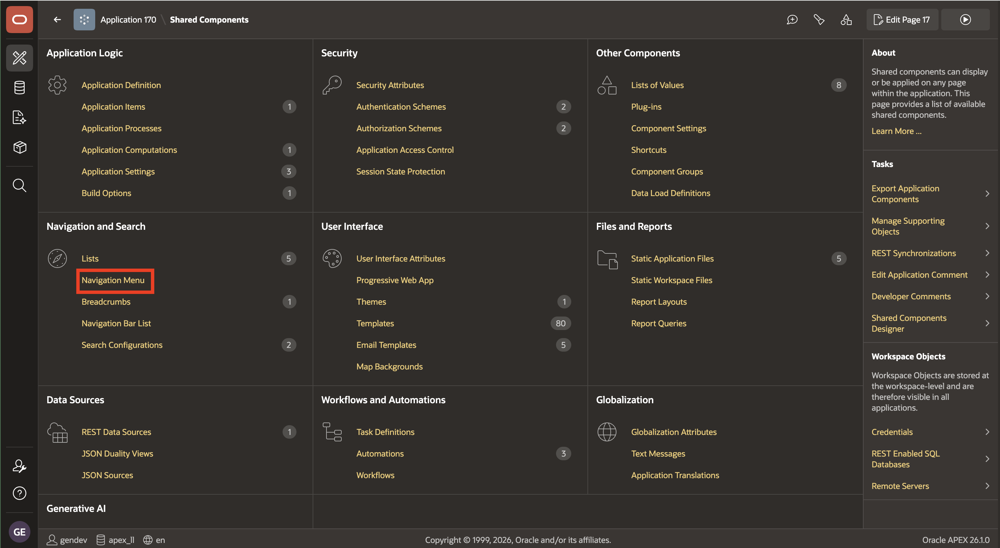

5. On the **Lists** page, click the **Navigation Menu** list.

    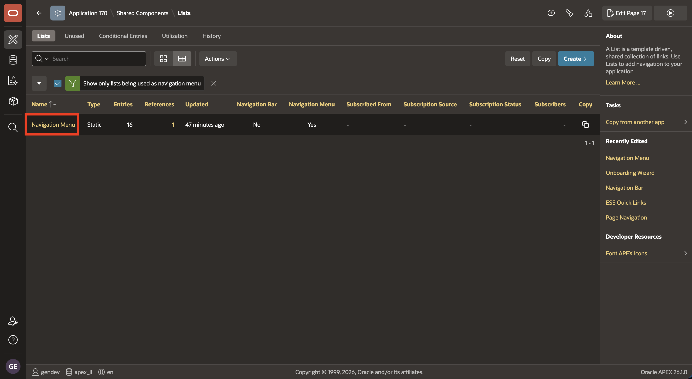

6. In the list entries, click the **edit pencil** for **Admin**.

    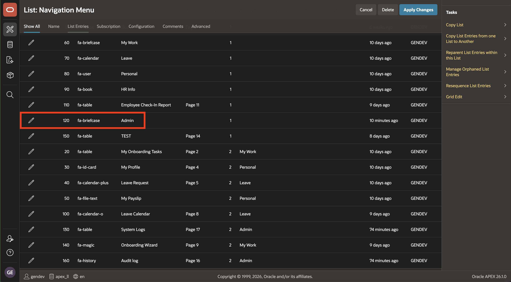

7. On the **Authorization** tab, set **Authorization Scheme** to **`IS_HR_ADMIN`**, then click **Apply Changes**.

    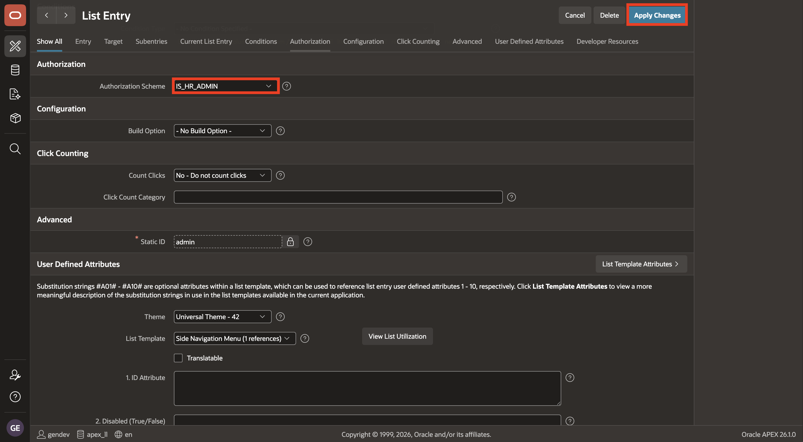

8. Return to the **Navigation Menu** list and click the **edit pencil** for **System Logs**.

    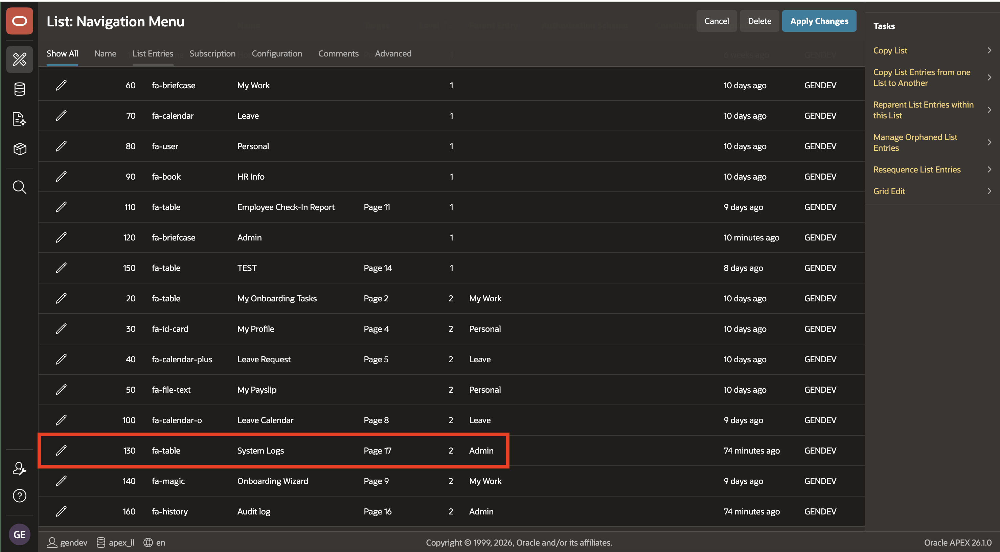

9. On the **Authorization** tab, set **Authorization Scheme** to **`IS_HR_ADMIN`**, then click **Apply Changes**. Use the same setting shown in step 7.

    

The protected pages now enforce authorization even when a user tries a direct URL, while the navigation menu shows users only the features available to their role. Next, you will apply a data-level filter to the Candidate Pipeline.

## Acknowledgements

- **Author** - Ashwin Rao, Principal Product Manager; Roopesh Thokala, Principal Product Manager
- **Last Updated By/Date** - Ashwin Rao, August 2026
