# Lab 4: Enforce Row-Level Security

## Introduction

Page authorization decides who can open a page. Row-level security decides which rows they can see after it opens. In this lab, a TA administrator sees all candidate records, while a hiring manager sees candidates only for requisitions they requested.

Estimated Time: 3 minutes

### Objectives

- Add a server-side candidate filter to the TAP Candidate Pipeline.
- Use a role-aware predicate that does not trust a browser-supplied value.
- Filter the ESS My Leave History and Leave Calendar regions by employee and HR-admin access.
- Verify results with different personas.

## Task 1: Filter the Candidate Pipeline source

1. From **App Builder**, open **Talent Acquisition Portal (TAP)**. On the application home page, select **Candidate Pipeline** (Page 4).

    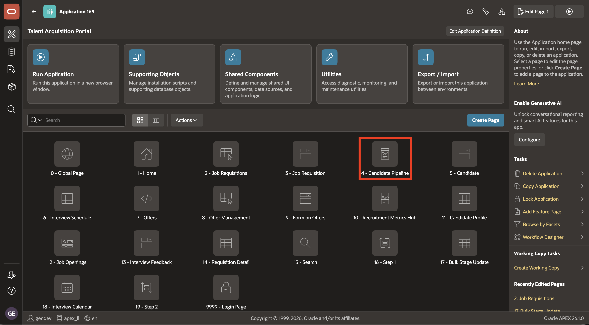

2. Under **Source** > **SQL Query**, replace the **Candidates** region query with the following SQL:

    ```sql
    <copy>
    SELECT c.candidate_id,
           c.req_id,
           c.first_name
           || ' '
           || c.last_name                  AS candidate_name,
           d.NAME                          AS department_name,
           c.email,
           c.phone,
           c.resume_blob,
           c.source,
           c.current_stage                 AS stage,
           c.applied_date,
           Trunc(sysdate - c.applied_date) AS days_since_applied,
           c.diversity_flag,
           c.ai_score,
           c.created_by,
           c.created_at,
           c.updated_by,
           c.updated_at
    FROM   tms_candidates c
           LEFT JOIN tms_job_requisitions r
                  ON c.req_id = r.req_id
           LEFT JOIN tms_departments d
                  ON r.dept_id = d.dept_id
    WHERE  ( :P4_REQ_ID IS NULL
              OR c.req_id = Lower(:P4_REQ_ID) )
           AND ( c.req_id IN (SELECT r.req_id
                              FROM   tms_job_requisitions r
                              WHERE  lower(r.requested_by) = lower(:APP_USER))
                  OR EXISTS (SELECT 1
                             FROM   tms_roles r
                                    JOIN tms_employee_roles er
                                      ON er.role_id = r.role_id
                             WHERE  r.role_code = 'TA_ADMIN'
                                    AND er.employee_id = :APP_EMPLOYEE_ID) )
    </copy>
    ```

    This evaluates requisition ownership and TA-admin access based on the logged-in user for candidates report.

    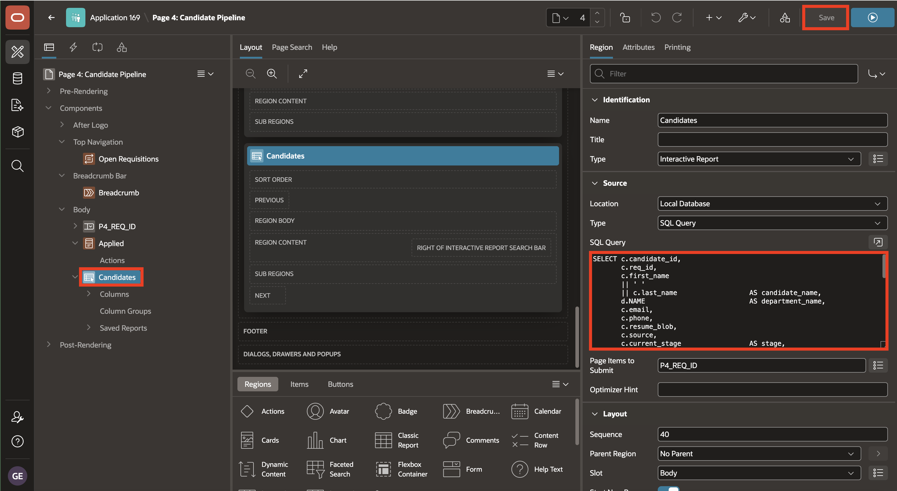

## Task 2: Filter ESS leave data

1. Use the breadcrumb to return to **App Builder**, open **Employee Self-Service Portal (ESS)**, and on the application home page select **Leave Request** (Page 5).

    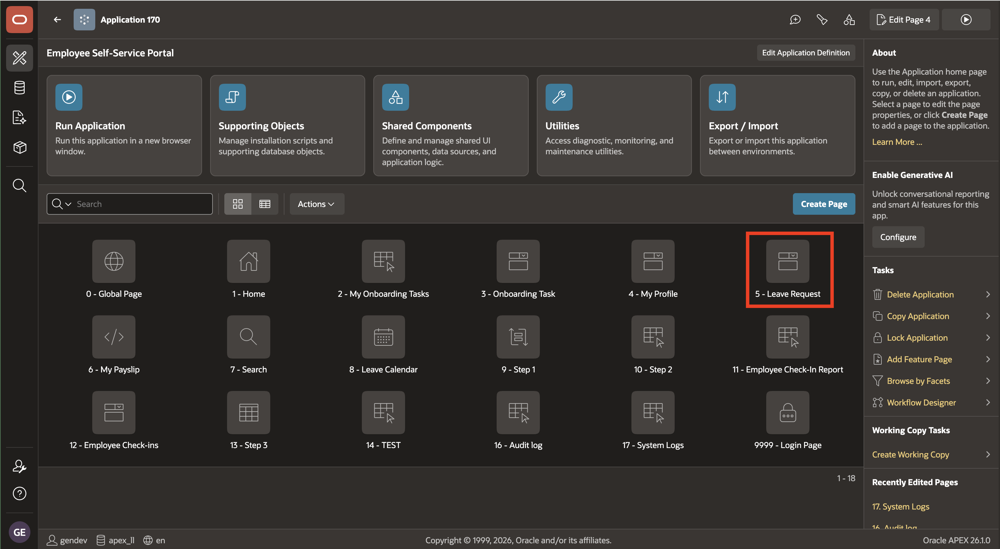

2. Under **Source** > **SQL Query**, replace the **My Leave History** region query with the following SQL:

    ```sql
    <copy>
    SELECT leave_type_id,
           start_date,
           end_date,
           days_requested,
           status
    FROM   tms_leave_requests lr
    WHERE  employee_id = :P5_EMPLOYEE_ID
           AND ( employee_id = :APP_EMPLOYEE_ID
                  OR EXISTS (SELECT 1
                             FROM   tms_roles r
                                    JOIN tms_employee_roles er
                                      ON er.role_id = r.role_id
                             WHERE  r.role_code = 'HR_ADMIN'
                                    AND er.employee_id = :APP_EMPLOYEE_ID) )
    ORDER  BY start_date DESC
    </copy>
    ```

    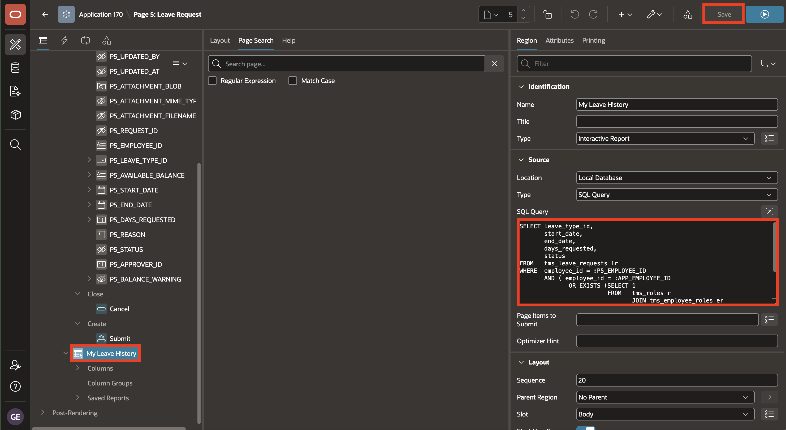

3. Confirm that **Page 5: Leave Request** is selected, the **My Leave History** region is selected, and the completed query is visible before continuing.

    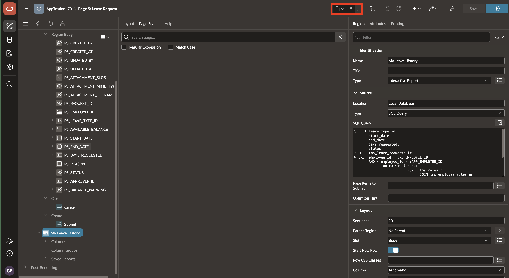

4. Save the **Leave Request** page. Then use **Page Finder** to open **Leave Calendar** (Page 8).

    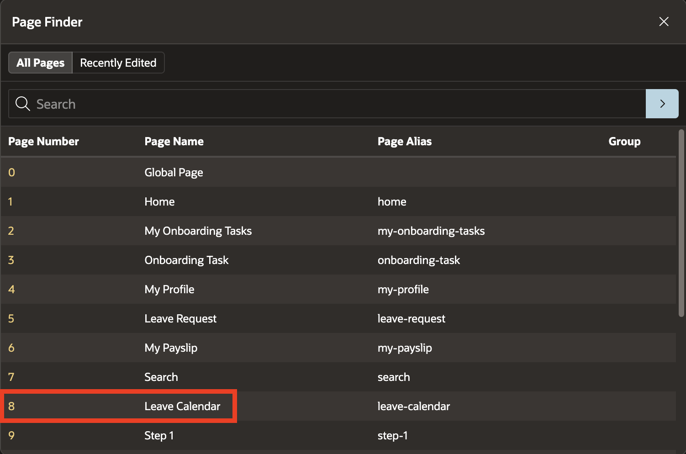

5. Under **Source** > **SQL Query**, replace the **Leave Calendar** region query with the following SQL:

    ```sql
    <copy>
    SELECT
        lr.request_id                 AS event_id,
        lt.name || ': ' || lr.status  AS event_title,
        lr.start_date                 AS start_date,
        lr.end_date + 1               AS end_date,   -- all-day inclusive
        CASE lr.status
          WHEN 'Approved' THEN 'event-approved'
          WHEN 'Pending'  THEN 'event-pending'
          WHEN 'Rejected' THEN 'event-rejected'
        END                            AS css_class
    FROM tms_leave_requests lr
    JOIN tms_leave_types    lt ON lt.leave_type_id = lr.leave_type_id
    JOIN tms_employees      e  ON e.employee_id   = lr.employee_id
    WHERE (
          lr.employee_id = :APP_EMPLOYEE_ID
          OR EXISTS (
            SELECT 1
              FROM tms_roles r
              JOIN tms_employee_roles er
                ON er.role_id = r.role_id
             WHERE r.role_code = 'HR_ADMIN'
               AND er.employee_id = :APP_EMPLOYEE_ID
          )
        )
    UNION ALL

    SELECT
        ROWNUM * -1                   AS event_id,      -- negative to avoid colliding with request_id PKs
        ph.localname                  AS event_title,
        ph.date_                      AS start_date,
        ph.date_ + 1                  AS end_date,       -- all-day inclusive, same convention as leave rows
        'event-holiday'               AS css_class
    FROM public_holidays_sync ph
    </copy>
    ```

    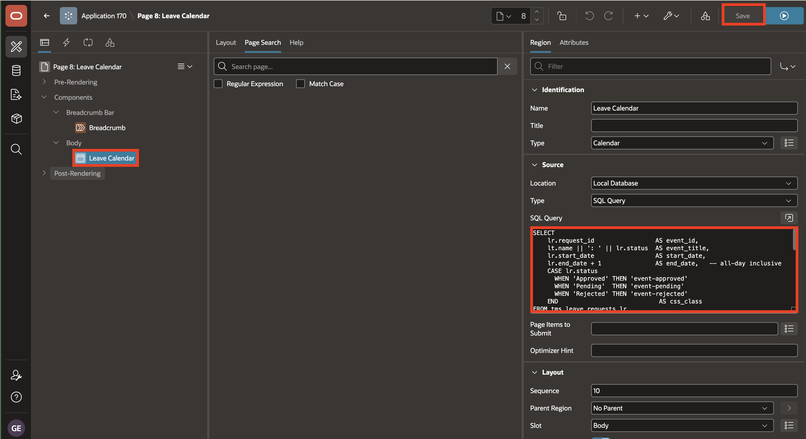

## Task 3: Verify each persona

1. Sign in to TAP with the hiring-manager test account that owns at least one requisition. Open **Candidate Pipeline** and confirm that it shows candidates only for that manager's requisitions.

    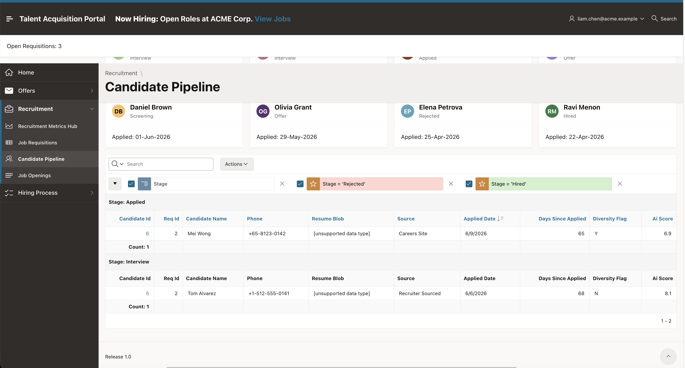

2. Sign out, then sign in to TAP with the TA-administrator test account. Open **Candidate Pipeline** and confirm that the pipeline includes candidates across requisitions.

    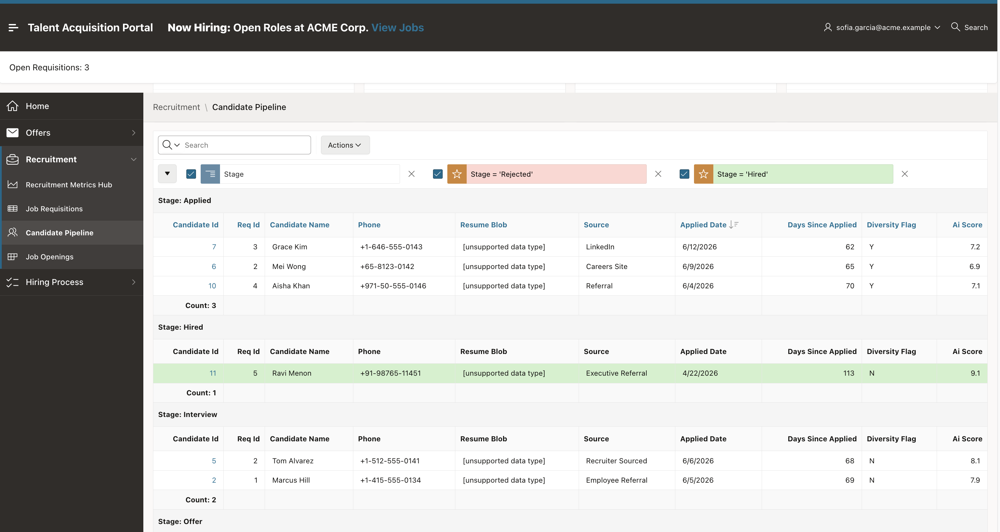

3. Sign out, sign in to ESS with the recruiter test account, and open **Leave Calendar** (Page 8). Confirm that the calendar shows only the recruiter's own leave requests and the public holidays. HR-admin-only data must not be visible to the recruiter.

    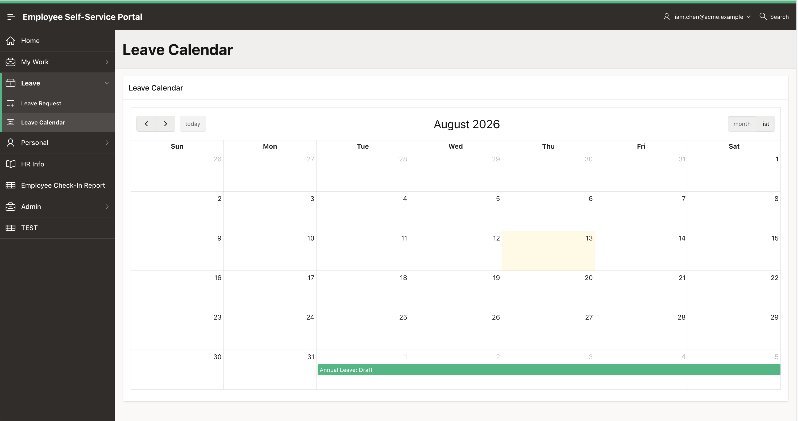

4. Sign out, then sign in to ESS with the HR-administrator test account and open **Leave Calendar** (Page 8). Confirm that the HR administrator can see leave requests for all employees together with the public holidays.

    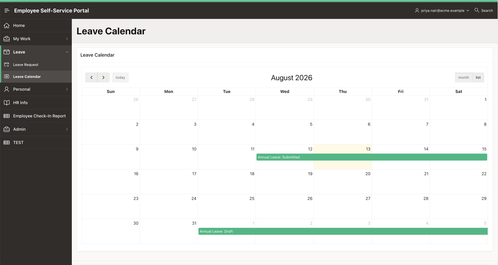

## Summary

You added server-side filtering that remains effective after a user reaches the page, including employee/HR-admin filtering for ESS leave history and leave-calendar data. In the final lab, you add an HR-admin-only audit report for reviewing changes to sensitive ESS data.

## Acknowledgements

- **Author** - Ashwin Rao, Principal Product Manager; Roopesh Thokala, Principal Product Manager
- **Last Updated By/Date** - Ashwin Rao, August 2026
