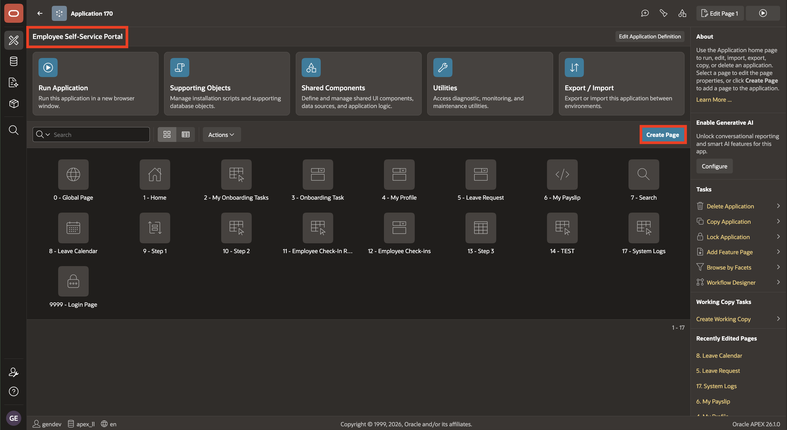
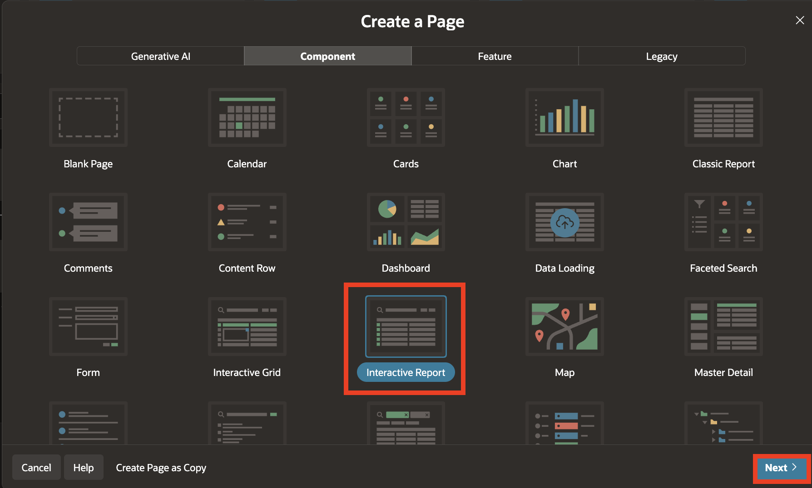
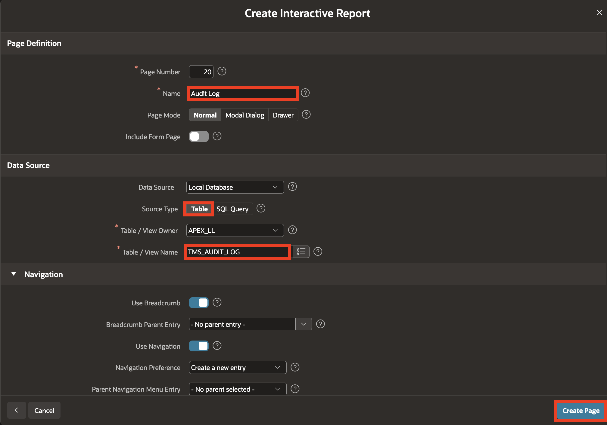
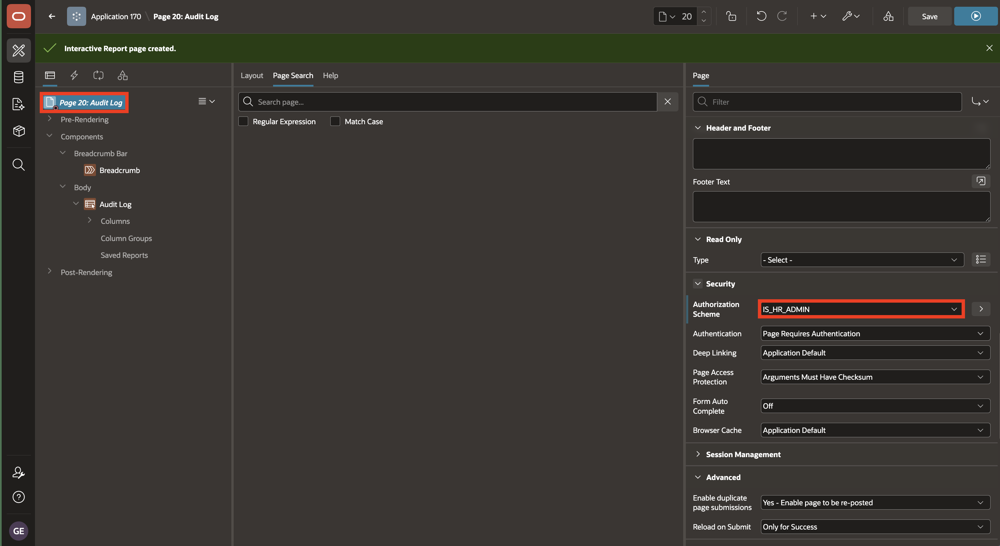
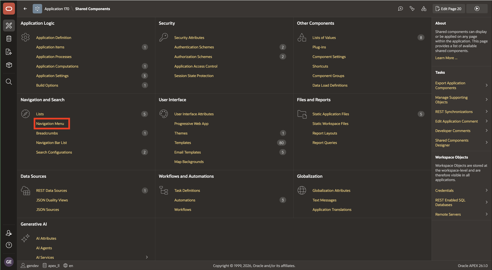
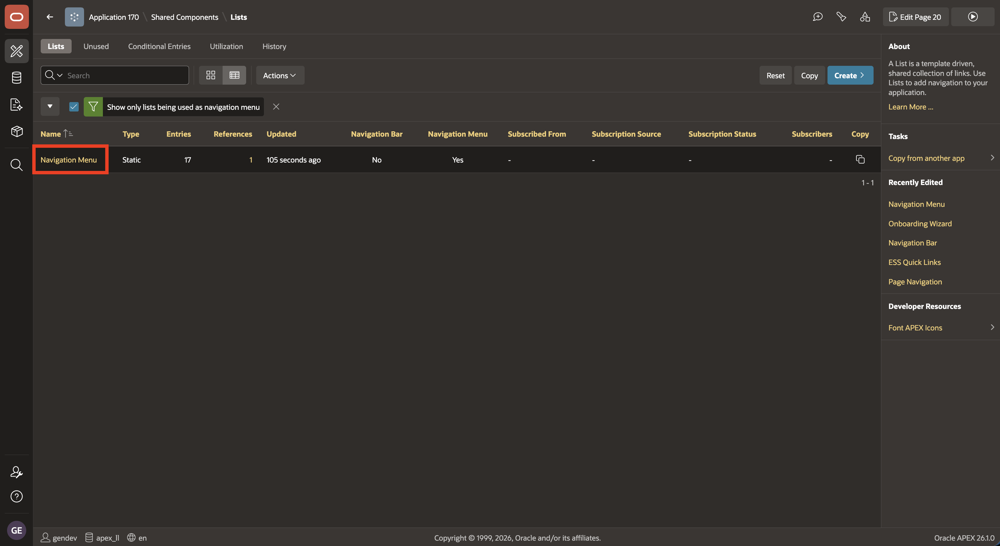
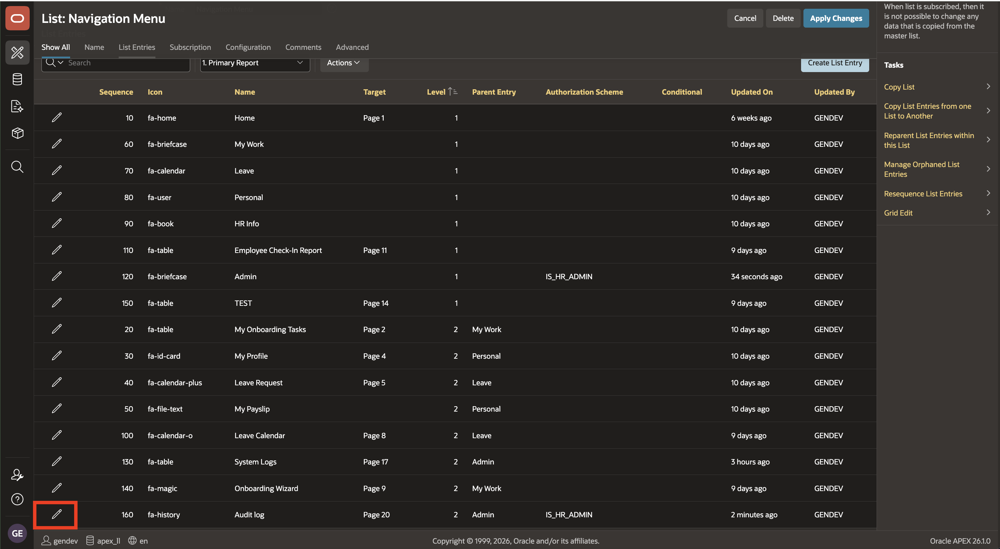
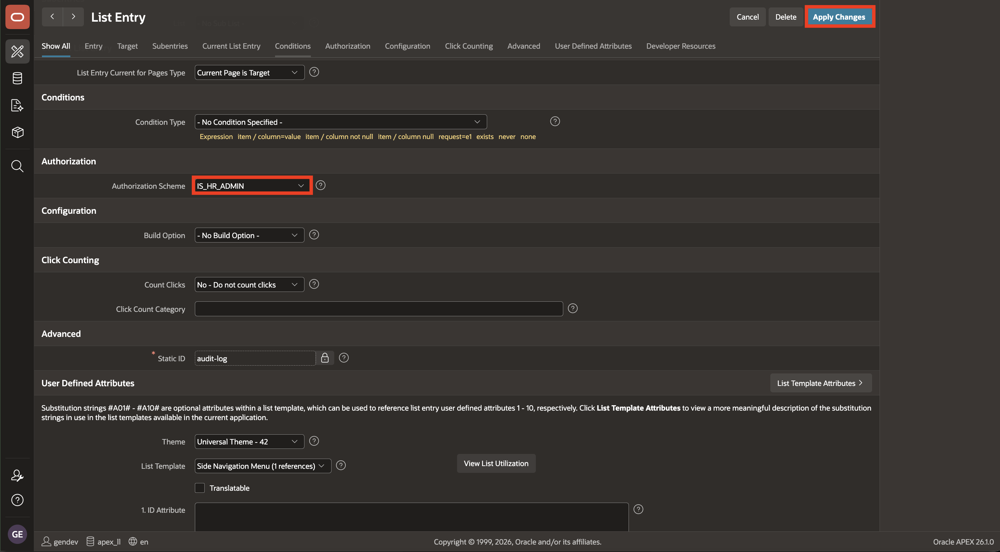
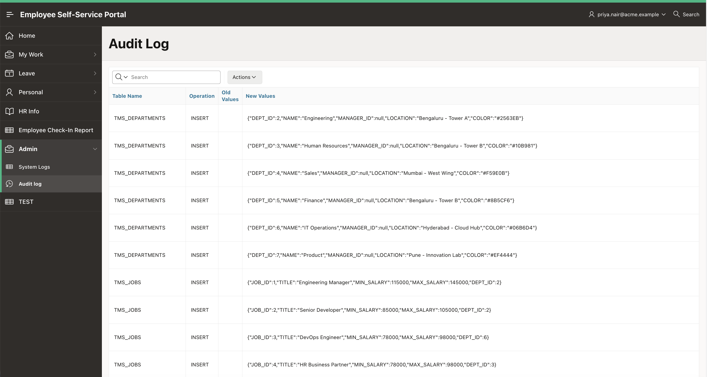
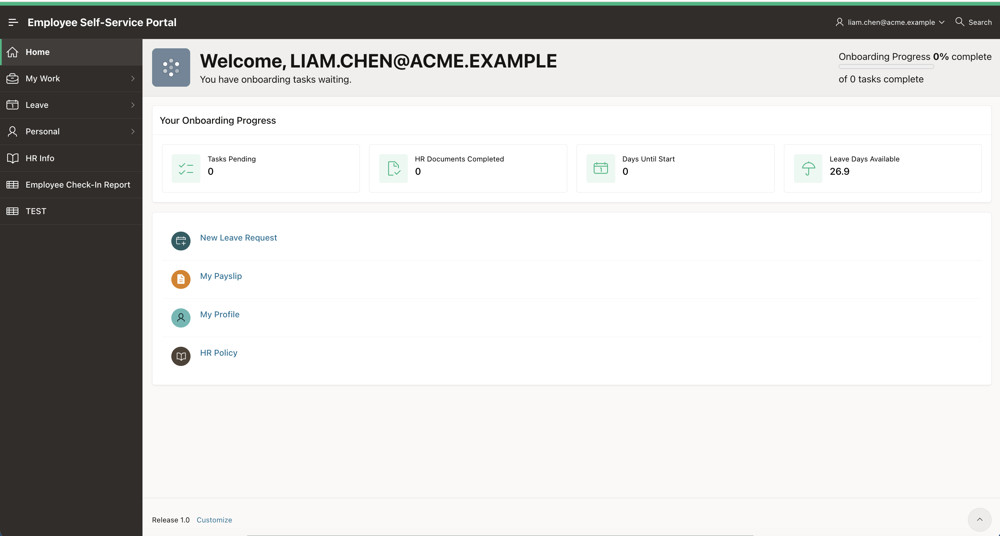

# Lab 5: Create the ESS Audit Log

## Introduction

In this lab, you create an HR-administrator-only Interactive Report over the audit log. The report provides a reviewable history of changes recorded in `TMS_AUDIT_LOG`.

Estimated Time: 3 minutes

### Objectives

- Create the ESS **Audit Log** Interactive Report.
- Restrict the page and its navigation entry to HR administrators.
- Confirm that non-administrators cannot open the report.

## Task 1: Create and secure the Audit Log page

1. From **App Builder**, open **Employee Self-Service Portal (ESS)** and click **Create Page**.

    

2. In the **Create a Page** dialog, select **Interactive Report** and click **Next**.

    

3. In the Interactive Report definition, set **Page Number** to **`20`**, **Name** to **`Audit Log`**, choose **Table** as the source type, and set **Table / View Name** to **`TMS_AUDIT_LOG`**. Keep **Use Navigation** enabled with **Create a new entry**, then click **Create Page**.

    

4. In Page Designer, select the **Page 20: Audit Log** page root. In the Property Editor, expand **Security**, set **Authorization Scheme** to **`IS_HR_ADMIN`**, and click **Save**.

    

5. Return to the ESS application home page, click **Shared Components**, and under **Navigation and Search** click **Navigation Menu**.

    

6. On the **Lists** page, click the **Navigation Menu** list.

    

7. On the Navigation Menu list, click the **edit pencil** for the **Audit Log** entry to open its **List Entry** screen.

     

8. On the **Authorization** tab, set **Authorization Scheme** to **`IS_HR_ADMIN`**, then click **Apply Changes**.

     
   

## Task 2: Verify access and audit visibility

1. Sign in to ESS as an HR administrator and open **Audit Log**. Confirm that the report displays audit rows.

    

2. Sign out and sign in as a non-HR employee. Confirm that **Audit Log** is not shown in the navigation menu.

    

## Summary

You have completed the security baseline for TAP and ESS: authenticated users, reusable role checks, protected pages and requests, row-level data filtering, and HR-admin audit visibility.

## Acknowledgements

- **Author** - Ashwin Rao, Principal Product Manager; Roopesh Thokala, Principal Product Manager
- **Last Updated By/Date** - Ashwin Rao, August 2026
