# Create a CV Screening Agent in TAP

## Introduction

In this lab, you will build a CV Screening Agent for recruiters. The agent retrieves one candidate, identifies the related requisition, retrieves the job information, evaluates job-related fit using verified qualifications and requirements supplied by the recruiter, and saves a score and concise summary to the candidate record.

Estimated Time: 20 minutes

### Objectives

In this lab, you will:

- Add an `AI_SUMMARY` column to the `TMS_CANDIDATES` table.
- Create the CV Screening Agent.
- Create three On-Demand AI tools.
- Add AI Score and AI Summary to Candidate Pipeline.
- Add a protected **Screen Candidate** button.
- Open the native AI Assistant in a dialog and reload Candidate Pipeline after screening.

### Prerequisites

- Oracle APEX 26.1 and the starter application for this lab. The screenshots use the supplied Module 20 apps.
- Access to a TA Admin runtime account, a test candidate, and verified qualification text from that candidate's résumé together with the requirements for their requisition. The sample retrieval queries return metadata, so the recruiter must supply this evidence in Task 10.
- A Generative AI Service configured in the workspace and selected under **Shared Components > AI Attributes** for the application.
- If a component already exists in the supplied completed app, open it to review its properties. In your workshop starter app, create it using the steps below.

> **Screenshot note:** Images labeled **Edited instructional view** have been edited to show only the components available at that point in the lab.

## Task 1: Prepare Candidate Data for AI Screening

1. Sign in to your Oracle APEX workspace. On the workspace home page, select **App Builder** to open the Applications home page.

    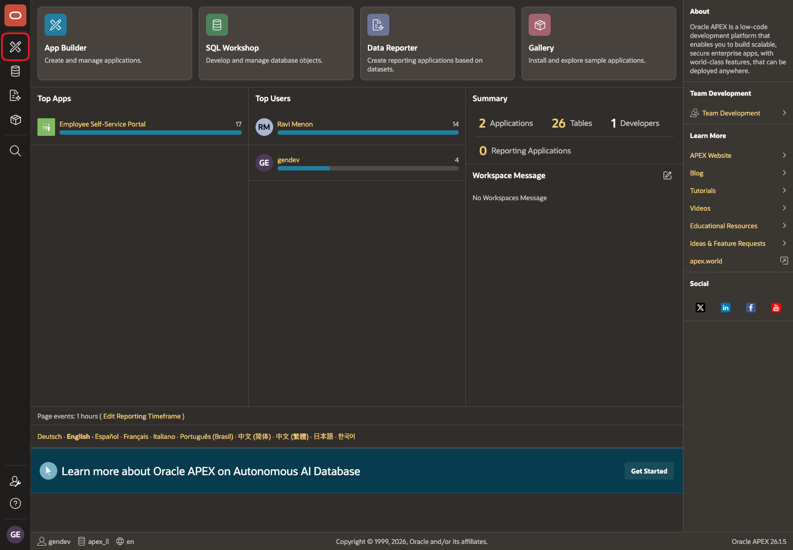

2. From the **App Builder** home page, select **SQL Workshop** in the left navigation bar.

    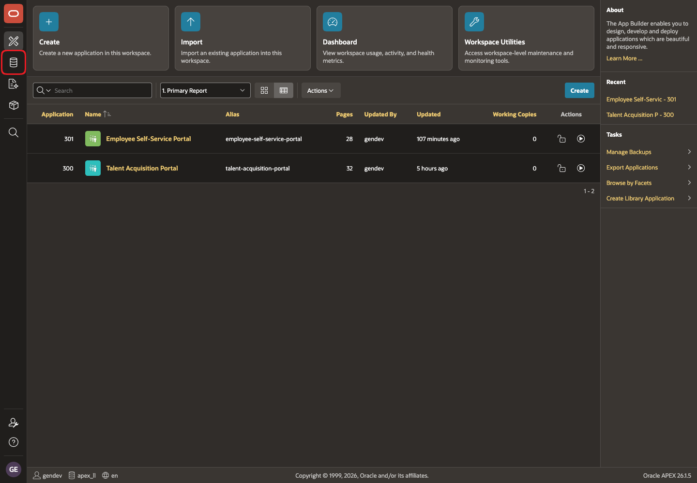

3. Select **SQL Commands**.

    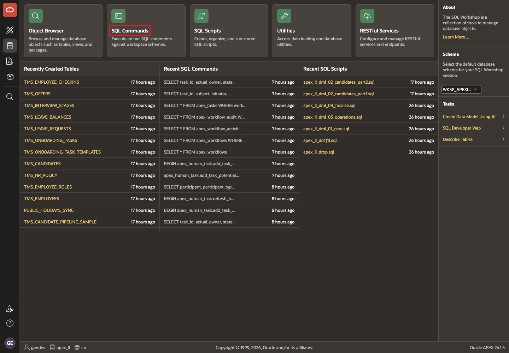

4. Enter and run the following statement:

    ```sql
    <copy>
    ALTER TABLE tms_candidates ADD (
        ai_summary VARCHAR2(4000)
    );
    </copy>
    ```

    > **Note:** If `AI_SUMMARY` already exists, do not run the statement again. Continue with the existing column.

    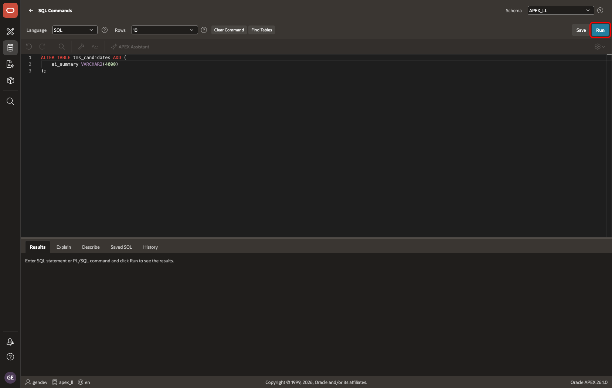

## Task 2: Create and Configure the CV Screening Agent

1. Select **App Builder**, and open **Talent Acquisition Portal**.

    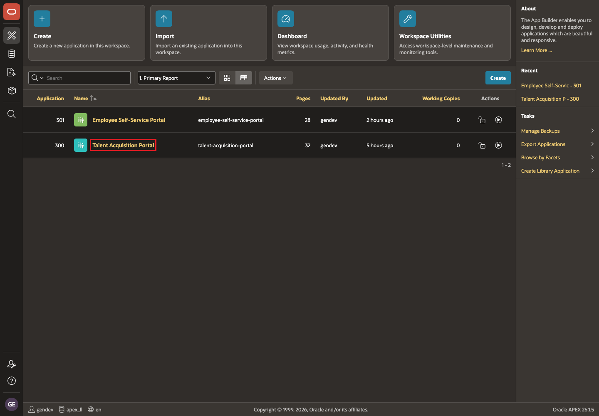

2. Select **Shared Components**.

    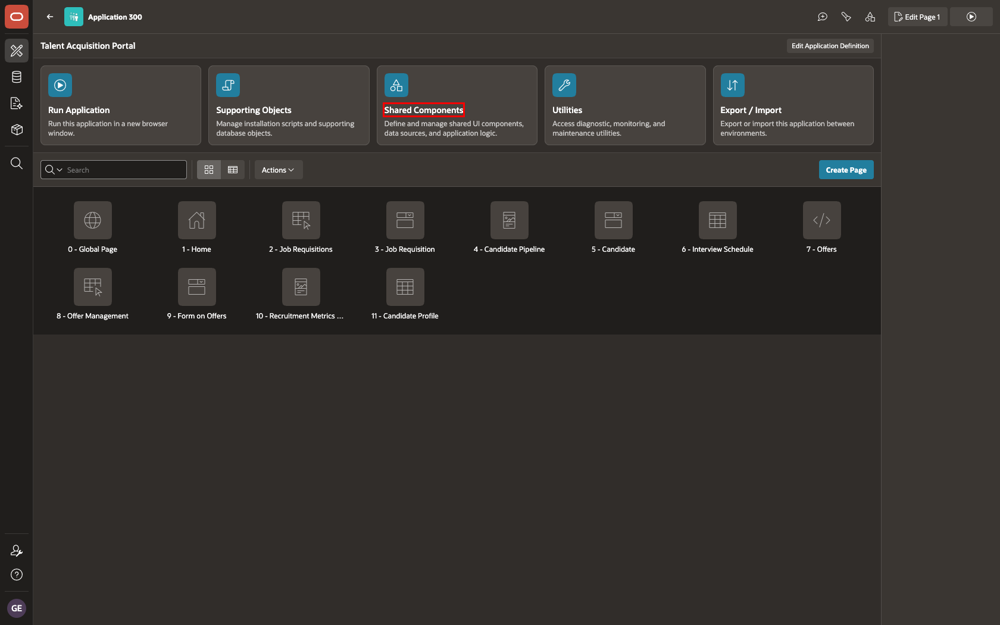

3. In **Generative AI**, select **AI Agents**.

    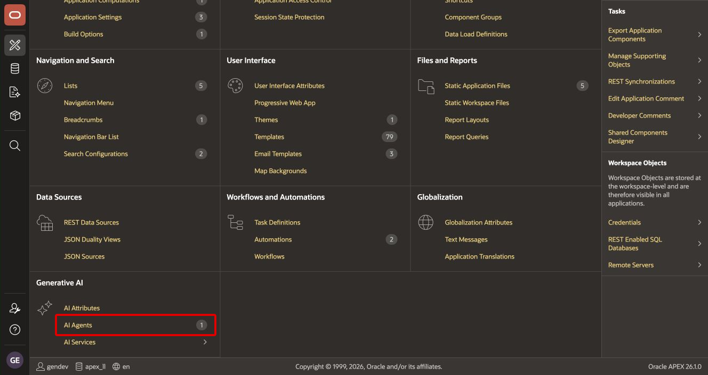

4. Click **Create**.

    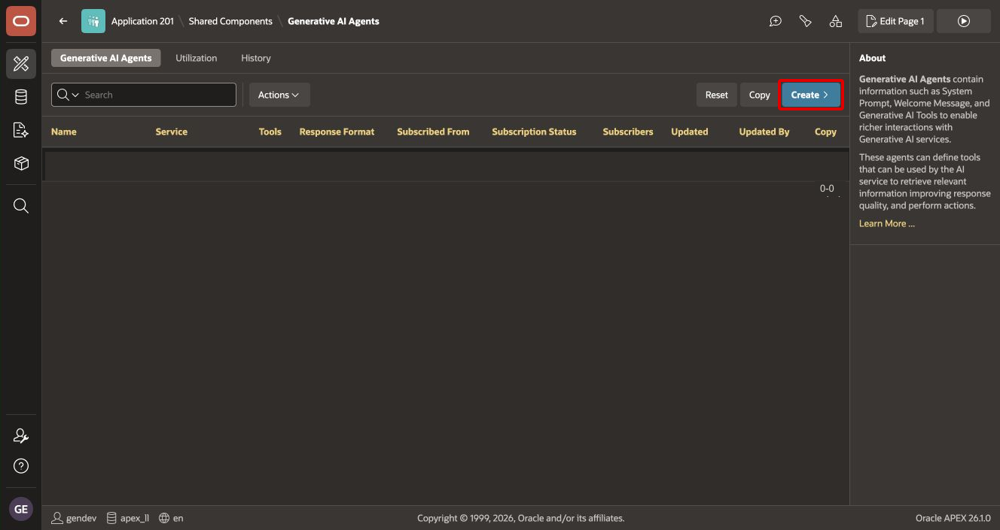

5. Configure the agent:

    | Property | Value |
    | --- | --- |
    | Name | `CV Screening Agent` |
    | Service | Application Default |
    | Response Format > Type | Text |

    ```text
    <copy>
    CV Screening Agent
    </copy>
    ```

    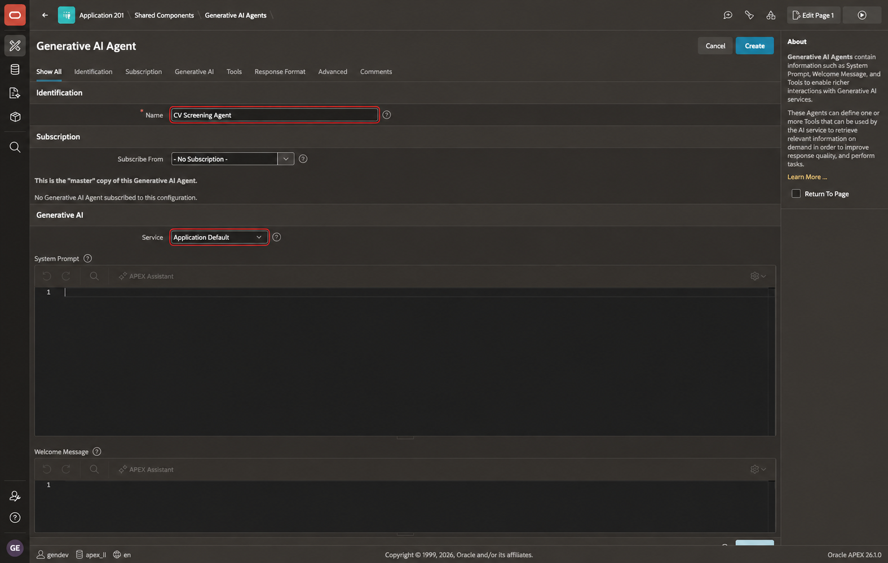

    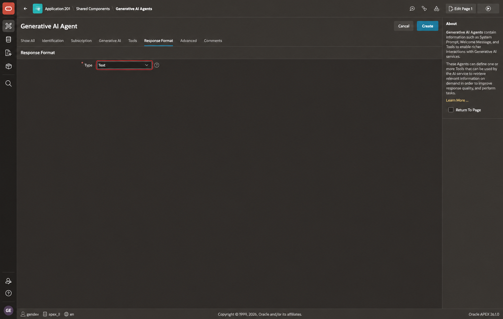

6. In **System Prompt**, enter the following text:

    ```text
    <copy>
    You are a recruitment screening assistant for Acme Corp.

    Your purpose is to help recruiters evaluate candidates against the
    requirements of the job requisition they applied for.

    When asked to screen a candidate:
    1. Use get_candidate_information to find the candidate by full name.
       If more than one record matches, ask the recruiter for the candidate's
       email and resolve the correct record before proceeding. Never guess.
       Keep record IDs and tool names internal; use names and job titles
       when talking to the recruiter. Use only IDs returned by the tools.
    2. Identify the candidate's requisition.
    3. Use get_job_requirements to retrieve the corresponding job requirements.
    4. Ask the recruiter for verified candidate qualifications and the specific
       requirements of that requisition if the tools do not return them.
    5. Evaluate only job-related information supported by that evidence.

    Score the candidate from 1 to 10 based on:
    - Relevant skills
    - Relevant experience
    - Job alignment
    - Overall suitability

    Provide:
    Overall Score: <1-10>
    Recommendation: Strong Yes / Yes / Maybe / No
    Summary: <short job-related explanation>

    Do not make decisions based on name, gender, age, ethnicity,
    nationality, disability, or other protected characteristics.

    Do not invent candidate qualifications or job requirements. Names, stages,
    sources, dates, job titles, departments, and existing AI scores are not
    evidence of skills or experience. If either qualification evidence or
    specific job requirements is missing, explain what is missing and do not
    assign a score, recommendation, or call update_ai_score.

    Use update_ai_score only after completing the evaluation and receiving
    the recruiter's explicit request to save the reviewed result.
    </copy>
    ```

7. Click **Create** to save the new agent. When reviewing an existing agent, click **Apply Changes**.

## Task 3: Create the Get Candidate Information Tool

1. Open **CV Screening Agent** and select the **Tools** tab.

    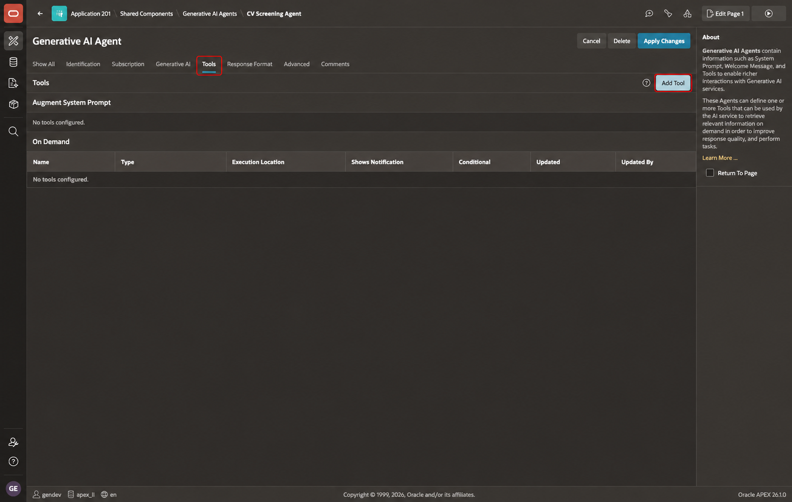

2. Click **Add Tool**.

    

3. Configure the tool:

    | Property | Value |
    | --- | --- |
    | Name | `get_candidate_information` |
    | Type | Retrieve Data |
    | Execution Point | On Demand |

    ```text
    <copy>
    get_candidate_information
    </copy>
    ```

4. Enter this description:

    ```text
    <copy>
    Finds candidates by their full name and returns their information and
    associated requisition. Use this tool before evaluating a candidate.
    If multiple records match, ask the recruiter to identify the correct
    candidate by email before continuing.
    </copy>
    ```

5. Under **Parameters**, click **Add Parameter**. Enter the following row in the grid:

    | Property | Value |
    | --- | --- |
    | Parameter Name | `CANDIDATE_NAME` |
    | Data Type | VARCHAR2 |
    | Required | Yes |

    Copy **Parameter Name**:

    ```text
    <copy>
    CANDIDATE_NAME
    </copy>
    ```

6. Under **Settings**, set **Type** to **SQL Query**, and enter the following in **SQL Query**:

    ```sql
    <copy>
    SELECT
        c.candidate_id,
        c.req_id,
        c.first_name || ' ' || c.last_name AS candidate_name,
        c.email,
        c.current_stage,
        c.source,
        c.applied_date,
        c.ai_score
    FROM tms_candidates c
    WHERE UPPER(TRIM(c.first_name || ' ' || c.last_name))
        = UPPER(TRIM(:CANDIDATE_NAME))
    </copy>
    ```

    The assistant searches by the name supplied in ordinary language. It retains the returned `CANDIDATE_ID` and `REQ_ID` internally for later tool calls; the recruiter does not need to enter either ID. If names match more than one record, use the returned email to clarify the candidate. The query must return `REQ_ID`. The next tool uses it to retrieve the related job. This sample returns candidate metadata; it does not extract the resume BLOB or supply qualifications. Task 4 also returns job metadata rather than detailed requirements. Supply verified qualification and requirement text in Task 10 before requesting an evaluation. If either is unavailable, test retrieval only; the agent must request the missing evidence and must not score or update the record.

7. Save the tool. Confirm that it appears under **On Demand**.

## Task 4: Create the Get Job Requirements Tool

1. Click **Add Tool** again.

    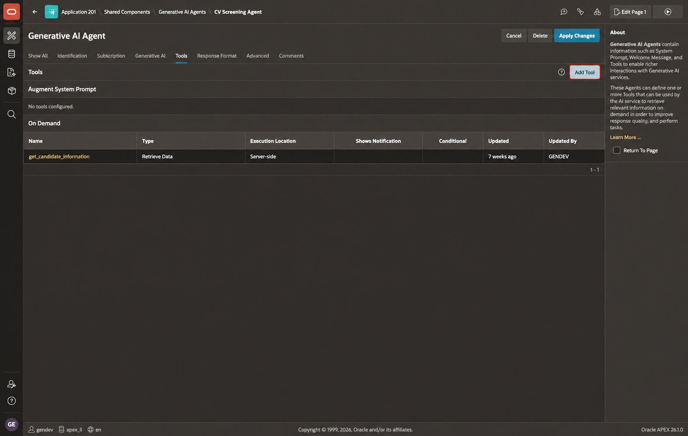

2. Configure the tool:

    | Property | Value |
    | --- | --- |
    | Name | `get_job_requirements` |
    | Type | Retrieve Data |
    | Execution Point | On Demand |

    ```text
    <copy>
    get_job_requirements
    </copy>
    ```

3. Enter this description:

    ```text
    <copy>
    Returns the requisition and associated job information.
    Use this tool to identify the candidate's job and department. This query
    does not return detailed requirements; ask the recruiter for verified
    requirements before evaluating the candidate.
    </copy>
    ```

    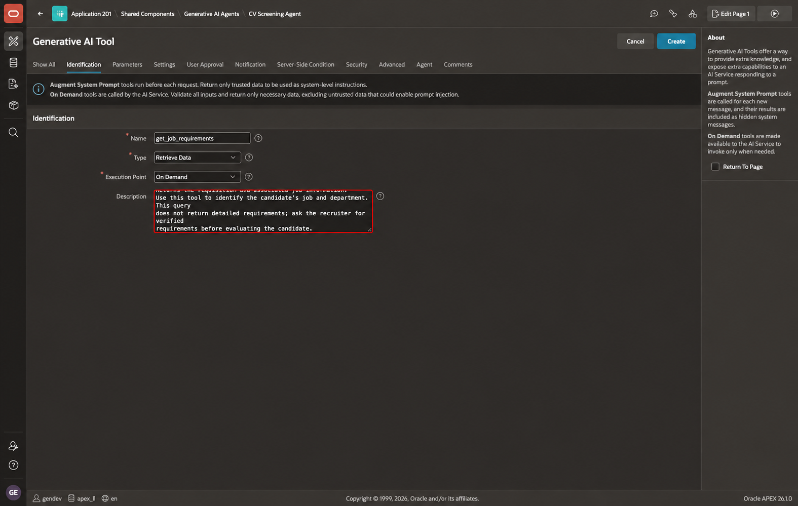

4. Under **Parameters**, click **Add Parameter**. Enter the following row in the grid:

    | Property | Value |
    | --- | --- |
    | Parameter Name | `REQ_ID` |
    | Data Type | NUMBER |
    | Required | Yes |

    Copy **Parameter Name**:

    ```text
    <copy>
    REQ_ID
    </copy>
    ```

    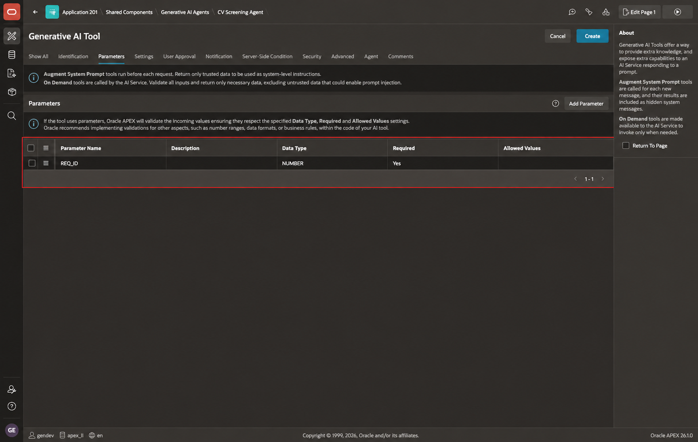

5. Under **Settings**, set **Type** to **SQL Query**, and enter the following in **SQL Query**:

    ```sql
    <copy>
    SELECT
        r.req_id,
        r.job_id,
        j.title AS job_title,
        r.status AS requisition_status,
        d.name AS department_name
    FROM tms_job_requisitions r
    JOIN tms_jobs j
      ON j.job_id = r.job_id
    LEFT JOIN tms_departments d
      ON d.dept_id = r.dept_id
    WHERE r.req_id = :REQ_ID
    </copy>
    ```

    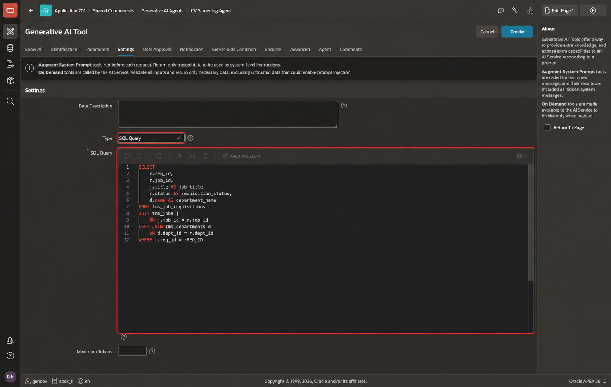

6. Save the tool.

    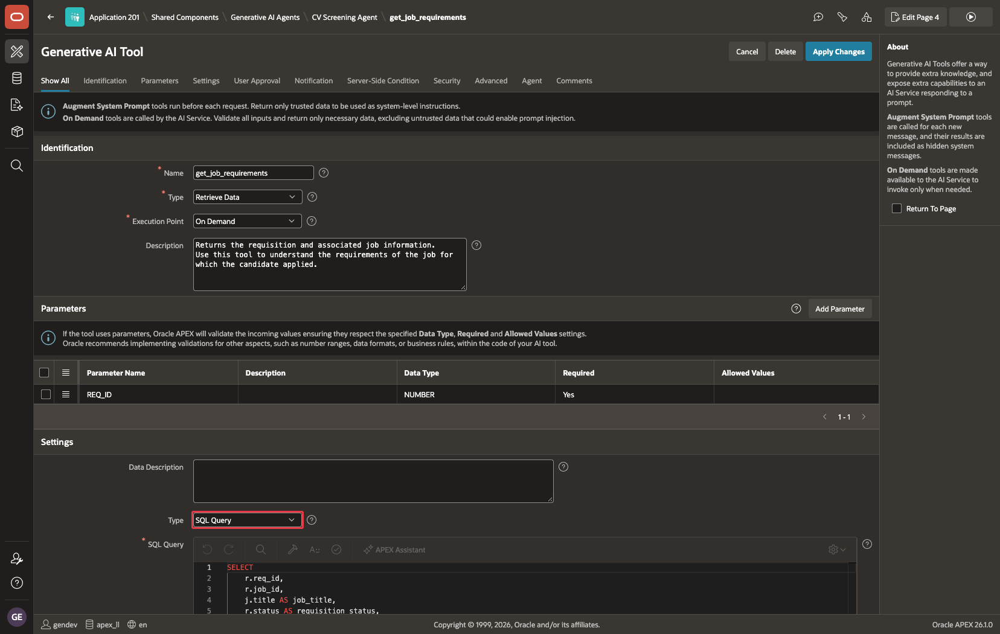

The two retrieval tools now follow this relationship:

```text
TMS_CANDIDATES.REQ_ID
        ↓
TMS_JOB_REQUISITIONS.REQ_ID
        ↓
TMS_JOBS.JOB_ID
```

## Task 5: Create the Update AI Screening Results Tool

1. Click **Add Tool**.

    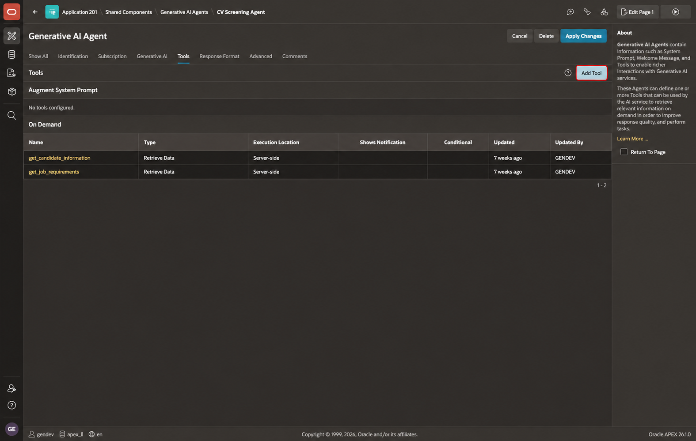

2. Configure the tool:

    | Property | Value |
    | --- | --- |
    | Name | `update_ai_score` |
    | Type | Execute Server-side Code |
    | Execution Point | On Demand |

    ```text
    <copy>
    update_ai_score
    </copy>
    ```

3. Enter this description:

    ```text
    <copy>
    Stores the completed AI screening score and summary for a candidate.
    Call this only after evaluating the candidate against their job.
    </copy>
    ```

    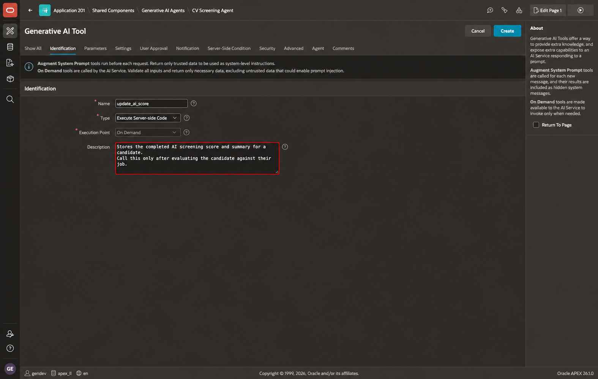

4. Under **Parameters**, click **Add Parameter** for each of the following rows:

    | Parameter Name | Data Type | Required |
    | --- | --- | --- |
    | `CANDIDATE_ID` | NUMBER | Yes |
    | `SCORE` | NUMBER | Yes |
    | `SUMMARY` | VARCHAR2 | Yes |

    Copy **Parameter name**:

    ```text
    <copy>
    CANDIDATE_ID
    </copy>
    ```

    Copy **Parameter name**:

    ```text
    <copy>
    SCORE
    </copy>
    ```

    Copy **Parameter name**:

    ```text
    <copy>
    SUMMARY
    </copy>
    ```

    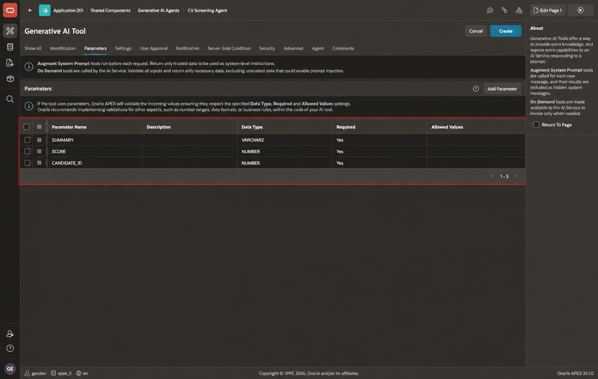

5. Under **Settings**, set **Language** to **PL/SQL** and enter the following in **PL/SQL Code**:

    ```plsql
    <copy>
    BEGIN
        IF :SCORE < 1 OR :SCORE > 10 THEN
            RAISE_APPLICATION_ERROR(
                -20001,
                'AI score must be between 1 and 10.'
            );
        END IF;

        UPDATE tms_candidates
           SET ai_score   = :SCORE,
               ai_summary = :SUMMARY,
               updated_by = :APP_USER,
               updated_at = SYSTIMESTAMP
         WHERE candidate_id = :CANDIDATE_ID;

        IF SQL%ROWCOUNT = 0 THEN
            RAISE_APPLICATION_ERROR(
                -20002,
                'Candidate could not be found.'
            );
        END IF;
    END;
    </copy>
    ```

    The validation rejects an out-of-range score. The row-count check prevents the tool from reporting success for a missing candidate.

    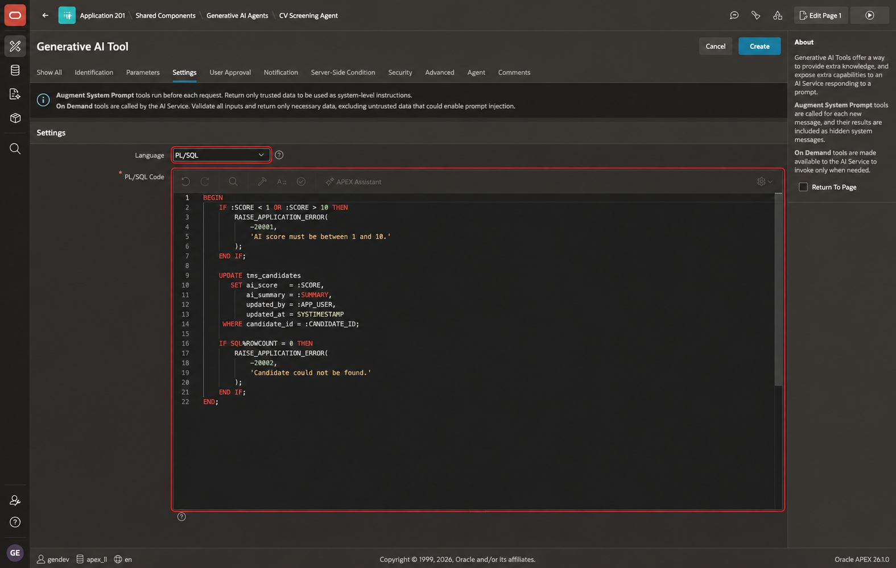

6. Save the tool.

    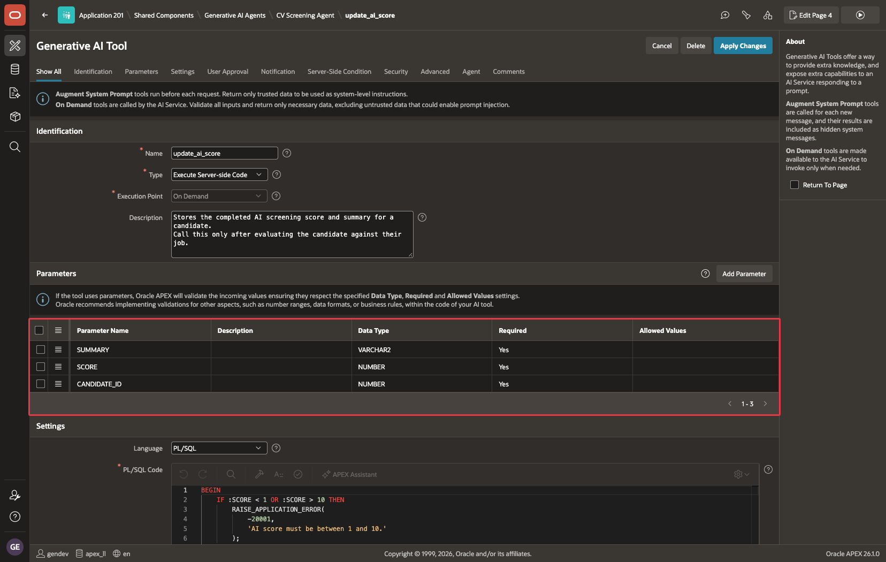

7. Return to the agent and verify that all three tools appear under **On Demand**.

    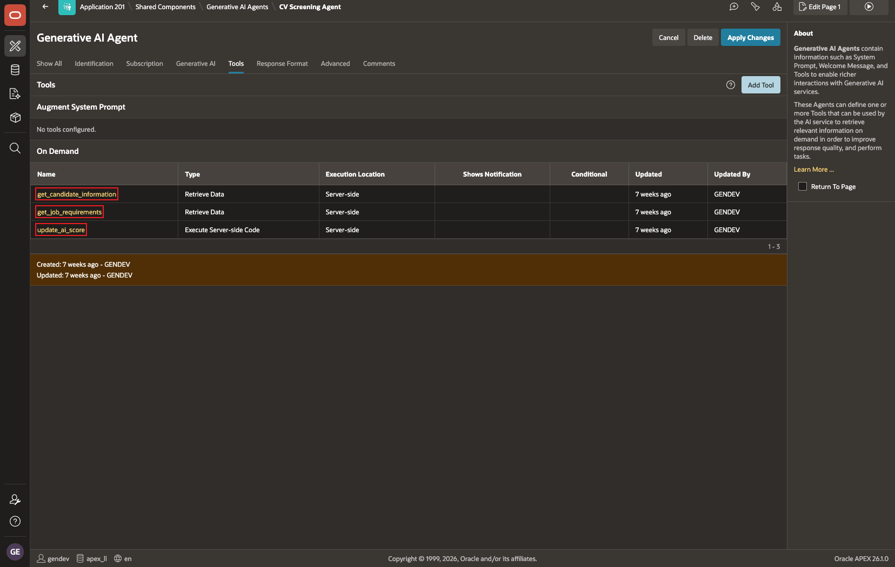

## Task 6: Display AI Screening Results in Candidate Pipeline

1. Return to the TAP application home page.

2. Open **Page 4: Candidate Pipeline**.

    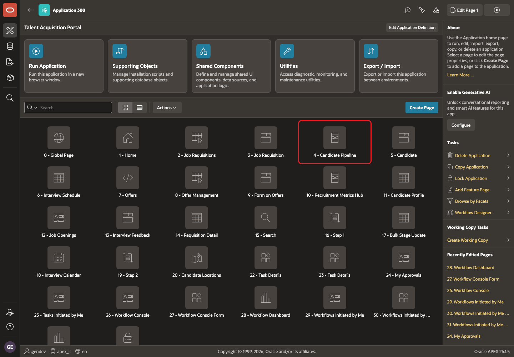

3. In the Rendering tree, select the **Candidates** Interactive Report region.

    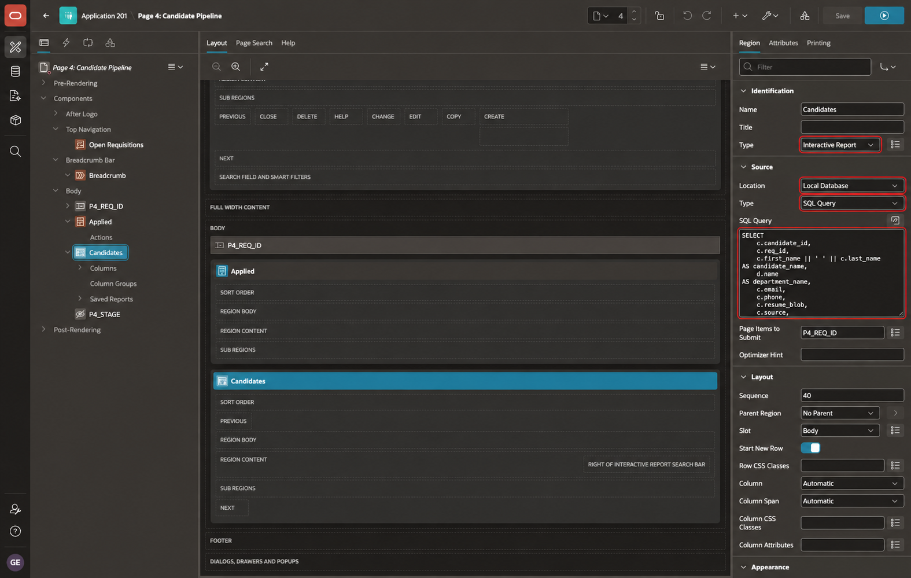

4. Open **Source**, and add the two columns to the existing query. Keep the existing table alias when the query uses one.

    ```sql
    <copy>
    c.ai_score,
    c.ai_summary
    </copy>
    ```

    Add the expressions before the query's `FROM` clause and preserve the comma between select-list expressions. If `AI_SCORE` is already in the select list, add only `AI_SUMMARY`; do not duplicate either expression.

    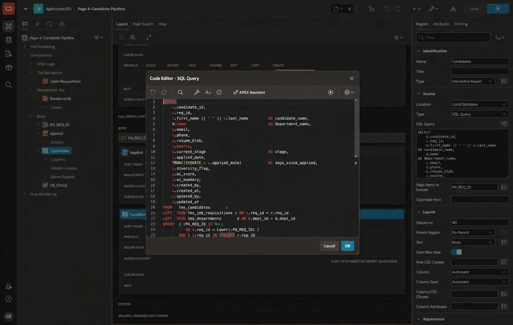

5. Save the page. APEX synchronizes the report columns with the query.

6. Expand **Candidates > Columns**, and select **`AI_SCORE`**.

    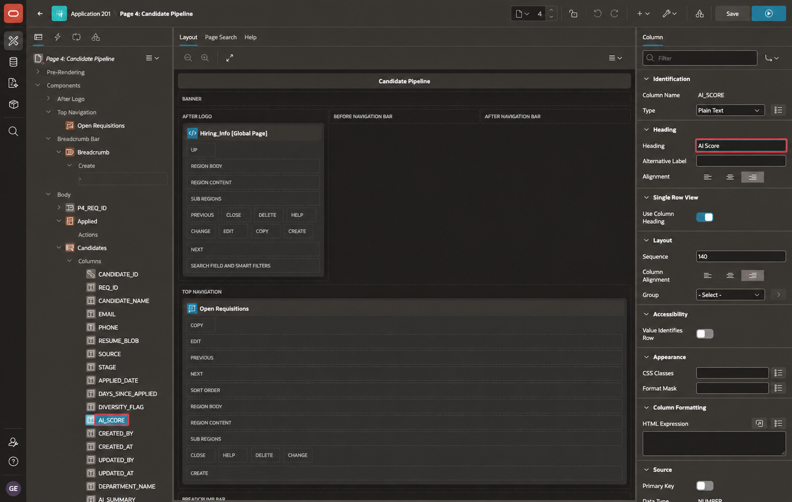

7. Under **Heading**, set **Heading** to `AI Score`. Under **Enable Users To**, keep **Sort** enabled. Use the Property Editor filter to find **Sort** if it is below the visible area.

    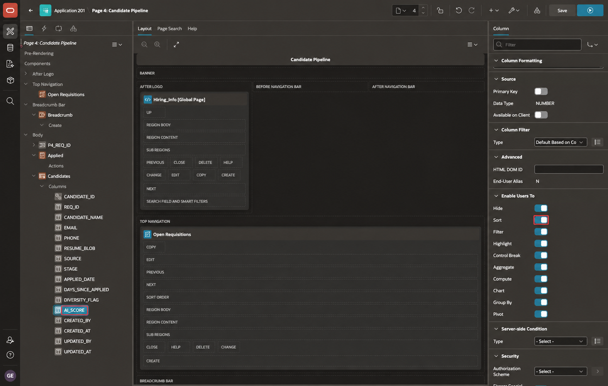

8. Select **`AI_SUMMARY`**.

    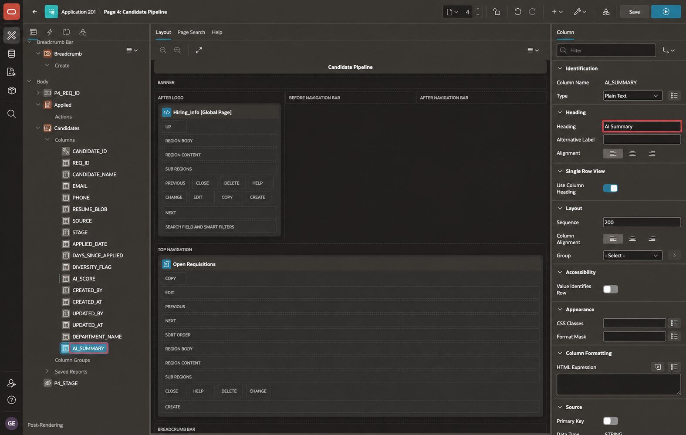

9. Under **Heading**, set **Heading** to `AI Summary`. Set **Identification > Type** to **Plain Text** and keep **Security > Escape Special Characters** enabled.

    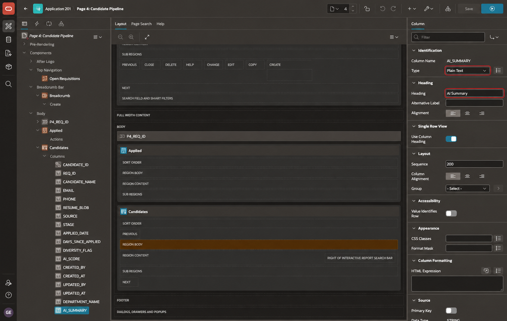

    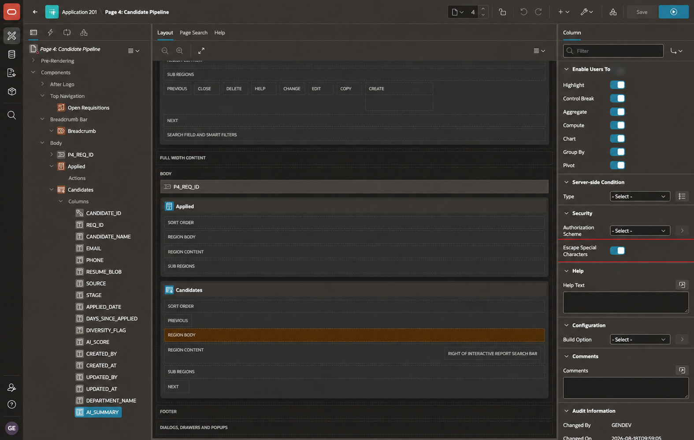

10. Save the page.

## Task 7: Save the Candidate Pipeline Default Report Layout

1. Run the application and open the Candidate Pipeline report.

    > **Note:** The reference screenshots label the numeric `AI_SCORE` column **AI Screening Summary**. After configuring its heading in Task 6, your column is labeled **AI Score**. Both refer to the numeric score; **AI Summary** is the separate text column.

2. In the Interactive Report, select **Actions > Columns**.

    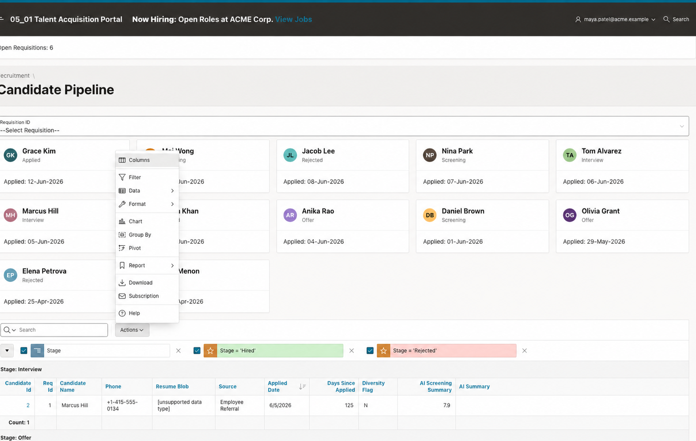

3. In **Select Columns**, use the shuttle: select **AI Score** and **AI Summary** under **Do Not Display**, then choose the right arrow to show them. To hide a column, select it under **Display in Report** and choose the left arrow. Select a displayed column and use the up/down arrows to change its display order. Place both AI columns near the candidate name and stage. These arrows reorder columns; they do not sort report rows.

    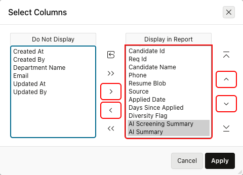

4. Click **Apply**.

5. To sort rows by score, select **Actions > Data > Sort**, select **AI Score** and **Descending**, and click **Apply**. Then select **Actions > Report > Save Report**.

    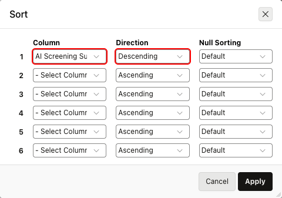

6. In the **Save Report** dialog, select **As Default Report Settings**, choose **Primary** for **Default Report Type**, and click **Apply**.

    > **Note:** Saving only a personal report does not change the layout for other users. Save the application default while signed in as a developer who can manage the default report.

    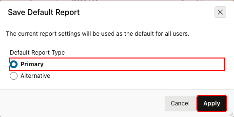

7. Confirm that both AI columns remain visible after the report reloads.

    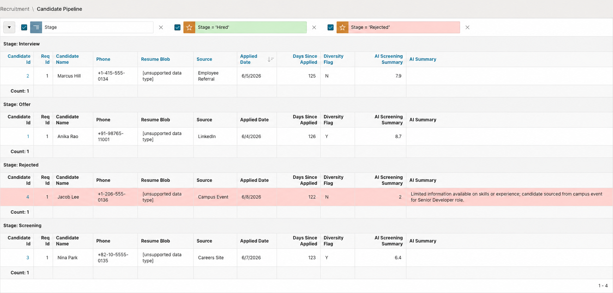

## Task 8: Add the Screen Candidate Button

1. Return to Page Designer for **Page 4: Candidate Pipeline**.

2. In the Rendering tree, select the existing **Breadcrumb** region.

3. Right-click **Breadcrumb**, select **Create Button**, and configure the following Property Editor groups:

    | Property | Value |
    | --- | --- |
    | Button Name | `SCREEN_CANDIDATE` |
    | Label | `Screen Candidate` |
    | Layout > Slot | Create |
    | Icon | `fa-sparkles` |
    | Behavior > Action | Trigger Action |

    Copy **Button Name**:

    ```text
    <copy>
    SCREEN_CANDIDATE
    </copy>
    ```

    Copy **Label**:

    ```text
    <copy>
    Screen Candidate
    </copy>
    ```

    Copy **Icon**:

    ```text
    <copy>
    fa-sparkles
    </copy>
    ```

    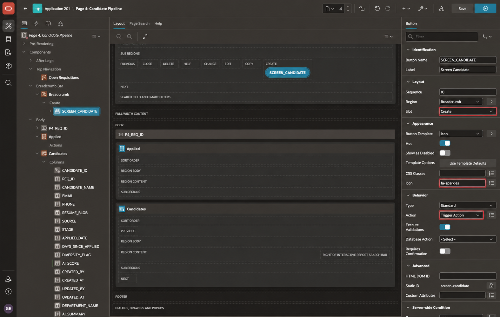

4. Under **Appearance**, set **Button Template** to **Text with Icon** and **Icon** to `fa-sparkles`. Under **Behavior**, confirm **Action** is **Trigger Action**.

    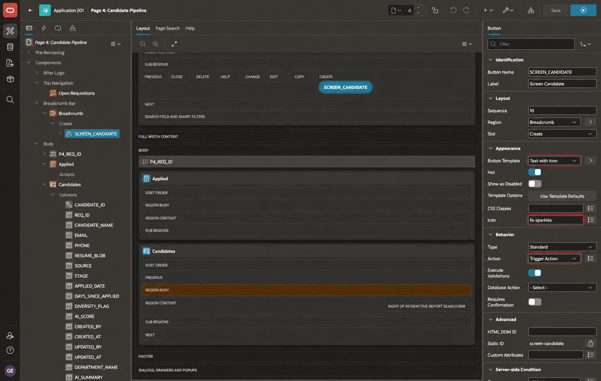

5. Under **Security**, set **Authorization Scheme** to the existing **`IS_TA_ADMIN`** authorization scheme (TA Admin).

    Use the same scheme on the screening action in Task 9.

    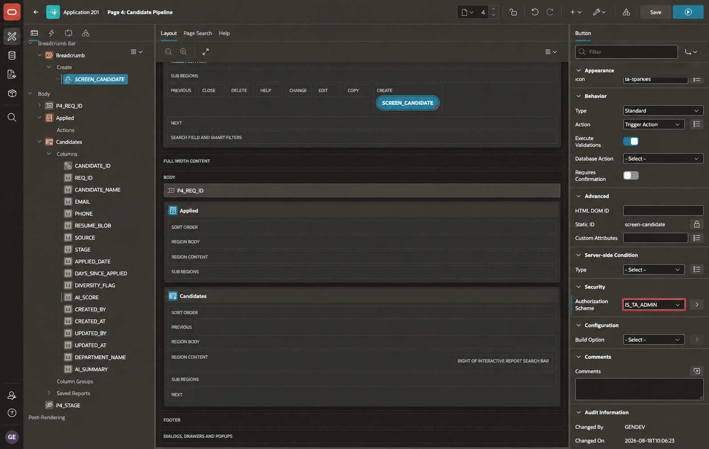

## Task 9: Connect the Button to the CV Screening Agent

1. In the Rendering tree, right-click **`SCREEN_CANDIDATE`** and select **Create Trigger Action**. This option is available because Task 8 set **Behavior > Action** to **Trigger Action**.

    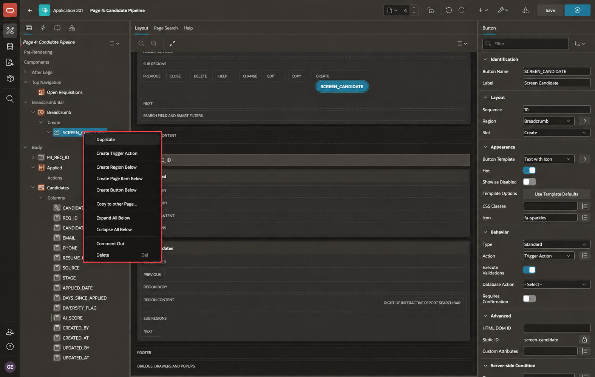

2. Select the new action under **`SCREEN_CANDIDATE` > Triggered Actions**. Under **Identification**, set **Name** to `Screen Candidate with AI` and **Action** to **Show AI Assistant**. These are Trigger Actions in the Rendering tree; there is no True branch to create.

3. Configure the action in the Property Editor:

    | Property | Value |
    | --- | --- |
    | Generative AI > Agent | CV Screening Agent |
    | Appearance > Display As | Dialog |
    | Appearance > Title | Candidate Screening |
    | Execution > Sequence | 10 |

    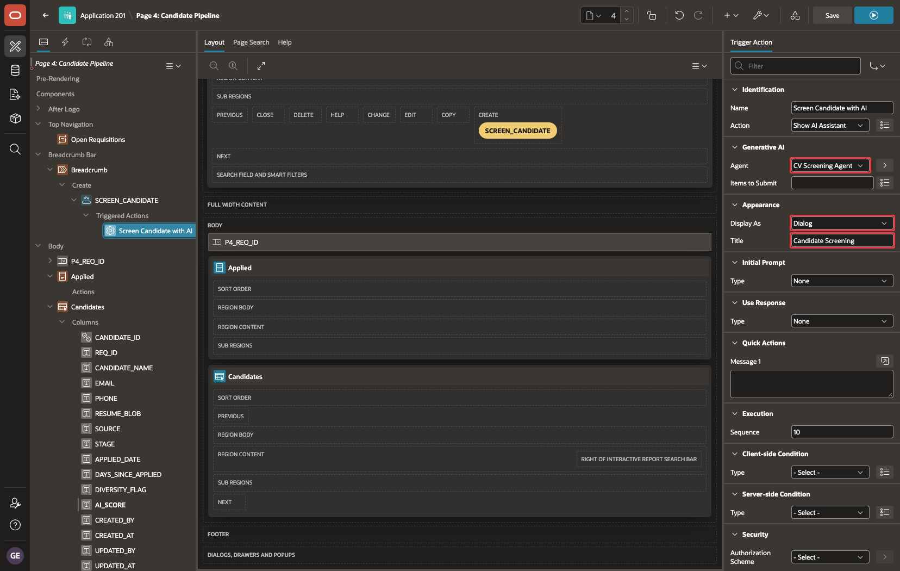

4. After screening, the report must be refreshed to read the saved values. After closing the assistant, reload the Candidate Pipeline page using the browser's Reload control. Opening the assistant does not itself update the candidate; do not add a following Refresh action and assume it waits for a conversation to finish.

5. With **Screen Candidate with AI** selected, under **Security**, set **Authorization Scheme** to the existing TA Admin scheme, **`IS_TA_ADMIN`**. Use the same scheme that protects the button in Task 8. Save the page.

    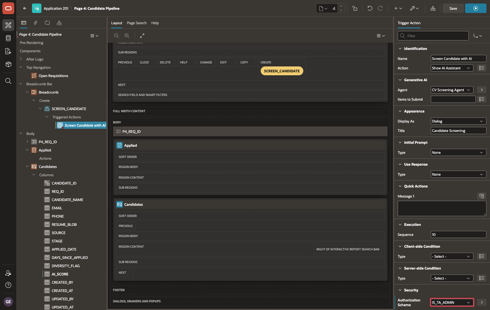

    > **Note:** The supplied Candidate Pipeline does not pass a selected candidate to the assistant. Enter the candidate's full name as shown in Task 10. Configure the name-based lookup in Task 3 before testing; an older completed reference app may still require a numeric candidate parameter.

## Task 10: Test Candidate Screening and Verify the Results

1. Return to the TAP application home page and click **Run Application**.

    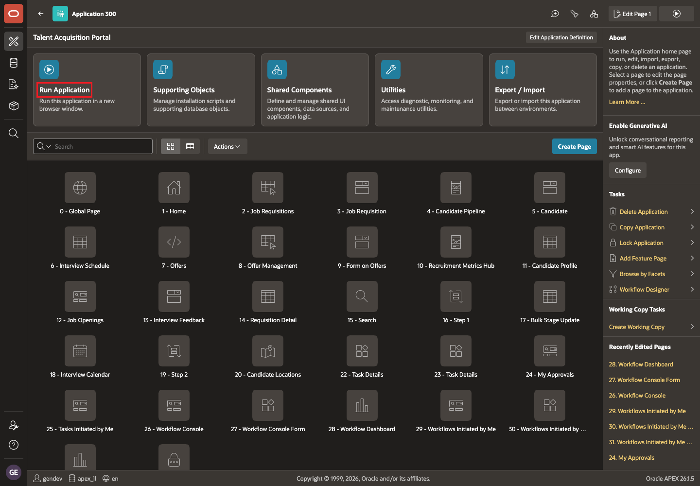

    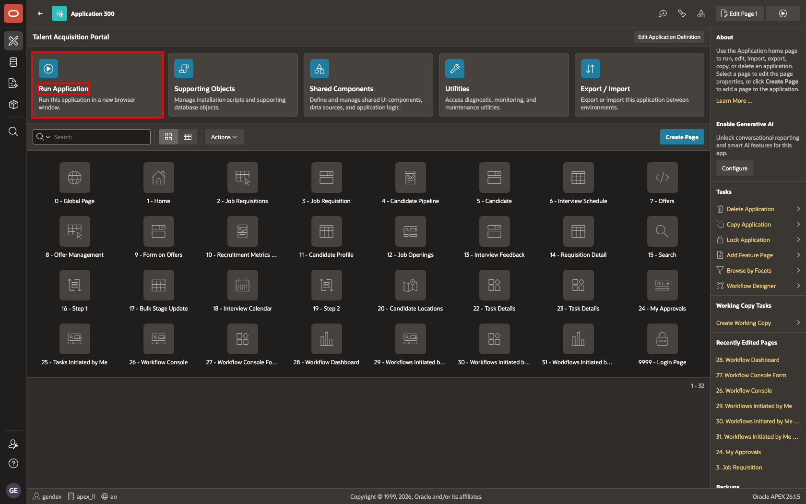

2. Sign in as a user who satisfies the TA Admin authorization scheme.

    > **Note:** The page authorization scheme **`IS_RECRUITER or IS_TA_ADMIN`** must check the role codes `RECRUITER` and `TA_ADMIN`. `IS_TA_ADMIN` is the authorization scheme name, not the TA Admin role code.

3. Open **Candidate Pipeline**, choose a test candidate for whom you have verified resume qualifications and requisition requirements, and click **Screen Candidate**. Use that candidate's full name in Point 4, then continue in the same conversation. For example, use Nina Park only if that candidate exists in your application. If names are duplicated, provide the candidate's email when asked. If the required evidence is unavailable, complete retrieval in Points 4–5 and verify that the agent asks for evidence rather than scoring; do not continue with an update.

    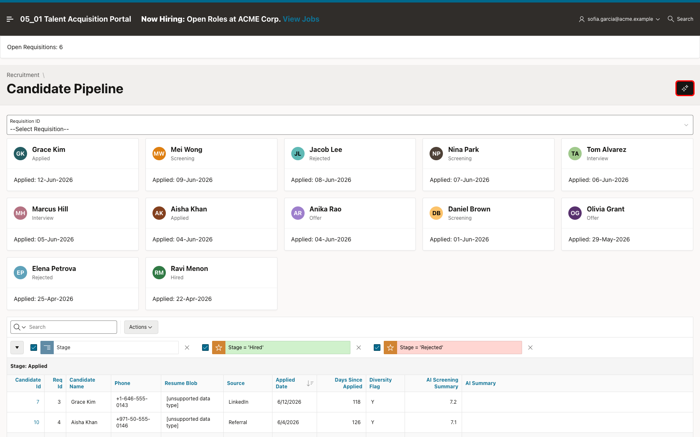

4. In the AI Assistant dialog, first enter this prompt to retrieve the candidate information:

    ```text
    <copy>
    Please show me the application details for Nina Park.
    </copy>
    ```

    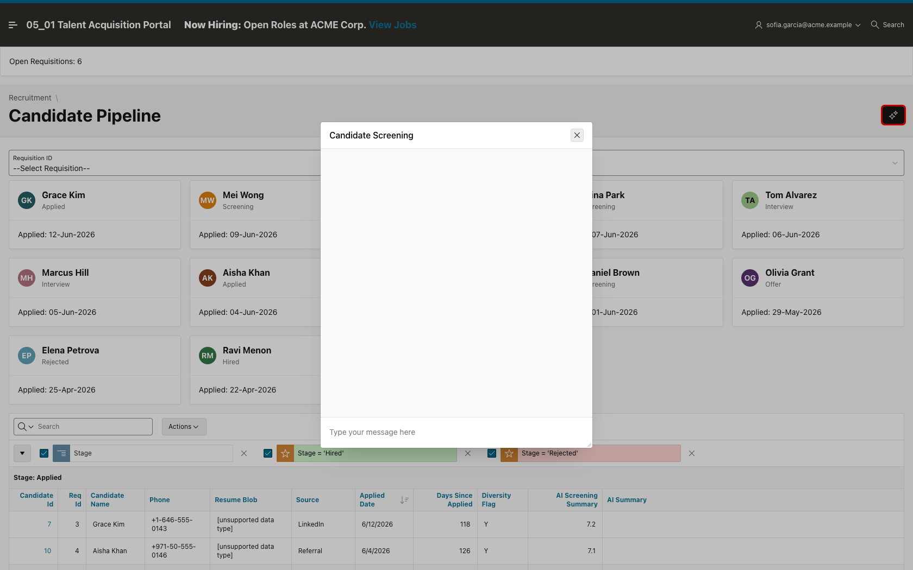

5. Review the returned name and email to confirm that the assistant found the chosen candidate. Then ask about the job in the same conversation:

    ```text
    <copy>
    What job has this candidate applied for, and what are its requirements?
    </copy>
    ```

6. Review the returned job metadata. Replace both evidence placeholders below with verified text for the chosen candidate and requisition before sending this prompt. A job title and department alone are insufficient. Review the proposed score before requesting its persistence:

    ```text
    <copy>
    Here are this candidate's verified qualifications from the resume:
    [Paste the relevant qualifications here.]

    Here are the verified requirements for the job:
    [Paste the job requirements here.]

    How well does this candidate match the job? Suggest a score from 1 to 10
    and a short explanation based only on this evidence. Explain any gaps.
    Please show me your assessment for review without saving it yet.
    </copy>
    ```

7. Verify that the evaluation uses the supplied evidence and refers to the correct candidate and job. If correct, send this prompt in the same conversation:

    ```text
    <copy>
    Please save the score and summary we just reviewed for this candidate.
    </copy>
    ```

    If the tool requests confirmation, confirm only after checking the candidate's name and email, score, and summary. If the evidence or result is incomplete, do not request an update.

8. Close the dialog after the assistant reports that it updated the record.

9. Reload the Candidate Pipeline page. Confirm that the Candidates report displays the new **AI Score** and **AI Summary** for the candidate chosen in Point 3. Confirm that the saved values match the reviewed result.

The completed flow is:

```text
Candidate name
    ↓
Candidate lookup
    ↓
Job lookup
    ↓
Verified qualifications + requisition requirements
    ↓
Job-related AI evaluation
    ↓
Recruiter review
    ↓
Save the reviewed score and summary
    ↓
Candidate Pipeline refresh
```

> **Note:** This lab screens one candidate at a time. Treat **Screen All Candidates** as a later enhancement with separate controls, monitoring, and error handling.

## Summary

You created a CV Screening Agent with three On-Demand tools, displayed its output in Candidate Pipeline, protected the entry point, and screened one candidate through the native AI Assistant.

You may now **proceed to the next lab**.

## Acknowledgements

- **Author** - Shanmukh Kornana
- **Last Updated By/Date** - Shanmukh Kornana, October 2026

## Learn More

- [Adding Interactivity to Pages](https://docs.oracle.com/en/database/oracle/apex/26.1/apxdc/adding-interactivity-pages.html)
- [Including Generative AI in Applications](https://docs.oracle.com/en/database/oracle/apex/26.1/htmdb/including-generative-ai-in-applications.html)

- [End User's Guide, Interactive Reports](https://docs.oracle.com/en/database/oracle/apex/26.1/aeeug/oracle-apex-end-users-guide.pdf)
