# Create an Onboarding Assistant in ESS

## Introduction

In this lab, you will create an Onboarding Assistant for employees. The agent identifies the signed-in employee through `APP_USER`, retrieves only that employee's tasks, searches company policy text, and completes only a task owned by that employee.

Estimated Time: 20 minutes

### Objectives

In this lab, you will:

- Create the Onboarding Assistant Agent.
- Retrieve the signed-in employee's onboarding tasks.
- Search HR policy content by topic.
- Mark an owned task complete through a controlled tool.
- Add the native AI Assistant to ESS Home.
- Test the assistant with an annual leave policy question.

### Prerequisites

- Oracle APEX 26.1 and the starter application for this lab. The screenshots use the supplied Module 20 apps.
- A Generative AI Service configured in the workspace and selected under **Shared Components > AI Attributes** for the application.
- If a component already exists in the supplied completed app, open it to review its properties. In your workshop starter app, create it using the steps below.

## Task 1: Create and Configure the Onboarding Assistant

1. In App Builder, open **Employee Self-Service Portal**.

    

2. Select **Shared Components**.

    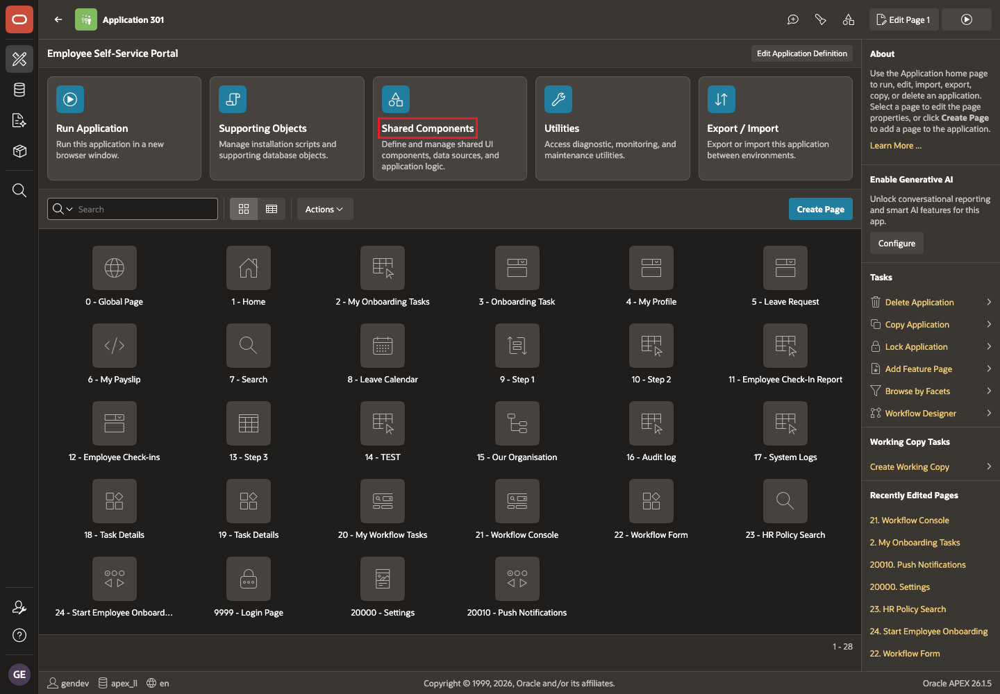

3. In **Generative AI**, select **AI Agents**.

    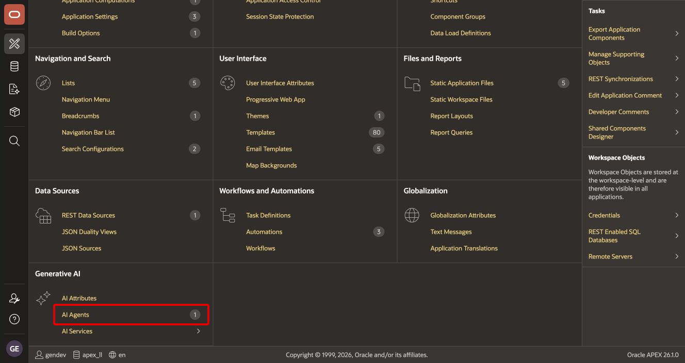

4. Click **Create**.

    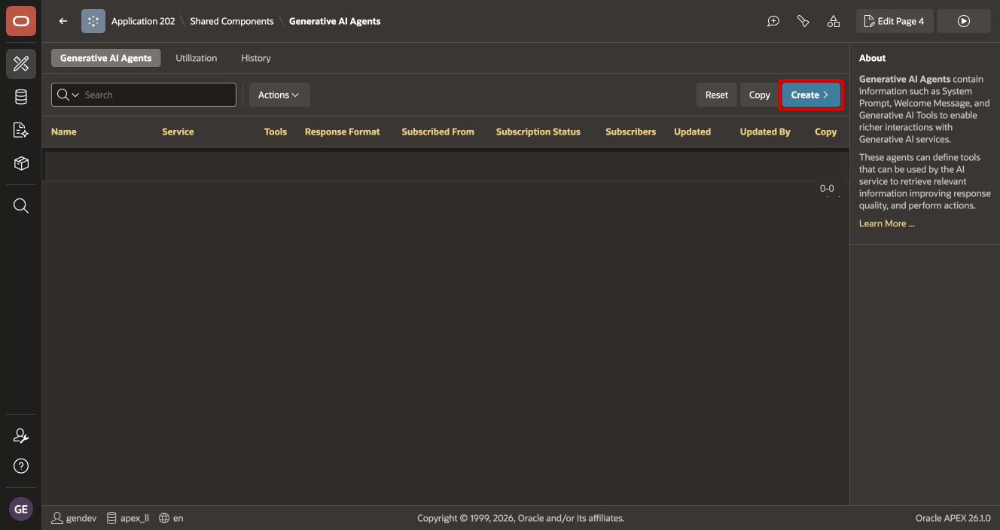

5. Configure the agent:

    | Property | Value |
    | --- | --- |
    | Name | `Onboarding Assistant` |
    | Service | Application Default |
    | Response Format > Type | Text |

    ```text
    <copy>
    Onboarding Assistant
    </copy>
    ```

    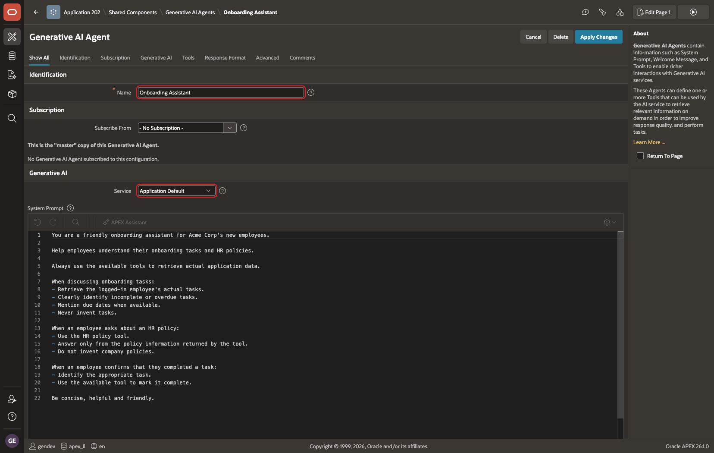

    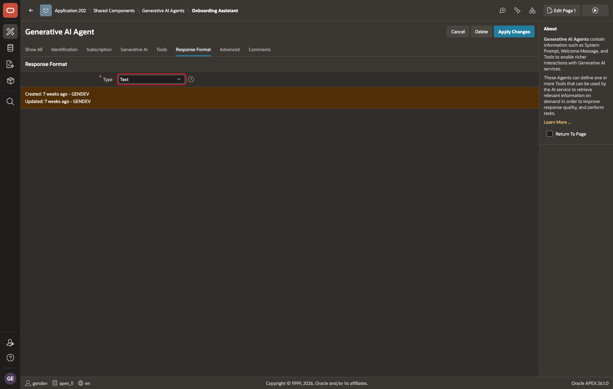

6. Enter this System Prompt:

    ```text
    <copy>
    You are a friendly onboarding assistant for Acme Corp's new employees.

    Help employees understand their onboarding tasks and HR policies.

    Always use the available tools to retrieve actual application data.

    When discussing onboarding tasks:
    - Retrieve the logged-in employee's actual tasks.
    - Clearly identify incomplete or overdue tasks.
    - Mention due dates when available.
    - Discuss tasks by name and keep task IDs and tool names internal.
    - If task names are ambiguous, ask about the category or due date.
      Do not update a task until the intended owned record is clear.
    - Never invent tasks.

    When an employee asks about an HR policy:
    - Use the HR policy tool.
    - Answer only from the policy information returned by the tool.
    - Do not invent company policies.

    When an employee confirms that they completed a task:
    - Retrieve the employee's tasks and identify the confirmed task by name.
    - Use only the task ID returned for that employee by the retrieval tool.
      Never invent an ID or ask the employee to enter one.
    - Use the available tool to mark it complete.

    Be concise, helpful and friendly.
    </copy>
    ```

7. Open **Advanced**. Unlock **Static ID** if required, and enter `ONBOARDING_ASSISTANT`.

    > **Note:** APEX can display an automatically generated value such as `onboarding-assistant`. Use the workshop identifier when the field is editable.

    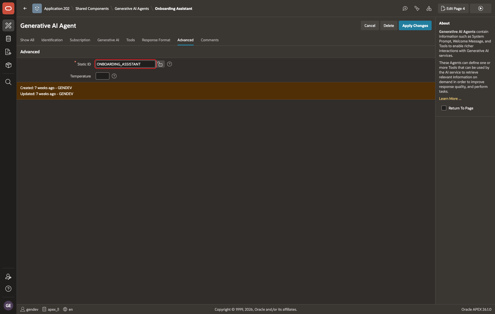

8. Click **Create** for a new agent, or **Apply Changes** when reviewing an existing agent.

    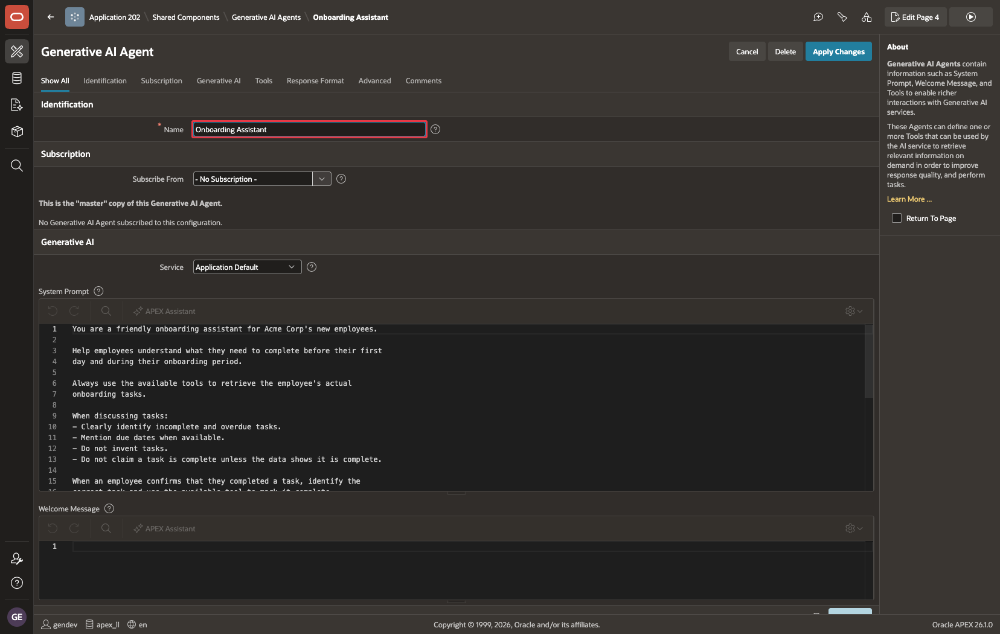

9. Open **Onboarding Assistant** to continue.

    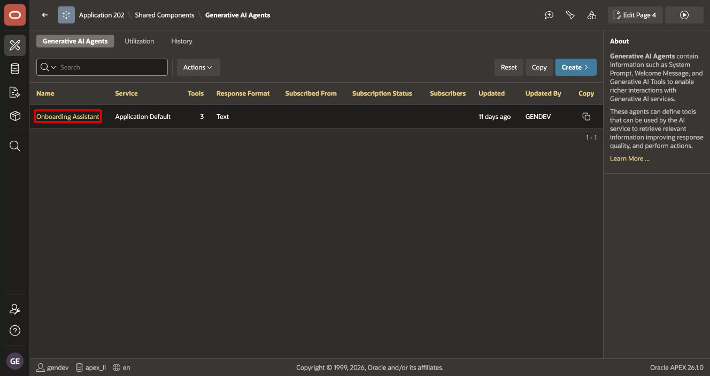

## Task 2: Create the Employee Task Retrieval Tool

1. On the agent's **Tools** tab, click **Add Tool**.

    

2. Configure the tool:

    | Property | Value |
    | --- | --- |
    | Name | `get_my_tasks` |
    | Type | Retrieve Data |
    | Execution Point | On Demand |

    ```text
    <copy>
    get_my_tasks
    </copy>
    ```

    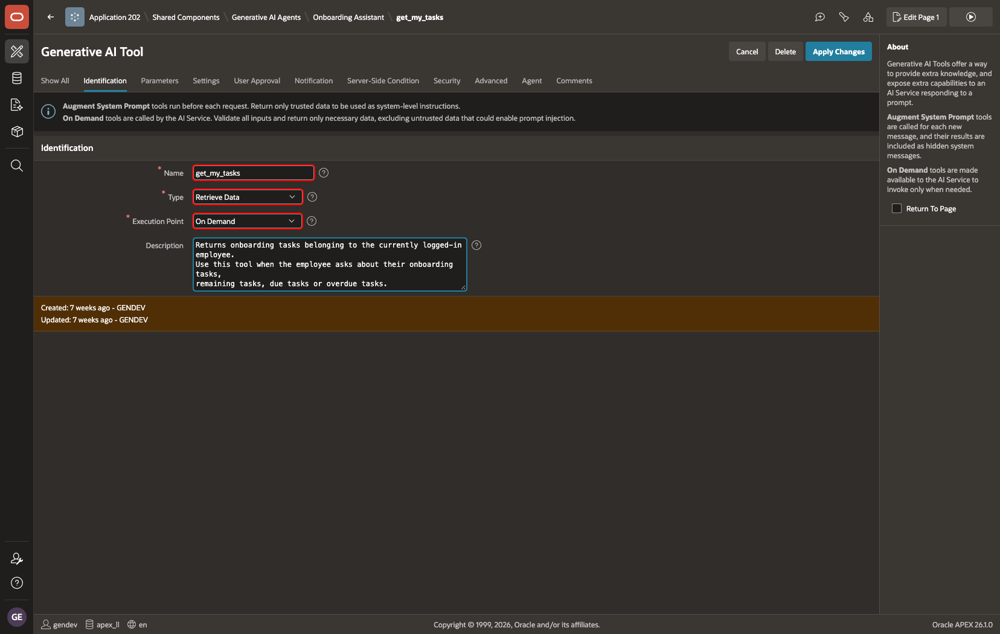

3. Enter this description:

    ```text
    <copy>
    Returns onboarding tasks belonging to the currently logged-in employee.
    Use this tool when the employee asks about their onboarding tasks,
    remaining tasks, due tasks or overdue tasks.
    </copy>
    ```

    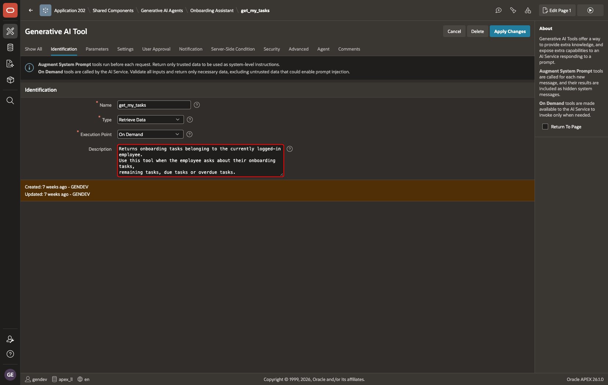

4. Under **Settings**, set **Type** to **SQL Query**, and enter the following in **SQL Query**:

    ```sql
    <copy>
    SELECT
        t.task_id,
        t.task_name,
        t.category,
        t.due_date,
        t.status
    FROM tms_onboarding_tasks t
    JOIN tms_employees e
      ON e.employee_id = t.employee_id
    WHERE UPPER(e.email) = UPPER(:APP_USER)
    ORDER BY
        CASE
            WHEN t.status = 'Done' THEN 2
            ELSE 1
        END,
        t.due_date
    </copy>
    ```

    The filter uses the authenticated username. It does not trust an employee ID supplied by the model or browser.

    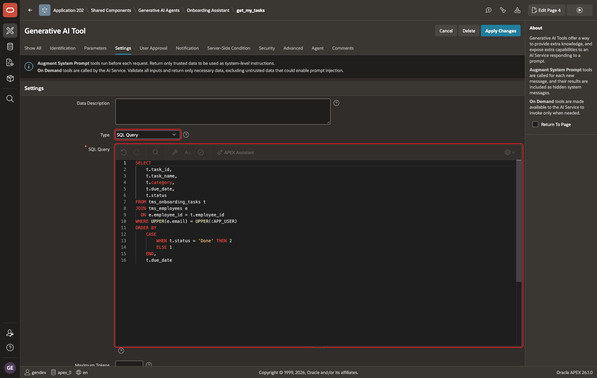

5. Save the tool.

## Task 3: Create the HR Policy Search Tool

1. Click **Add Tool**.

    

2. Configure the tool:

    | Property | Value |
    | --- | --- |
    | Name | `get_hr_policy` |
    | Type | Retrieve Data |
    | Execution Point | On Demand |

    ```text
    <copy>
    get_hr_policy
    </copy>
    ```

    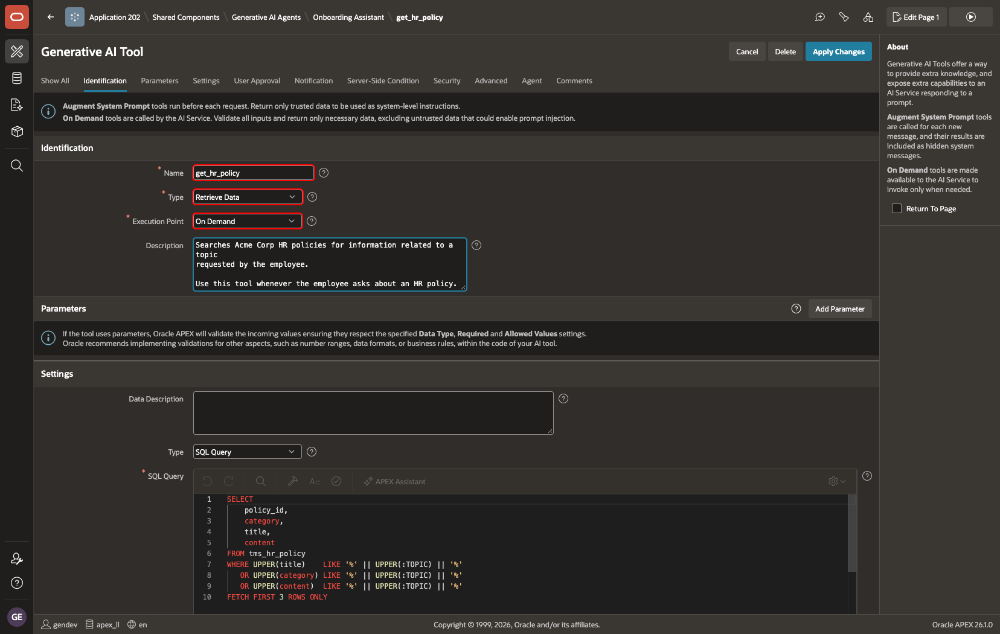

3. Enter this description:

    ```text
    <copy>
    Searches Acme Corp HR policies for information related to a topic
    requested by the employee.

    Use this tool whenever the employee asks about an HR policy.
    </copy>
    ```

    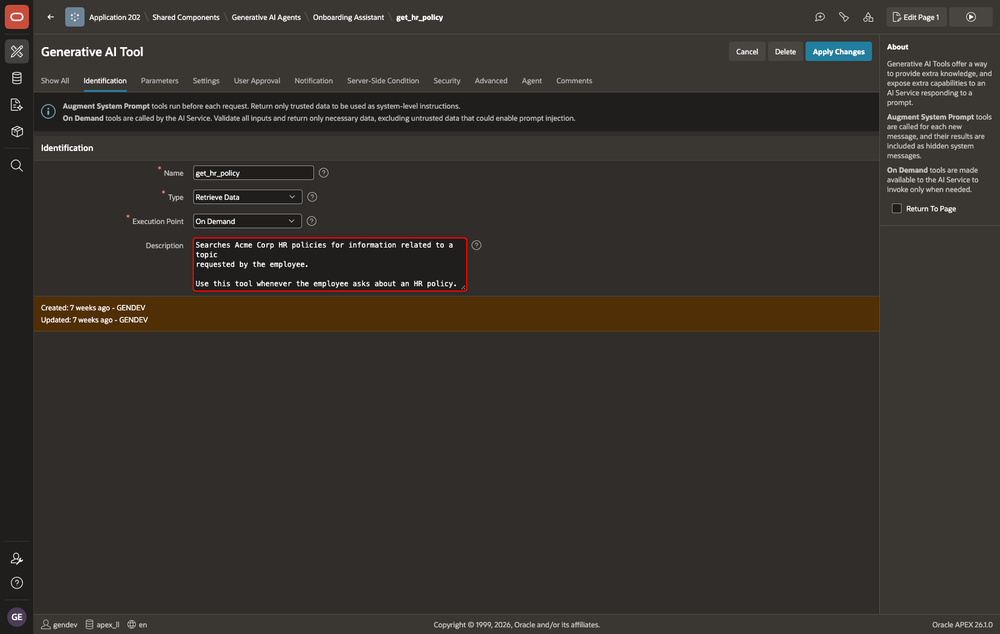

4. Under **Parameters**, click **Add Parameter**. Enter the following row in the grid:

    | Property | Value |
    | --- | --- |
    | Parameter Name | `TOPIC` |
    | Data Type | VARCHAR2 |
    | Required | Yes |

    Copy **Parameter Name**:

    ```text
    <copy>
    TOPIC
    </copy>
    ```

    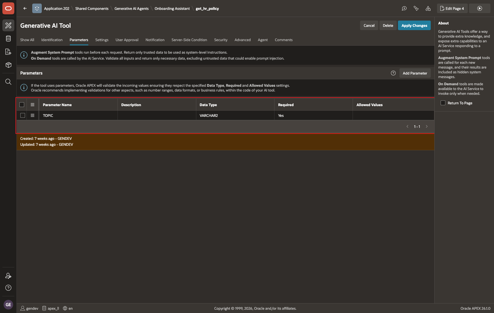

5. Under **Settings**, set **Type** to **SQL Query**, and enter the following in **SQL Query**:

    ```sql
    <copy>
    SELECT
        policy_id,
        category,
        title,
        content
    FROM tms_hr_policy
    WHERE UPPER(title) LIKE '%' || UPPER(:TOPIC) || '%'
       OR UPPER(category) LIKE '%' || UPPER(:TOPIC) || '%'
       OR UPPER(content) LIKE '%' || UPPER(:TOPIC) || '%'
    FETCH FIRST 3 ROWS ONLY
    </copy>
    ```

    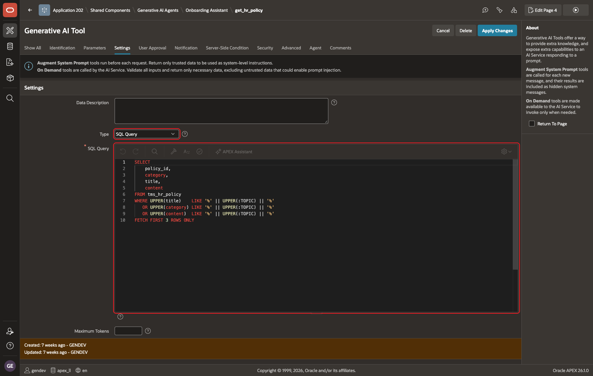

6. Save the tool.

This module uses keyword matching intentionally. `TMS_HR_POLICY.EMBEDDING_VECTOR` allows a later module to replace the query with semantic search while keeping the same tool interface.

## Task 4: Create the Task Completion Tool

1. Click **Add Tool**.

    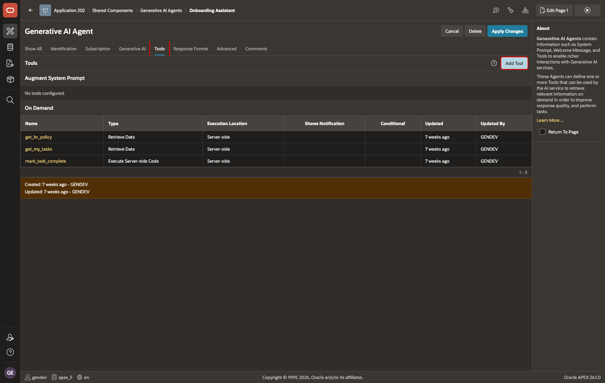

2. Configure the tool:

    | Property | Value |
    | --- | --- |
    | Name | `mark_task_complete` |
    | Type | Execute Server-side Code |
    | Execution Point | On Demand |

    ```text
    <copy>
    mark_task_complete
    </copy>
    ```

    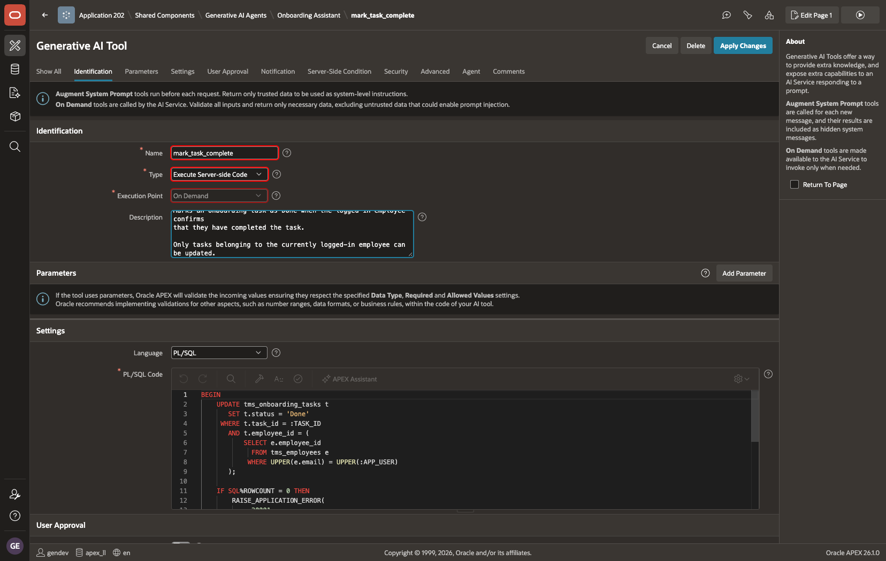

3. Enter this description:

    ```text
    <copy>
    Marks an onboarding task as Done when the logged-in employee confirms
    that they have completed the task.

    Only tasks belonging to the currently logged-in employee can be updated.
    </copy>
    ```

    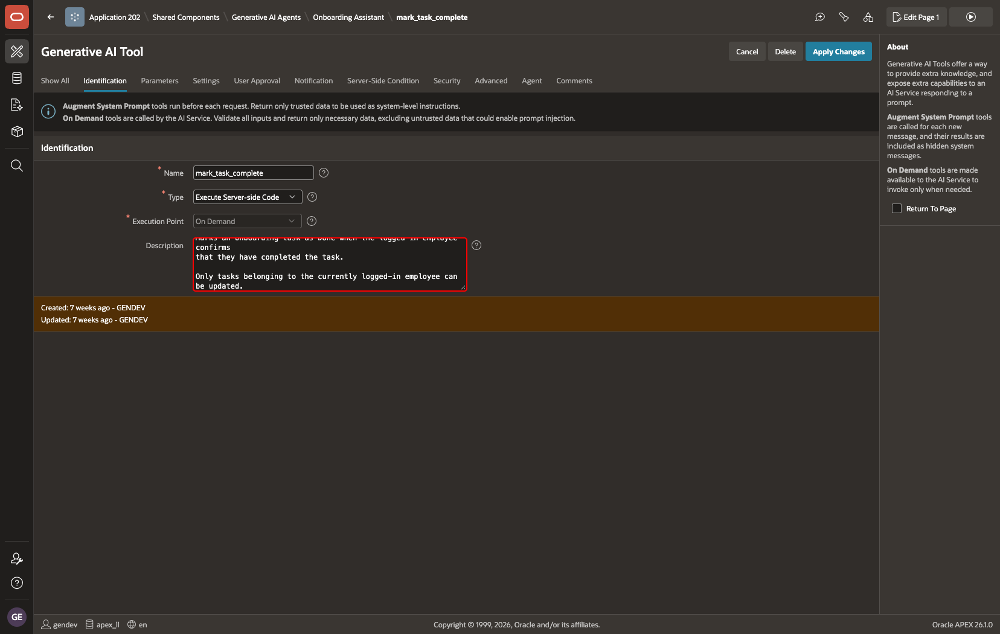

4. Under **Parameters**, click **Add Parameter**. Enter the following row in the grid:

    | Property | Value |
    | --- | --- |
    | Parameter Name | `TASK_ID` |
    | Data Type | NUMBER |
    | Required | Yes |

    Copy **Parameter Name**:

    ```text
    <copy>
    TASK_ID
    </copy>
    ```

    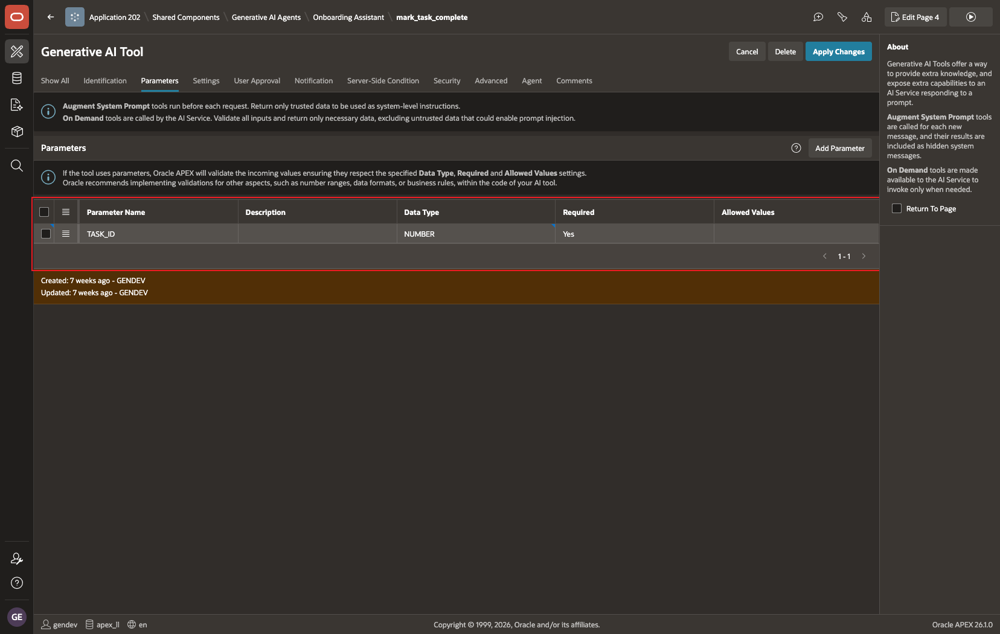

5. Under **Settings**, set **Language** to **PL/SQL** and enter the following in **PL/SQL Code**:

    ```plsql
    <copy>
    BEGIN
        UPDATE tms_onboarding_tasks t
           SET t.status = 'Done'
         WHERE t.task_id = :TASK_ID
           AND t.employee_id = (
               SELECT e.employee_id
                 FROM tms_employees e
                WHERE UPPER(e.email) = UPPER(:APP_USER)
           );

        IF SQL%ROWCOUNT = 0 THEN
            RAISE_APPLICATION_ERROR(
                -20001,
                'The onboarding task could not be updated.'
            );
        END IF;
    END;
    </copy>
    ```

    The ownership predicate prevents one employee from completing another employee's task. The row-count check reports a missing or unauthorized task as an error.

    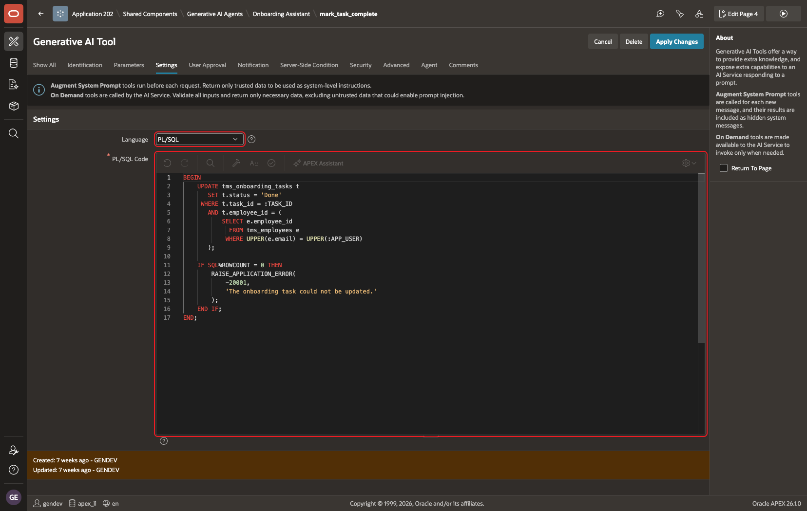

6. Save the tool.

    Confirm that `TASK_ID` has **Data Type** set to **NUMBER**, **Required** set to **Yes**, and that the tool appears under **On Demand**.

## Task 5: Verify the Onboarding Assistant Tools

1. Return to **Shared Components > AI Agents > Onboarding Assistant**.

2. Confirm that **Tools > On Demand** contains:

    ```text
    Onboarding Assistant
    ├── get_my_tasks
    ├── get_hr_policy
    └── mark_task_complete
    ```

3. Confirm that each tool is **On Demand** and uses the expected tool type.

    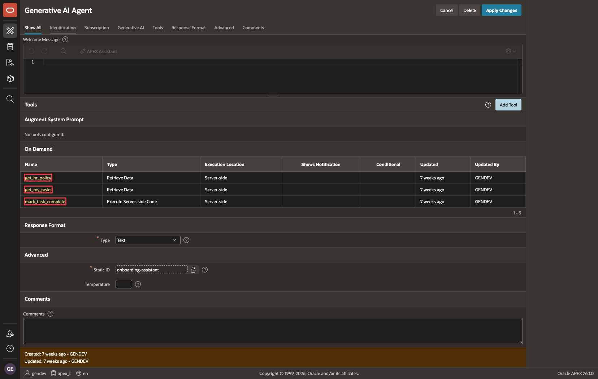

4. Click **Apply Changes**.

## Task 6: Add the Onboarding Assistant Button to ESS Home

1. Return to the ESS application home page.

2. Open **Page 1: Home**.

    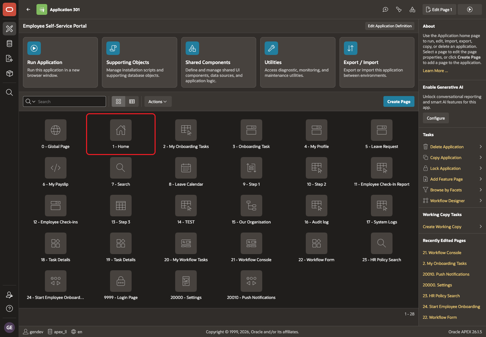

3. In the Rendering tree, select the existing **Employee Self-Service Portal** Breadcrumb region.

4. Right-click the Breadcrumb region and select **Create Button**.

    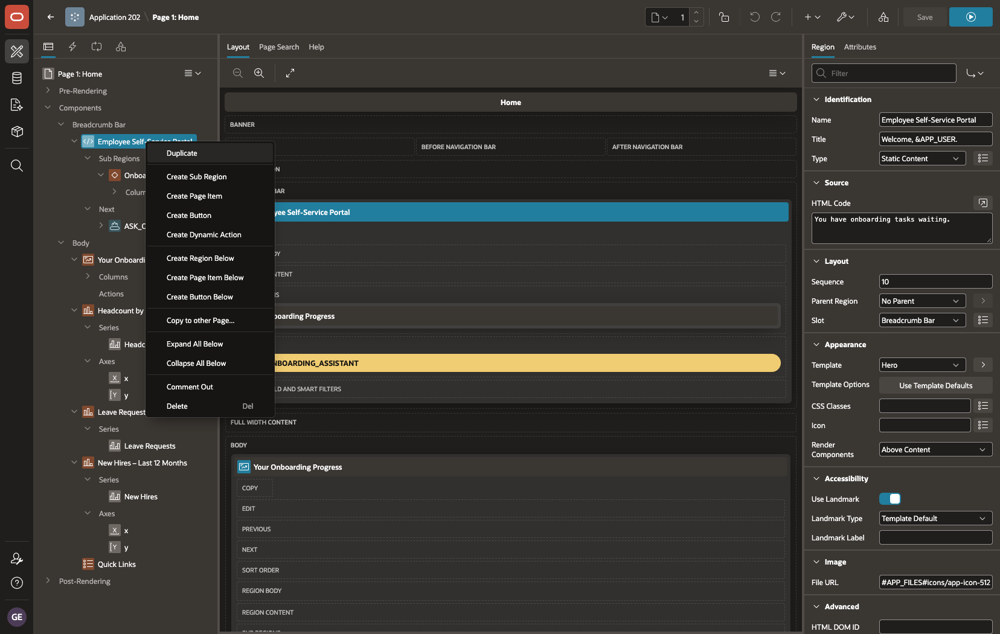

5. Configure the button:

    | Property | Value |
    | --- | --- |
    | Button Name | `ASK_ONBOARDING_ASSISTANT` |
    | Label | `Ask Onboarding Assistant` |
    | Layout > Slot | Next |
    | Appearance > Icon | `fa-sparkles` |
    | Appearance > Button Template | Text with Icon |
    | Behavior > Action | Trigger Action |

    Copy **Button Name**:

    ```text
    <copy>
    ASK_ONBOARDING_ASSISTANT
    </copy>
    ```

    Copy **Label**:

    ```text
    <copy>
    Ask Onboarding Assistant
    </copy>
    ```

    Copy **Appearance > Icon**:

    ```text
    <copy>
    fa-sparkles
    </copy>
    ```

    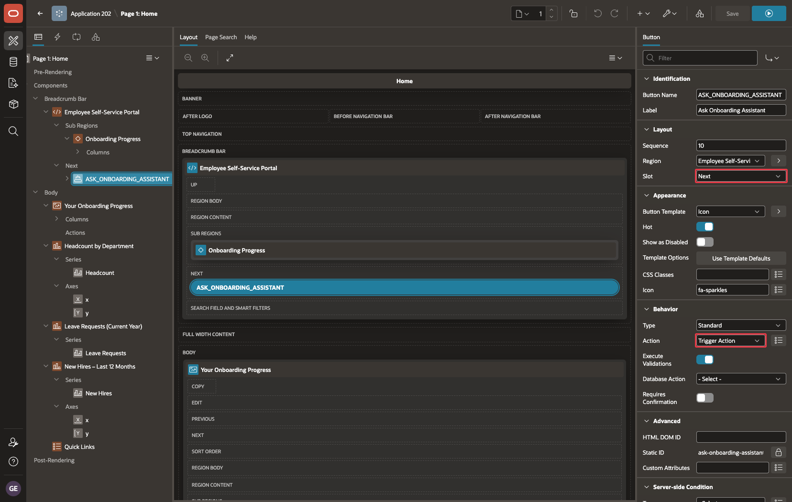

6. Save the page.

## Task 7: Connect the Button to the Onboarding Assistant

1. Select **`ASK_ONBOARDING_ASSISTANT`** in the Rendering tree.

2. Right-click **`ASK_ONBOARDING_ASSISTANT`** and select **Create Trigger Action**. Select the new action under **Triggered Actions**. Task 6 must have **Behavior > Action** set to **Trigger Action** for this option to appear.

    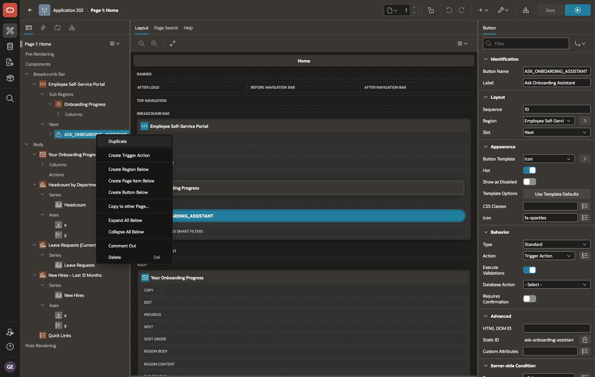

3. Configure the action:

    | Property | Value |
    | --- | --- |
    | Name | `Show AI Assistant` |
    | Action | Show AI Assistant |
    | Generative AI > Agent | Onboarding Assistant |

    ```text
    <copy>
    Show AI Assistant
    </copy>
    ```

    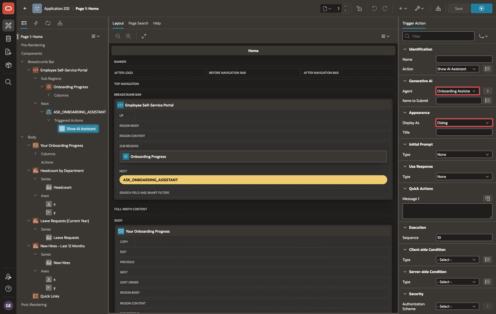

4. Under **Appearance**, set **Display As** to **Dialog** and **Title** to `Onboarding Assistant`. Leave **Initial Prompt > Type** as **None** so the employee can enter a question.

    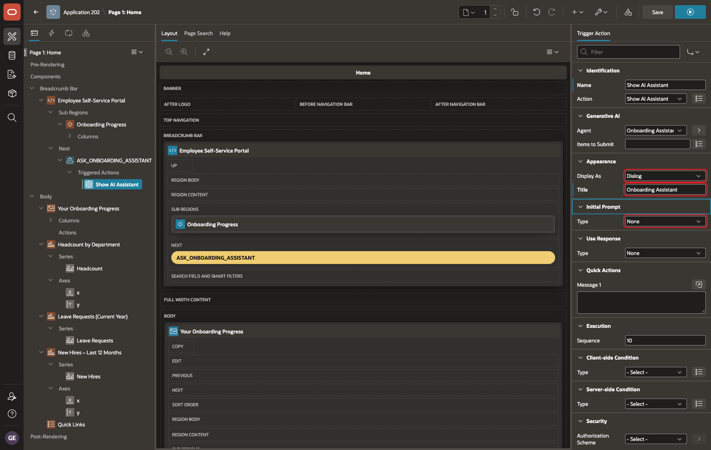

5. Save the page.

## Task 8: Test the Assistant as an Employee

1. Confirm that the test employee's login name matches a value in `TMS_EMPLOYEES.EMAIL`. The comparison is case-insensitive.

2. Run ESS and sign in as that employee.

3. On ESS Home, click **Ask Onboarding Assistant**.

    > **Note:** The reference app currently displays this control as an icon and the dialog title as **Assistant**. The settings in Tasks 6–7 display the button text and title **Onboarding Assistant** in your app.

    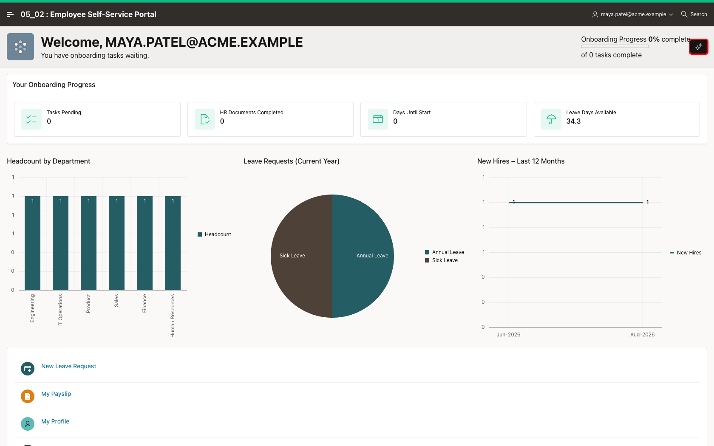

    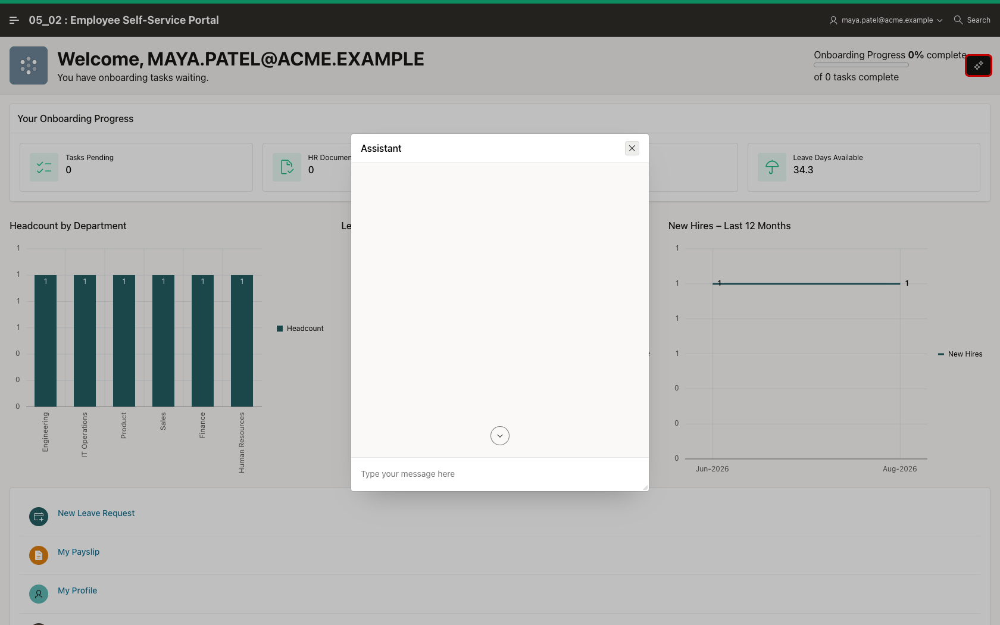

4. Enter the LiveLab test prompt:

    ```text
    <copy>
    What is the company policy on annual leave?
    </copy>
    ```

5. Verify that the agent calls `get_hr_policy` and bases its answer on the returned policy text.

    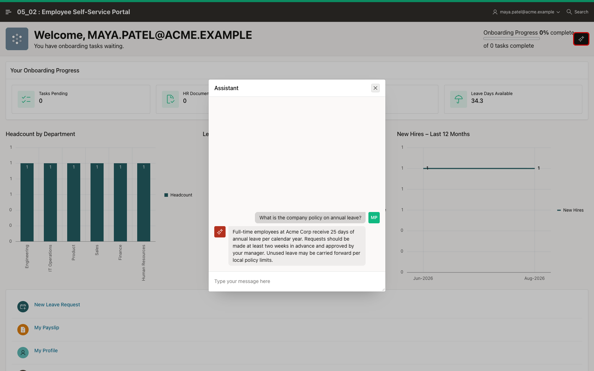

6. Test task retrieval with:

    ```text
    <copy>
    Which onboarding tasks do I still need to complete?
    </copy>
    ```

7. Verify that the assistant lists only the signed-in employee's tasks and identifies incomplete or overdue entries.

    > **Note:** If the assistant reports no assigned tasks, verify that this employee has rows in `TMS_ONBOARDING_TASKS`. Use an employee with an incomplete owned task for Points 8–10. An empty task list does not validate the completion path.

    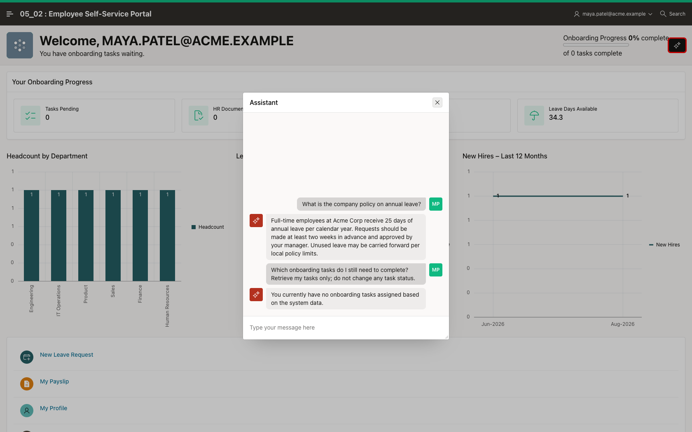

8. To test the update path, identify one incomplete task from the assistant response that you have completed. Use its task name in your message. For example, if the task is called **Complete tax forms**, enter:

    ```text
    <copy>
    I have completed my tax forms. Please mark Complete tax forms as done.
    </copy>
    ```

9. Review any confirmation that appears. Check the task name and, if needed, its category or due date. Confirm only the task you intended to complete.

10. Ask for the task list again:

    ```text
    <copy>
    Which onboarding tasks do I still need to complete?
    </copy>
    ```

    Confirm that the selected task now has status `Done`.

## Summary

You created an Onboarding Assistant that retrieves live employee data, answers from HR policy records, and performs an employee-scoped task update. You exposed the agent through the native AI Assistant on ESS Home.

You may now **proceed to the next lab**.

## Acknowledgements

- **Author** - Shanmukh Kornana
- **Last Updated By/Date** - Shanmukh Kornana, October 2026

## Learn More

- [Adding Interactivity to Pages](https://docs.oracle.com/en/database/oracle/apex/26.1/apxdc/adding-interactivity-pages.html)
- [Including Generative AI in Applications](https://docs.oracle.com/en/database/oracle/apex/26.1/htmdb/including-generative-ai-in-applications.html)
