# Build the Weekly HR AI Summary

## Introduction

In this lab, you will add an HR Admin-only region to ESS Home. A button first calculates four current HR metrics on the server. A second action sends only those metrics to the configured AI service and writes a concise weekly briefing to a read-only item.

Estimated Time: 20 minutes

### Objectives

In this lab, you will:

- Create the Weekly HR Summary region.
- Restrict the region with `IS_HR_ADMIN`.
- Add a read-only AI result item and four hidden metric items.
- Populate live HR metrics through PL/SQL.
- Generate a three-sentence summary with AI.
- Verify action order and runtime behavior.

### Prerequisites

- Oracle APEX 26.1 and the starter application for this lab. The screenshots use the supplied Module 20 apps.
- A Generative AI Service configured in the workspace and selected under **Shared Components > AI Attributes** for the application.
- If a component already exists in the supplied completed app, open it to review its properties. In your workshop starter app, create it using the steps below.

## Task 1: Open ESS Home in Page Designer

1. In App Builder, open **Employee Self-Service Portal**.

    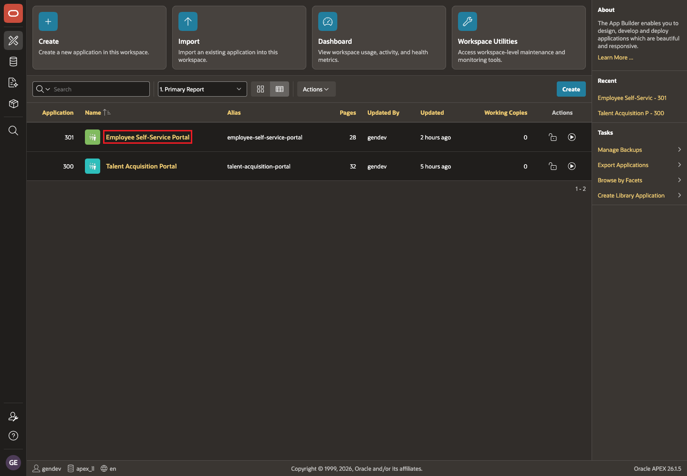

2. Open **Page 1: Home**.

    

3. Review the existing page layout from Module 19. The new region must appear above the three HR charts.

    ```text
    ESS Home
    ├── Metric Cards
    ├── Onboarding Progress
    ├── Weekly HR Summary
    ├── Headcount by Department
    ├── Leave Requests by Type
    └── New Hires - Last 12 Months
    ```

    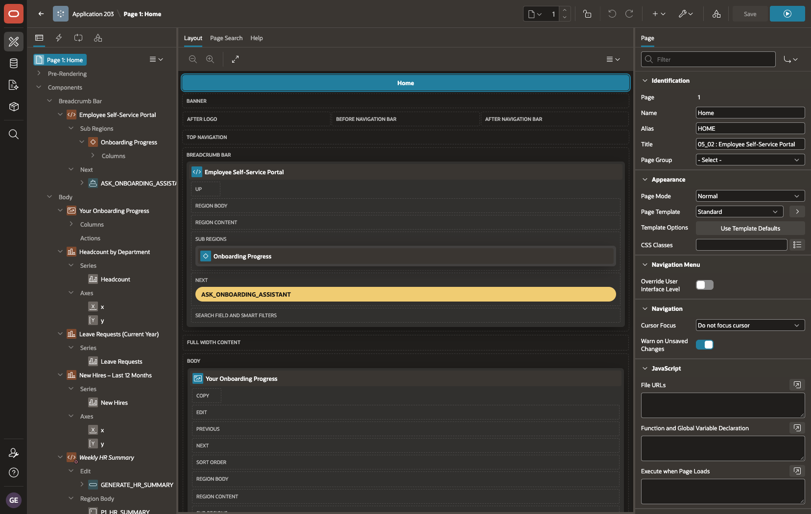

## Task 2: Create the Weekly HR Summary Region

1. In the Rendering tree, right-click **Body** and select **Create Region**.

    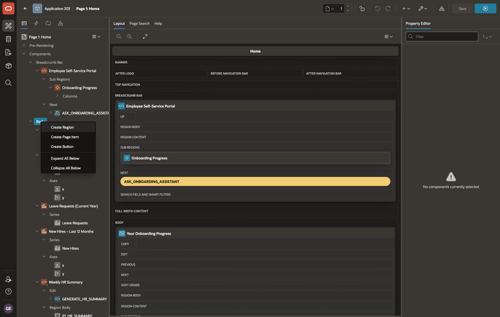

2. Configure the region:

    | Property | Value |
    | --- | --- |
    | Identification > Name | `Weekly HR Summary` |
    | Type | Static Content |
    | Authorization Scheme | `IS_HR_ADMIN` |

    Copy **Identification > Name**:

    ```text
    <copy>
    Weekly HR Summary
    </copy>
    ```

    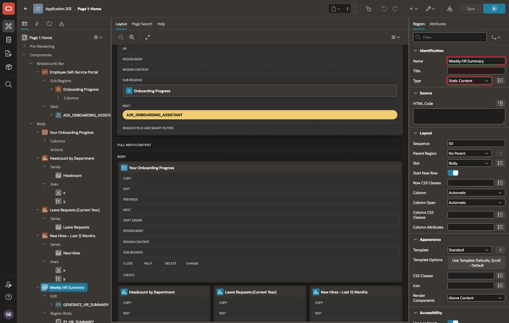

    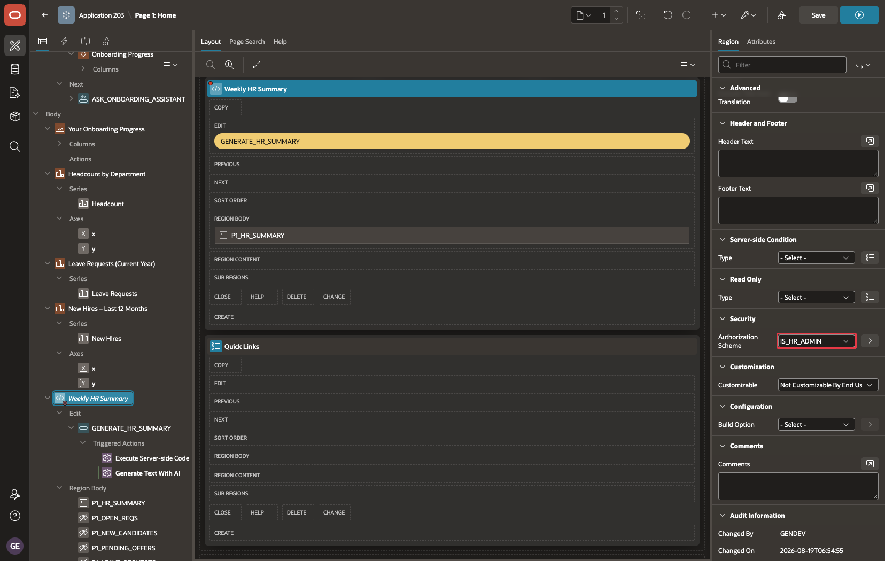

3. Under **Layout**, set **Slot** to **Body**. Drag the region above **Headcount by Department** in the Rendering tree. Use a **Sequence** lower than the Headcount region; for example, `15` when Headcount has sequence `20`.

4. Verify the region in the Rendering tree.

    Confirm that **Weekly HR Summary** precedes **Headcount by Department** in the Body region list.

    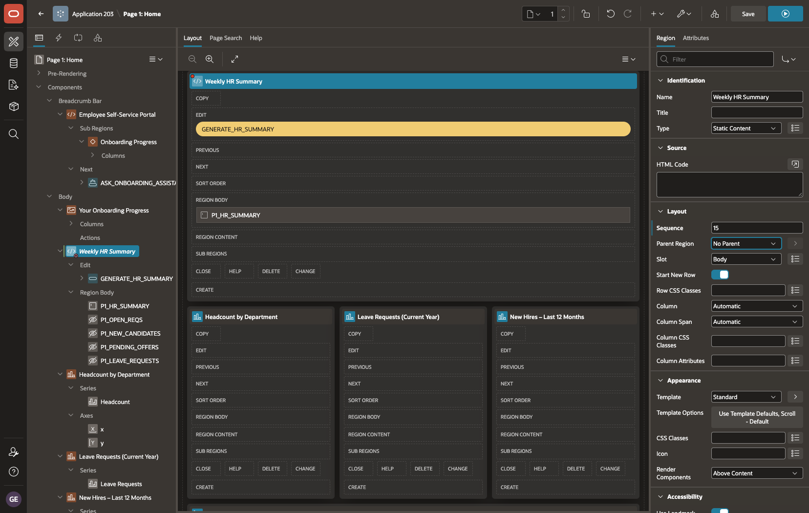

The authorization scheme protects the complete region, including its button, metrics, and AI-generated text.

## Task 3: Add the Summary and Metric Items

1. Right-click **Weekly HR Summary**, and select **Create Page Item**.

    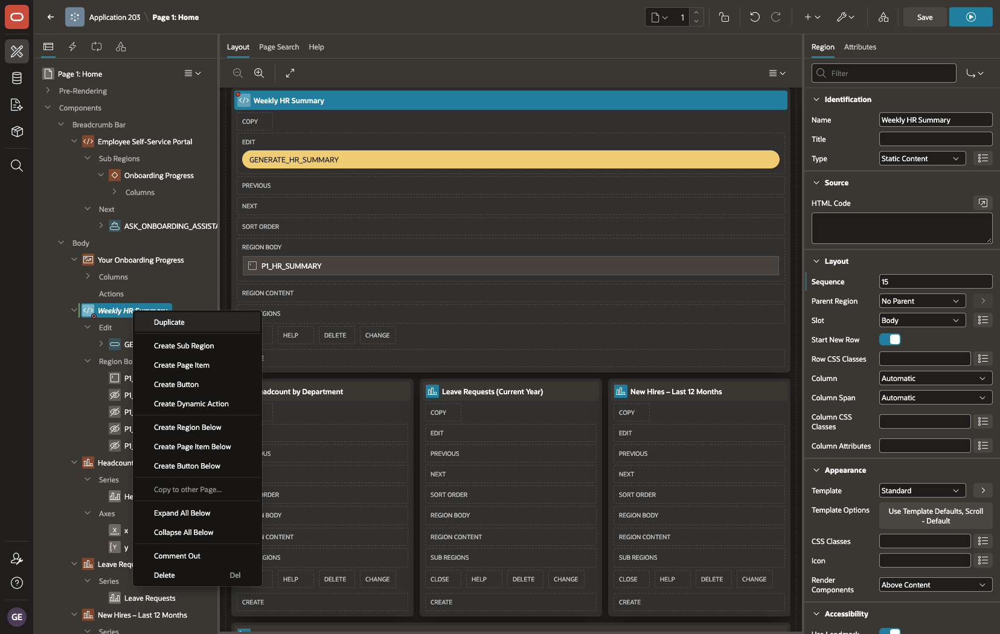

2. Configure the AI result item:

    | Property | Value |
    | --- | --- |
    | Identification > Name | `P1_HR_SUMMARY` |
    | Type | Textarea |
    | Label | `Weekly HR Summary` |
    | Read Only > Type | Always |
    | Appearance > Height | 5 |

    Copy **Identification > Name**:

    ```text
    <copy>
    P1_HR_SUMMARY
    </copy>
    ```

    Copy **Label**:

    ```text
    <copy>
    Weekly HR Summary
    </copy>
    ```

    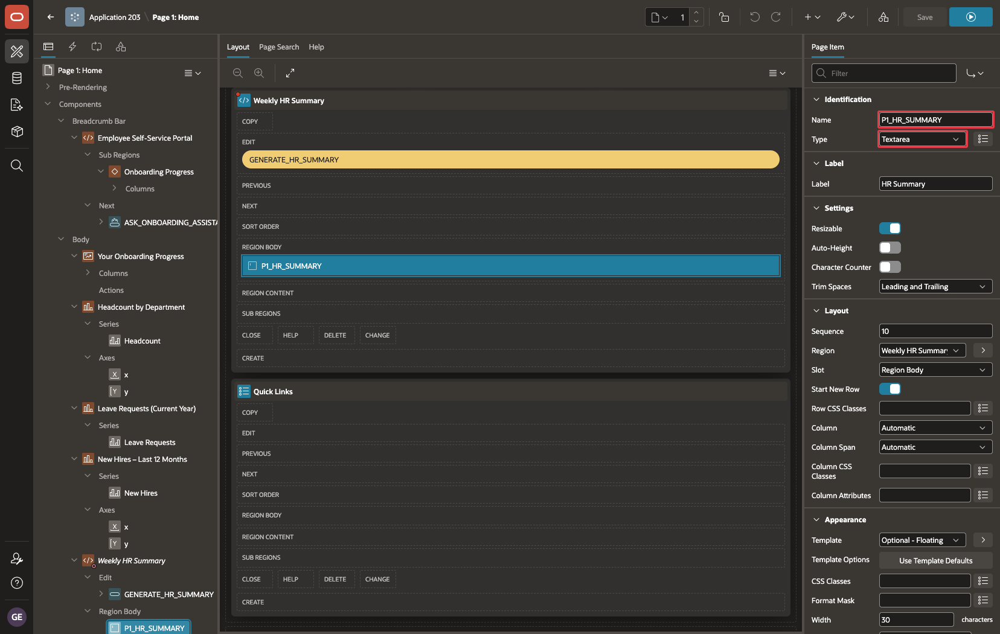

    Use the **Appearance > Height** field for the five-line height; there is no **Rows** property on this item in the supplied APEX version. Under **Read Only**, set **Type** to **Always**.

    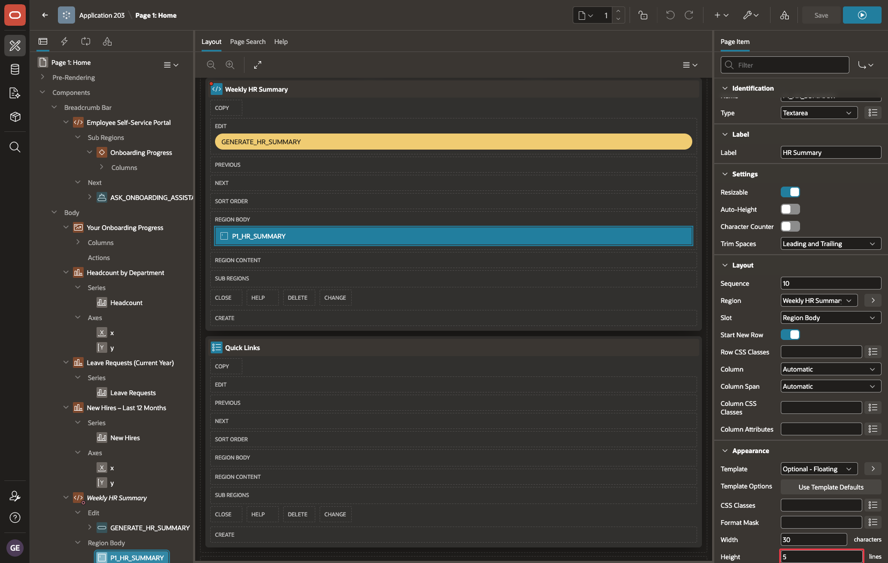

    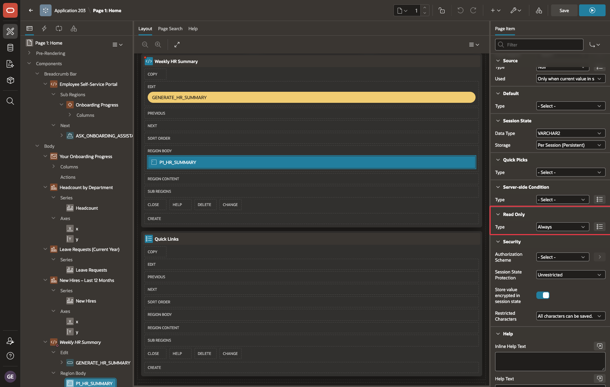

3. Create four more page items under the region. Set **Type** to **Hidden** and **Session State > Storage** to **Per Session (Persistent)** for each item. Keep **Settings > Value Protected** enabled. These values are calculated on the server and retained between the two action requests; they will not be submitted from the browser:

    | Item Name | Purpose |
    | --- | --- |
    | `P1_OPEN_REQS` | Number of open job requisitions |
    | `P1_NEW_CANDIDATES` | Candidates who applied during the current ISO week |
    | `P1_PENDING_OFFERS` | Offers pending approval |
    | `P1_LEAVE_REQUESTS` | Leave requests starting during the current ISO week |

    Copy **Item name**:

    ```text
    <copy>
    P1_OPEN_REQS
    </copy>
    ```

    Copy **Item name**:

    ```text
    <copy>
    P1_NEW_CANDIDATES
    </copy>
    ```

    Copy **Item name**:

    ```text
    <copy>
    P1_PENDING_OFFERS
    </copy>
    ```

    Copy **Item name**:

    ```text
    <copy>
    P1_LEAVE_REQUESTS
    </copy>
    ```

    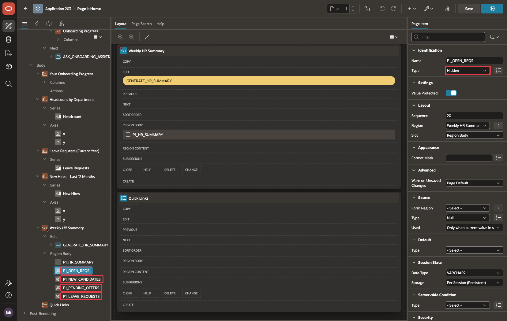

    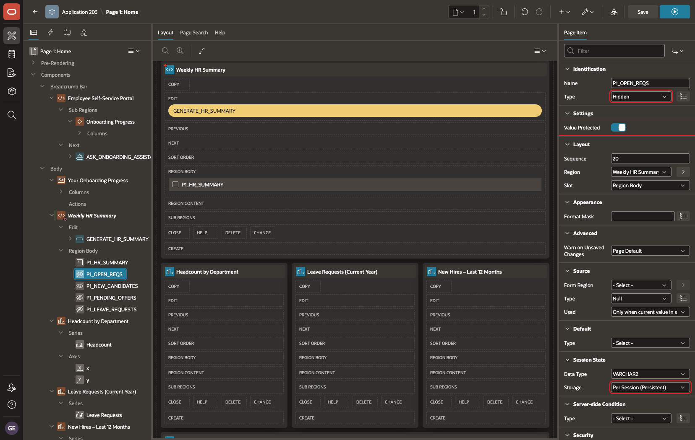

4. Save the page.

## Task 4: Add the Generate Weekly Summary Button

1. Right-click **Weekly HR Summary**, and select **Create Button**.

    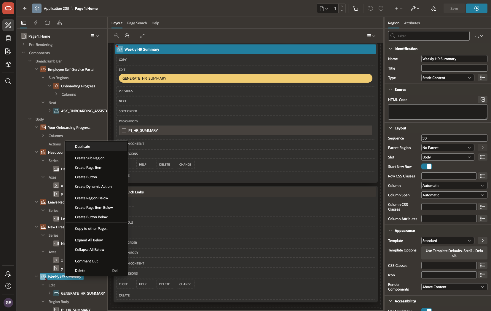

2. Configure the button:

    | Property | Value |
    | --- | --- |
    | Button Name | `GENERATE_HR_SUMMARY` |
    | Label | `Generate Weekly HR Summary` |
    | Appearance > Icon | `fa-sparkles` |
    | Appearance > Button Template | Text with Icon |
    | Layout > Slot | Edit |
    | Behavior > Action | Trigger Action |

    Copy **Button Name**:

    ```text
    <copy>
    GENERATE_HR_SUMMARY
    </copy>
    ```

    Copy **Label**:

    ```text
    <copy>
    Generate Weekly HR Summary
    </copy>
    ```

    Copy **Icon**:

    ```text
    <copy>
    fa-sparkles
    </copy>
    ```

    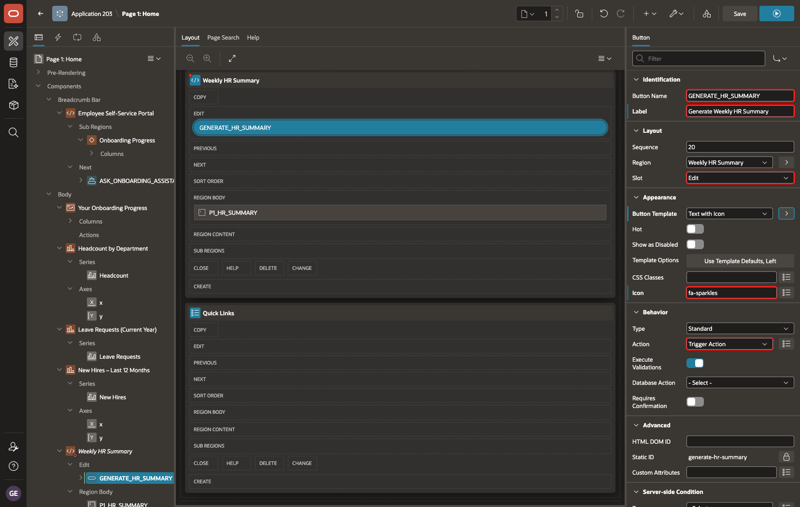

3. Verify the button in the Rendering tree.

4. Save the page.

## Task 5: Retrieve Current HR Metrics

1. Right-click **`GENERATE_HR_SUMMARY`** in the Rendering tree and select **Create Trigger Action**.

    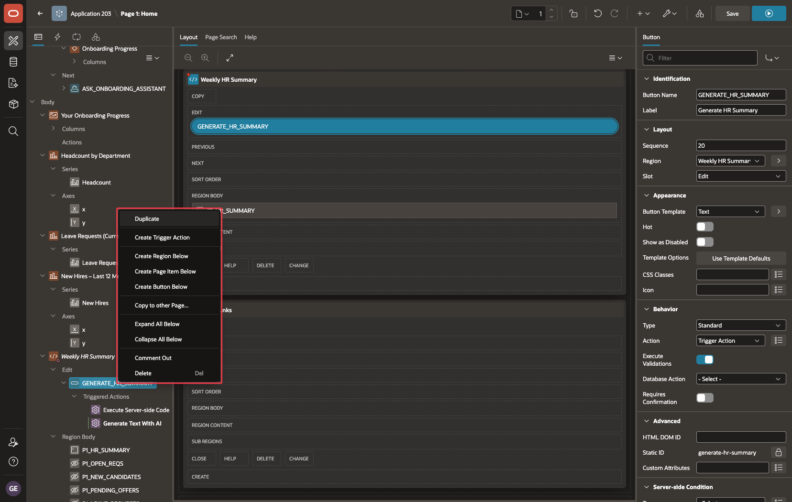

2. Select the new action under **`GENERATE_HR_SUMMARY` > Triggered Actions**.

3. Configure the action:

    | Property | Value |
    | --- | --- |
    | Name | `Execute Server-side Code` |
    | Action | Execute Server-side Code |

    ```text
    <copy>
    Execute Server-side Code
    </copy>
    ```

    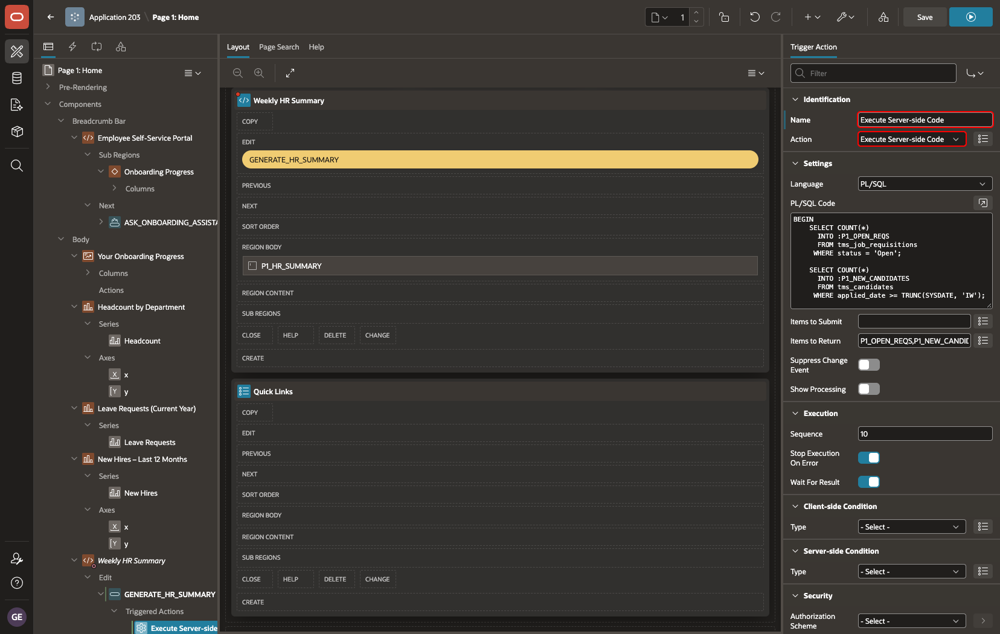

4. Under **Settings**, set **Language** to **PL/SQL** and enter the following in **PL/SQL Code**:

    ```plsql
    <copy>
    BEGIN
        SELECT COUNT(*)
          INTO :P1_OPEN_REQS
          FROM tms_job_requisitions
         WHERE status = 'Open';

        SELECT COUNT(*)
          INTO :P1_NEW_CANDIDATES
          FROM tms_candidates
         WHERE applied_date >= TRUNC(SYSDATE, 'IW')
           AND applied_date < TRUNC(SYSDATE, 'IW') + 7;

        SELECT COUNT(*)
          INTO :P1_PENDING_OFFERS
          FROM tms_offers
         WHERE status = 'Pending Approval';

        SELECT COUNT(*)
          INTO :P1_LEAVE_REQUESTS
          FROM tms_leave_requests
         WHERE start_date >= TRUNC(SYSDATE, 'IW')
           AND start_date < TRUNC(SYSDATE, 'IW') + 7;
    END;
    </copy>
    ```

    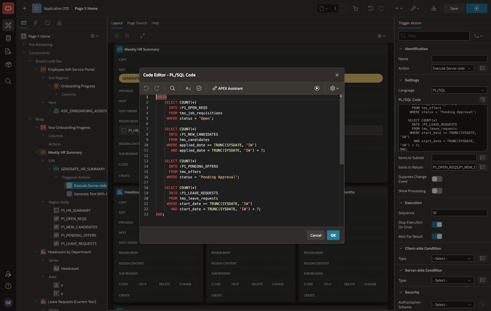

5. Leave **Items to Submit** and **Items to Return** empty. The PL/SQL assignments set the four items in server session state. Under **Execution**, set **Sequence** to `10`, and keep **Wait For Result** and **Stop Execution On Error** enabled. The next action must wait for these values to be stored before generating the summary.

    

6. Verify the action beneath the button.

    Confirm that both weekly date filters have a lower bound of `TRUNC(SYSDATE, 'IW')` and an upper bound of `TRUNC(SYSDATE, 'IW') + 7`. Confirm that the action has no items to submit or return.

## Task 6: Generate the HR Summary with AI

1. Right-click **`GENERATE_HR_SUMMARY`** and select **Create Trigger Action** again. Select the new action under **Triggered Actions**.

    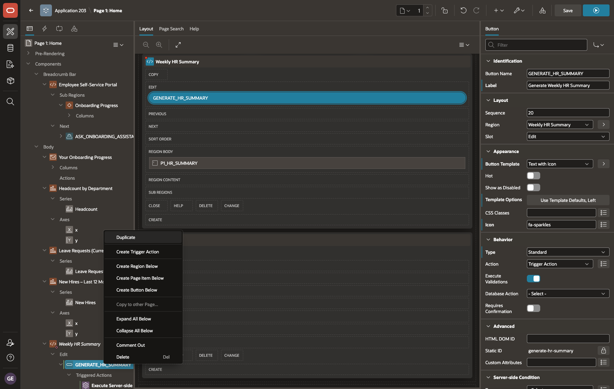

2. Configure the action:

    | Property | Value |
    | --- | --- |
    | Name | `Generate Text With AI` |
    | Action | Generate Text With AI |

    ```text
    <copy>
    Generate Text With AI
    </copy>
    ```

    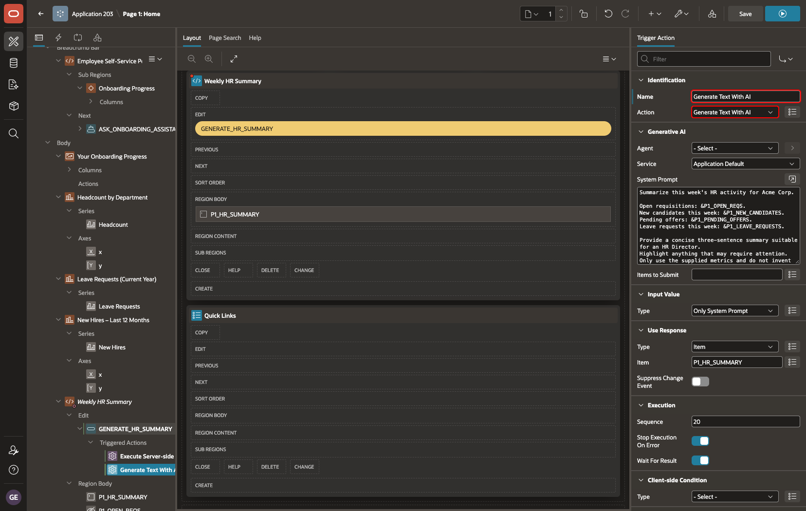

3. Under **Generative AI**, enter the following in **System Prompt**:

    ```text
    <copy>
    Summarize this week's HR activity for Acme Corp.

    Open requisitions: &P1_OPEN_REQS.
    New candidates this week: &P1_NEW_CANDIDATES.
    Pending offers: &P1_PENDING_OFFERS.
    Leave requests this week: &P1_LEAVE_REQUESTS.

    Provide a concise three-sentence summary suitable for an HR Director.
    Highlight anything that may require attention.
    Only use the supplied metrics and do not invent additional facts.
    </copy>
    ```

    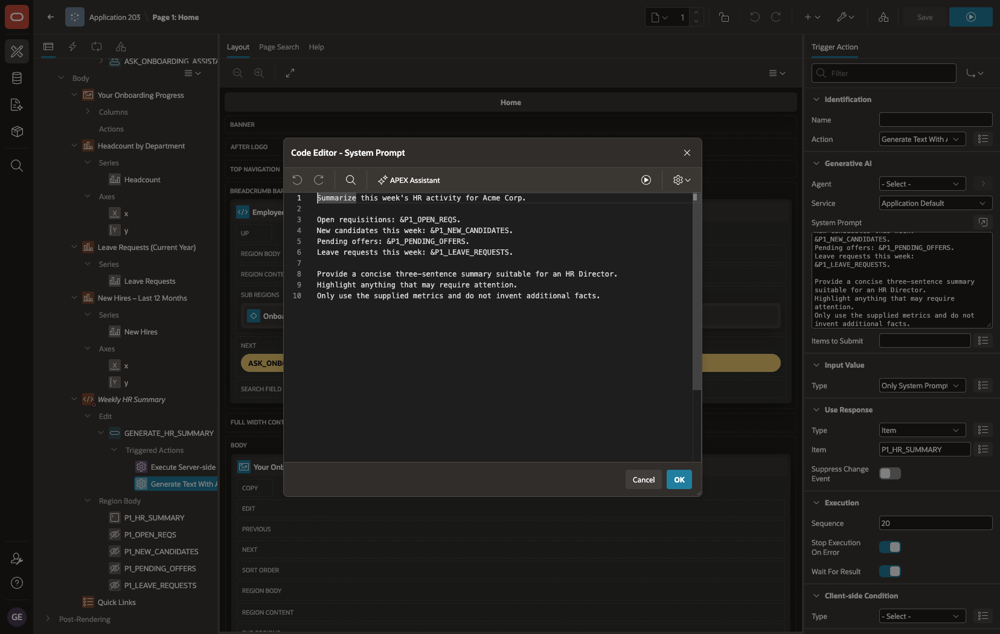

4. Under **Generative AI**, leave **Agent** unselected to use the configured application AI service. Leave **Items to Submit** empty. The item substitution strings, such as `&P1_OPEN_REQS.`, in the system prompt read the metrics already stored in server session state by Task 5. Do not return these protected hidden values to the browser and submit them again. Under **Input Value**, set **Type** to **Only System Prompt**. Under **Use Response**, set **Type** to **Item** and **Item** to `P1_HR_SUMMARY`.

    

5. Verify the action in the Rendering tree.

    Confirm that the response target is `P1_HR_SUMMARY` and that **Items to Submit** is empty.

6. Save the page.

## Task 7: Verify the Action Execution Order

1. Expand `GENERATE_HR_SUMMARY > Triggered Actions`.

2. Confirm that the actions appear in this order:

    ```text
    GENERATE_HR_SUMMARY
        ↓
    Execute Server-side Code
        ↓
    Populate P1_OPEN_REQS
             P1_NEW_CANDIDATES
             P1_PENDING_OFFERS
             P1_LEAVE_REQUESTS
        ↓
    Generate Text With AI
        ↓
    P1_HR_SUMMARY
    ```

3. Set **Execution > Sequence** to `10` for **Execute Server-side Code** and `20` for **Generate Text With AI**. The server action must complete before the AI action reads the metrics.

    Select each action to verify its sequence. For the server action, also confirm **Wait For Result** and **Stop Execution On Error** are enabled and **Items to Return** is empty.

    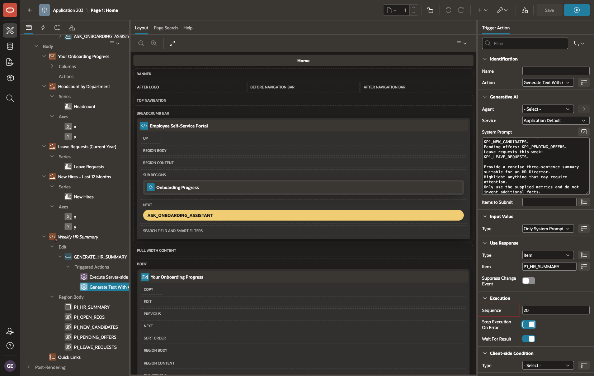

    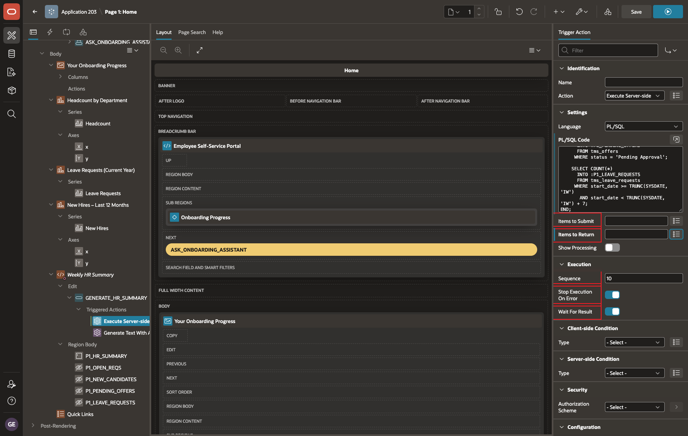

The order is required. The AI prompt reads the server session-state values stored by the first action. Persistent storage is required because the two actions run in separate requests.

## Task 8: Test the Weekly Summary as an HR Administrator

1. Run ESS and sign in as an HR Admin.

2. Open **Home**.

3. Confirm that **Weekly HR Summary** appears above the HR charts.

    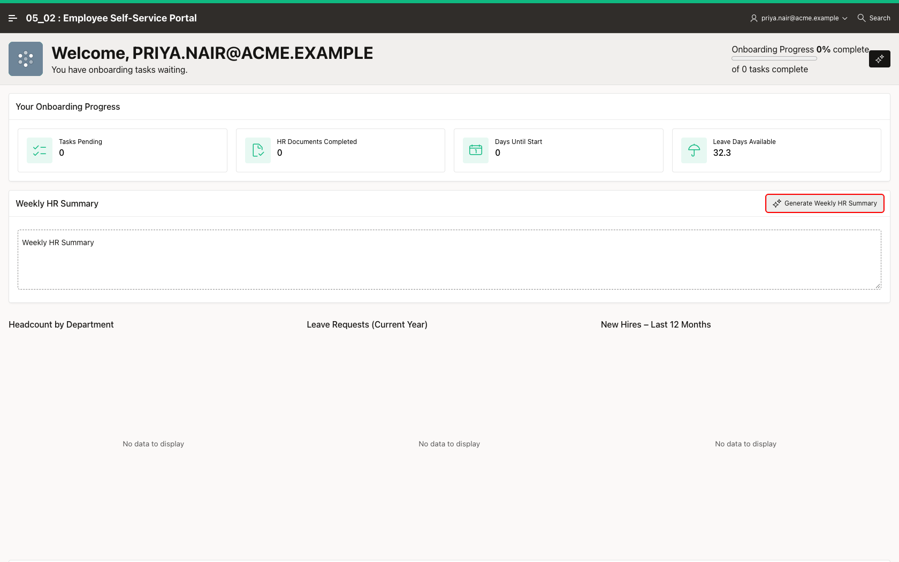

4. Click **Generate Weekly HR Summary**.

5. Wait for the Generative AI request to complete.

6. Verify that `P1_HR_SUMMARY` displays a concise three-sentence summary.

    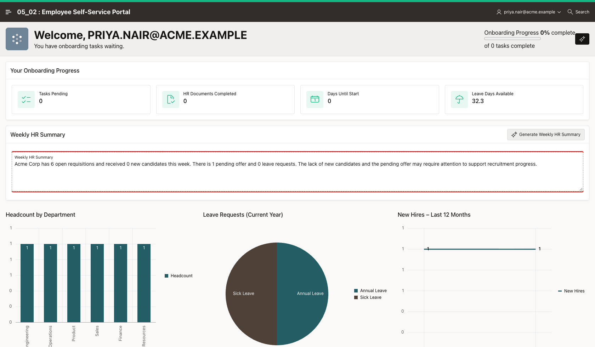

7. While running the application from App Builder, click **Session > View Session State** on the Developer Toolbar to inspect the four page-item values in session state. Compare each number in the summary with those values. The response must not introduce additional facts, causes, names, or forecasts.

    > **Note:** The leave metric counts requests **starting** this week, rather than requests submitted this week. Review the generated wording as well as the numbers; if the assistant changes that meaning, regenerate or correct the prompt before accepting the briefing.

    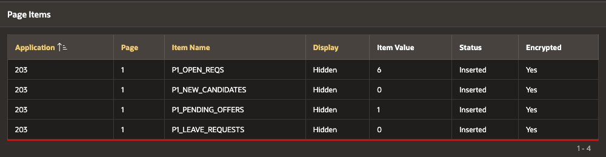

8. Sign in as a user who does not satisfy `IS_HR_ADMIN`, or ask another workshop participant to test that role.

9. Confirm that the complete **Weekly HR Summary** region is hidden.

    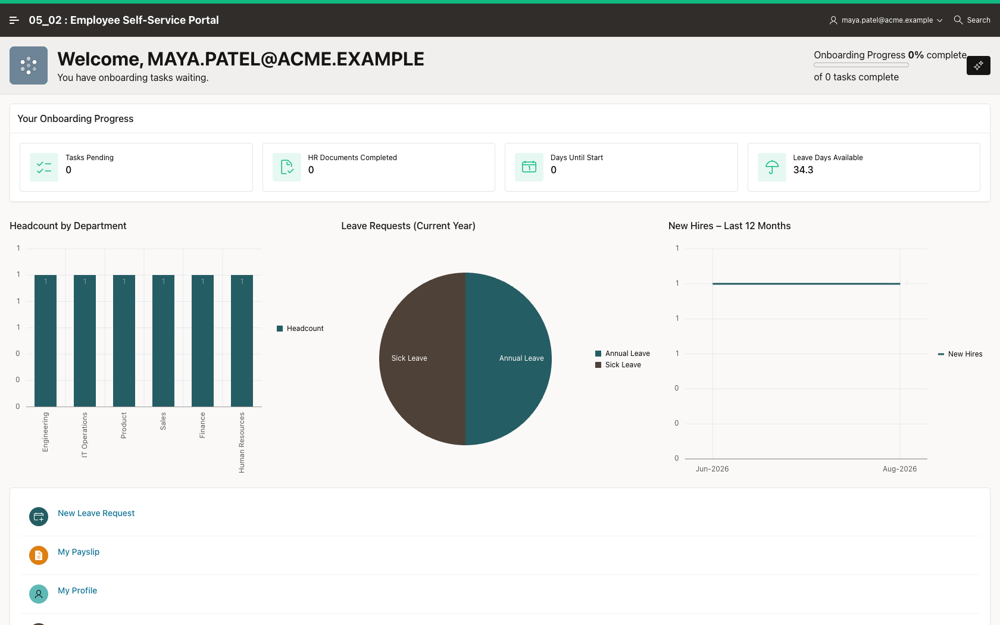

## Summary

You created an HR Admin-only weekly briefing that calculates current HR metrics and sends only those values to the AI service. You also verified the action sequence, generated result, and authorization behavior.

You may now **proceed to the next module**.

## Acknowledgements

- **Author** - Shanmukh Kornana
- **Last Updated By/Date** - Shanmukh Kornana, October 2026

## Learn More

- [Adding Interactivity to Pages](https://docs.oracle.com/en/database/oracle/apex/26.1/apxdc/adding-interactivity-pages.html)
- [Including Generative AI in Applications](https://docs.oracle.com/en/database/oracle/apex/26.1/htmdb/including-generative-ai-in-applications.html)
