# Add PWA Shortcuts and Screenshots

## Introduction

In this lab, you will add shortcuts for My Tasks, Apply for Leave, and My Payslip to the installed ESS application. You will also upload two mobile screenshots for supported installation prompts.

Estimated Time: 8 minutes

### Objectives

- Enable Rejoin Sessions for authenticated shortcut navigation in the lab environment.
- Create three shortcuts to existing ESS pages.
- Add two screenshots with the Narrow form factor.
- Test shortcut navigation from the installed application icon.

### Prerequisites

Complete Lab 1. Use a browser and device that support PWA shortcuts to complete Task 6.

The instance administrator must permit **Rejoin Sessions → Enabled for All Sessions** before this lab. In Administration Services, the administrator selects **Manage Instance → Security**, enables the setting, and clicks **Apply Changes**. Workspace developers cannot change this instance setting.

## Task 1: Configure Session Management for Shortcuts

1. In your workspace, open **Employee Self-Service Portal**. Click **Edit Application Definition** on the application home page.

    

2. Click the **Security** tab.

    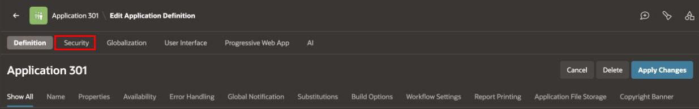

3. Click **Session Management**.

    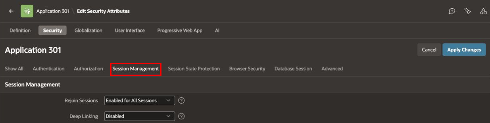

4. Set **Rejoin Sessions** to **Enabled for All Sessions**. If this value is rejected, ask your facilitator to complete the instance prerequisite before continuing.

    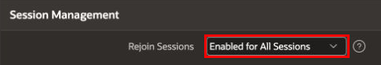

5. Set **Deep Linking** to **Enabled** so that a shortcut can open its requested page after the employee signs in.

    

6. Follow the numbered boxes: click **Browser Security** (1), set **Embed in Frames** to **Deny** (2), click **Apply Changes** (3), and then click the **Shared Components** icon (4).

    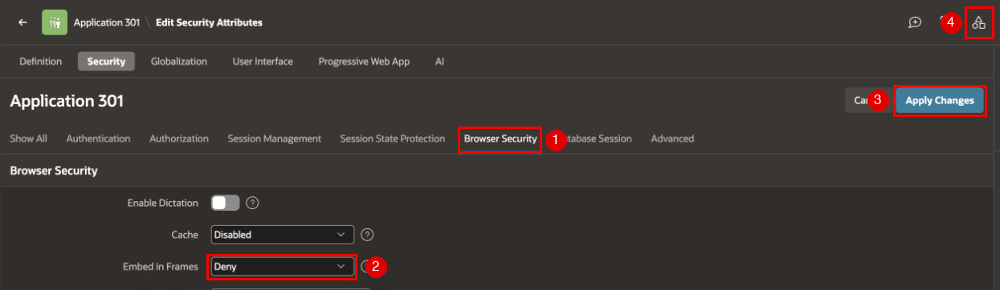

7. Under **User Interface**, click **Progressive Web App**. Click **Installability**, then locate **Shortcuts**.

    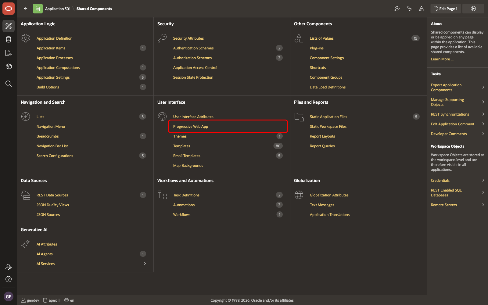

    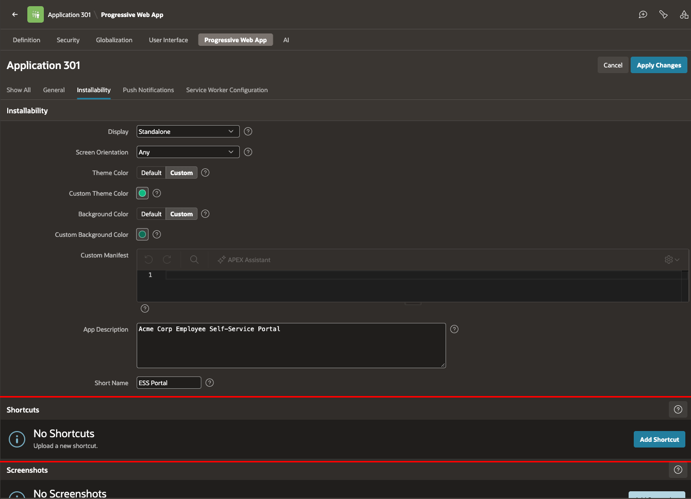

## Task 2: Add the My Tasks Shortcut

1. Click **Add Shortcut**.

    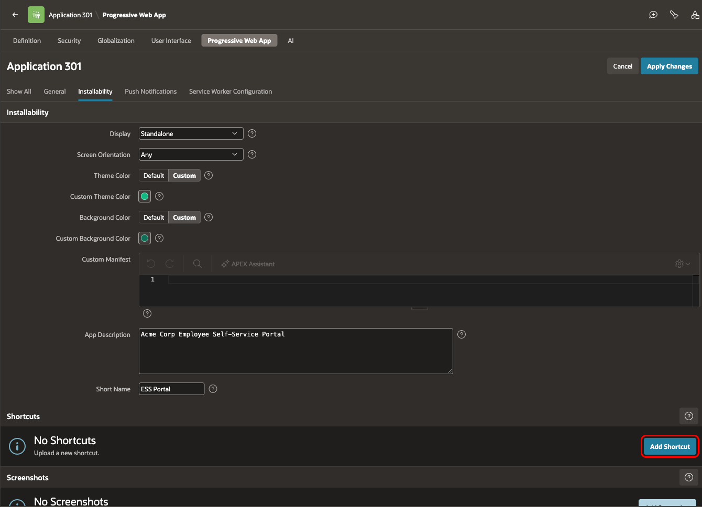

2. Enter:

    | Property | Value |
    | --- | --- |
    | Name | `My Tasks` |
    | Target URL | Select **2 — My Onboarding Tasks** in LOV |
    | Sequence | `10` |
    | Description | `View my onboarding tasks` |

    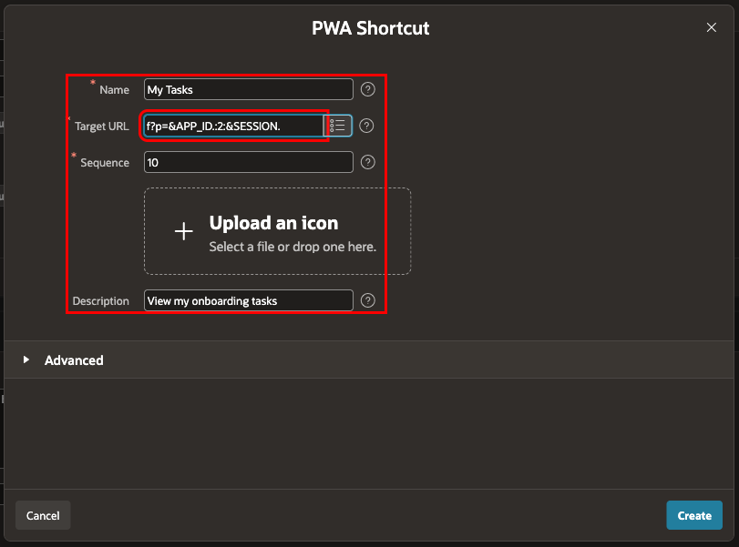

    Click the selection button beside **Target URL**. In the **Search** popup, type `My Onboarding Tasks`, click the magnifying-glass **Search** button, and select **2 My Onboarding Tasks**.

    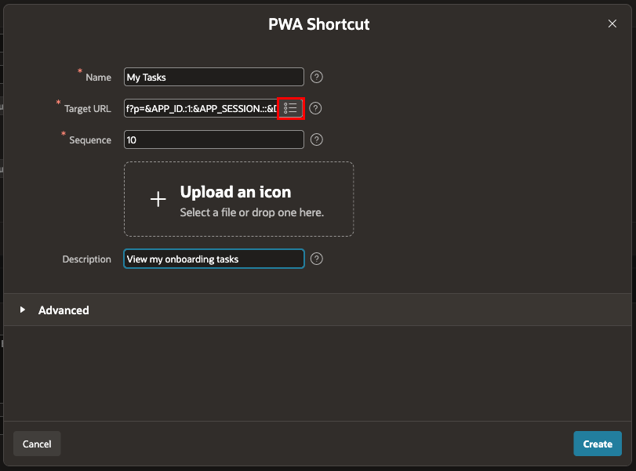

    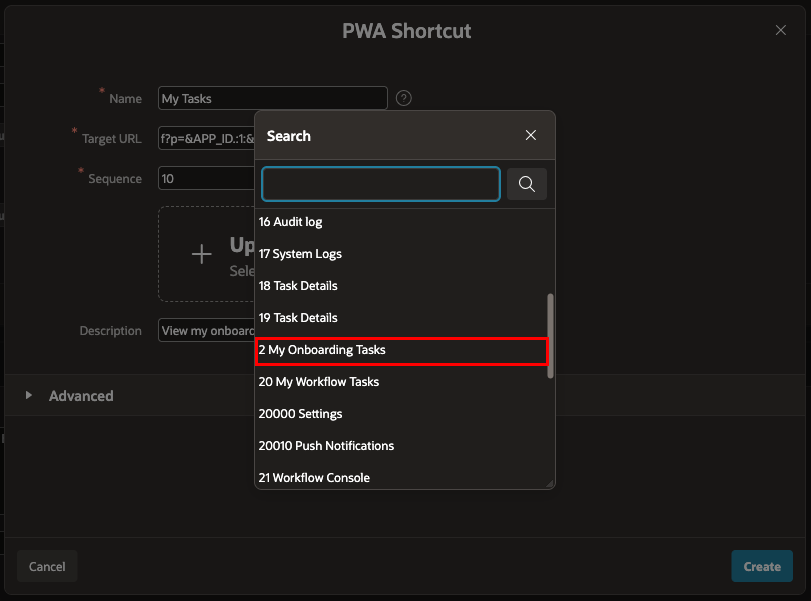

3. Click **Create**. Verify that the shortcut appears in **Shortcuts**.

    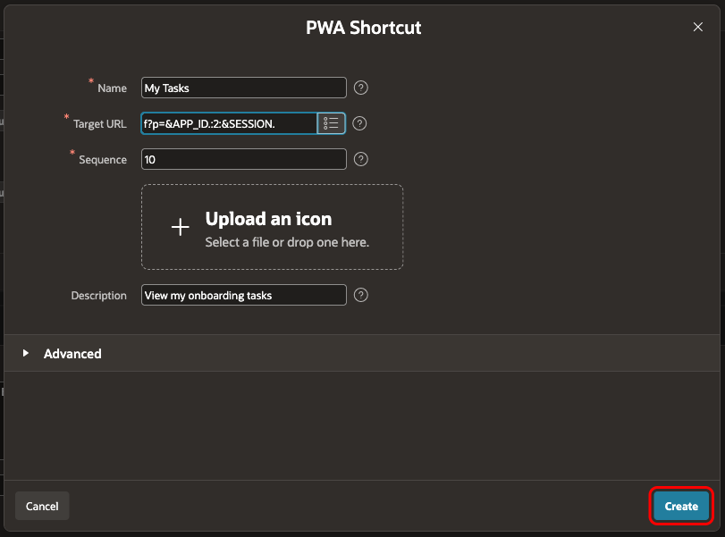

## Task 3: Add the Apply for Leave Shortcut

1. Click **Add Shortcut** again.

    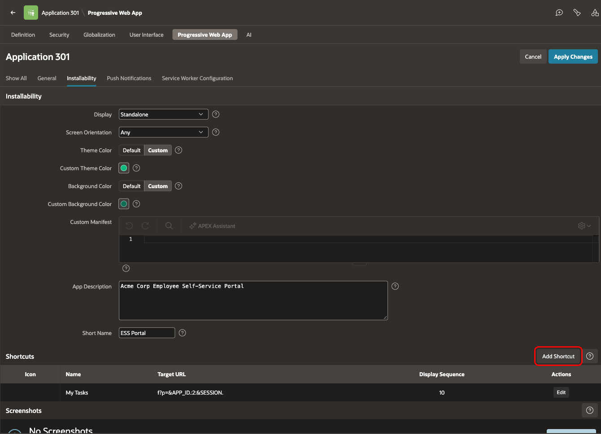

2. Configure:

    | Property | Value |
    | --- | --- |
    | Name | `Apply for Leave` |
    | Target URL | Select **5 — Leave Request** in LOV |
    | Sequence | `20` |
    | Description | `Submit a leave request` |

    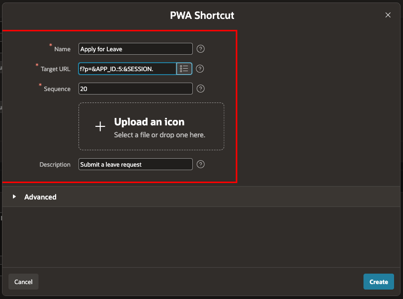

    Click the selection button beside **Target URL**. In the **Search** popup, type `Leave Request`, click the magnifying-glass **Search** button, and select **5 Leave Request**.

    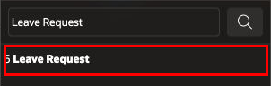

3. Click **Create**.

    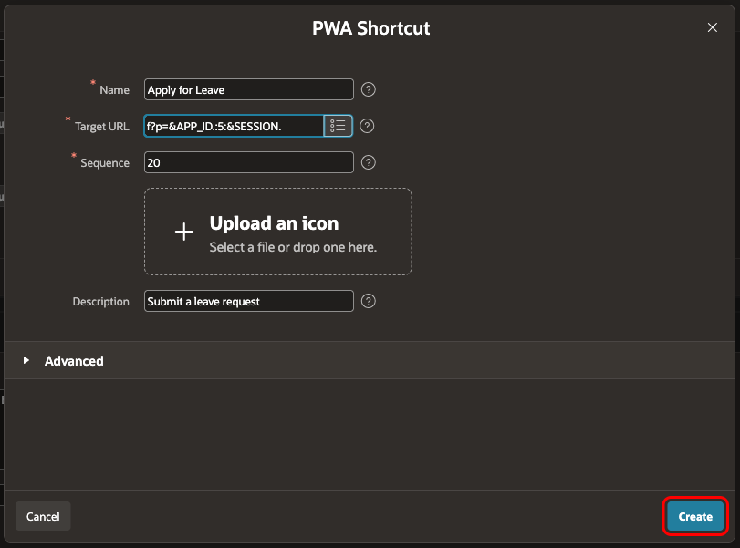

## Task 4: Add the My Payslip Shortcut

1. Click **Add Shortcut**.

    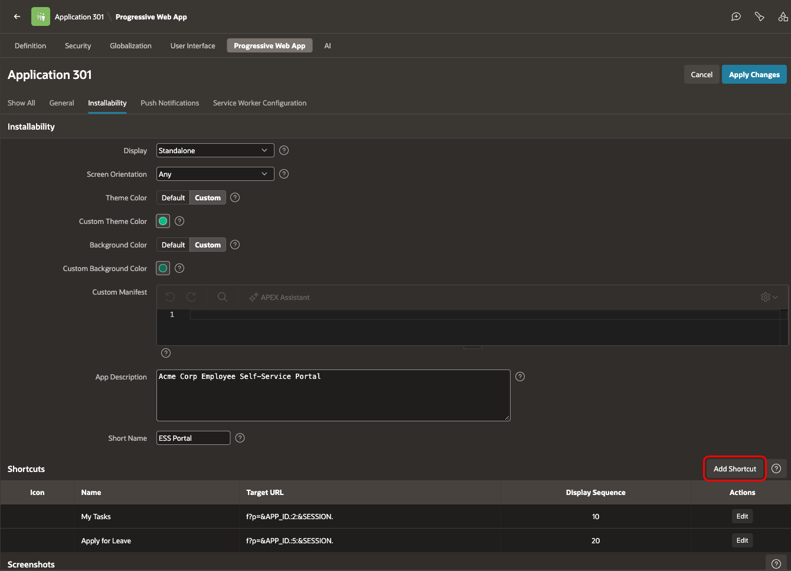

2. Configure:

    | Property | Value |
    | --- | --- |
    | Name | `My Payslip` |
    | Target URL | Select **6 — My Payslip** in LOV |
    | Sequence | `30` |
    | Description | `View my payslip` |

    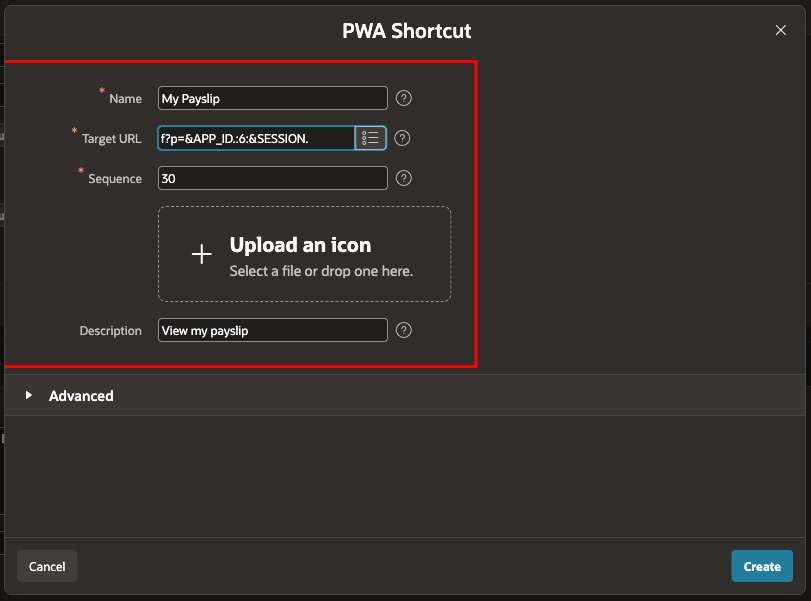

    Click the selection button beside **Target URL**. In the **Search** popup, type `My Payslip`, click the magnifying-glass **Search** button, and select **6 My Payslip**.

    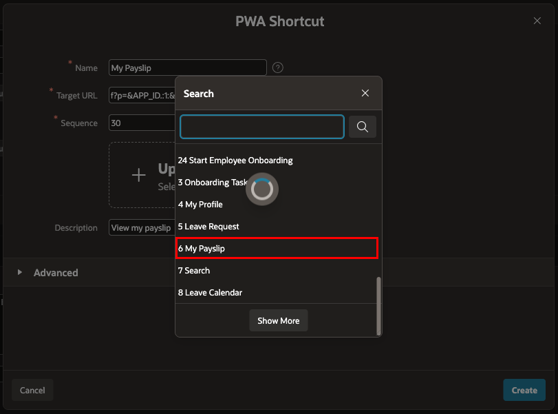

3. Click **Create**. Verify that the three shortcuts appear in sequence order: **My Tasks**, **Apply for Leave**, **My Payslip**.

    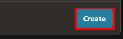

    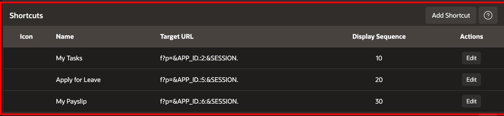

## Task 5: Add PWA Installation Screenshots

1. Run **Employee Self-Service Portal** from App Builder and sign in as the employee. Open **Home**. In Chrome, right-click the application and click **Inspect**. Click **Toggle device toolbar**, select **Responsive**, and set the width to **390** and height to **844**.

    

    

    On the device toolbar, click **More options → Add device pixel ratio** to show the **DPR** control, then set **DPR** to **1**. This makes the screenshot dimensions match the viewport dimensions.

    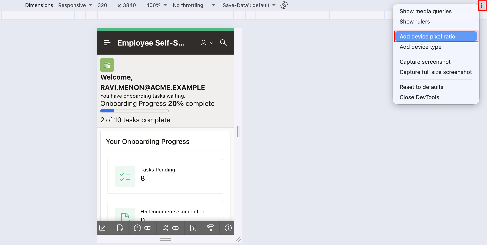

2. With **Home** open, click **More options** (the three dots on the device toolbar) and select **Capture screenshot**. Rename the downloaded PNG to `ess-home-narrow.png`. Use **Capture screenshot**, which captures the current viewport, rather than **Capture full size screenshot**.

    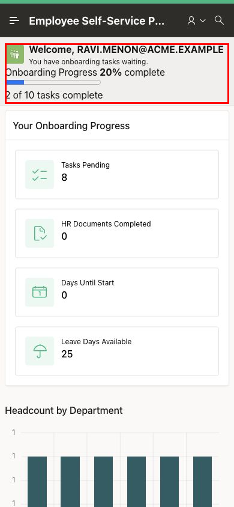

3. Click **Main Navigation**, click the arrow beside **My Work**, and click **My Onboarding Tasks**. Keep the viewport at **390 × 844** and repeat **Capture screenshot**. Rename the file to `ess-my-tasks-narrow.png`.

    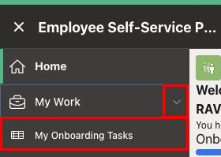

    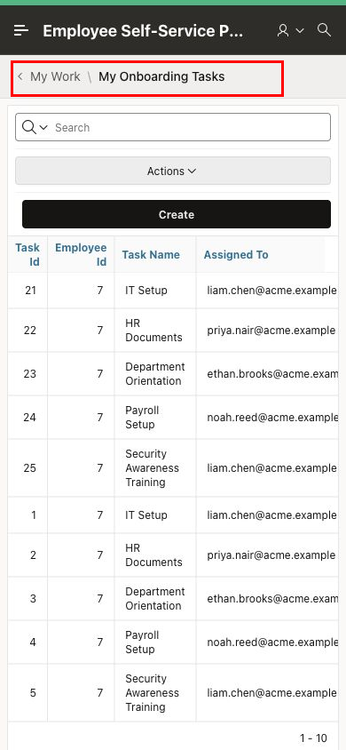

    Both images must have the same aspect ratio. Each dimension must be between **320 and 3840 pixels**; PNG, JPG, and JPEG are supported. Exclude browser tabs, Developer Tools, desktop folders, and loading indicators from the uploaded images.

    You can also download the prepared [ESS Home screenshot](files/ess-home-narrow.png) and [My Tasks screenshot](files/ess-my-tasks-narrow.png). Open each link, right-click the image, select **Save image as…**, and keep the supplied filename. Both files are **390 × 844 pixels**. These runtime files are separate from the annotated App Builder screenshots in this lab.

4. Return to **Progressive Web App** and locate **Screenshots** under **Installability**.

    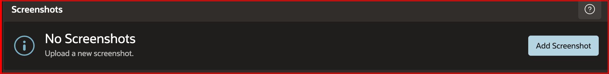

5. Click **Add Screenshot** and configure the following values. Click **Upload a Screenshot**, choose `ess-home-narrow.png`, and click **Open** in the file picker. Click **Create**.

    | Property | Value |
    | --- | --- |
    | Description | `ESS Home` |
    | Upload a Screenshot | `ess-home-narrow.png` |
    | Form Factor | Narrow |
    | Sequence | `10` |

    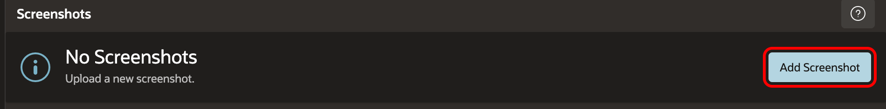

    

6. Click **Add Screenshot**, upload `ess-my-tasks-narrow.png`, and configure the following values. Click **Create**.

    | Property | Value |
    | --- | --- |
    | Description | `My Tasks` |
    | Upload a Screenshot | `ess-my-tasks-narrow.png` |
    | Form Factor | Narrow |
    | Sequence | `20` |

    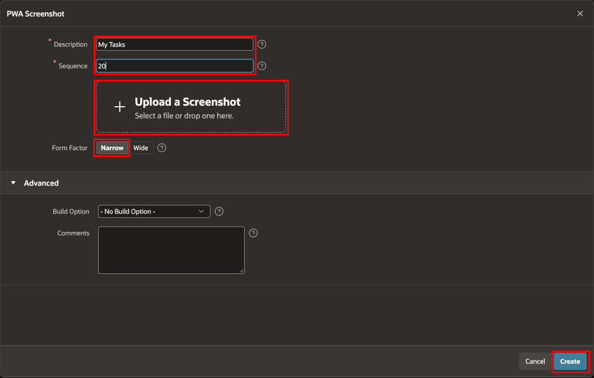

7. Click **Apply Changes** to save remaining application settings.

    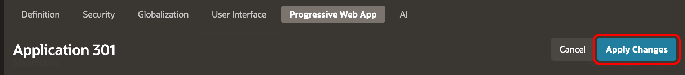

## Task 6: Test the Installed Shortcuts

1. Close and reopen the installed ESS application to allow its browser to refresh the application metadata.

    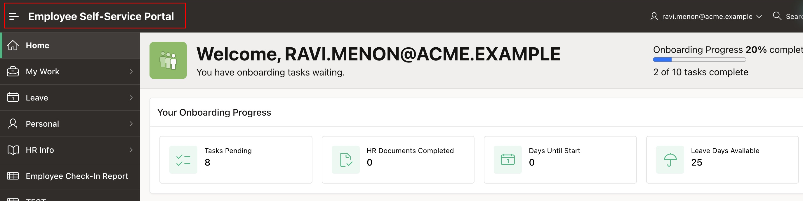

2. On a device that supports PWA shortcuts, long-press the installed **Employee Self-Service Portal** icon on the home screen, or right-click its icon in the desktop taskbar or application launcher. Use the installed application's shortcut menu, rather than a downloaded file's context menu. Shortcut support varies by browser and operating system; use the supported test device supplied by your facilitator if your device does not show this menu.

3. Verify that **My Tasks**, **Apply for Leave**, and **My Payslip** appear in the shortcut menu.

4. Open **My Tasks** and verify that **My Onboarding Tasks** appears. For the other pages, open **Main Navigation**, expand **Leave**, and click **Leave Request**. Then expand **Personal** and click **My Payslip**. Sign in as the employee when prompted. Verify the page heading for each destination, rather than accepting a return to **Home**.

    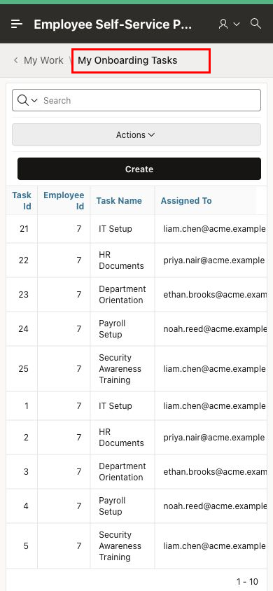

    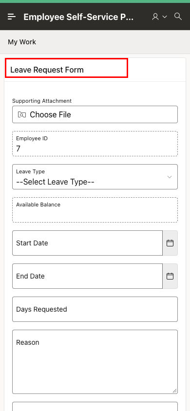

    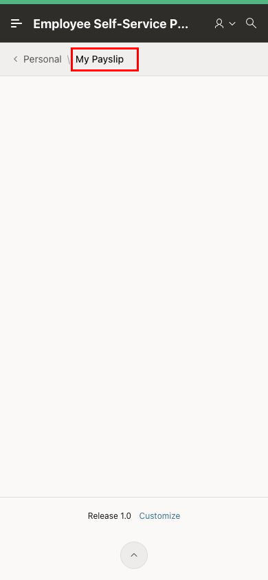

5. On a browser that displays PWA installation screenshots, open the installation prompt and verify the **ESS Home** and **My Tasks** images. If ESS is already installed, use a separate supported test device or browser profile for this check. A browser that omits promotional screenshots cannot verify this part of the lab.

## Summary

In this lab, you configured session management for shortcut navigation, added three shortcuts to existing employee pages, and uploaded two Narrow screenshots with matching dimensions. You also checked shortcut destinations with an existing session and after employee sign-in.

You may now proceed to the next lab.

## Learn More

- [Creating a Progressive Web App](https://docs.oracle.com/en/database/oracle/apex/26.1/htmdb/creating-a-progressive-web-app.html)
- [Configuring Security Attributes](https://docs.oracle.com/en/database/oracle/apex/26.1/htmdb/configuring-security-attributes.html)

## Acknowledgements

- **Author** - Shanmukh Kornana
- **Last Updated By/Date** - Shanmukh Kornana, October 2026
