# Enable Push Notifications for Overdue Onboarding Tasks

## Introduction

In this lab, you will enable push notifications in Employee Self-Service Portal (ESS), subscribe an employee's device, and add a **Send Push Notification** action to the existing **Task Overdue** automation.

Estimated Time: 12 minutes

### Objectives

- Enable push notifications and configure credentials.
- Create the notification settings pages and subscribe a device.
- Address each notification to the employee identified by the automation query.
- Review the execution log and verify receipt on the subscribed device.

### Prerequisites

- Have the **Task Overdue** automation created in Module 16 and an employee account for ESS.
- Use a device and browser that support web push. Open ESS over HTTPS; install it if required by the device.
- Ensure the instance's email configuration supports the automation's existing **Send E-Mail** action. An error in that action can stop execution before the push action runs.

## Task 1: Enable Push Notifications

1. In your workspace, open **Employee Self-Service Portal**. Click the **Shared Components** icon on the Application home page.

    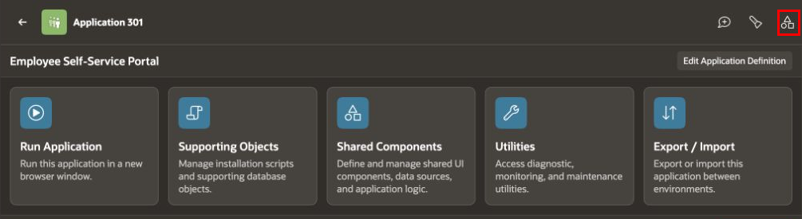

2. Under **User Interface**, click **Progressive Web App**.

    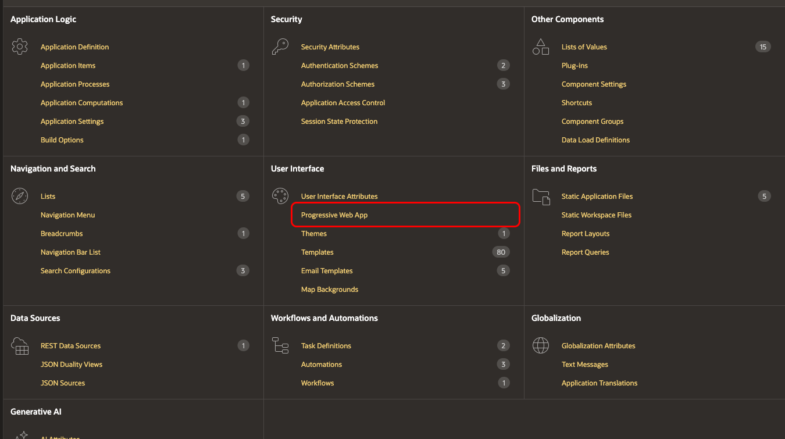

3. Click **Push Notifications**. Set **Enable Push Notifications** to **On**.

    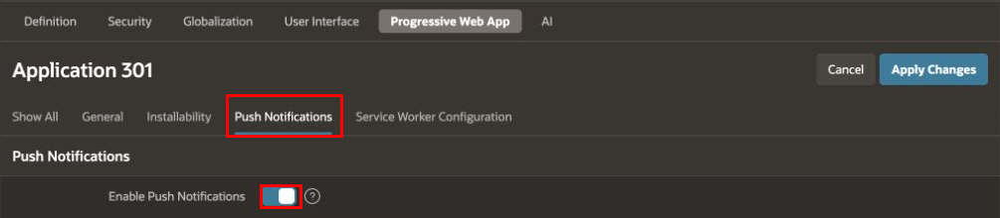

## Task 2: Configure Push Notification Credentials

1. Under **Credentials**, click **Generate Credentials** to create a public/private key pair. Regenerating the keys requires users to subscribe again.

    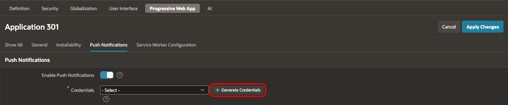

2. In the confirmation dialog, click **Generate Credentials**.

    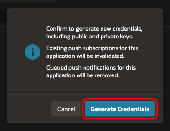

3. Verify that the generated credential is selected in **Credentials**. In **Contact Email**, you can enter the application owner's email address for the push service provider to use if it needs to contact the owner.

    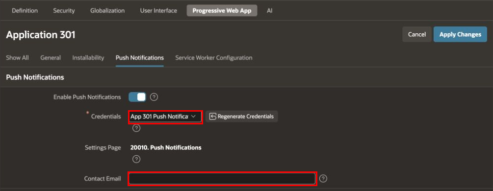

## Task 3: Add the Push Notification Settings Pages

1. Next to **Settings Page**, click **Add Settings Page**. If a settings page is already selected, continue to Step 3.

    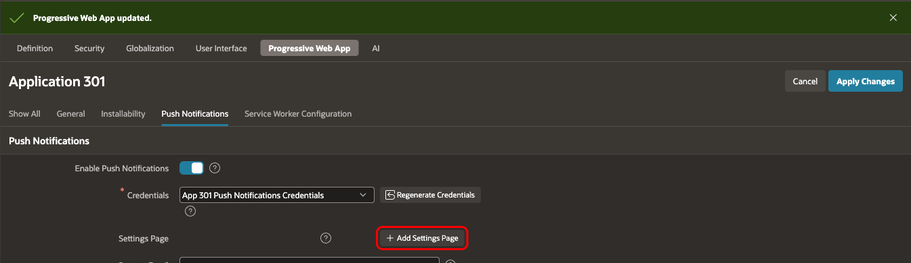

2. In **Create Push Notification Settings Page**, configure the following values, then click **Create**. Use unused page numbers if these numbers are already assigned to other pages.

    | Section | Property | Value |
    | --- | --- | --- |
    | User Settings Page | Page Source | Create a new page |
    | User Settings Page | Page Number | `20000` |
    | Push Notifications Settings Page | Page Number | `20010` |

    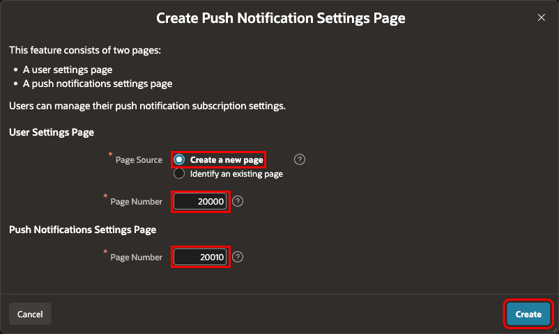

3. Verify that **Settings Page** shows **20010. Push Notifications**, or the page number you selected. Click **Apply Changes**.

    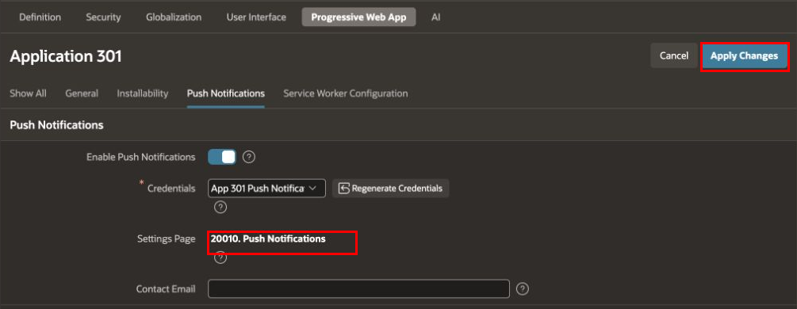

## Task 4: Subscribe the Employee's Device

1. Return to the Application home page by clicking **Application 301** in the breadcrumb. Click **Run Application**. Use the device on which you want to receive notifications.

    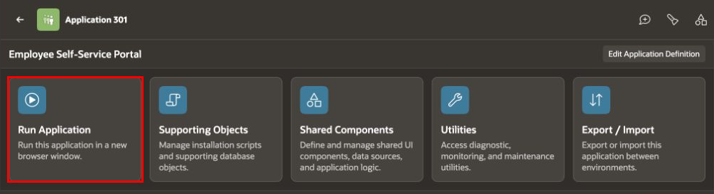

2. Enter the employee username and password, then click **Sign In**. The authenticated username, represented by `APP_USER`, identifies the notification recipient.

    

3. Click the employee account menu in the application header, then click **Settings**.

    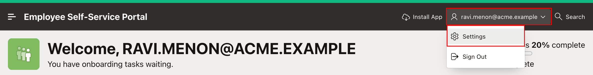

4. In **Settings**, click **Push Notifications**.

    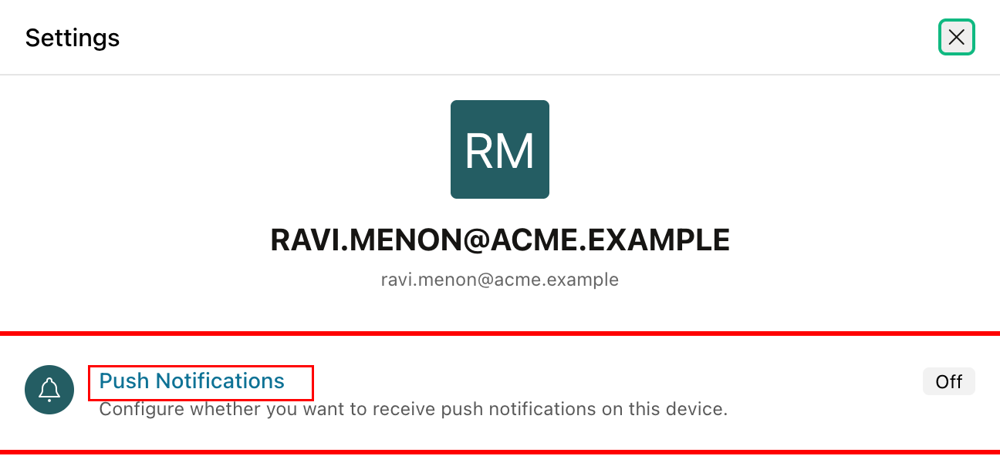

5. Select **Enable push notifications on this device**. When the browser requests notification permission, click **Allow**.

    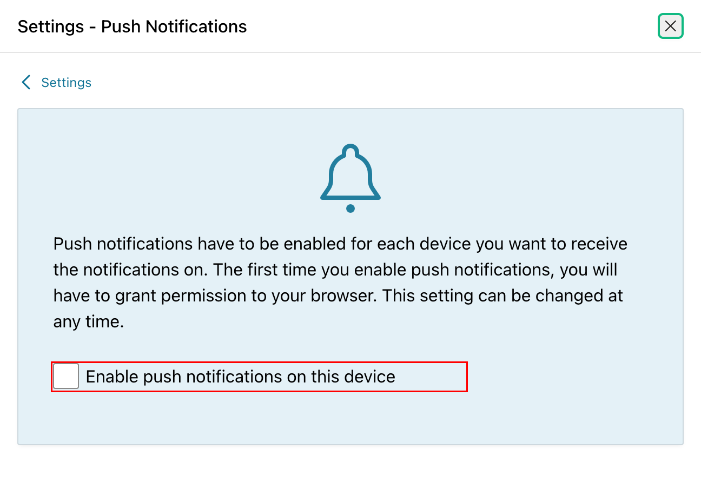

    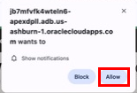

6. Verify that **Enable push notifications on this device** is selected. Keep the device connected for the notification test. Each receiving device must be subscribed separately.

    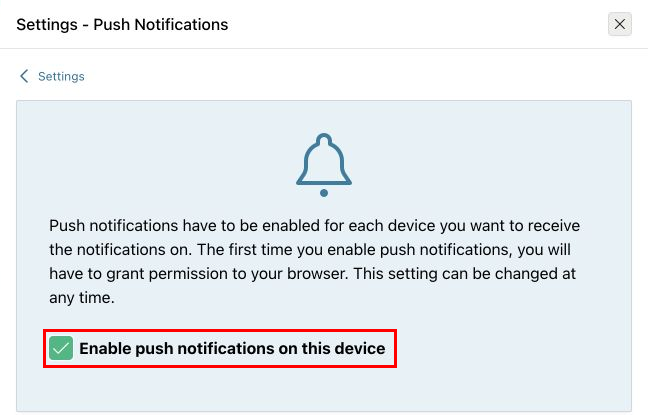

## Task 5: Review the Existing Overdue Task Automation

1. Return to ESS in App Builder. Click the **Shared Components** icon.

    

2. Under **Workflows and Automations**, click **Automations**.

    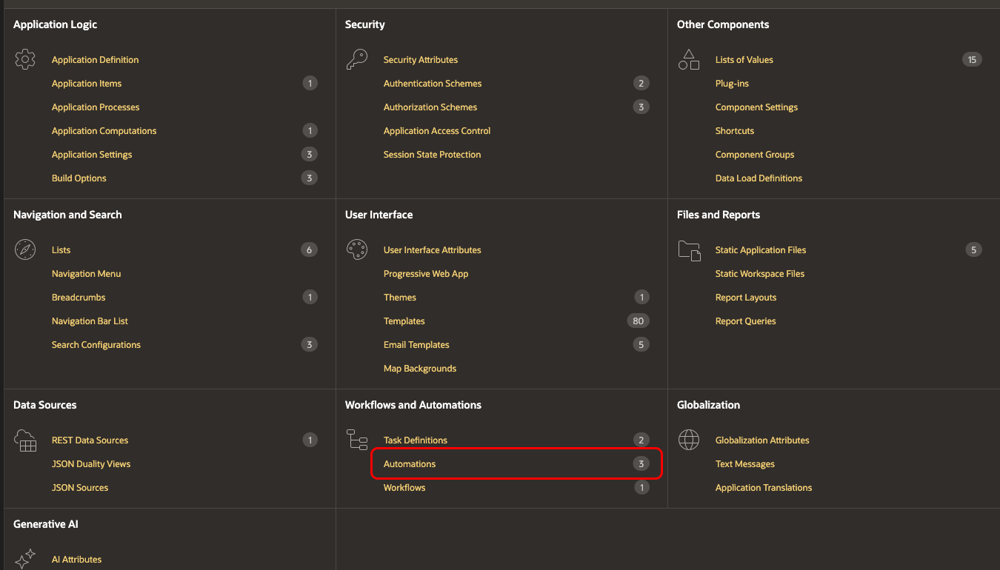

3. Click **Task Overdue**.

    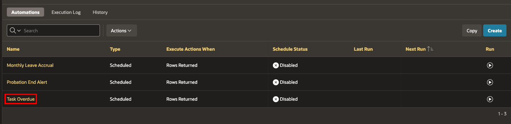

4. Click **Settings**. Verify that **Actions Initiated On** is **Query**.

    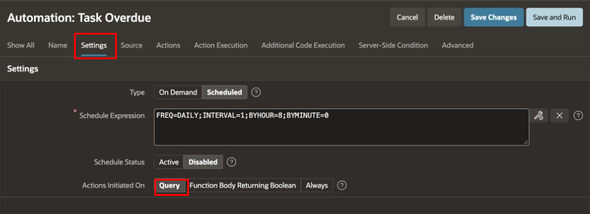

5. Click **Source**. Review the SQL query and confirm that it returns these columns. Preserve the other columns and conditions used by the existing actions.

    | Result column | Purpose |
    | --- | --- |
    | `EMPLOYEE_EMAIL` | ESS username receiving the notification |
    | `TASK_NAME` | Task name in the notification title |
    | `DUE_DATE` | Due date of the selected task |
    | `TASK_ID` | Task identifier used by the status update action |

    In the course schema, employee email comes from `TMS_EMPLOYEES.EMAIL`. Its value must match the authenticated ESS username. ESS shows the employee username in uppercase, so use `UPPER(e.email) AS employee_email` for that result column. Preserve the query's other columns and conditions. Use the recipient from each query row; the automation has no interactive employee session from which to obtain the recipient.

    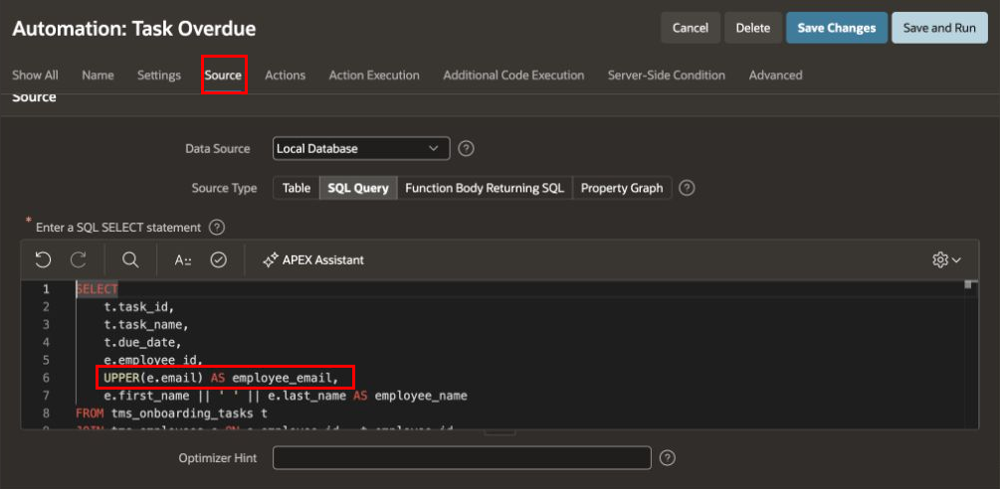

6. Click **Action Execution**. Verify that **Execute Actions When** is **Rows returned**.

    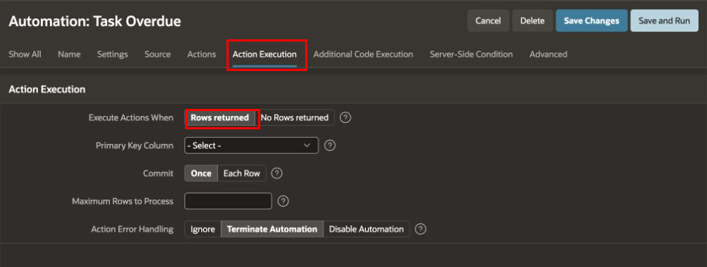

## Task 6: Add the Send Push Notification Action

1. Click **Actions**, then **Add Action**.

    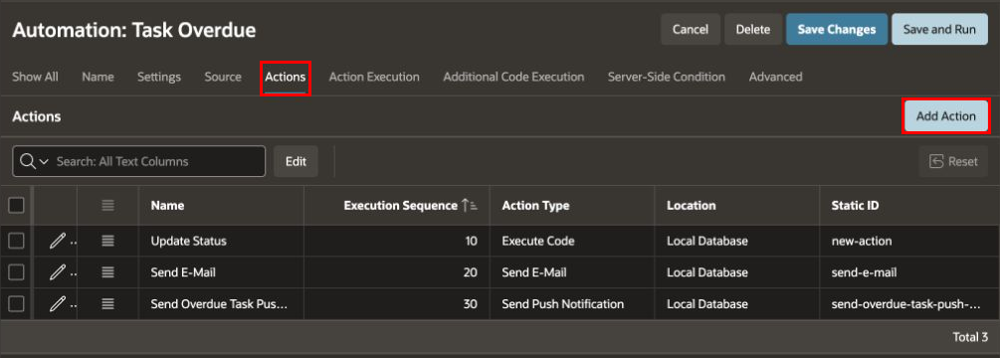

2. On **Edit Action**, configure the following values, then click **Create**. Execution sequence `30` places the push action after **Update Status** (`10`) and **Send E-Mail** (`20`).

    | Property | Value |
    | --- | --- |
    | Name | `Send Overdue Task Push Notification` |
    | Type | Send Push Notification |
    | Execution Sequence | `30` |
    | To | `&EMPLOYEE_EMAIL.` |
    | Title | `Overdue Task: &TASK_NAME.` |
    | Body | `This task is overdue. Please complete it today.` |

    Keep the final period in each substitution string. APEX replaces the strings with values from the current query row. Leave **Link Target** at its default to open ESS when the employee clicks the notification.

    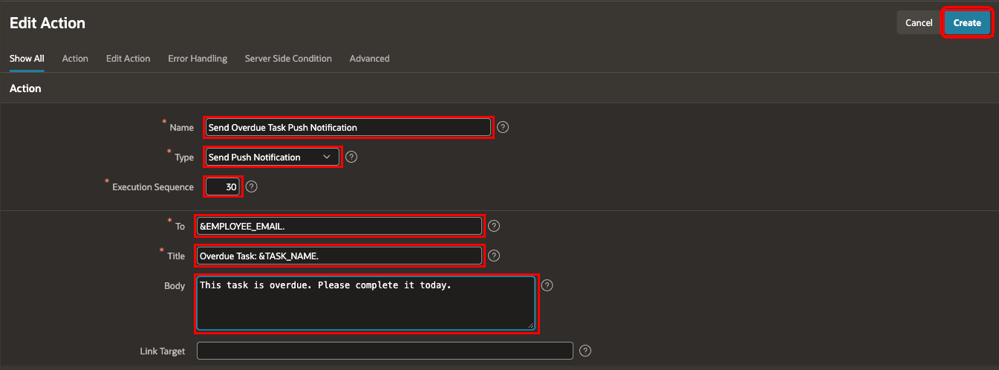

3. Verify that **Send Overdue Task Push Notification** appears after the existing actions. Click **Save Changes**.

    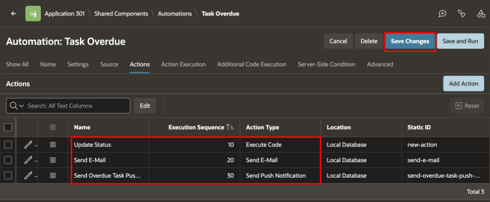

## Task 7: Test the Automation and Verify Delivery

1. Before running the automation, review the tasks selected by its query. Open **SQL Workshop → SQL Commands** and run the following read-only query. Use the same conditions as the automation if your Module 16 query differs.

    ```sql
    <copy>
    SELECT t.task_id,
           t.task_name,
           t.due_date,
           UPPER(e.email) AS employee_email
      FROM tms_onboarding_tasks t
      JOIN tms_employees e ON e.employee_id = t.employee_id
     WHERE t.due_date < TRUNC(SYSDATE)
       AND t.status NOT IN ('Completed', 'Cancelled', 'Overdue')
     ORDER BY e.email, t.task_id;
    </copy>
    ```

2. Return to **App Builder → Employee Self-Service Portal → Shared Components → Automations → Task Overdue**. Click **Save and Run** to execute the automation in the background. Keep its existing schedule configuration for this manual test.

    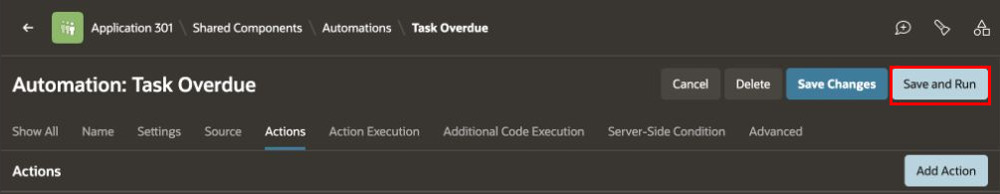

3. Click **Automations** in the breadcrumb, then **Execution Log**. Locate the latest run with **Automation Static ID** `task-overdue`. Verify **Status** is **Success**, **Successful Rows** is greater than zero, and **Error Rows** is `0`. The number of successful rows depends on the eligible tasks in your workspace.

    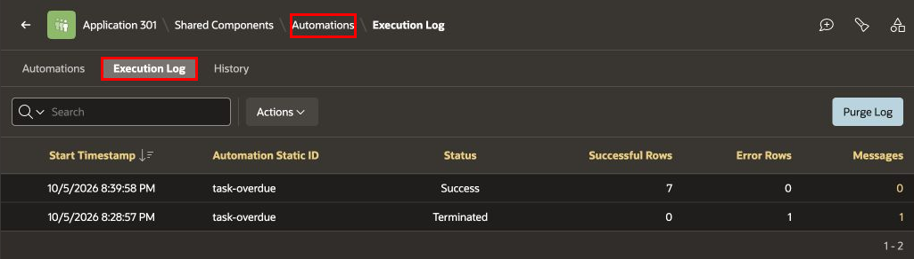

    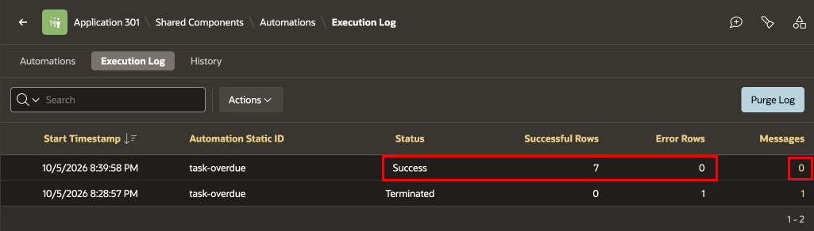

4. Click the number in the run's **Messages** column to open **Log Messages**. Review any messages. If no messages were logged, the page shows **No detail messages available for this execution.** A successful execution does not confirm that the device received the notification.

    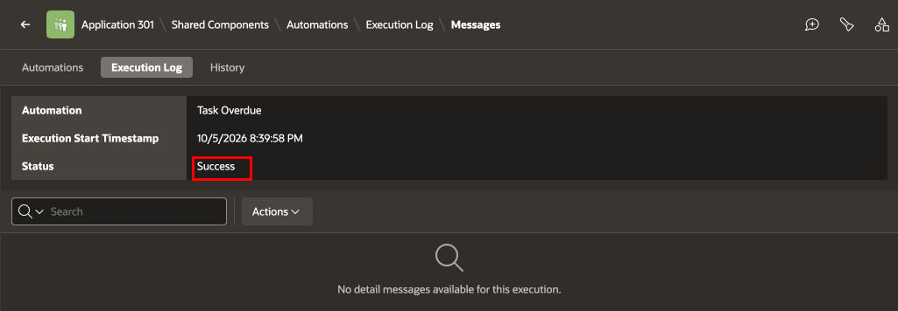

5. On the subscribed device, verify that a notification appears with the following title and body. Confirm that the task name matches a task selected for this employee.

    ```text
    Overdue Task: <Task Name>
    This task is overdue. Please complete it today.
    ```

6. Click the notification and verify that ESS opens. Sign in if prompted. Open **My Work → My Onboarding Tasks** from the application navigation menu and confirm that the notified task has **Overdue** status.

## Summary

You configured push notifications and notification settings pages, subscribed an employee's device, and added a **Send Push Notification** action to the existing **Task Overdue** automation. You reviewed execution results and tested receipt and application opening on the subscribed device.

## Learn More

- [Delivering Push Notifications](https://docs.oracle.com/en/database/oracle/apex/26.1/apxdc/delivering-push-notifications.html)
- [Letting Users Manage Notification Settings](https://docs.oracle.com/en/database/oracle/apex/26.1/apxdc/letting-users-manage-notification-settings.html)
- [Opting-In to Receive Push Notifications](https://docs.oracle.com/en/database/oracle/apex/26.1/apxdc/opting-receive-push-notifications.html)
- [Editing an Existing Automation](https://docs.oracle.com/en/database/oracle/apex/26.1/htmdb/editing-an-existing-automation.html)

## Acknowledgements

- **Author** - Shanmukh Kornana
- **Last Updated By/Date** - Shanmukh Kornana, October 2026
