# Verify ESS on Mobile and Review APEX To Go

## Introduction

In this lab, you will inspect the existing ESS pages in mobile view and tour Oracle APEX To Go as an end user in mobile view.

Estimated Time: 7 minutes

### Objectives

- Inspect ESS using Chrome's device emulation.
- Check navigation, reports, forms, and the calendar in mobile view.
- Tour the Oracle APEX To Go welcome screens and application home page in mobile view.

### Prerequisites

- Complete Labs 1–3 and have an employee account for ESS.
- Use Chrome to inspect the existing Home, My Onboarding Tasks, Leave Request, and Leave Calendar pages.

## Task 1: Open ESS in Mobile View

1. In your workspace, open **Employee Self-Service Portal**. Click **Run Application** to open ESS in Chrome, then sign in as an employee user.

    

    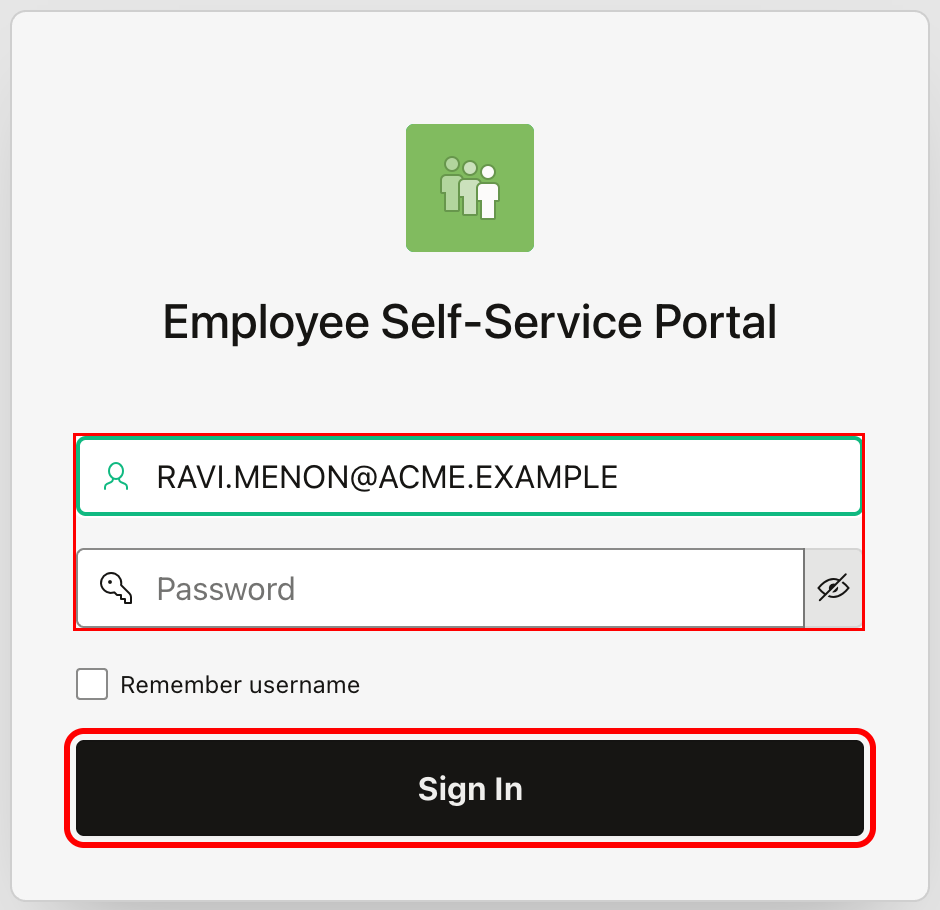

2. On the ESS Home page, right-click the **Your Onboarding Progress** heading and select **Inspect**. Chrome opens **Developer Tools**.

    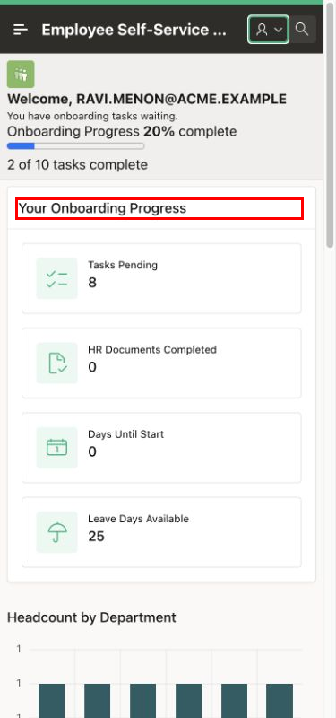

    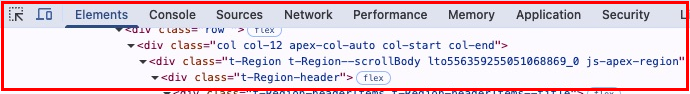

3. In Developer Tools, click **Toggle device toolbar**, the phone and tablet icon.

    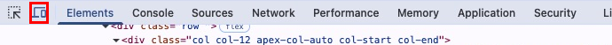

4. On the device toolbar, select **Dimensions → Responsive**. Enter **390** for the width and **844** for the height, pressing **Enter** after each value. Keep these dimensions for the remaining page checks.

    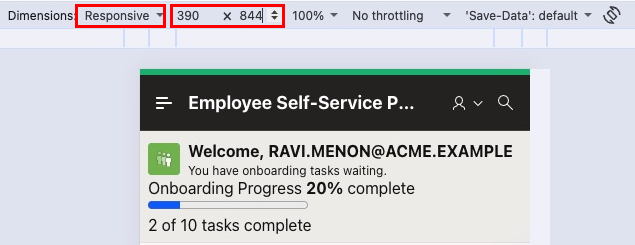

## Task 2: Verify ESS Home

1. Click **Main Navigation**, then click **Home**.

    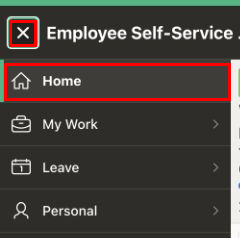

2. Check that the onboarding cards stack vertically, their text is readable, and the regions do not overlap. Check the application title and welcome heading for clipped text. The main page should fit the mobile view without horizontal scrolling.

    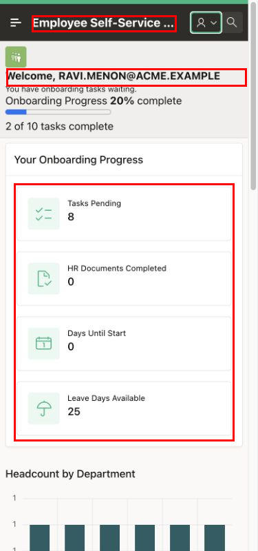

3. Click the **user account** icon in the application header, then click **Settings**. Check that the Settings dialog fits the mobile view and its controls are accessible. Click **Close** to return to ESS Home.

    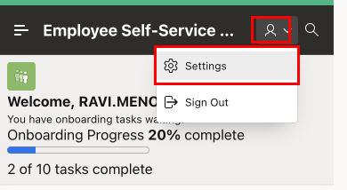

    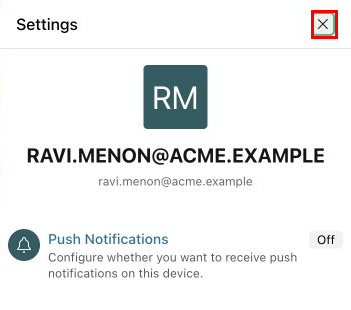

## Task 3: Verify My Onboarding Tasks

1. Click **Main Navigation**. Click the arrow beside **My Work** to expand it, then click **My Onboarding Tasks**.

    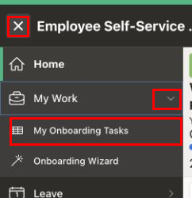

2. Read the **Task Name** column. Swipe left inside the report, or move its horizontal scrollbar to the right, to reveal **Due Date** and **Status**. Check that the values are readable and that the application header stays in place while the report scrolls.

    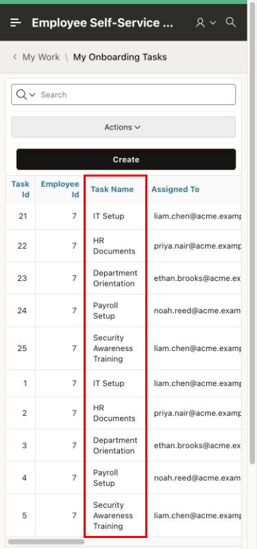

    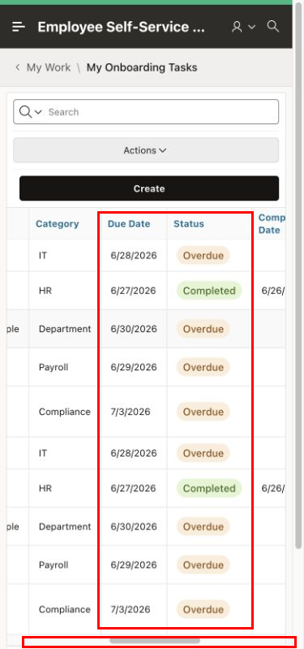

3. Click **Create** to open the **Onboarding Task** dialog. Check that its fields stack vertically and its action buttons are accessible. Click **Cancel** to return to the report.

    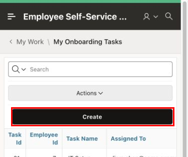

    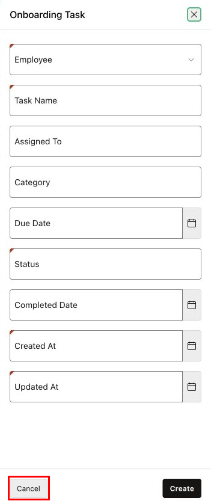

## Task 4: Verify Leave Request

1. Click **Main Navigation**. Expand **Leave**, then click **Leave Request**. If a load error appears, click **OK** and record it as **Needs fix**. Continue with the layout checks if the form is accessible; verify the complete form again after the error is resolved. If a load error appears, click **OK** and record it as **Needs fix**. Continue with the layout checks if the form is accessible; verify the complete form again after the error is resolved.

    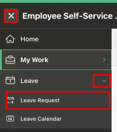

2. Inspect the form using the following checks. Click the calendar icon beside **Start Date** and check that the date picker fits the mobile view. Press **Escape** to close it. Scroll within the page to reach the lower fields and buttons.

    | Field or control | What to check |
    | --- | --- |
    | Leave Type | The list opens and its options are readable. |
    | Start Date and End Date | The inputs and calendar icons are accessible. |
    | Reason | The text area fits the available space. |
    | Submit Leave | The button is visible when you scroll to the bottom of the form. |

    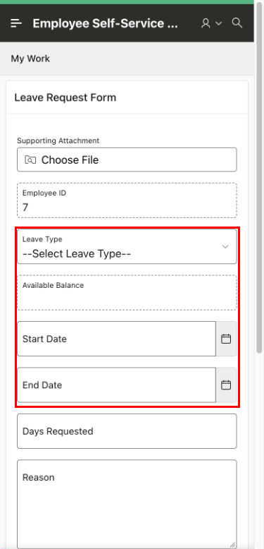

    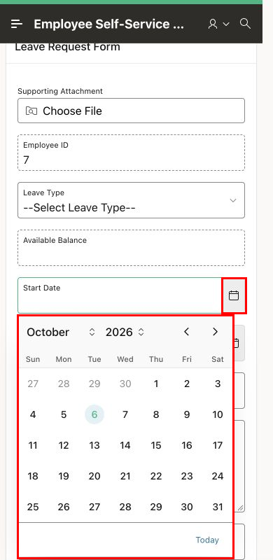

3. Enter **Mobile layout check** in **Reason**. Confirm that the text remains inside the field and that **Cancel** and **Submit Leave** are visible. Click **Cancel** to return to ESS Home.

    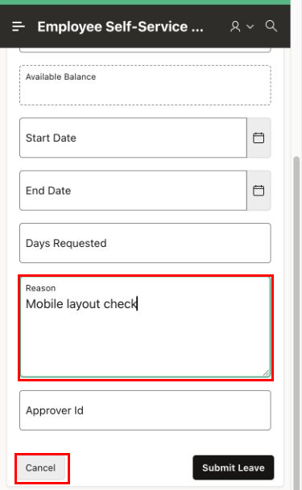

## Task 5: Verify Leave Calendar

1. Click **Main Navigation**. Expand **Leave**, then click **Leave Calendar**.

    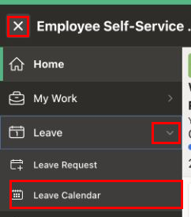

2. In **month** view, check that the month heading, weekday labels, date cells, and navigation buttons fit the mobile view.

    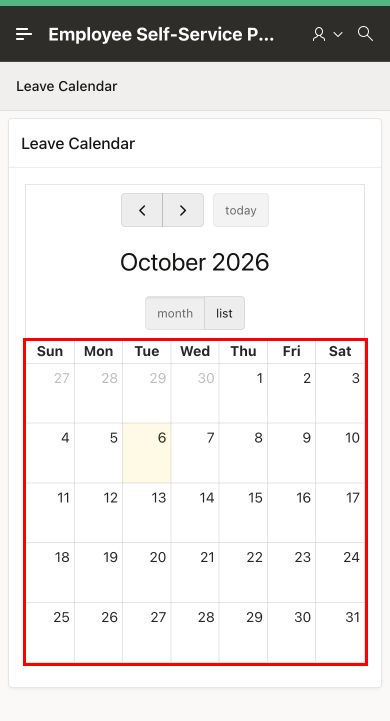

3. Click **Previous** and **Next** to move between months. Check that the month heading changes. Click **today** to return to the current month.

    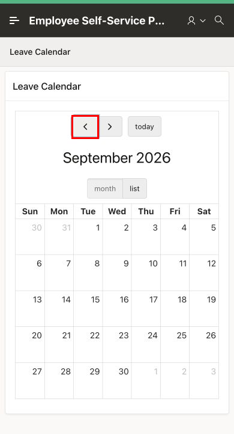

    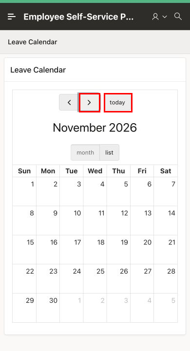

4. Click **list** and compare it with **month** view. If leave events are present, check that their dates and labels are readable. If the calendar shows **No events to display**, record event visibility as **Not tested** and repeat this check later for a period containing an employee leave event. Click **month** to return to the calendar grid.

    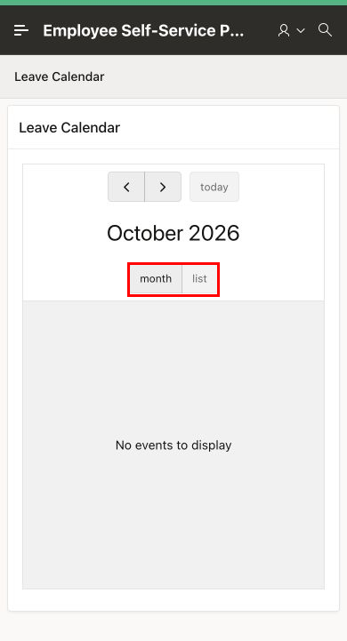

## Task 6: Tour Oracle APEX To Go in Mobile View

1. Open [Oracle APEX To Go](https://apex.oracle.com/go/apextogo) in a new tab. Set the device toolbar to **Responsive**, with a width of **390** and a height of **844**. The **Welcome** screen introduces the mobile sample application. Click **Next** to continue the tour.

    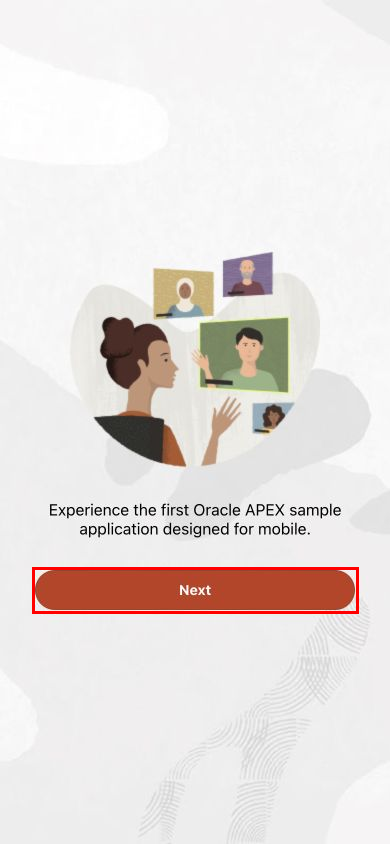

2. On **Discover**, read the introduction to the mobile patterns available in the sample application. Click **Next** to continue.

    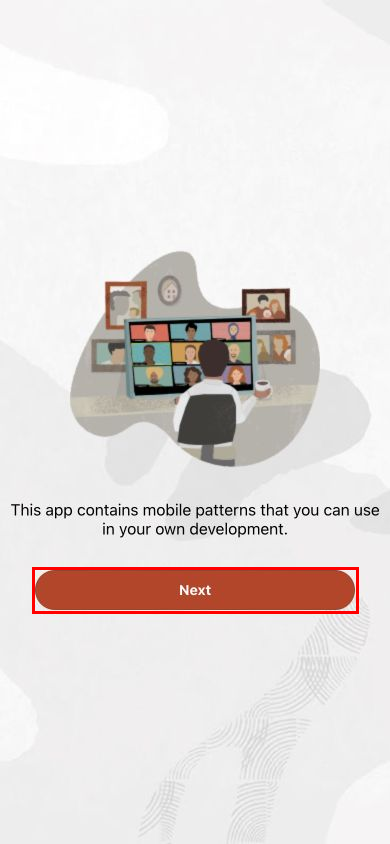

3. On **Get Started**, click **Go!** to continue to the application. Sign in if prompted.

    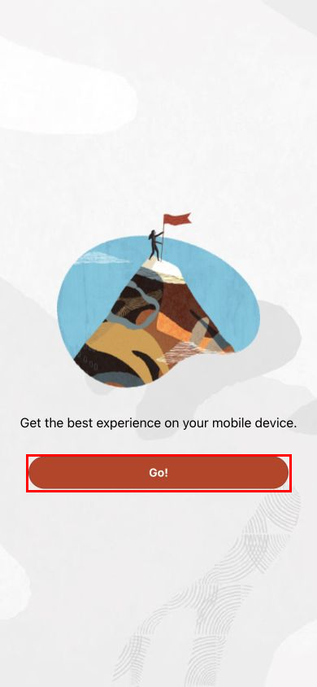

4. Explore the **APEXToGo** home screen in mobile view.

    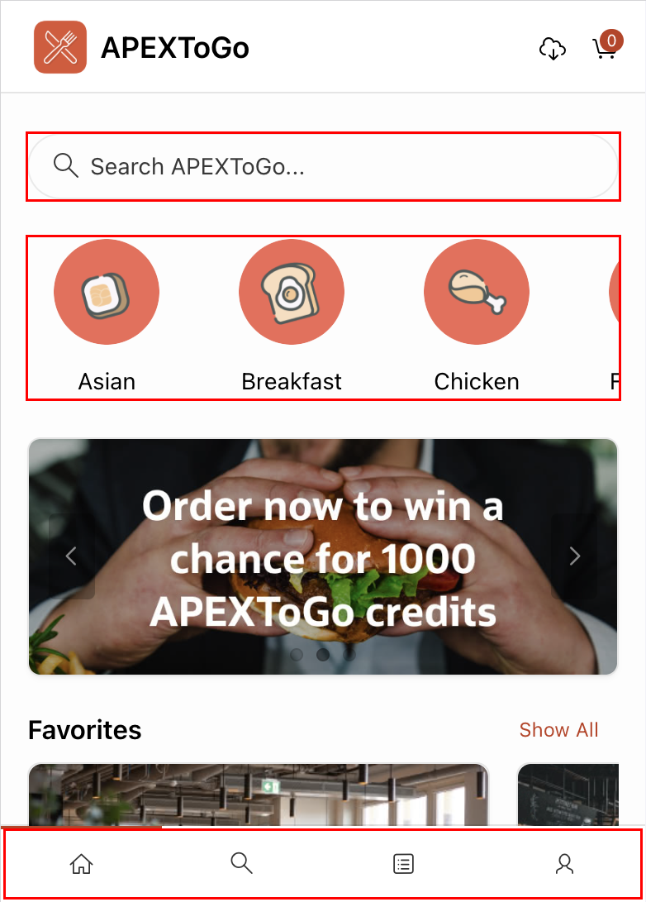

## Summary

You reviewed ESS navigation, cards, report scrolling, form controls, and calendar views in mobile view. You also toured the Oracle APEX To Go welcome screens and application home page in mobile view.

## Learn More

- [Creating Applications for Mobile Devices](https://docs.oracle.com/en/database/oracle/apex/26.1/htmdb/creating-applications-for-mobile-devices.html)
- [Oracle APEX To Go](https://apex.oracle.com/go/apextogo)
- [Simulate Mobile Devices with Device Mode](https://developer.chrome.com/docs/devtools/device-mode)

## Acknowledgements

- **Author** - Shanmukh Kornana
- **Last Updated By/Date** - Shanmukh Kornana, October 2026
