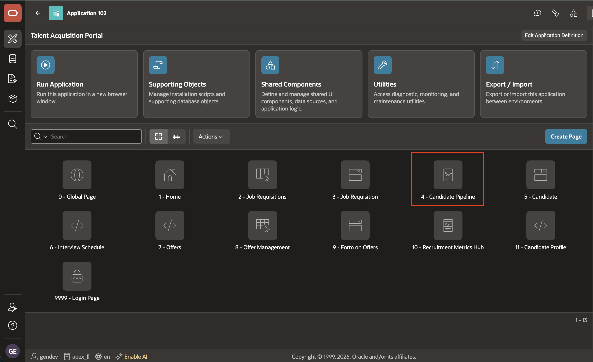
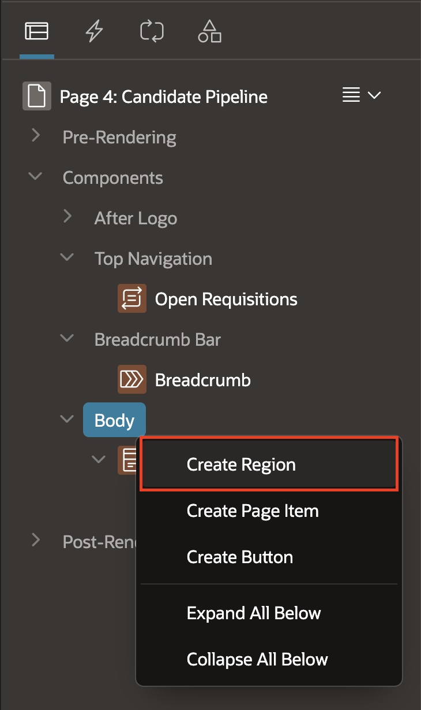
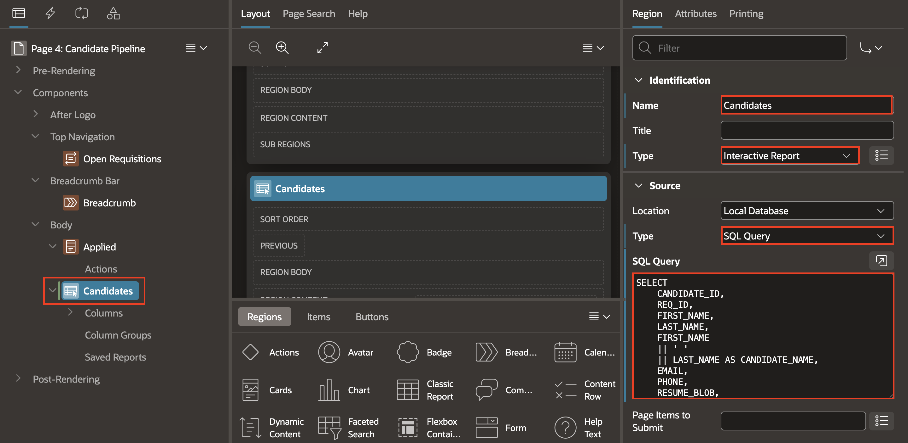
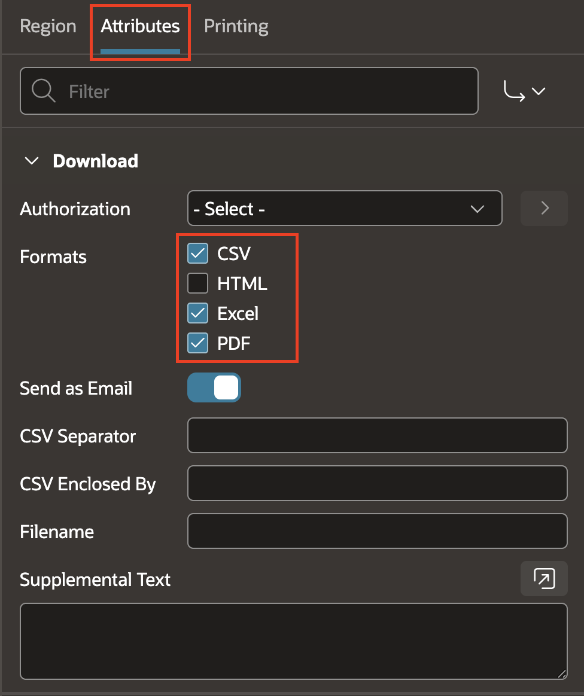
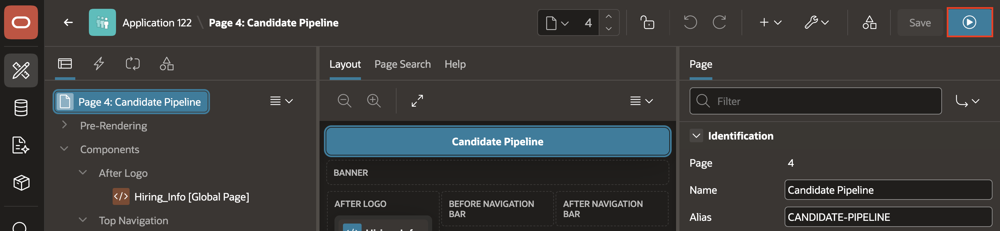
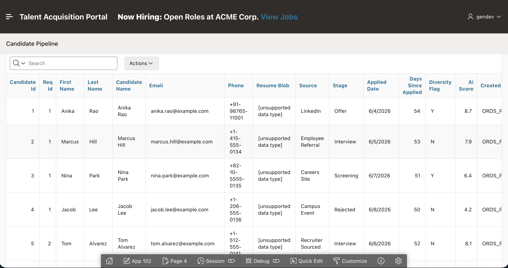
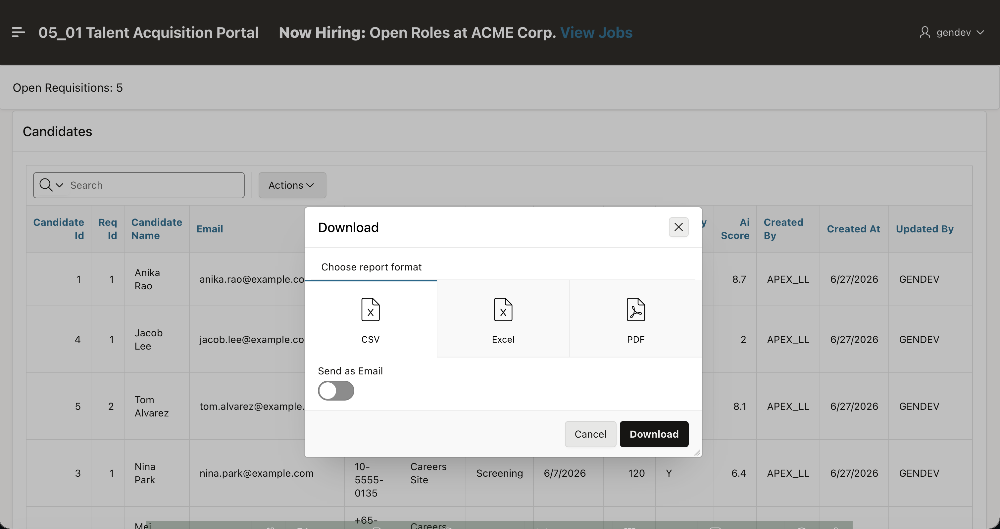

# Upgrade the Candidate Pipeline Page and add an Interactive Report

## Introduction

Recruiters need more than a visual snapshot when they review a busy candidate pipeline. In this lab, you will add an Interactive Report alongside the existing Cards view, giving the team a dependable place to scan candidate details and export the list when needed.

Estimated Time: 10 minutes

### Objectives

In this lab, you will:

- Add an Interactive Report to Candidate Pipeline.
- Populate the report from the candidate data set.
- Enable CSV, Excel, and PDF downloads.

## Task 1: Add the Interactive Report

Add the report alongside the existing Cards region.

1. In Talent Acquisition Portal Application, open **Candidate Pipeline** in Page Designer.

    

2. Add a second region. Right click on Body and select **Create Region**.

    

3. In the Rendering Tree, select **New** region. In the Property Editor, enter/select the following properties:
    - Under Identification:
        - Name: **Candidates**
        - Type: **Interactive Report**
    - Under Source:
        - Type: **SQL Query**
        - SQL Query: **Enter the Following Query**
            ```sql
            <copy>
                SELECT
                    CANDIDATE_ID,
                    REQ_ID,
                    FIRST_NAME,
                    LAST_NAME,
                    FIRST_NAME
                    || ' '
                    || LAST_NAME AS CANDIDATE_NAME,
                    EMAIL,
                    PHONE,
                    SOURCE,
                    CURRENT_STAGE AS STAGE,
                    APPLIED_DATE,
                    TRUNC(SYSDATE - APPLIED_DATE) AS DAYS_SINCE_APPLIED,
                    DIVERSITY_FLAG,
                    AI_SCORE,
                    CREATED_BY,
                    CREATED_AT,
                    UPDATED_BY,
                    UPDATED_AT
                FROM
                    TMS_CANDIDATES
            </copy>
            ```

    

## Task 2: Enable downloads and verify the report

1. In Property Editor, click **Attributes**, Under **Download**, enable **CSV**, **Excel**, and **PDF**.

    

2. Save and run the page. Verify the report, and download choices.

    

3. Verify the report, and download choices.

    

    

## Summary

You now have a Candidate Pipeline report that complements the Cards view. Recruiters can review candidate details in a tabular format and download the results in the format that works for them.

## Acknowledgements

* **Author** - Roopesh Thokala, Principal product manager
* **Last Updated By/Date** - Roopesh Thokala, July, 2026