# Lab 2: Enable Natural Language Support for Job Requisitions

## Introduction

Recruiters often start with a question, not a set of filters. In this lab, you will make the Job Requisitions report understand the language of the hiring team, so a plain-English request can become a useful report filter.

Estimated Time: 5 minutes

### Objectives

In this lab, you will:

- Enable Natural Language Support on Job Requisitions.
- Give the department and status columns clear business context.
- Test a recruiter-style natural-language request.

## Task 1: Enable Natural Language Support

1. From the **Candidate Pipeline** page, click on the **Page Finder** and select **Job Requisitions** Page.

    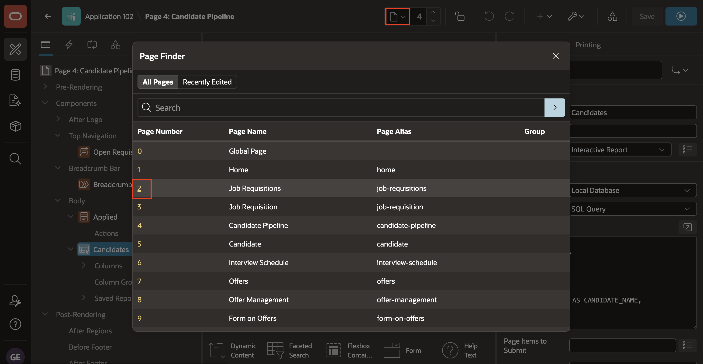

2. Click on the **Job Requisitions** region.

    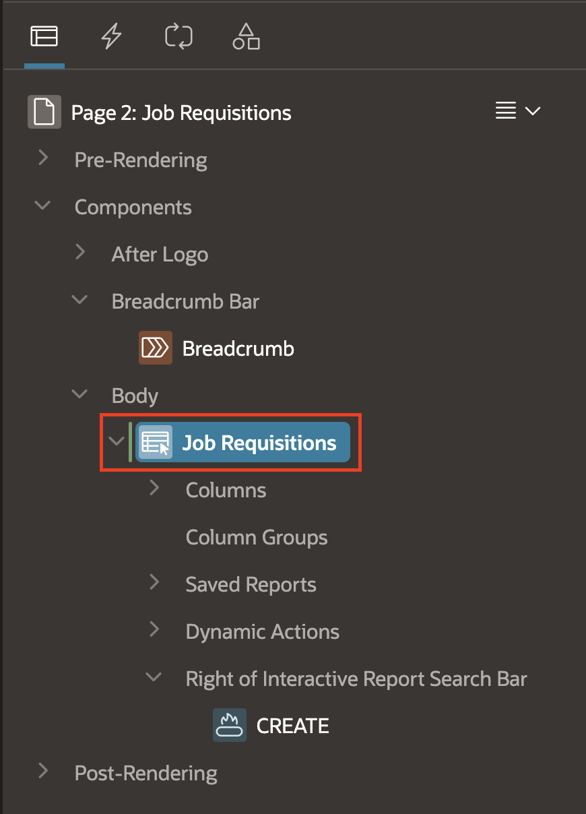

3. Then in the Property Editor, select **Attributes** Tab and then:

    - Under Generative AI > Enable **Natural Language Support**.

    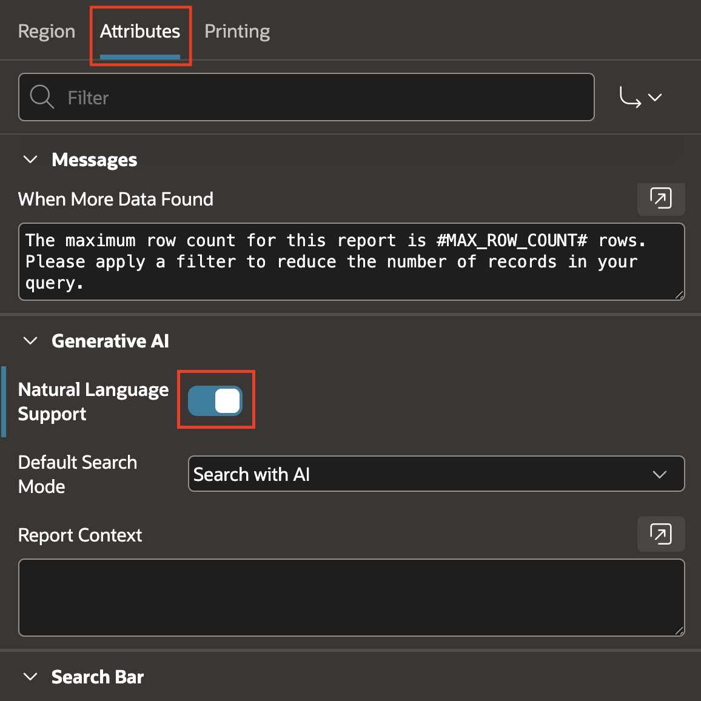

## Task 2: Add column context

Column context helps the AI interpret business terms in a prompt.

1. In the left pane, expand the report columns.

    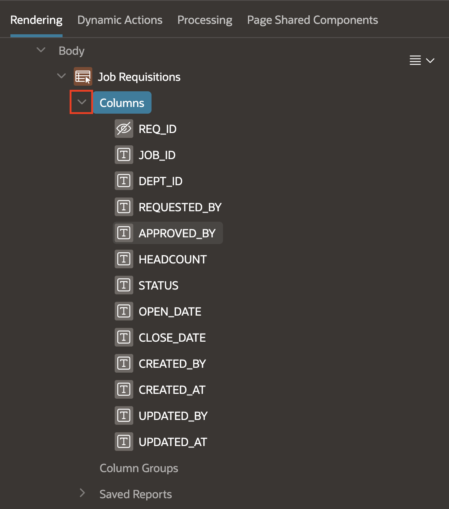

2. Select the column **DEPT\_ID**.

    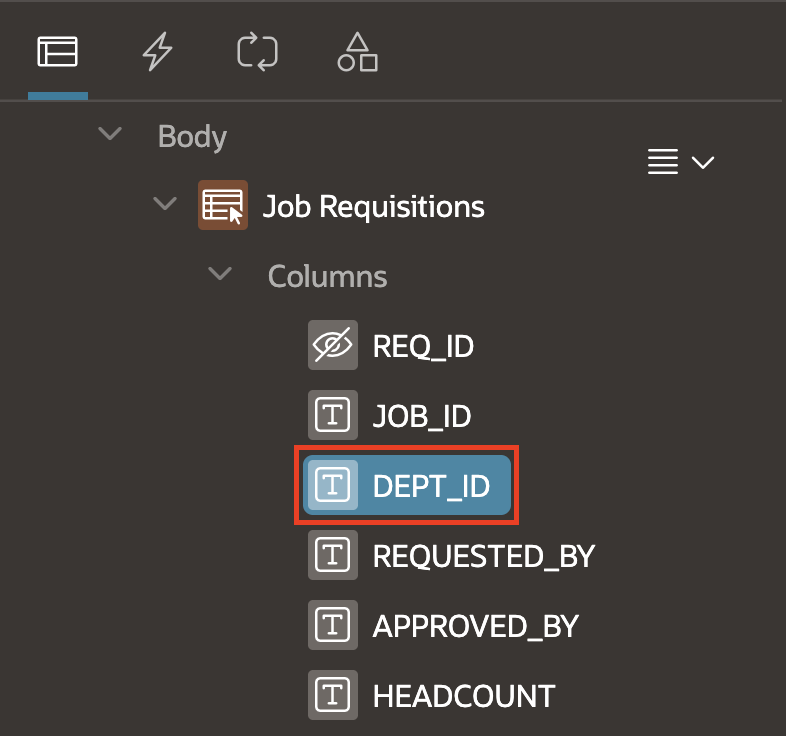

3. In the right pane, scroll to the **Generative AI** section for the selected column. If the section is collapsed, expand it.

    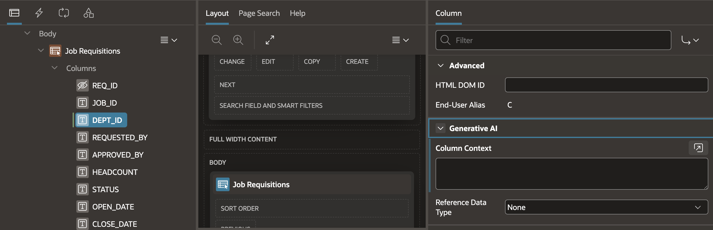

4. In **Column Context**, enter the following context value:

    ```
    <copy>
    Organizational department name (e.g., Sales, Engineering, HR)
    </copy>
    ```

    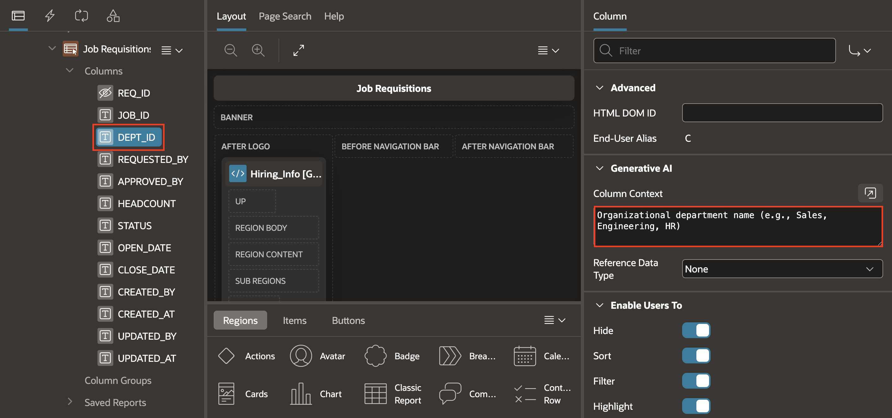

5. Select the second column **STATUS**.

    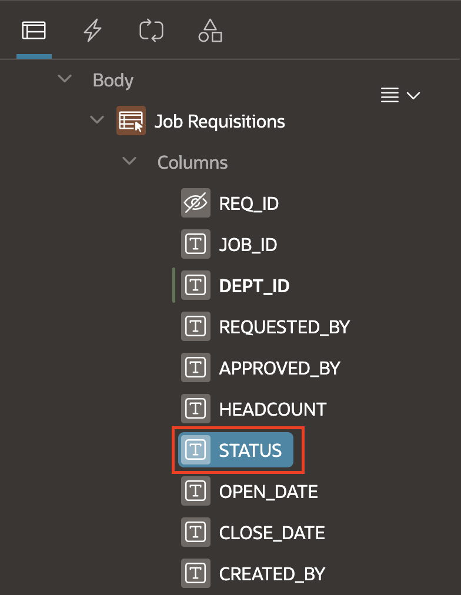

6. In the **Generative AI** section, enter the following **Column Context** value:

    ```
    <copy>
    Requisition status; values include Open, Filled, Pending Approval, Draft
    </copy>
    ```

    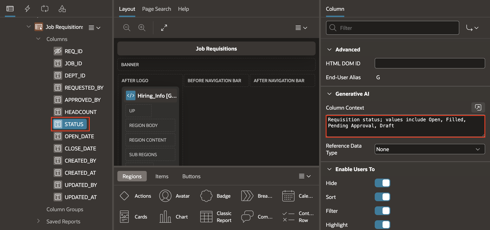

## Task 3: Test a natural-language filter

1. Save and run the page.

    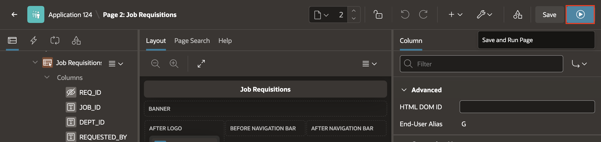

2. In the natural-language Search bar, enter `Show me Engineering requisitions open for more than 30 days`. Alternatively, click the Chat button to open a Chatbot to the right of Interactive report.

    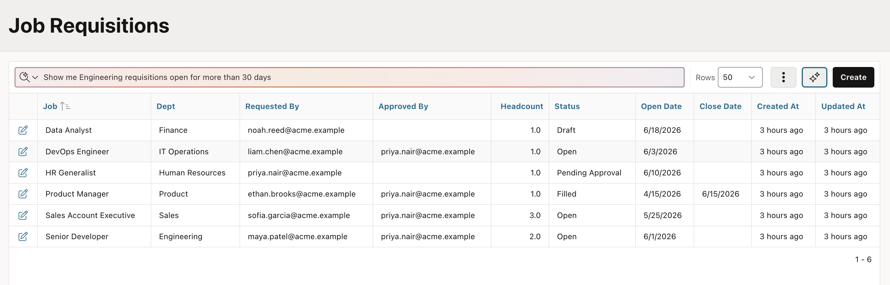

    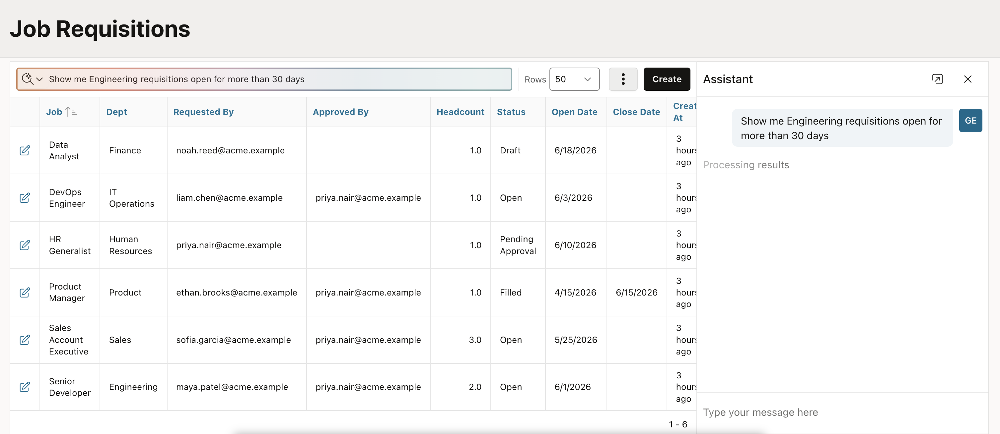

3. Confirm that APEX converts the prompt to a filter and shows matching requisitions.

    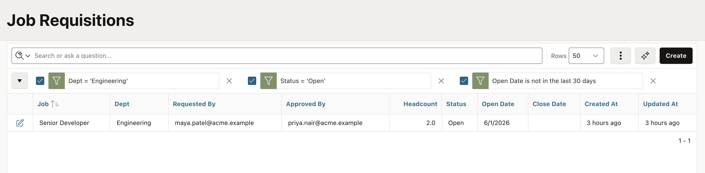

    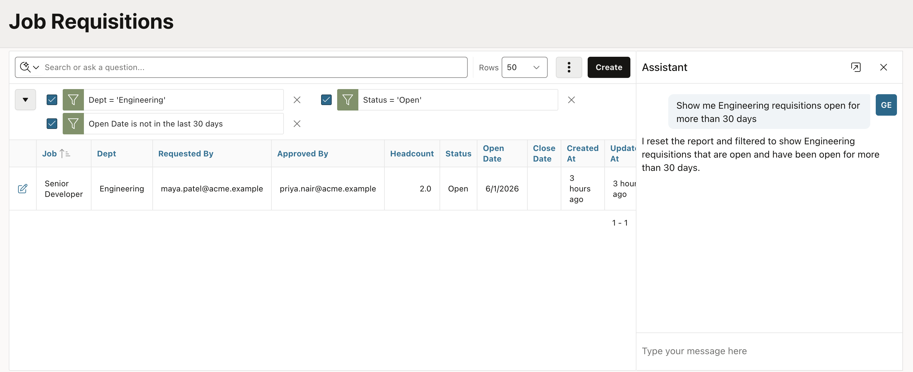


## Summary

You enabled AI Interactive Report and explained the meaning of the department and status fields. Recruiters can now start with a natural-language question and quickly focus the requisitions report.

## Acknowledgements

* **Author** - Roopesh Thokala, Principal product manager
* **Last Updated By/Date** - Roopesh Thokala, July 29, 2026
