# Lab 3: Build the Interview Schedule as an Interactive Grid

## Introduction

An interview schedule changes quickly, and recruiters should not have to leave the page to keep it accurate. In this lab, you will build an editable grid that puts each interview stage and its working details in one place.

Estimated Time: 10 minutes

### Objectives

In this lab, you will:

- Create an Interactive Grid from the `TMS_INTERVIEW_STAGES` table.
- Keep candidate and requisition identifiers visible but protected from edits.
- Hide audit fields and save a change from the grid.

## Task 1: Add the Interactive Grid

1. In Talent Acquisition Portal Application, open **Interview Schedule** page.

    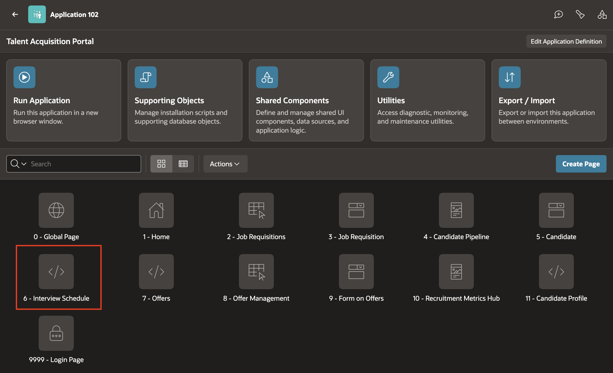

2. In the Rendering tree (left pane), right click on Body and click **Create Region**.

    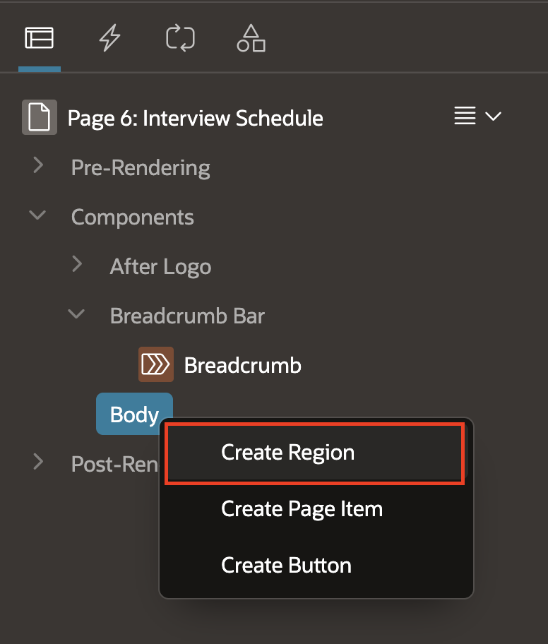

3. In the Property Editor, enter/select the following properties:
    - Under Identification:
        - Name: **Interview Stages**
        - Type: **Interactive Grid**
    - Under Source:
        - Table Owner: **Parsing Schema**
        - Table Name: `TMS_INTERVIEW_STAGES`

    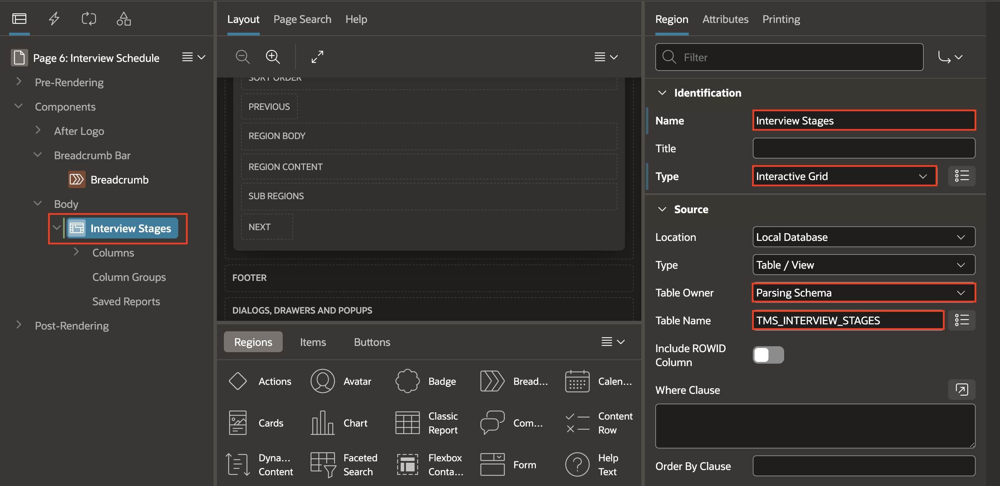

4. In the Property Editor, Click **Attributes** Tab and then:
    - Under Edit > Enabled: Yes

    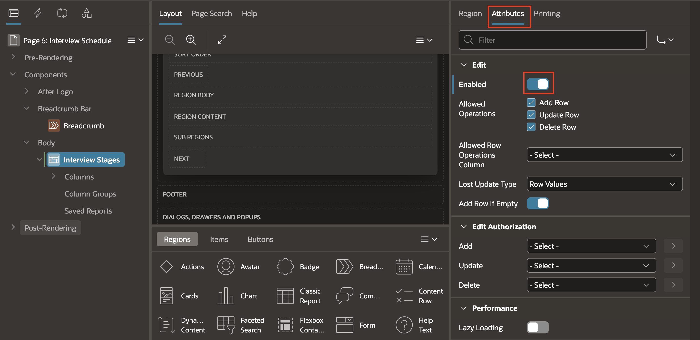

## Task 2: Configure editable columns

1. In the left pane, expand the report columns of the Interactive Grid Region.

    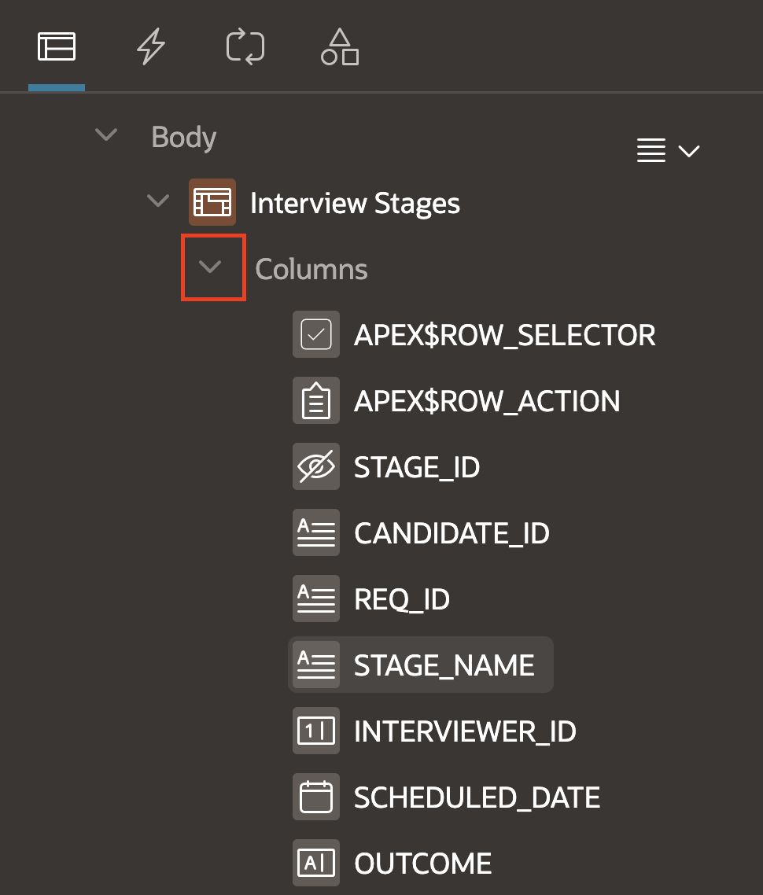

2. Select the column **CANDIDATE\_ID**.

    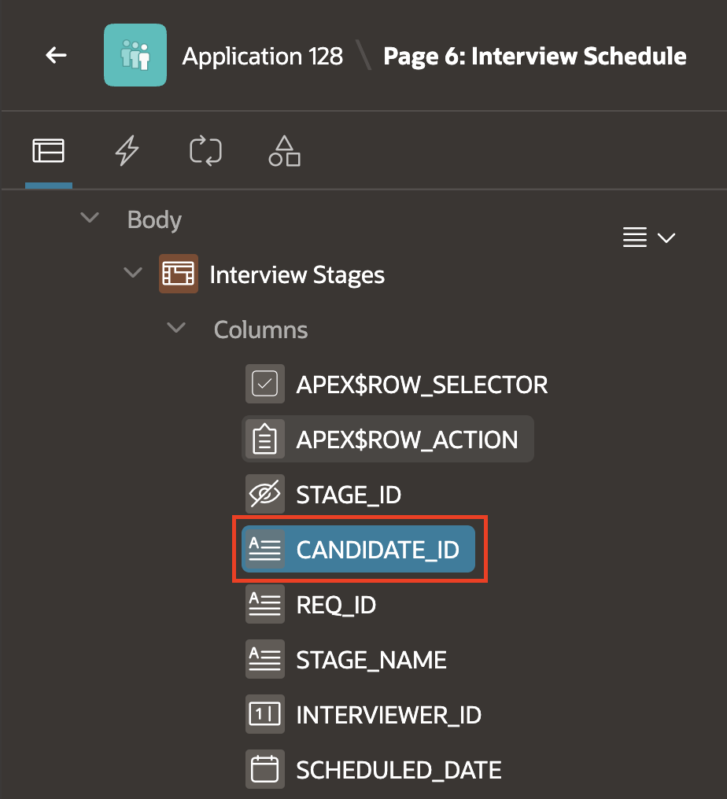

3. In the right pane:
    - Under Identification > Type: Display Only

    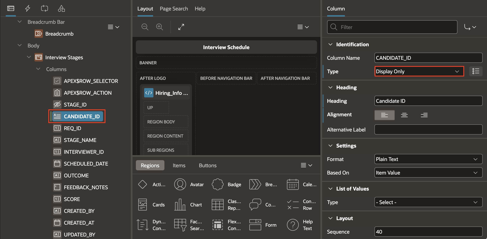

4. Similarly, Update the Identification **Type** for **REQ\_ID** and **STAGE\_NAME** as Display Only.

  |Column Name | Identification Type |
  |----------|-------|
  | REQ\_ID | Display Only |
  | STAGE\_NAME | Display Only |

    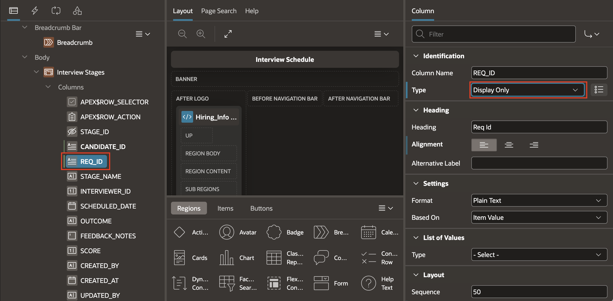

    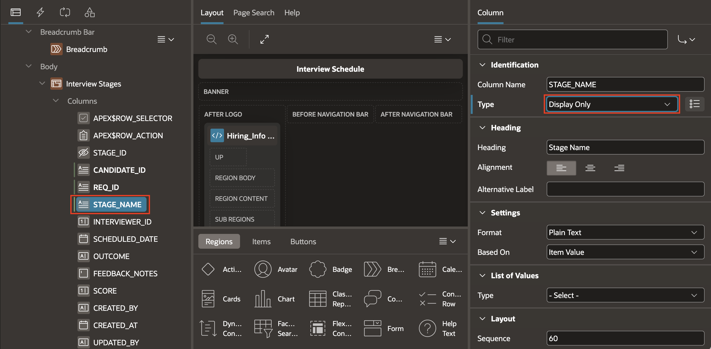

5. Next, you will need to hide all the Audit Columns **CREATED\_BY**, **CREATED\_AT**, **UPDATED\_BY**, and **UPDATED\_AT**. To do this, you can set the Type of the column to Hidden, which will not display the column on the frontend.

    - To select these four Columns, click on the **CREATED\_BY** column under the Interview Stages region, and then hold shift and click on the last column, **UPDATED\_AT**.

6. Then, In the **Property Editor**, Update the Identification **Type** as **Hidden**.

    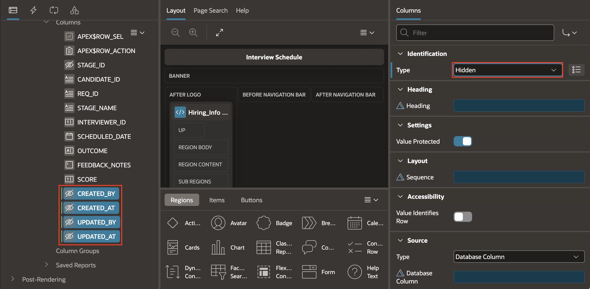

7. Save and Run the Page.

    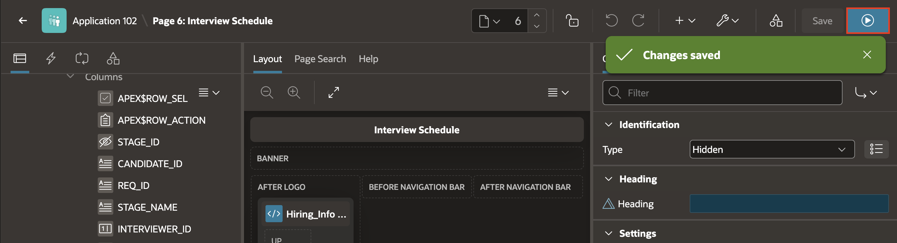

8. Navigate through the **Interview Schedule** Grid page.

    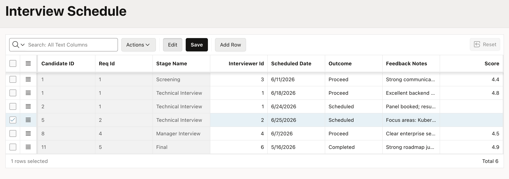

9. Edit a cell, in this example, update the candidate’s Interviewer ID. Click **Save** and confirm the change was committed.

    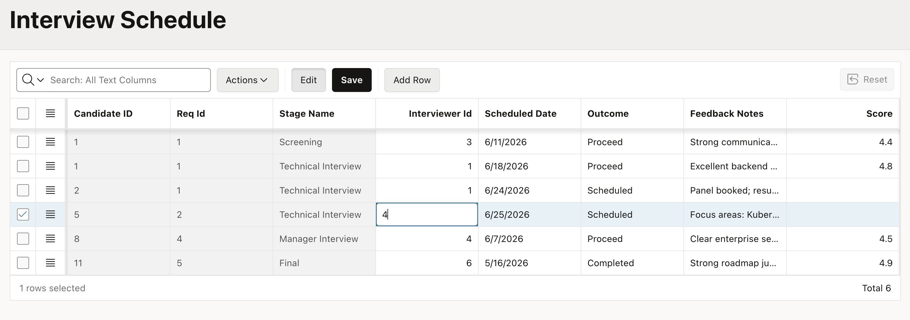

    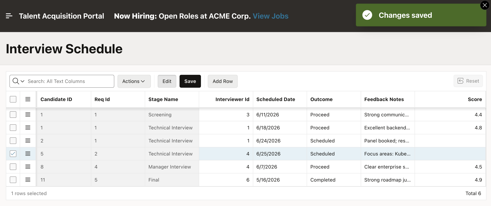

## Summary

You created an editable Interview Schedule grid with the right balance of visibility and control. Recruiters can see the interview context, keep audit data out of the way, and save schedule changes directly in the grid.

## Acknowledgements

* **Author** - Roopesh Thokala, Principal product manager
* **Last Updated By/Date** - Roopesh Thokala, July, 2026
