# Lab 4: Create Job Openings Cards Page

## Introduction

When a hiring manager asks what roles are open, the answer should be easy to browse. In this lab, you will turn open requisitions into a clean job board where each card shows the essentials and Smart Filters help the recruitment team find the right openings quickly.

Estimated Time: 5 minutes

### Objectives

In this lab, you will:

- Create a Cards page from open job requisitions.
- Present each opening with department, headcount, opening date, and an icon.
- Add department and headcount filters to narrow the job board.

## Task 1: Create the Job Openings page

1. In the Talent Acquisition Portal application, click **Create Page**.

    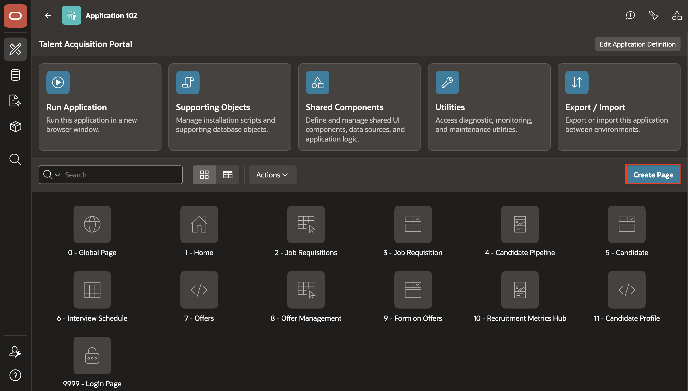

2. In Create a Page wizard, select **Cards** as the page type and click **Next**.

    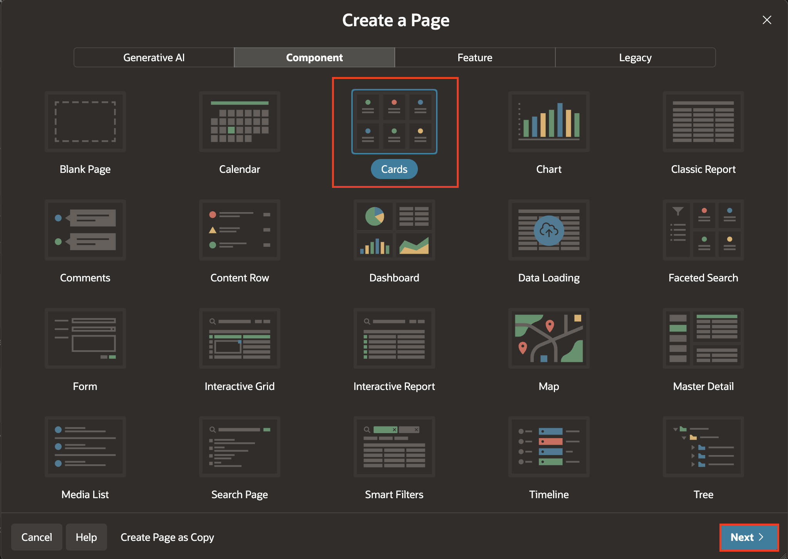

3. In **Create Cards** page wizard:
    - Under Page Definition > Name: **Job Openings**.
    - Under Data Source:
        - Data Source: **Local Database**
        - Source Type: **SQL Query**
        - Enter a SQL SELECT statement: **Enter the following query**

            ```sql
            <copy>
                SELECT
                    R.REQ_ID,
                    J.TITLE,
                    D.NAME AS DEPT,
                    R.HEADCOUNT AS HEADCOUNT,
                    TO_CHAR(R.OPEN_DATE, 'DD-Mon-YYYY') AS OPEN_DATE
                FROM
                    TMS_JOB_REQUISITIONS R
                    JOIN TMS_JOBS J
                        ON R.JOB_ID = J.JOB_ID
                    JOIN TMS_DEPARTMENTS D
                        ON R.DEPT_ID = D.DEPT_ID
                WHERE
                    R.STATUS = 'Open'
            </copy>
            ```

        - Click **Next**

    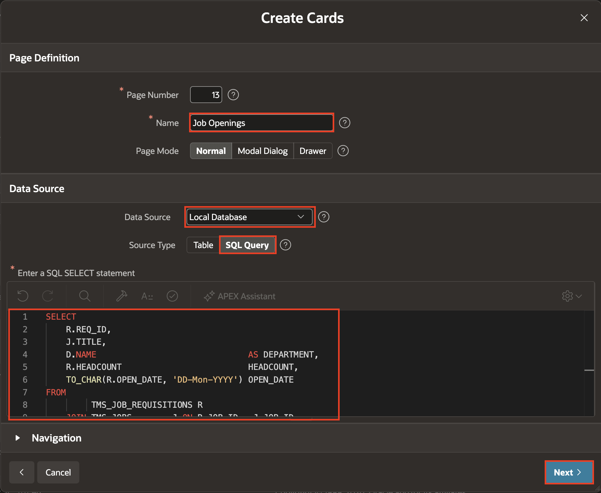

4. In the **Create Cards** wizard, under **Cards Attributes**, set **Title Column** to **TITLE**. Then, click **Create Page**.

    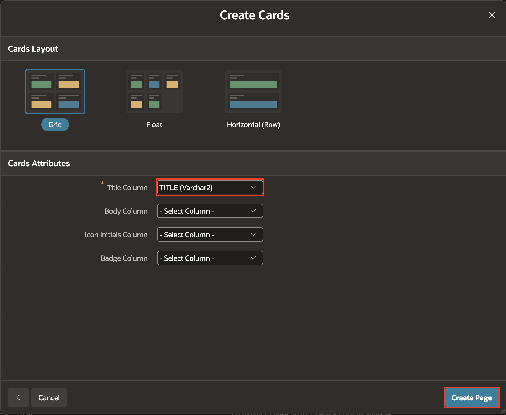

## Task 2: Configure the Cards region

1. Under Page Rendering, Select **Job Openings** region.

    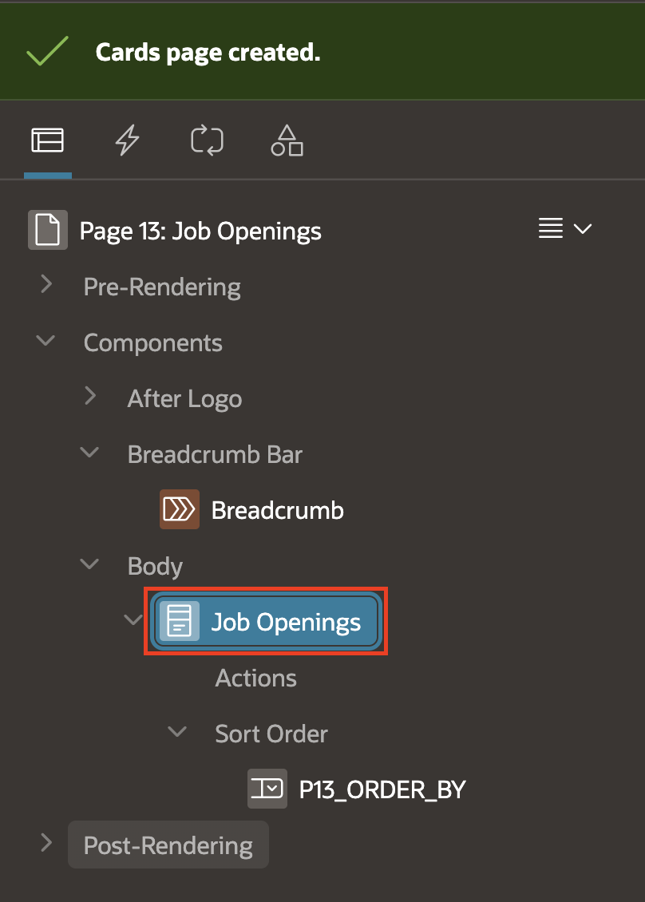

2. With the **Job Openings** Cards region selected, in the Property Editor, Under **Region**, set **Order By Type** to **None**.

    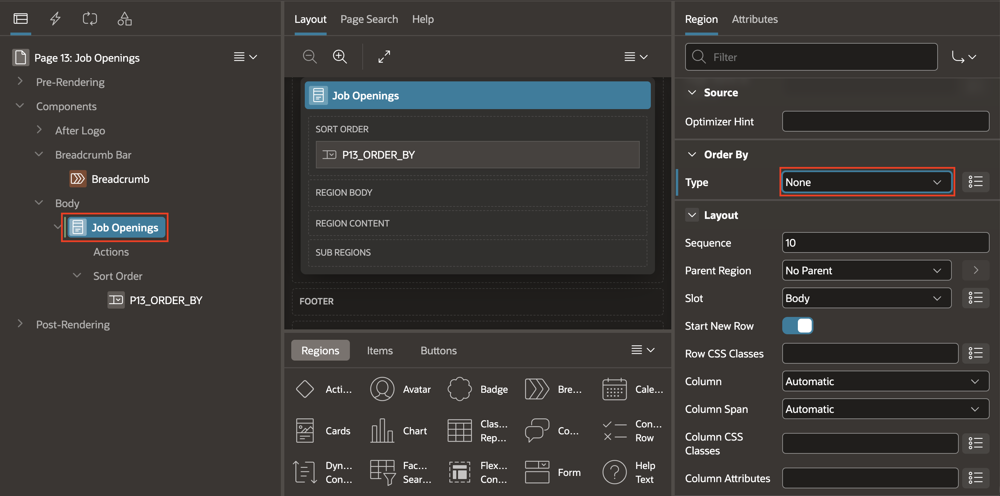

3. In Property Editor, select **Attributes**. Enter or select the following properties:

    - Under Subtitle > Column: **Department**
    - Under Body:
        - Advanced Formatting: **Yes**
        - HTML Expression:

            ```html
            <copy>
            <strong>Headcount:</strong> &HEADCOUNT.
            <br>
            <strong>Open since:</strong> &OPEN_DATE.
            </copy>
            ```

    - Under **Icon and Badge**:
        - Icon Source: **Icon Class**
        - Icon CSS Classes: `fa-briefcase`

    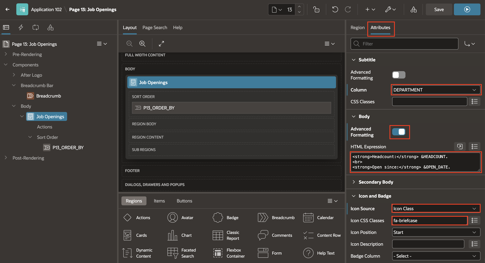

4. Now, In the Rendering Tree(Left Pane), Right click on P13\_ORDER\_BY under Sort Order, if exists, and click **Delete**.

    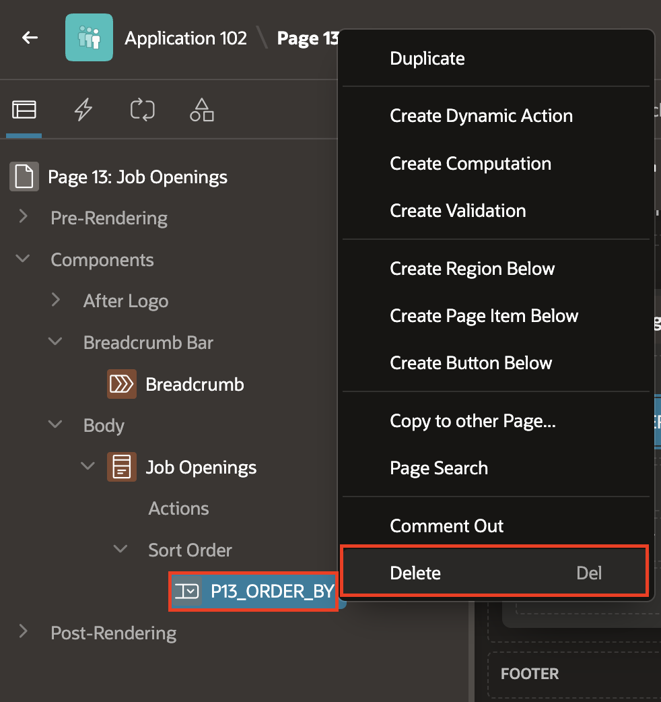

## Task 3: Add Smart Filters

1. In the Rendering tree, right-click **Body** and select **Create Region**.

    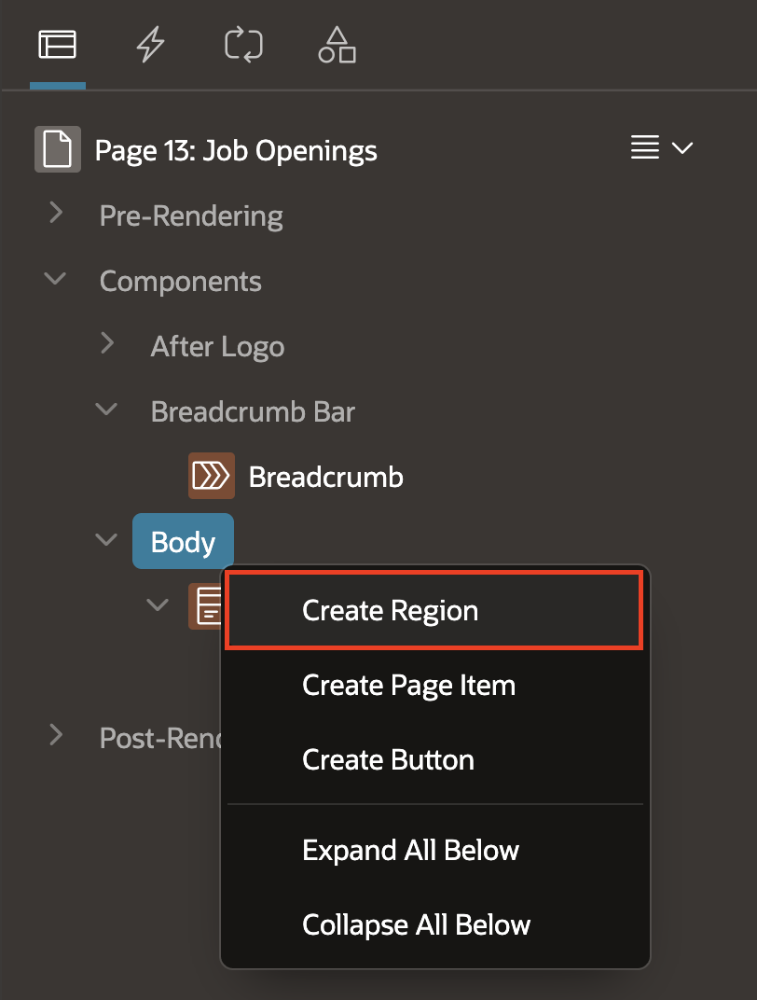

2. Drag and drop the **New** region above **Job Openings** region to re-order the sequence.

    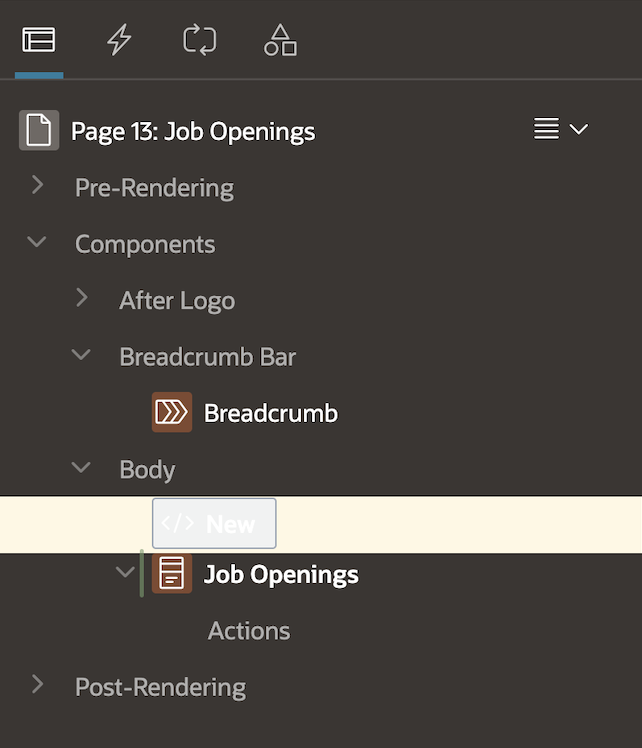

3. Select the Newly created region **New**. Then, in the Property Editor, enter or select the following properties:

    - Under Identification:
        - Name: **Smart Filters**
        - Type: **Smart Filters**
    - Under Source:
        - Filtered Region: **Job Openings**

    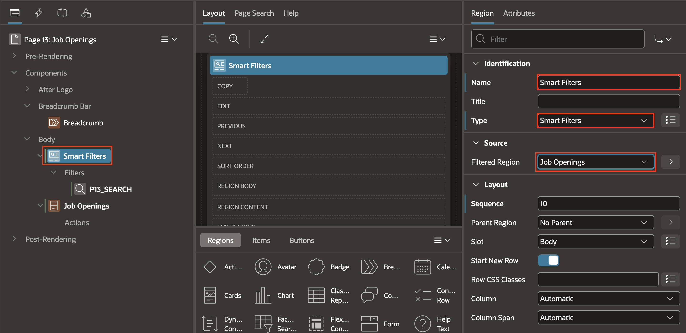

4. In the Rendering tree, expand **Smart Filters** and right click on **Filters**. Click **Create Filter**.

    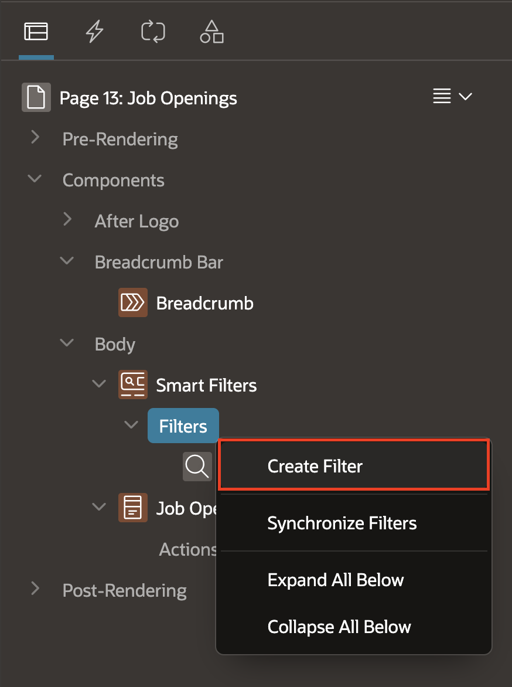

5. In Property Editor, enter or select the following properties:
    - Under Identification
        - Name: **Pn\_DEPARTMENT**
        - Type: **Checkbox Group**
    - Under List of Values > Type: **Distinct Values**
    - Under Source:
        - Database Column: **DEPARTMENT**
        - Data Type: **VARCHAR2**

    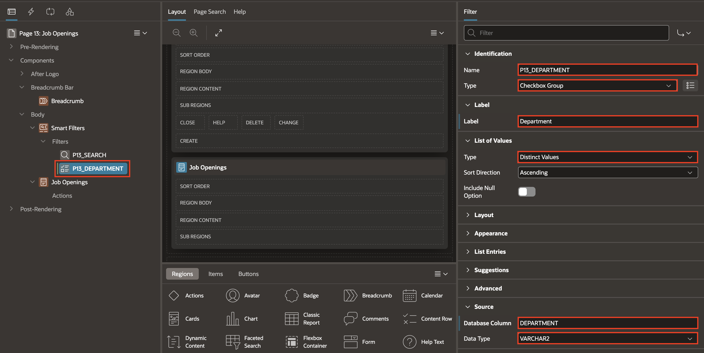

6. Similarly, create another filter in the **Rendering Tree**. Then, in Property Editor, enter or select the following properties:

    - Under Identification
        - Name: **P13\_HEADCOUNT**
        - Type: **Range**
    - Under Label > Label: **Headcount Range**
    - Under Source:
        - Database Column: **HEADCOUNT**
        - Data Type: **NUMBER**

    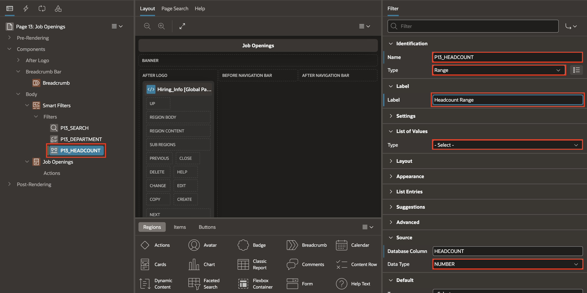

7. Save and run the page.

    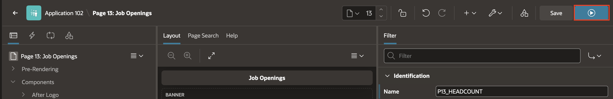

    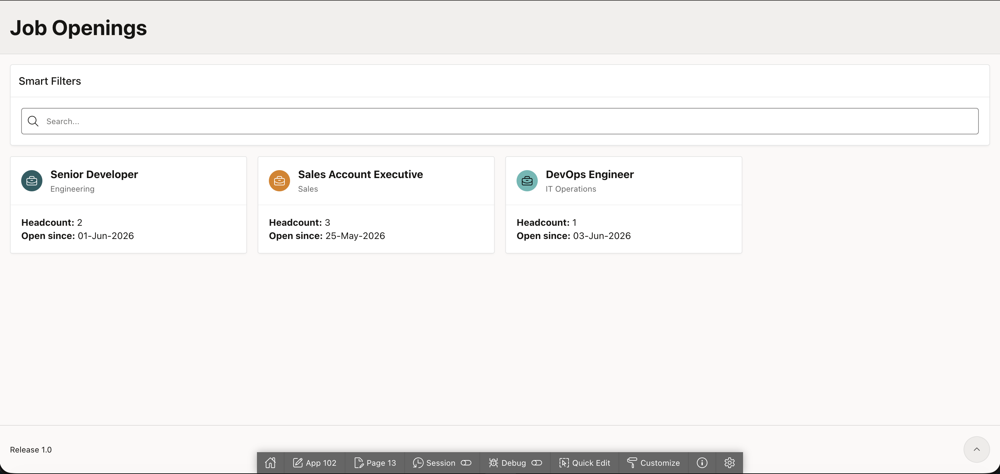

8. Verify that the Cards page shows open jobs and that both filters narrow the results.

    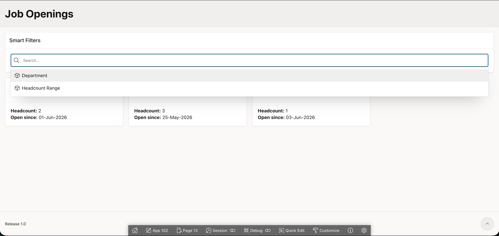

8. Apply **Department** Filters and check the narrowed Results.

    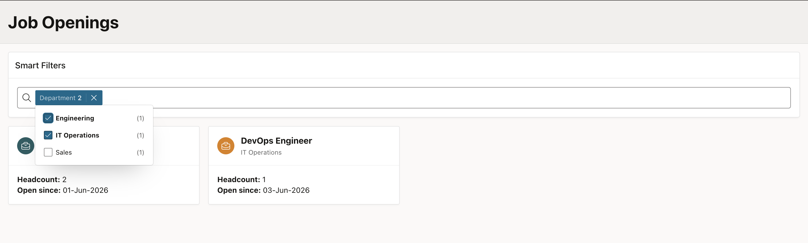

## Summary

You created a browsable Job Openings page that shows the details recruiters need at a glance. With department and headcount filters in place, the team can move from a broad list of roles to the openings that matter most.

## Acknowledgements

* **Author** - Roopesh Thokala, Principal product manager
* **Last Updated By/Date** - Roopesh Thokala, July 29, 2026
