# Lab 5: Upgrade My Tasks to an Interactive Grid

## Introduction

Onboarding works best when employees can see what is due and keep their own progress current. In this lab, you will transform My Onboarding Tasks into an editable grid that keeps the task list focused on the signed-in employee.

Estimated Time: 5 minutes

### Objectives

In this lab, you will:

- Change My Onboarding Tasks from a report to an Interactive Grid.
- Configure a clear status list and protect task details from edits.
- Hide audit fields for a cleaner employee view.

## Task 1: Replace the report with an Interactive Grid

1. Navigate to **Employee Self Service application**, and open the **My Onboarding Tasks** page.

    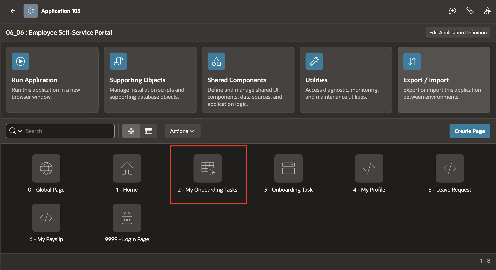

2. In the Rendering tree, select **Onboarding Tasks** region.

    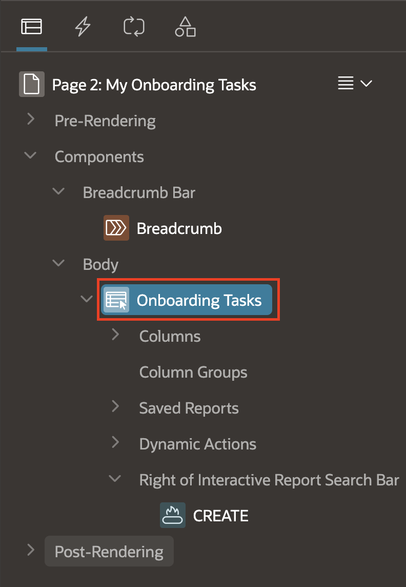

3. In the Property Editor, update, enter or select the following properties:

    - Under Identification:
        - Type: **Interactive Grid**
    - Under Source:
        - Type: **SQL Query**
        - SQL Query: **Enter the following query**
            <copy>
            ```sql
                SELECT
                    T.*, E.Email
                FROM
                    TMS_ONBOARDING_TASKS T
                    JOIN TMS_EMPLOYEES E ON E.EMPLOYEE_ID = T.EMPLOYEE_ID
                WHERE
                    lower(T.ASSIGNED_TO) = LOWER(:APP_USER)
            ```
            </copy>

    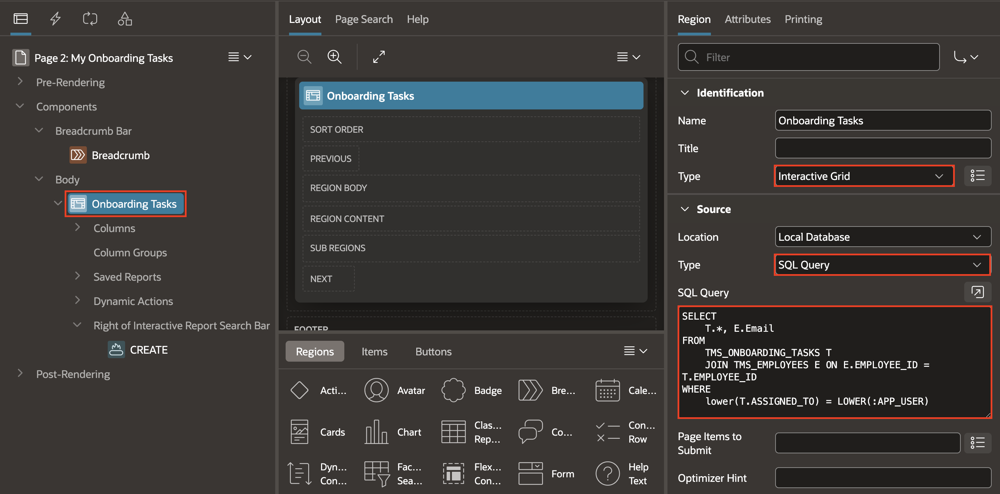

4. In the Property Editor, click the **Attributes** tab. Under **Edit**, set **Enabled** to **Yes**.

    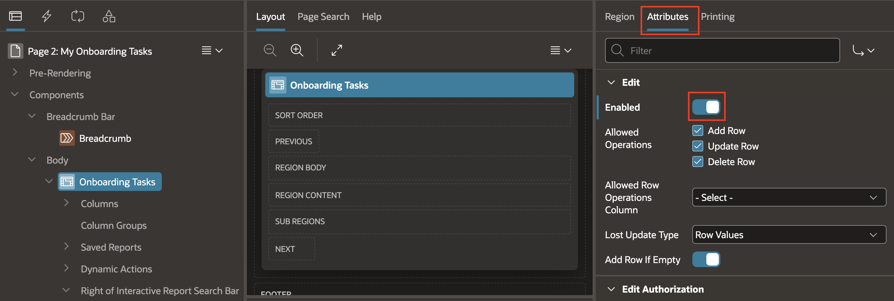

## Task 2: Configure editable columns

1. In the Rendering tree, expand the report columns under the **My Onboarding Tasks** Interactive Grid region.

    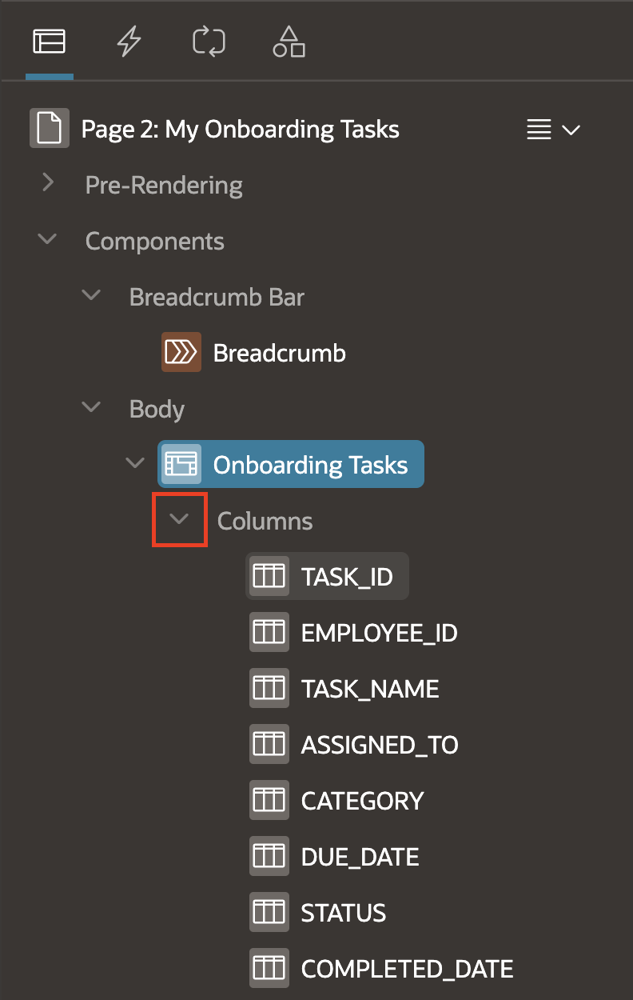

2. Select **TASK_ID** column. Then, in the Property Editor, under **Source**, set **Primary Key** and **Query Only** to **Yes**.

    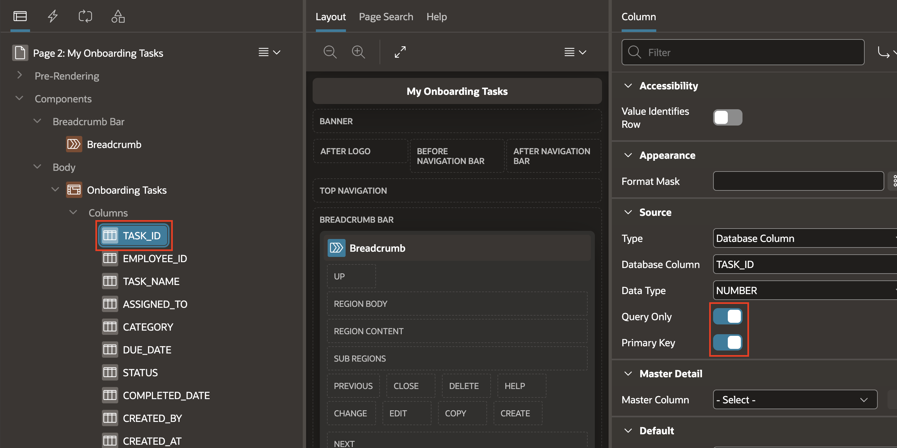

3. Select **STATUS**.

    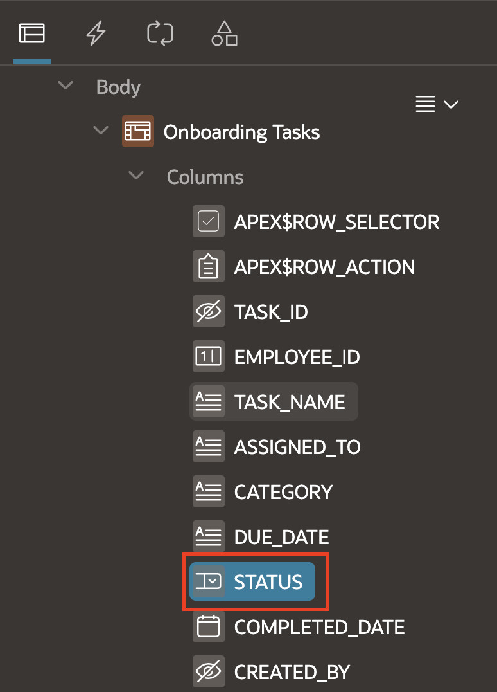

4. In the Property Editor,  enter or select the following properties:
    - Under Identification > Type: **Select List**.
    - Under List of Values:
        - Type: **Static Values**
        - Static Values: **Set the static values as follows**
            | Display Value | Return Value |
            | --- | --- |
            | Pending | Pending |
            | In Progress | In Progress |
            | Done | Done |
            | Blocked | Blocked |

        - Null Display Value: **--Select Status--**

    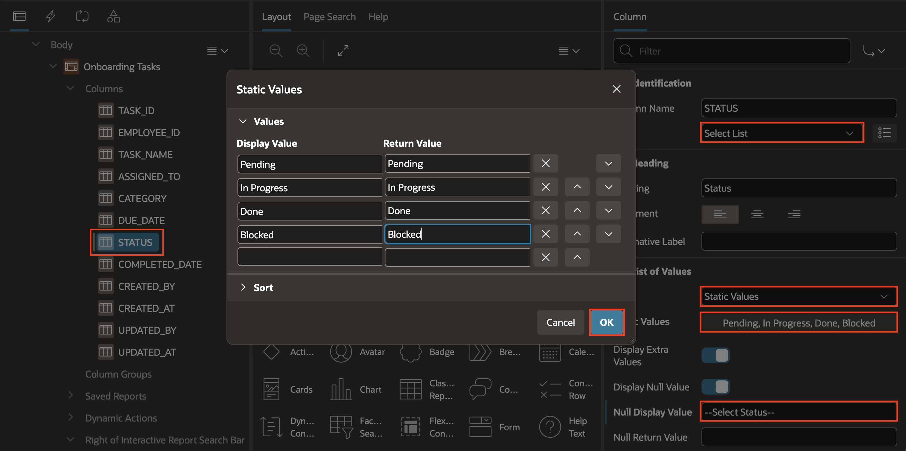

5. Next, select **Task Name** column in the Rendering Tree. Then, in the **Property Editor**:
    - Set **Identification** > Type: **Display Only**.

    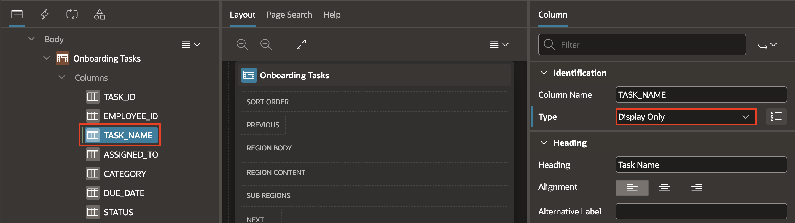

6. Similarly, set the below columns as **Display Only**.
    - To select these three Columns, click on the **ASSIGNED\_TO** column under the My Onboarding Tasks region, and then hold shift and click on the last column, **DUE\_DATE**.
    - In the Property Editor, Set the Identification Type as **Display Only**:

    | Column Name |
    | --- |
    | ASSIGNED\_TO |
    | CATEGORY |
    | DUE\_DATE |

    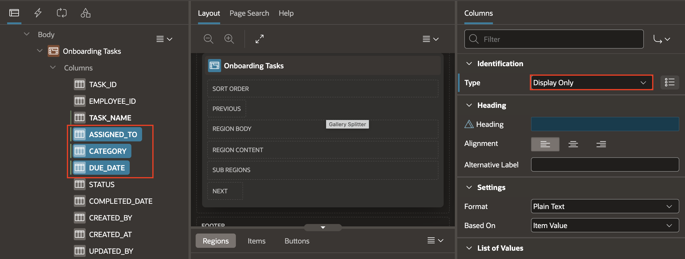

7. Select **CREATED\_BY**, **CREATED\_AT**, **UPDATED\_BY**, and **UPDATED\_AT**. In the Property Editor, set **Identification > Type** to **Hidden** and **Value Protected** to **No**.

    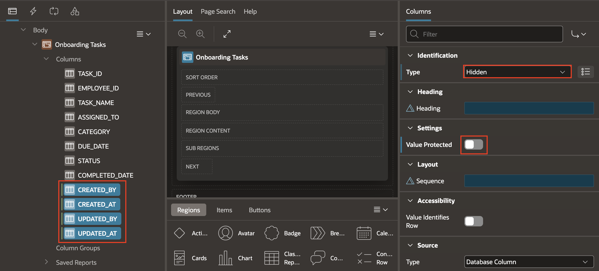

8. Save and run the page. If prompted, log in to the Application. Verify the Onboarding Tasks assigned to a logged in User.

    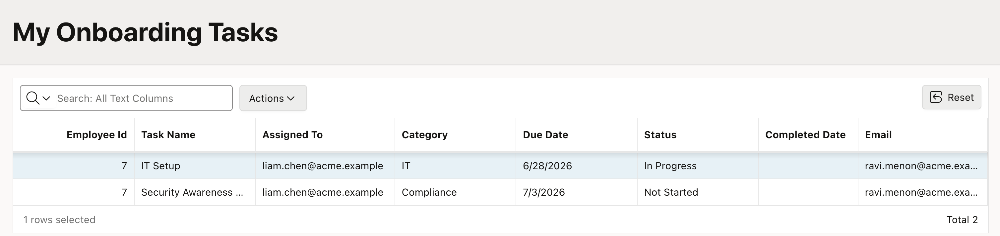

## Summary

You transformed My Onboarding Tasks into a focused Interactive Grid. Employees can select a clear status for their work, while the task details and audit information remain protected and uncluttered.

## Acknowledgements

* **Author** - Roopesh Thokala, Principal product manager
* **Last Updated By/Date** - Roopesh Thokala, July 29, 2026
